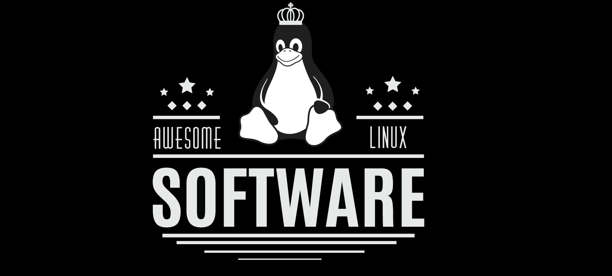

# Linux Apps
I Just Switch As to Linux Of Writing This Are Some Of Linux Apps They Are From Github Credits To them

# 1.  Awesome Linux Software

🐧 This repo is a collection of **AWESOME** Linux applications and tools for **any users/developers**.
 
🐧 Feel free to **contribute** / **star** / **fork** / **pull request** . Any **recommendations** and **suggestions** are welcome.

**Acknowledgement:** *Everything written below is from my own experience in college and after reading various materials. I am neither a professional nor an expert, but a passionate student. Anyone can open a discussion in the issue section, or a pull request if something should be modified or added.*

## Table of Contents

- [Applications](#applications)
    - [Audio](#audio)
    - [Chat Clients](#chat-clients)
    - [Data Backup and Recovery](#data-backup-and-recovery)
    - [Desktop Customization](#desktop-customization)
    - [Development](#development)
    - [E-Book Utilities](#e-book-utilities)
    - [Editors](#editors)
    - [Education](#education)
    - [Email Utilities](#email)
    - [File Manager](#file-manager)
    - [Games](#games)
    - [Graphics](#graphics)
    - [Internet](#internet)
    - [Office](#office)
    - [Productivity](#productivity)
    - [Proxy](#proxy)
    - [Security](#security)
    - [Sharing Files](#sharing-files)
    - [Terminal](#terminal)
    - [Utilities](#utilities)
    - [Video](#video)
    - [Wiki software](#wiki-software)
    - [Others](#others)
- [Command Line Utilities](#command-line-utilities)
- [Desktop Environments](#desktop-environments)
- [Display Managers](#display-manager)
   - [Console](#console)
   - [Graphic](#graphic)
- [Window Managers](#window-managers)
   - [Compositors](#compositors)
   - [Stacking window managers](#stacking-window-managers)
   - [Tiling window managers](#tiling-window-managers)
   - [Dynamic window managers](#dynamic-window-managers)

***********

- [Linux News, Apps, and more ....](#linux-news-apps-and-more)
- [Reddit](#reddit)
- [Contributors](#contributors)
- [Guideline to Contribute](#guideline-to-contribute)
- [How to Contribute](#unsure-how-to-contribute)

***********

## Applications

### Audio
*For a more comprehensive/advanced/better categorized/... list of Linux audio software, you may want to click [here](https://github.com/nodiscc/awesome-linuxaudio)*

- [![Open-Source Software][OSS Icon]](https://github.com/sourcefabric/Airtime) [Airtime](https://www.airtime.pro/) - The open broadcast software for scheduling and remote station management.
- [![Open-Source Software][OSS Icon]](https://ardour.org/development.html) [Ardour](https://ardour.org/) - Record, Edit, and Mix on Linux.
- [![Open-Source Software][OSS Icon]](https://audacious-media-player.org/developers) [Audacious](https://audacious-media-player.org/) - An open source audio player that plays your music how you want it, without stealing away your computer’s resources from other tasks.
- [![Open-Source Software][OSS Icon]](https://github.com/audacity/audacity) [Audacity](https://www.audacityteam.org/download/linux/) - Free, open source, cross-platform software for recording and editing sounds.
- [![Open-Source Software][OSS Icon]](https://bazaar.launchpad.net/~audio-recorder/audio-recorder/trunk/files) [Audio Recorder](https://launchpad.net/~audio-recorder) - Simple audio recorder available in an Ubuntu PPA.
- [![Open-Source Software][OSS Icon]](https://github.com/Superjo149/auryo) [Auryo](https://auryo.com/) - Unofficial multiplatform SoundCloud® app for your desktop.
- [![Open-Source Software][OSS Icon]](https://github.com/beetbox/beets) [beets](http://beets.io/) - Beets is the media library management system for obsessive-compulsive music geeks.
- ![Non Free][Money Icon] [Bitwig](https://www.bitwig.com/en/download.html) - DAW for music production
- [![Open-Source Software][OSS Icon]](https://github.com/CDrummond/cantata) [Cantata](https://www.linux-apps.com/content/show.php/Cantata?content=147733) - Qt5 Graphical MPD (Music Player Daemon) Client for Linux, Windows, MacOS.
- [![Open-Source Software][OSS Icon]](https://github.com/clementine-player/Clementine) [Clementine](https://www.clementine-player.org/) - Play numerous lossy and lossless audio formats.
- [![Open-Source Software][OSS Icon]](https://github.com/cmus/cmus) [Cmus](https://cmus.github.io/#download) - A small, fast and powerful console music player for Unix-like operating systems.
- [![Open-Source Software][OSS Icon]](https://github.com/DeaDBeeF-Player/deadbeef) [DeaDBeeF](http://deadbeef.sf.net/) - DeaDBeeF is a modular audio player for GNU/Linux, BSD, OpenSolaris, macOS, and other UNIX-like systems.
- [![Open-Source Software][OSS Icon]](https://github.com/linuxdeepin/deepin-music) [Deepin Music](https://www.deepin.org/en/original/deepin-music/) - An application, developed by Deepin Technology Team, which focused on local music playing.
- [![Open-Source Software][OSS Icon]](https://github.com/enzo1982/freac) [fre:ac](https://www.freac.org) - fre:ac is a free audio converter and CD ripper with support for various popular formats and encoders. It currently converts between MP3, MP4/M4A, WMA, Ogg Vorbis, FLAC, AAC, WAV and Bonk formats.
- [![Open-Source Software][OSS Icon]](http://gnormalize.sourceforge.net/) [Gnormalize](http://gnormalize.sourceforge.net/) - An audio converter and CD ripper with ReplayGain normalization algorithms, a metadata (tag) editor and an audio player. It uses gtk2-perl under GNU/Linux.
- [![Open-Source Software][OSS Icon]](https://github.com/MarshallOfSound/Google-Play-Music-Desktop-Player-UNOFFICIAL-) [Google Play Music Desktop Player](https://www.googleplaymusicdesktopplayer.com/) - Unofficial but beautiful cross-platform desktop player for Google Play Music.
- [![Open-Source Software][OSS Icon]](https://github.com/gpodder/gpodder) [Gpodder](https://gpodder.github.io/) - Media aggregator and podcast client.
- [![Open-Source Software][OSS Icon]](https://github.com/haecker-felix/Gradio) [GRadio](https://github.com/haecker-felix/gradio/releases/) - Radio software for Ubuntu Linux.
- [![Open-Source Software][OSS Icon]](https://github.com/mtytel/helm) [Helm](https://tytel.org/helm/) - A software synthesizer, that runs either standalone, or as an LV2, VST, VST3 or AU plugin.
- [![Open-Source Software][OSS Icon]](https://github.com/hydrogen-music/hydrogen) [Hydrogen](http://www.hydrogen-music.org/) - Advanced drum machine for GNU/Linux.
- [![Open-Source Software][OSS Icon]](https://github.com/trazyn/ieaseMusic) [ieaseMusic](https://github.com/trazyn/ieaseMusic) - iEaseMusic is a multiplatform program built in electron for listening to NetEase Music.
- [![Open-Source Software][OSS Icon]](https://github.com/KDE/k3b) [K3b](https://userbase.kde.org/K3b) - The CD/DVD Kreator for Linux, optimized for KDE.
- [![Open-Source Software][OSS Icon]](https://kid3.sourceforge.io/) [Kid3Qt](https://kid3.sourceforge.io/#download) - Edit tags of multiple files, e.g. the artist, album, year and genre of all mp3 files of an album.
- [![Open-Source Software][OSS Icon]](https://sourceforge.net/projects/kxstudio/) [KxStudio](https://kxstudio.linuxaudio.org/) - A collection of applications and plugins for professional audio production.
- [![Open-Source Software][OSS Icon]](https://github.com/LibreTime/libretime) [Libretime](https://libretime.org/) - The open broadcast software for scheduling and remote station management; forked from Airtime.
- [![Open-Source Software][OSS Icon]](https://github.com/LMMS/lmms) [LMMS](https://lmms.io/download/#linux) - Making music on your PC by creating melodies and beats, synthesizing and mixing sounds, arranging samples and much more.
- [![Open-Source Software][OSS Icon]](https://gitlab.gnome.org/World/lollypop) [Lollypop](https://wiki.gnome.org/Apps/Lollypop) - A GNOME music playing application.
- [![Open-Source Software][OSS Icon]](https://github.com/emilioastarita/lyricfier) [Lyricfier](https://github.com/emilioastarita/lyricfier) - A Spotify Lyrics alternative app.
- [![Open-Source Software][OSS Icon]](https://gitlab.com/ColinDuquesnoy/MellowPlayer) [Mellow Player](https://colinduquesnoy.gitlab.io/MellowPlayer/) - Cloud music integration for your desktop.
- [![Open-Source Software][OSS Icon]](https://github.com/mixxxdj/mixxx) [Mixxx](https://www.mixxx.org/download/) - Free DJ software that gives you everything you need to perform live mixes; veritable alternative to Traktor.
- [![Open-Source Software][OSS Icon]](https://github.com/mopidy/mopidy) [Mopidy](https://www.mopidy.com/) - An extensible music server written in Python.
- [![Open-Source Software][OSS Icon]](https://github.com/martpie/museeks) [Museeks](https://museeks.io/) - A simple, clean and cross-platform music player.
- [![Open-Source Software][OSS Icon]](https://github.com/musescore/MuseScore) [MuseScore](https://musescore.org) - Create, play and print beautiful sheet music.
- [![Open-Source Software][OSS Icon]](https://github.com/metabrainz/picard) [MusicBrainz Picard](https://picard.musicbrainz.org/) - Picard is a cross-platform music tagger written in Python.
- [MusixMatch](https://snapcraft.io/musixmatch) - A Capable lyrics app with synchronized lyrics function.
- [Netease Music](http://music.163.com/#/download) - A music player of Netease - a cloud music service in China.
- [![Open-Source Software][OSS Icon]](https://github.com/nukeop/nuclear) [Nuclear](https://nuclear.gumblert.tech/) - An Electron-based, multiplatform music player app that streams from multiple sources.
- [Ocenaudio](https://www.ocenaudio.com/whatis) - A cross-platform, easy to use, fast and functional audio editor. It is the ideal software for people who need to edit and analyze audio files.
- [![Open-Source Software][OSS Icon]](https://github.com/osdlyrics/osdlyrics) [OSD Lyrics](https://github.com/osdlyrics/osdlyrics) - Show lyrics with your favorite media player.
- [![Open-Source Software][OSS Icon]](https://github.com/gkarsay/parlatype) [Parlatype](https://gkarsay.github.io/parlatype/) - GNOME audio player for transcription.
- [![Open-Source Software][OSS Icon]](https://github.com/pithos/pithos) [Pithos](https://pithos.github.io/) - A native Pandora client for Linux.
- [![Open-Source Software][OSS Icon]](https://github.com/wwmm/pulseeffects) [PulseEffects](https://github.com/wwmm/pulseeffects) - Limiter, compressor, reverberation, equalizer and auto volume effects for Pulseaudio applications.
- [![Open-Source Software][OSS Icon]](https://github.com/quodlibet/quodlibet) [Quod Libet](https://quodlibet.readthedocs.io) - GTK+ music player written with huge libraries in mind. Supports search-based dynamic playlists, regular expressions, tagging, Replay Gain, podcasts & Internet radio.
- [![Open-Source Software][OSS Icon]](https://github.com/ebruck/radiotray-ng) [RadioTray-NG](https://github.com/ebruck/radiotray-ng) - An Internet radio player for Linux.
- ![Non Free][Money Icon] [Reaper](https://www.reaper.fm/) - Audio Production without Limits.
- [![Open-Source Software][OSS Icon]](https://github.com/GNOME/rhythmbox) [Rhythmbox](https://wiki.gnome.org/Apps/Rhythmbox) - Music player from GNOME.
- [![Open-Source Software][OSS Icon]](https://sayonara-player.com/downloads.php#Source) [Sayonara Player](https://sayonara-player.com/downloads.php) - A small, clear and fast audio player for Linux written in C++, supported by the Qt framework.
- [![Open-Source Software][OSS Icon]](https://github.com/multani/sonata/) [Sonata](https://www.nongnu.org/sonata/) - A Music player that is designed to be an elegant and intuitive interface for your music collection via the Music Player Daemon (MPD).
- [![Open-Source Software][OSS Icon]](https://launchpad.net/soundconverter) [Soundconverter](http://soundconverter.org/) - Leading audio file converter. Aims to be simple to use, and very fast.
- [![Open-Source Software][OSS Icon]](https://gitlab.gnome.org/GNOME/sound-juicer) [SoundJuicer](https://wiki.gnome.org/Apps/SoundJuicer/Documentation#Installing) - CD Ripping tool for GNOME.
- [![Open-Source Software][OSS Icon]](https://github.com/Soundnode/soundnode-app) [Soundnode](http://www.soundnodeapp.com/) - An opensource SoundCloud app for desktop.
- [![Open-Source Software][OSS Icon]](https://github.com/devinhalladay/spotio) [Spotio](https://github.com/devinhalladay/spotio) - A Rdio-inspired light theme for the Spotify desktop app.
- [![Open-Source Software][OSS Icon]](https://github.com/VCVRack/Rack) [VCV Rack](https://vcvrack.com/) - An open-source virtual modular synthesizer.
- [![Open-Source Software][OSS Icon]](https://github.com/Audio4Linux/Viper4Linux-GUI) [Viper4Linux](https://github.com/Audio4Linux/Viper4Linux-GUI) - An audio effect processor based on Viper4Android
- [![Open-Source Software][OSS Icon]](https://github.com/needle-and-thread/vocal) [Vocal](https://vocalproject.net/) - Podcast client for the modern desktop.
- [![Open-Source Software][OSS Icon]](https://github.com/yktoo/indicator-sound-switcher) [Yktoo Sound Switcher Indicator](https://yktoo.com/en/software/indicator-sound-switcher) - Sound input/output selector indicator for Ubuntu/Unity.

### Chat Clients

#### 3rd party Client
- [![Open-Source Software][OSS Icon]](https://github.com/sindresorhus/caprine) [Caprine](https://sindresorhus.com/caprine) - Elegant Facebook Messenger desktop app.
- [![Open-Source Software][OSS Icon]](https://github.com/chatty/chatty) [Chatty](https://chatty.github.io/) - Chatty is a Twitch chat client for everyone who wants to try something new and different from the webchat, but doesn't want the complexity of an IRC client or miss out on the Twitch specific features.
- [![Open-Source Software][OSS Icon]](https://github.com/stanfieldr/ghetto-skype) [GhettoSkype](https://github.com/stanfieldr/ghetto-skype) - open source web wrapper for Skype.
- [![Open-Source Software][OSS Icon]](https://github.com/yakyak/yakyak) [YakYak](https://github.com/yakyak/yakyak) -  Desktop chat client for Google Hangouts.

#### All-in-One Client
- [![Open-Source-Software][OSS Icon]](https://github.com/meetfranz/franz) [Franz](https://meetfranz.com/) - Franz is a free messaging app that combines many chat & messaging services into one application.
- [![Open-Source Software][OSS Icon]](https://developer.pidgin.im/) [Pidgin](https://pidgin.im/) - A universal chat client.
- [![Open-Source Software][OSS Icon]](https://github.com/ramboxapp/community-edition) [Rambox](https://rambox.pro/) - Free, Open Source and Cross Platform messaging and emailing app that combines common web applications into one.

#### Chat Client Utilities
- [![Open-Source Software][OSS Icon]](https://github.com/Cog-Creators/Red-DiscordBot) [Red Discord Bot](https://cogs.red) - Red Discord Bot is a self-hosted music/chat/trivia bot that can run on a Raspberry Pi and a variety of OS's. It's extensible through a system of "Cogs" that allow it to do more.

#### IRC Client
- [![Open-Source Software][OSS Icon]](https://github.com/hexchat) [HexChat](https://hexchat.github.io/) - HexChat is an IRC client based on XChat, but unlike XChat it’s completely free for both Windows and Unix-like system.
- [![Open-Source Software][OSS Icon]](https://github.com/irssi/irssi) [Irssi](https://github.com/irssi/irssi) - Irssi is a modular chat client that is most commonly known for its text mode user interface.
- [![Open-Source Software][OSS Icon]](https://github.com/kvirc/KVIrc) [KVIrc](http://www.kvirc.net/) - KVIrc is a free portable IRC client based on the excellent Qt GUI toolkit.

#### Official Client
- [![Open-Source-Software][OSS Icon]](https://sourceforge.net/p/beebeep/code/HEAD/tree/) [BeeBEEP](http://beebeep.sourceforge.net) - BeeBEEP is an open source, peer to peer, lan messenger. You can talk and share files with anyone inside your local area network. You don't need a server, just download, unzip and start it. Simple, fast and secure.
- [![Open-Source Software][OSS Icon]](https://github.com/dino/dino) [Dino](https://dino.im) - Clean and modern Jabber/XMPP chat client.
- [Discord](https://discordapp.com/) - All-in-one voice and text chat for gamers that’s free, secure, and works on both your desktop and phone.
- [![Open-Source Software][OSS Icon]](https://github.com/vector-im/element-web) [Element](https://element.io/) - A glossy Matrix collaboration client for the web.
- [![Open-Source Software][OSS Icon]](https://gitlab.com/gitlab-org/gitter/services) [Gitter](https://gitter.im/) - Gitter — Where developers come to talk. Gitter is designed to make community messaging, collaboration and discovery as smooth and simple as possible.
- [![Open-Source Software][OSS Icon]](https://git.ring.cx/savoirfairelinux/ring-project) [Jami](https://jami.net/) - Chat. Talk. Share. Jami is a free and universal communication platform which preserves the users' privacy and freedoms. Formerly Ring.
- [![Open-Source Software][OSS Icon]](https://github.com/jitsi) [Jitsi](https://jitsi.org/) - Jitsi is a free and open source multiplatform voice, videoconferencing and instant messaging application for Windows, Linux, Mac OS X and Android.
- [![Open-Source Software][OSS Icon]](https://github.com/qTox/qTox) [qTox](https://qtox.github.io/) - A simple distributed, secure messenger with audio and video chat capabilities.
- [Skype](https://www.skype.com/en/) - Skype keeps the world talking, for free.
- [Slack](https://slack.com/downloads/linux) - real-time messaging, archiving and search for modern teams.
- [![Open-Source Software][OSS Icon]](https://github.com/telegramdesktop/tdesktop) [Telegram](https://desktop.telegram.org/) - A messaging app with a focus on speed and security, it’s super fast, simple and free.
- [Viber](https://www.viber.com/download/) - Viber for Linux lets you send free messages and make free calls to other Viber users on any device and network, in any country.
- [![Open-Source Software][OSS Icon]](https://github.com/weechat) [Weechat](https://weechat.org/) - WeeChat is a fast, light and extensible chat client.
- [![Open-Source Software][OSS Icon]](https://github.com/wireapp) [Wire](https://wire.com/en/) - Secure communication. Full privacy.

### Data Backup and Recovery
- [![Open-Source Software][OSS Icon]](https://backintime-dev.readthedocs.io/en/latest/) [Back In Time](https://github.com/bit-team/backintime/) - A simple backup tool for Linux, inspired by "flyback project".
- [![Open-Source Software][OSS Icon]](https://borgbackup.readthedocs.io/en/stable/development.html) [BorgBackup](https://borgbackup.readthedocs.io/en/stable/) - A deduplicating backup program with compression and authenticated encryption.
- [![Open-Source Software][OSS Icon]](https://github.com/bup/bup) [bup](https://bup.github.io/) - Very efficient backup system based on the git packfile format, providing fast incremental saves and global deduplication (among and within files, including virtual machine images).
- [![Open-Source Software][OSS Icon]](https://gitlab.gnome.org/World/deja-dup) [Deja Dup](https://launchpad.net/deja-dup) - A simple backup tool with built-in encryption.
- [![Open-Source Software][OSS Icon]](https://launchpad.net/duplicity) [Duplicity](http://duplicity.nongnu.org/) - Duplicity does directory backups by producing encrypted tar-format volumes and uploading them to a remote or local file server.
- [![Open-Source Software][OSS Icon]](https://www.freefilesync.org/download.php) [FreeFileSync](https://www.freefilesync.org) - FreeFileSync is a folder comparison and synchronization software that creates and manages backup copies of all your important files. Instead of copying every file every time, FreeFileSync determines the differences between a source and a target folder and transfers only the minimum amount of data needed.
- [![Open-Source Software][OSS Icon]](https://github.com/cgsecurity/testdisk) [Photorec](https://www.cgsecurity.org/wiki/PhotoRec) - PhotoRec is file data recovery software designed to recover lost files including video, documents and archives from hard disks, CD-ROMs, and lost pictures (thus the Photo Recovery name) from digital camera memory.
- [![Open-Source Software][OSS Icon]](https://sourceforge.net/projects/qt-fsarchiver/) [Qt-fsarchiver](https://sourceforge.net/projects/qt-fsarchiver/) - qt-fsarchiver is a GUI for the fsarchiver program to save/restore partitions, folders and even the MBR/GPT table. The program is for systems based on Debian, OpenSuse or Fedora.
- [![Open-Source Software][OSS Icon]](https://github.com/ncw/rclone) [rclone](https://rclone.org/) - Rclone is a command line program to sync files and directories to and from various cloud storage solutions. It also allows encrypted backups.
- [![Open-Source Software][OSS Icon]](https://github.com/restic/restic) [restic](https://restic.net/) - restic is a backup program that is fast, efficient and secure. It supports the three major operating systems (Linux, macOS, Windows) and a few smaller ones (FreeBSD, OpenBSD).
- [![Open-Source Software][OSS Icon]](https://github.com/rsnapshot/rsnapshot) [rsnapshot](https://rsnapshot.org/) - rsnapshot is a command line utility based on rsync to make periodic snapshots of local/remote machines. The code makes extensive use of hard links whenever possible to greatly reduce the disk space required.
- [![Open-Source Software][OSS Icon]](https://sourceforge.net/projects/systemrescuecd/) [System Rescue CD](http://www.system-rescue-cd.org/) - SystemRescueCd is a Linux system rescue disk available as a bootable CD-ROM or USB stick for administrating or repairing your system and data after a crash.
- [![Open-Source Software][OSS Icon]](https://github.com/cgsecurity/testdisk) [Test Disk](https://www.cgsecurity.org/wiki/TestDisk) - TestDisk is powerful free data recovery software! It was primarily designed to help recover lost partitions and/or make non-booting disks bootable again when these symptoms are caused by faulty software.
- [![Open-Source Software][OSS Icon]](https://github.com/teejee2008/timeshift) [Timeshift](https://launchpad.net/timeshift) - TimeShift is a system restore utility which takes incremental snapshots of the system using rsync and hard-links. These snapshots can be restored at a later date to undo all changes that were made to the system after the snapshot was taken. Snapshots can be taken manually or at regular intervals using scheduled jobs.

### Desktop Customization

#### Desktop Themes

- [![Open-Source Software][OSS Icon]](https://github.com/adapta-project/adapta-gtk-theme) [Adapta Theme](https://github.com/adapta-project/adapta-gtk-theme) - An adaptive Gtk+ theme based on Material Design Guidelines.
- [![Open-Source Software][OSS Icon]](https://github.com/EliverLara/Ant) [Ant Theme](https://github.com/EliverLara/Ant) - Ant is a flat GTK theme for Ubuntu and other GNOME-based Linux desktops it comes in three varieties: vanilla, Bloody, or Dracula.
- [![Open-Source Software][OSS Icon]](https://github.com/jnsh/arc-theme) [Arc Theme](https://github.com/jnsh/arc-theme) - A flat theme with transparent elements.
- [![Open-Source Software][OSS Icon]](https://github.com/solus-project/evopop-gtk-theme) [EvoPop Theme](https://github.com/solus-project/evopop-gtk-theme) - EvoPop is a modern desktop theme suite build for the Solus Project. Its design is mostly flat with a minimal use of shadows for depth.
- [![Open-Source Software][OSS Icon]](https://github.com/anmoljagetia/Flatabulous) [Flatabulous](https://github.com/anmoljagetia/Flatabulous) - This is a Flat theme for Ubuntu and other Gnome based Linux Systems.
- [![Open-Source Software][OSS Icon]](https://github.com/andreisergiu98/arc-flatabulous-theme) [Flatabulous Arc Theme](https://github.com/andreisergiu98/arc-flatabulous-theme) - A flat and blue GTK theme that also comes in darker versions.
- [![Open-Source Software][OSS Icon]](https://github.com/material-ocean/material-ocean) [Material Ocean Theme](https://github.com/material-ocean/material-ocean) - A material design theme with oceanic colors(GTK, QT).
- [![Open-Source Software][OSS Icon]](https://github.com/numixproject/numix-gtk-theme) [Numix Theme](https://github.com/numixproject/numix-gtk-theme) - A flat and colorful GTK-Theme.

#### Desktop Widgets and Theme Utilities

- [![Open-Source Software][OSS Icon]](https://github.com/brndnmtthws/conky) [Conky](https://github.com/brndnmtthws/conky) - Conky is a free, light-weight system monitor for X, that displays any kind of information on your desktop.
- [Gnome Extensions](https://extensions.gnome.org/) - Extensions for the Gnome Desktop Environment.
- [Gnome Look](https://www.gnome-look.org/) - A website that hosts a Large amounts of community created icons, shell themes, fonts, and many more assets that can be used to customize your Gnome desktop environment.
- [![Open-Source Software][OSS Icon]](https://github.com/bilelmoussaoui/Hardcode-Tray) [Hardcode Tray](https://github.com/bilelmoussaoui/Hardcode-Tray) - This script fixes hardcoded tray icons in Linux by automatically detecting your default theme, the right icon size, the hard-coded applications, the right icons for each indicator and fix them.
- [Macbuntu](https://www.noobslab.com/2017/06/macbuntu-transformation-pack-ready-for.html) - A transformation pack for making your desktop look like a macOS.
- [![Open-Source Software][OSS Icon]](https://git.opendesktop.org/akiraohgaki/ocs-store) [OCS store](https://www.opendesktop.org/p/1175480/) - Desktop app of openDesktop.org, which is one of the largest communities where developers and artists share applications, themes and other content.
- [![Open-Source Software][OSS Icon]](https://github.com/themix-project/oomox) [Oomox theme generator](https://github.com/themix-project/oomox) - A Graphical application for generating different color variations of a Numix-based and Flat-Plat themes (GTK2, GTK3), Gnome-Colors and Archdroid icons.
- [![Open-Source Software][OSS Icon]](https://github.com/jaagr/polybar) [Polybar](https://github.com/jaagr/polybar) - Fast and easy-to-use status bar.
- [![Open-Source Software][OSS Icon]](https://github.com/LemonBoy/bar) [Lemonbar](https://github.com/LemonBoy/bar) - Super fast, lightweight, and mnml status bar for Linux.
- [![Open-Source Software][OSS Icon]](https://github.com/deviantfero/wpgtk) [Wpgtk](https://deviantfero.github.io/wpgtk) - A universal theming software for all themes defined in text files, compatible with all terminals, with default themes for GTK2, GTK+, openbox and Tint2 that uses pywal as it's core for colorscheme generation.

#### Desktop Icon Packs

- [![Open-Source Software][OSS Icon]](https://github.com/keeferrourke/la-capitaine-icon-theme) [La Capitaine Icon Theme](https://github.com/keeferrourke/la-capitaine-icon-theme) - A macOS and Material design inspired icon theme designed to fit into most desktop environments.
- [![Open-Source Software][OSS Icon]](https://github.com/snwh/moka-icon-theme) [Moka Icon Theme](https://snwh.org/moka) - Moka was created with simplicity in mind. With the use simple geometry & bright colours.
- [![Open-Source Software][OSS Icon]](https://github.com/numixproject/numix-icon-theme) [Numix Icon Theme](https://github.com/numixproject/numix-icon-theme) - A flat icon theme that comes in two varieties, Numix Main, and Numix circle.
- [![Open-Source Software][OSS Icon]](https://github.com/PapirusDevelopmentTeam/papirus-icon-theme) [Papirus Icon Theme](https://github.com/PapirusDevelopmentTeam/papirus-icon-theme) - SVG icon theme for Linux systems, based on Paper with a few extras like (hardcode-tray support, kde-color-scheme support, libreoffice icon theme, filezilla theme, smplayer themes,  ...) and other modifications. The theme is available for GTK and KDE.

### Development

#### Android
- [![Open-Source Software][OSS Icon]](https://github.com/anbox/anbox) [Anbox](https://anbox.io) - Run Android applications on any GNU/Linux operating system.
- [![Open-Source Software][OSS Icon]](https://android.googlesource.com/platform/tools/base/+/studio-master-dev/source.md) [Android studio](https://developer.android.com/studio/) - The Official IDE for Android: Android Studio provides the fastest tools for building apps on every type of Android device.

#### C\+\+
- [![Open-Source Software][OSS Icon]](https://sourceforge.net/p/codeblocks/code/HEAD/tree/) [Code::Blocks](http://www.codeblocks.org/) - Code::Blocks is a free C/C++ and Fortran IDE built to meet the most demanding needs of its users. It is designed to be very extensible and fully configurable.
- [![Open-Source Software][OSS Icon]](https://wiki.codelite.org/pmwiki.php/Main/Repositories) [Codelite](https://codelite.org/) - A Free, open source, cross platform C/C++, PHP and Node.js IDE.
- ![Non Free][Money Icon] [Clion](https://www.jetbrains.com/clion/) - A cross-platform and powerful IDE for C/C++.
- [![Open-Source Software][OSS Icon]](https://github.com/qt-creator/qt-creator) [QT Creator](https://www.qt.io/qt-features-libraries-apis-tools-and-ide/) - Fully-stocked cross-platform integrated development environment for easy creation of connected devices, UIs and applications.

#### Database
- [![Open-Source Software][OSS Icon]](https://github.com/apache/cassandra) [Cassandra](https://cassandra.apache.org/) - Apache Cassandra database is the right choice when you need scalability and high availability without compromising performance. Linear scalability and proven fault-tolerance on commodity hardware or cloud infrastructure make it the perfect platform for mission-critical data.
- [![Open-Source Software][OSS Icon]](https://github.com/apache/couchdb) [CouchDB](https://couchdb.apache.org/) - Seamless multi-master sync, that scales from Big Data to Mobile, with an Intuitive HTTP/JSON API and designed for Reliability.
- [DataGrip](https://www.jetbrains.com/datagrip/) - DataGrip is a cross-platform IDE that is aimed at DBAs and developers working with SQL databases. It has built-in drivers that support DB2, Derby, H2, HSQLDB, MySQL, Oracle, PostgreSQL, SQL Server, Sqlite and Sybase.
- [![Open-Source Software][OSS Icon]](https://github.com/dbeaver/dbeaver) [DBeaver](https://dbeaver.io/) - A universal database client supporting multiple platforms and databases.
- [![Open-Source Software][OSS Icon]](https://cgit.kde.org/kexi.git/about/) [Kexi](http://kexi-project.org/) - Kexi is an open source visual database applications creator, a long-awaited competitor for programs like MS Access or Filemaker.
- [![Open-Source Software][OSS Icon]](https://mariadb.org/get-involved/getting-started-for-developers/) [MariaDB](https://mariadb.org/) - One of the most popular database servers. Made by the original developers of MySQL.
- [![Open-Source Software][OSS Icon]](https://github.com/mongodb/mongo) [MongoDB](https://www.mongodb.com/) - MongoDB is a free and open-source cross-platform document-oriented database program, uses JSON-like documents with schemas.
- [![Open-Source Software][OSS Icon]](https://github.com/dbcli/mycli) [MyCLI](https://www.mycli.net/) - MyCLI is a command line interface for MySQL, MariaDB, and Percona with auto-completion and syntax highlighting.
- [![Open-Source Software][OSS Icon]](https://github.com/mysql/mysql-server) [MySQL](https://dev.mysql.com/doc/refman/5.7/en/linux-installation.html) - MySQL is the world's leading open source database thanks to its proven performance, reliability and ease-of-use. It is used by high profile web properties including Facebook, Twitter, YouTube, Yahoo! and many more.
- [![Open-Source Software][OSS Icon]](https://github.com/mysql/mysql-workbench) [MySQL Workbench](https://www.mysql.com/products/workbench/) - MySQL Workbench is a unified visual tool for database architects, developers, and DBAs. MySQL Workbench provides data modeling, SQL development, and comprehensive administration tools for server configuration, user administration, backup, and much more.
- [![Open-Source Software][OSS Icon]](https://github.com/OmniDB/OmniDB) [OmniDB](https://omnidb.org) - Browser-based tool that visually create, manage, and view databases.
- ![Non Free][Money Icon] [OracleDB](https://www.oracle.com/technetwork/database/enterprise-edition/downloads/index.html) - Object-relational database management system produced and marketed by Oracle Corporation, one of the most trusted and widely-used relational database engines.
- [![Open-Source Software][OSS Icon]](https://github.com/percona/percona-server-mongodb) [Percona MongoDB](https://www.percona.com/software/mongo-database/percona-server-for-mongodb) - Percona Server for MongoDB provides all features and benefits of MongoDB Community Server.
- [![Open-Source Software][OSS Icon]](https://github.com/percona/pmm-server) [Percona Monitoring](https://www.percona.com/software/database-tools/percona-monitoring-and-management) - Percona Monitoring and Management (PMM) is a free and open-source platform for managing and monitoring MySQL, MariaDB and MongoDB performance. You can run PMM in your own environment for maximum security and reliability. It provides thorough time-based analysis for MySQL, MariaDB and MongoDB servers to ensure that your data works as efficiently as possible.
- [![Open-Source Software][OSS Icon]](https://github.com/percona/percona-server) [Percona MySQL](https://www.percona.com/software/mysql-database/percona-server) - Percona Server for MySQL is a free, fully compatible, enhanced, open source drop-in replacement for MySQL that provides superior performance, scalability and instrumentation.
- [![Open-Source Software][OSS Icon]](https://github.com/percona/percona-xtradb-cluster) [Percona XtraDB Cluster](https://www.percona.com/software/mysql-database/percona-xtradb-cluster) - Percona XtraDB Cluster is an active/active high availability and high scalability open source solution for MySQL clustering. It integrates Percona Server and Percona XtraBackup with the Codership Galera library of MySQL high availability solutions in a single package that enables you to create a cost-effective MySQL high availability cluster.
- [![Open-Source Software][OSS Icon]](https://github.com/dbcli/pgcli) [pgcli](https://www.pgcli.com/) - Pgcli is a command line interface for Postgres with auto-completion and syntax highlighting.
- [![Open-Source Software][OSS Icon]](https://github.com/postgres/postgres) [PostgreSQL](https://www.postgresql.org/download/) - PostgreSQL is a powerful, open source object-relational database system with more than 15 year development. PostgreSQL is not controlled by any corporation or other private entity and the source code is available free of charge.
- [![Open-Source Software][OSS Icon]](https://www.sqlite.org/src/doc/trunk/README.md) [Sqlite](https://sqlite.org/download.html) - SQLite is an in-process library that implements a self-contained, serverless, zero-configuration, transactional SQL database engine.
- [![Open-Source Software][OSS Icon]](https://github.com/sqlitebrowser/sqlitebrowser) [Sqlite Browser](https://sqlitebrowser.org/) - Visually create, manage, and view sqlite database files.

#### Golang
- [GoLand](https://www.jetbrains.com/go/) - GoLand is the codename for a new commercial IDE by JetBrains aimed at providing an ergonomic environment for Go development.
- [![Open-Source Software][OSS Icon]](https://github.com/visualfc/liteide) [LiteIDE X](http://liteide.org/en/) - LiteIDE is a simple, open source, cross-platform Go IDE.

#### Java
- [![Open-Source Software][OSS Icon]](https://www.bluej.org/versions.html) [BlueJ](https://bluej.org/) - A free Java Development Environment designed for beginners, used by millions worldwide.
- [Eclipse](https://eclipse.org/ide/) - Eclipse is famous for our Java Integrated Development Environment (IDE), but can also download packages to support C/C++ IDE and PHP IDE.
- [![Open-Source Software][OSS Icon]](https://github.com/JetBrains/intellij-community) [IntelliJ IDEA](https://www.jetbrains.com/idea/) - Powerful IDE for JAVA. The Community version is open sourced.

#### Javascript
- [Webstorm](https://www.jetbrains.com/webstorm/) - Powerful IDE for modern JavaScript development, made by JetBrains.

#### Microcomputer and Embedded Devices
- [![Open-Source Software][OSS Icon]](https://github.com/arduino/Arduino) [Arduino IDE](https://www.arduino.cc/en/Main/Software) - The open-source Arduino Software (IDE) makes it easy to write code and upload it to the board.
- [![Open-Source Software][OSS Icon]](https://github.com/fritzing/fritzing-app) [Fritzing](http://fritzing.org/) - Fritzing is an open-source hardware initiative that makes electronics accessible as a creative material for anyone.
- [![Open-Source Software][OSS Icon]](https://github.com/Sloeber/arduino-eclipse-plugin) [Sloeber IDE](https://eclipse.baeyens.it/) - Sloeber IDE. The Arduino IDE for Eclipse.

#### Multiple Languages Support
- [![Open-Source Software][OSS Icon]](https://github.com/aptana) [Aptana](http://www.aptana.com/) - Aptana Studio harnesses the flexibility of Eclipse and focuses it into a powerful web development engine.
- [![Open-Source Software][OSS Icon]](https://phabricator.kde.org/dashboard/view/8/) [KDevelop](https://www.kdevelop.org/) - It is a free, open source IDE, feature-full, plugin extensible IDE for C/C++ and other programming languages.
- [![Open-Source Software][OSS Icon]](http://www.monodevelop.com/developers/) [MonoDevelop](https://www.monodevelop.com/) - Cross platform IDE for C#, F# and more.
- [![Open-Source Software][OSS Icon]](https://netbeans.apache.org/participate/index.html) [Netbeans](https://netbeans.apache.org/download/index.html) - NetBeans IDE lets you quickly and easily develop Java desktop, mobile, and web applications, as well as HTML5 applications with HTML, JavaScript, and CSS.

#### PHP
- [PHPStorm](https://www.jetbrains.com/phpstorm/) - Lightning-smart and powerful PHP IDE from Jetbrain.

#### Python
- [![Open-Source Software][OSS Icon]](https://github.com/JetBrains/intellij-community/tree/master/python) [PyCharm](https://www.jetbrains.com/pycharm/) - Powerful IDE for Python.

#### Shell
- [![Open-Source Software][OSS Icon]](https://github.com/fish-shell/fish-shell) [Fish](https://fishshell.com/) - A smart and user-friendly command-line shell.
- [![Open-Source Software][OSS Icon]](https://github.com/jorgebucaran/fisher) [Fisher](https://github.com/jorgebucaran/fisher) - A plugin manager for fish shell.
- [![Open-Source Software][OSS Icon]](https://github.com/ipython/ipython) [Ipython](https://ipython.org/) - Powerful Python shell.
- [![Open-Source Software][OSS Icon]](https://github.com/oh-my-fish/oh-my-fish) [Oh-my-fish](https://github.com/oh-my-fish/oh-my-fish) - Provides various packages and themes to extend the functionality of your fish shell.
- [![Open-Source Software][OSS Icon]](https://github.com/robbyrussell/oh-my-zsh) [Oh-my-zsh](https://github.com/robbyrussell/oh-my-zsh) - A delightful community-driven framework for managing your zsh configuration.
- [![Open-Source Software][OSS Icon]](https://github.com/koalaman/shellcheck) [Shellcheck](https://www.shellcheck.net/) - ShellCheck, a static analysis tool for shell scripts.
- [![Open-Source Software][OSS Icon]](http://sourceforge.net/p/zsh/code/ci/master/tree/) [Zsh](https://www.zsh.org/) - A powerful command line shell.

#### Supporting Tools
- [![Open-Source Software][OSS Icon]](https://sourceforge.net/projects/cscope/) [Cscope](http://cscope.sourceforge.net/) - Cscope is a developer's tool for browsing source code. Although cmd-line application, it is nativelly integrated with Vim editor. It allows searching code for symbols, definitions, functions (called/calling), regex, files.
- [![Open-Source Software][OSS Icon]](https://github.com/cytopia/devilbox) [Devilbox](https://github.com/cytopia/devilbox) - The devilbox is a modern and highly customisable dockerized PHP stack supporting full LAMP and MEAN and running on all major platforms. The main goal is to easily switch and combine any version required for local development.
- [![Open-Source Software][OSS Icon]](https://sourceforge.net/projects/diffuse/files/?source=navbar) [Diffuse](http://diffuse.sourceforge.net/) - Diffuse is a graphical tool for comparing and merging text files. It can retrieve files for comparison from Bazaar, CVS, Darcs, Git, Mercurial, Monotone, RCS, Subversion, and SVK repositories.
- [![Open-Source Software][OSS Icon]](https://www.fossil-scm.org/index.html/dir?ci=tip) [Fossil](https://www.fossil-scm.org) - Self-contained, distributed software configuration management system with integrated bug-tracking, wiki, technotes and web interface.
- [![Open-Source Software][OSS Icon]](https://github.com/gaphor/gaphor) [Gaphor](https://gaphor.org) - A simple and fast software and systems modeling tool.
- ![Nonfree][Money Icon] [Genymotion](https://www.genymotion.com/desktop/) - Genymotion is a fast third-party emulator that can be used instead of the default Android emulator.
- [![Open-Source Software][OSS Icon]](https://gitlab.gnome.org/GNOME/giggle/) [Giggle](https://wiki.gnome.org/action/show/Apps/giggle) - Giggle is a graphical frontend for the git content tracker.
- [![Open-Source Software][OSS Icon]](https://github.com/Gisto/Gisto) [Gisto](https://www.gistoapp.com/) - Gisto is a code snippet manager that runs on GitHub Gists and adds additional features such as searching, tagging and sharing gists while including a rich code editor.
- [![Open-Source Software][OSS Icon]](https://github.com/git/git) [Git](https://git-scm.com/) - Git is a free and open source distributed version control system designed to handle everything from small to very large projects with speed and efficiency.
- [![Open-Source Software][OSS Icon]](https://github.com/git-cola/git-cola) [GitCola](https://git-cola.github.io/) - Git Cola is a sleek and powerful graphical Git client. Written in Python and GPL-licensed.
- [![Open-Source Software][OSS Icon]](https://gitlab.gnome.org/GNOME/gitg) [Gitg](https://wiki.gnome.org/Apps/Gitg) - gitg is the GNOME GUI client to view git repositories.
- [GitKraken](https://www.gitkraken.com/) - The downright luxurious Git GUI client for Windows, Mac & Linux.
- [![Open-Source Software][OSS Icon]](https://github.com/gitlabhq/gitlabhq) [GitLab](https://github.com/gitlabhq/gitlabhq) - GitLab is a web-based Git repository manager with wiki and issue tracking features.
- [![Open-Source Software][OSS Icon]](https://github.com/sitaramc/gitolite) [Gitolite](http://gitolite.com/gitolite/index.html) - Gitolite allows you to setup git hosting on a central server, with fine-grained access control and many more powerful features.
- [![Open-Source Software][OSS Icon]](https://phabricator.kde.org/source/heaptrack/repository/master/) [Heaptrack](https://phabricator.kde.org/source/heaptrack/repository/master/) - a heap memory profiler for Linux
- [![Open-Source Software][OSS Icon]](https://github.com/WindSoilder/hors) [hors](https://github.com/WindSoilder/hors) - instant coding answers via the command line
- [Insomnia](https://insomnia.rest/) - A simple, beautiful, and free REST API client.
- [![Open-Source Software][OSS Icon]](https://jupyter.readthedocs.io/en/latest/install.html) [Jupyter Notebook](https://jupyter.org/) - An open source program that provides interactive data and scientific computing information across over 40 programming languages.
- [![Open-Source Software][OSS Icon]](https://meldmerge.org/development.html) [Meld](https://meldmerge.org/) - Meld is a visual diff and merge tool that helps you compare files, directories, and version controlled projects.
- [Mockingbot](https://mockingbot.com) - Mockingbot is an easy-to-use prototyping tool.
- [![Open-Source Software][OSS Icon]](https://github.com/GNOME/nemiver) [Nemiver](https://github.com/GNOME/nemiver) - Nemiver is a project to write a standalone graphical debugger that integrates well in the GNOME desktop environment.
- [![Open-Source Software][OSS Icon]](https://github.com/evolus/pencil) [Pencil](https://pencil.evolus.vn/) - An open-source GUI prototyping tool that's available for ALL platforms.
- [![Open-Source Software][OSS Icon]](https://github.com/stuartlangridge/ColourPicker) [Pick](https://kryogenix.org/code/pick/) - Simple color picker.
- [Postman](https://www.getpostman.com) - Postman, allows a user to develop and test APIs quickly.
- [![Open-Source Software][OSS Icon]](https://github.com/rabbitvcs/rabbitvcs) [Rabbit VCS](http://rabbitvcs.org/) - RabbitVCS is a set of graphical tools written to provide simple and straightforward access to the version control systems you use.
- ![Nonfree][Money Icon] [SmartGit](https://www.syntevo.com/smartgit/) - SmartGit is a Git client with support for GitHub Pull Requests+Comments and SVN.
- [![Open-Source Software][OSS Icon]](https://github.com/CoatiSoftware/Sourcetrail) [Sourcetrail](https://www.sourcetrail.com/) - Sourcetrail is a free and open-source cross-platform source explorer that helps you get productive on unfamiliar source code.
- ![Non Free][Money Icon] [StarUML](http://staruml.io/) - A sophisticated software modeler.
- [![Open-Source Software][OSS Icon]](https://github.com/uncrustify/uncrustify) [Uncrustify](http://uncrustify.sourceforge.net/) - Source Code Beautifier for C/C++, C#, ObjectiveC, D, Java, Pawn and VALA. See UniversalIndentGUI below.
- [![Open-Source Software][OSS Icon]](https://sourceforge.net/projects/universalindent/files/uigui/) [UniversalIndentGUI](http://universalindent.sourceforge.net/) - UniversalIndentGUI offers a live preview for setting the parameters of nearly any indenter.
- [![Open-Source Software][OSS Icon]](https://sourceware.org/git/?p=valgrind.git) [Valgrind](http://valgrind.org/) - Valgrind is a GPL'd system for debugging and profiling Linux programs.
- ![Nonfree][Money Icon] [Vershd](https://vershd.io/) - Vershd is the free for personal use effortless Git GUI for Windows, Mac, & Linux.
- [![Open-Source Software][OSS Icon]](https://www.gnu.org/software/wdiff/devguide) [Wdiff](https://www.gnu.org/software/wdiff/) - The GNU wdiff program is a front end to diff for comparing files on a word per word basis. It collects the diff output and uses it to produce a nicer display of word differences between the original files.
- [![Open-Source Software][OSS Icon]](https://code.wireshark.org/review/gitweb?p=wireshark.git;a=tree) [Wireshark](https://www.wireshark.org/) - Wireshark is the world's foremost network protocol analyzer. It lets you see what's happening on your network at a microscopic level. It is the de facto (and often de jure) standard across many industries and educational institutions.
- [![Open-Source Software][OSS Icon]](https://github.com/zealdocs/zeal) [Zeal](https://zealdocs.org/) - Zeal is an offline documentation browser for software developers.

### E-Book Utilities
- [![Open-Source Software][OSS Icon]](https://github.com/babluboy/bookworm) [Bookworm](https://babluboy.github.io/bookworm/) - A simple, focused eBook reader.
- [![Open-Source Software][OSS Icon]](https://github.com/oguzhaninan/Buka) [Buka](https://github.com/oguzhaninan/Buka/) - A program for EBook Management.
- [![Open-Source Software][OSS Icon]](https://github.com/kovidgoyal/calibre) [Calibre](https://calibre-ebook.com/) - Incredibly ugly but powerful software for ebook management and conversion.
- [![Open-Source Software][OSS Icon]](https://github.com/janeczku/calibre-web) [Calibre-web](https://github.com/janeczku/calibre-web) - Calibre Web is a web app providing a clean interface for browsing, reading and downloading eBooks using an existing Calibre database.
- [![Open-Source Software][OSS Icon]](https://github.com/michaldaniel/Ebook-Viewer) [Easy Ebook Viewer](https://github.com/michaldaniel/Ebook-Viewer) - Modern GTK Python Ebook Reader app to easily read epub files.
- [![Open-Source Software][OSS Icon]](https://wiki.gnome.org/Apps/Evince/GettingEvince) [Evince](https://wiki.gnome.org/Apps/Evince) - Evince is a document viewer for multiple document formats. The goal of evince is to replace the multiple document viewers that exist on the GNOME Desktop with a single simple application.
- [![Open-Source Software][OSS Icon]](https://github.com/geometer/FBReader) [FBReader](https://fbreader.org/content/fbreader-beta-linux-desktop) - One of the most popular eReader apps.
- [Foxit](https://www.foxitsoftware.com/pdf-reader/) - Foxit Reader 8.0—Award-winning PDF Reader.
- [![Open-Source Software][OSS Icon]](https://github.com/martahilmar/gnome-books) [Gnome Books](https://github.com/martahilmar/gnome-books) - GNOME Books is application for listing, searching and reading eBooks.
- [![Open-Source Software][OSS Icon]](https://www.willus.com/k2pdfopt/src) [K2pdfopt](https://www.willus.com/k2pdfopt) - K2pdfopt optimizes PDF/DJVU files for mobile e-readers (e.g. the Kindle) and smartphones.
- [![Open-Source Software][OSS Icon]](http://repo.or.cz/w/llpp.git) [llpp](https://wiki.archlinux.org/index.php/Llpp) - A lightweight, fast, customizable and featureful PDF, EPUB, XPS and CBZ viewer with vi-like keybindings based on MuPDF.
- [Lucidor](https://www.lucidor.org/lucidor/) - Lucidor is a computer program for reading and handling e-books. Lucidor supports e-books in the EPUB file format, and catalogs in the OPDS format.
- [MasterPDF editor](https://code-industry.net/free-pdf-editor/) - Master PDF Editor a convenient and smart PDF editor for Linux.
- [![Open-Source Software][OSS Icon]](https://sourceforge.net/p/mcomix/git/ci/master/tree/) [Mcomix](https://sourceforge.net/projects/mcomix/) - GTK+ comic book viewer.
- [![Open-Source Software][OSS Icon]](http://git.ghostscript.com/?p=mupdf.git;a=summary) [MuPDF](https://mupdf.com/) - a lightweight PDF and XPS viewer.
- [![Open-Source Software][OSS Icon]](https://github.com/KDE/okular) [Okular](https://okular.kde.org/) - Okular is a universal document viewer based developed by KDE. Okular works on multiple platforms, including but not limited to Linux, Windows, Mac OS X, BSD, etc.
- [![Open-Source Software][OSS Icon]](https://github.com/torakiki/pdfsam) [PDFsam](http://www.pdfsam.org/) - A desktop application to split, extract pages, rotate, mix and merge PDF files.
- [PDF Studio](https://www.qoppa.com/pdfstudio/) - An easy to use, full-featured PDF editing software that is a reliable alternative to Adobe Acrobat and provides all PDF functions needed at a fraction of the cost. PDF Studio maintains full compatibility with the PDF Standard.
- [![Open-Source Software][OSS Icon]](https://github.com/burtonator/polar-bookshelf) [Polar](https://getpolarized.io/) - Polar is a personal knowledge repository for PDF and web content supporting incremental reading and document annotation.
- [![Open-Source Software][OSS Icon]](https://launchpad.net/qpdfview) [qpdf](https://launchpad.net/qpdfview) - qpdfview is a tabbed document viewer.
- [![Open-Source Software][OSS Icon]](https://github.com/Sigil-Ebook/Sigil) [Sigil](https://github.com/Sigil-Ebook/Sigil) - Sigil is a multi-platform EPUB ebook editor.
- [![Open-Source Software][OSS Icon]](https://git.pwmt.org/pwmt/zathura.git) [Zathura](https://pwmt.org/projects/zathura/) - Zathura is a highly customizable and functional document viewer.

### Editors
- [![Open-Source Software][OSS Icon]](https://github.com/atom/atom) [Atom](https://atom.io/) - Hackable text editor for the 21st century.
- [![Open-Source Software][OSS Icon]](https://sourceforge.net/p/bluefish/code/HEAD/tree/trunk/bluefish/) [Bluefish](http://bluefish.openoffice.nl/index.html) - Bluefish is a powerful editor targeted towards programmers and web developers, with many options to write websites, scripts and programming code.
- [![Open-Source Software][OSS Icon]](https://github.com/adobe/brackets) [Brackets](http://brackets.io/) - A modern text editor that understands web design.
- [![Open-Source Software][OSS Icon]](https://github.com/emacs-mirror/emacs) [Emacs](https://www.gnu.org/software/emacs/) - An extensible, customizable, free/libre text editor — and more.
- [![Open-Source Software][OSS Icon]](https://www.geany.org/Download/Git) [Geany](https://www.geany.org/) - Geany is a text editor using the GTK+ toolkit with basic features of an integrated development environment. It was developed to provide a small and fast IDE, which has only a few dependencies from other packages.
- [![Open-Source Software][OSS Icon]](https://gitlab.gnome.org/GNOME/gedit) [Gedit](https://wiki.gnome.org/Apps/Gedit) -gedit is the GNOME text editor. While aiming at simplicity and ease of use, gedit is a powerful general purpose text editor.
- [![Open-Source Software][OSS Icon]](https://github.com/GNOME/gnome-builder) [Gnome Builder](https://wiki.gnome.org/Apps/Builder) - Powerful IDE for modern C / C++ / Bash / JavaScript development, made by Gnome Team. One of the best IDE for C/C++ development (Cmake integrated).
- [![Open-Source Software][OSS Icon]](https://github.com/mawww/kakoune) [Kakoune](https://kakoune.org/) - Kakoune code editor - Vim inspired. Faster as in less keystrokes. Multiple selections. Orthogonal design. Has a strong focus on interactivity.
- [![Open-Source Software][OSS Icon]](https://kate-editor.org/build-it/) [Kate](https://kate-editor.org/get-it/) - Kate is a multi-document editor part of KDE since release 2.2.
- [![Open-Source Software][OSS Icon]](https://github.com/Komodo/KomodoEdit) [Komodo Edit](https://github.com/Komodo/KomodoEdit) - Free and open source multilanguage development environment.
- [![Open-Source Software][OSS Icon]](https://github.com/LightTable/LightTable) [Lighttable](http://lighttable.com/) - The next generation code editor! Support live coding.
- [![Open-Source Software][OSS Icon]](https://github.com/zyedidia/micro) [Micro](https://micro-editor.github.io) - Micro is a terminal-based text editor that aims to be easy to use and intuitive, while also taking advantage of the full capabilities of modern terminals.
- [![Open-Source Software][OSS Icon]](http://git.savannah.gnu.org/cgit/nano.git/) [Nano](https://www.nano-editor.org/) - GNU Nano is a text editor which aims to introduce a simple interface and intuitive command options to console based text editing.
- [![Open-Source Software][OSS Icon]](https://github.com/neovim/neovim) [Neovim](https://neovim.io/) - Neovim is a fork of Vim aiming to improve user experience, plugins, and GUIs.
- [![Open-Source Software][OSS Icon]](https://github.com/syl20bnr/spacemacs) [Spacemacs](http://spacemacs.org) - A community-driven Emacs distribution.
- [![Open-Source Software][OSS Icon]](https://github.com/SpaceVim/SpaceVim) [SpaceVim](https://spacevim.org/) - A community-driven modular vim distribution.
- [Sublime](https://www.sublimetext.com/) - A very capable text editor with advanced search capabilities, and many powerful plugins to improve its functionality.
- [![Open-Source Software][OSS Icon]](https://foicica.com/hg/textadept) [Textadept](https://foicica.com/textadept) - Minimalist text editor for programmers. Textadept is extensible with Lua programming language.
- [![Open-Source Software][OSS Icon]](https://github.com/vim/vim) [Vim](https://www.vim.org/download.php) -Vim is an advanced text editor that seeks to provide the power of the de-facto Unix editor 'Vi', with a more complete feature set. It's useful whether you're already using vi or using a different editor.
- [![Open-Source Software][OSS Icon]](https://github.com/Microsoft/vscode) [VSCode](https://code.visualstudio.com) - Visual Studio Code is a lightweight but powerful source code editor which runs on your desktop and is available for Windows, OS X and Linux. It comes with built-in support for JavaScript, TypeScript and Node.js and has a rich ecosystem of extensions for other languages (C++, C#, Python, PHP, Golang) and runtimes.
- [![Open-Source Software][OSS Icon]](https://github.com/VSCodium/vscodium) [VSCodium](https://github.com/VSCodium/vscodium) - Binary releases of VS Code without MS branding/telemetry/licensing.

### Education
- [![Open-Source Software][OSS Icon]](https://apps.ankiweb.net/) [Anki](https://apps.ankiweb.net/) - Powerful, intelligent flash cards which makes remembering things easy.
- [![Open-Source Software][OSS Icon]](https://sourceforge.net/projects/artha/) [Artha](http://artha.sourceforge.net/wiki/index.php/Home) - Artha is a free cross-platform English thesaurus that works completely off-line and is based on WordNet.
- [![Open-Source Software][OSS Icon]](https://github.com/bibletime/bibletime) [BibleTime](http://bibletime.info/) - BibleTime is a Bible study application based on the Sword library and Qt toolkit.
- [![Open-Source Software][OSS Icon]](https://sourceforge.net/projects/celestia/) [Celestia](https://celestia.space) - The free space simulation that lets you explore our universe in three dimensions.
- [![Open-Source Software][OSS Icon]](https://github.com/opp11/chemtool/) [Chemtool](http://ruby.chemie.uni-freiburg.de/~martin/chemtool/) - Chemtool is a small program for drawing chemical structures on Linux.
- [![Open-Source Software][OSS Icon]](https://code.launchpad.net/epoptes) [Epoptes](http://www.epoptes.org/) - An open source computer lab management and monitoring tool.
- [![Open-Source Software][OSS Icon]](https://github.com/gap-system/gap) [GAP](https://www.gap-system.org/) - A computer algebra system for computational discrete algebra with particular emphasis on computational group theory.
- [![Open-Source Software][OSS Icon]](http://gcompris.net/wiki/Developer%27s_corner) [Gcompris](https://gcompris.net/index-en.html) - GCompris is a high quality educational software suite comprising of numerous activities for children aged 2 to 10.
- [![Open-Source Software][OSS Icon]](https://github.com/geogebra/geogebra) [Geogebra](https://www.geogebra.org/download) - The graphing calculator for functions, geometry, algebra, calculus, statistics and 3D mathematics.
- [![Open-Source Software][OSS Icon]](https://wiki.gnome.org/Apps/Dictionary) [Gnome-dictionary](https://wiki.gnome.org/Apps/Dictionary) - A powerful dictionary for GNOME.
- [![Open-Source Software][OSS Icon]](https://hg.savannah.gnu.org/hgweb/octave) [GNU Octave](https://www.gnu.org/software/octave/) - GNU Octave is a scientific programming language, primarily intended for numerical computations, that is mostly compatible with MATLAB.
- [![Open-Source Software][OSS Icon]](https://git.savannah.gnu.org/cgit/gtypist.git) [GNU Typist](https://www.gnu.org/software/gtypist/index.html) - ncurses-based free-software typing instructor.
- [![Open-Source Software][OSS Icon]](https://github.com/kinitrupti/GNUKhata) [GNUKhata](https://www.gnukhata.in/) - Open source accounting software.
- [Google Earth](https://itsfoss.com/install-google-earth-ubunu/) - Google Earth is a virtual globe, map and geographical information program.
- [![Open-Source Software][OSS Icon]](http://gperiodic.seul.org/cvs/) [GPeriodic](http://gperiodic.seul.org/) - GPeriodic is a periodic table application for Linux.
- [KDE Edu Suite](https://edu.kde.org/) - Free Educational Software based on the KDE technologies.
- [![Open-Source Software][OSS Icon]](https://sourceforge.net/projects/klavaro) [Klavaro](http://klavaro.sourceforge.net/en/index.html) - A touch typing tutor very flexible, supporting customizable keyboard layouts. You can edit and save new or unknown keyboard layouts, as the basic course was designed to not depend on specific ones. Also, there are some charts about the learning process.
- [![Open-Source Software][OSS Icon]](https://github.com/KDE/ktouch) [Ktouch](https://github.com/KDE/ktouch) - KTouch is a program to learn and practice touch typing.
- ![Nonfree][Money icon] [MAPLE](https://www.maplesoft.com/products/maple/) - Maple is math software that combines the world's most powerful math engine with an interface that makes it extremely easy to analyze, explore, visualize, and solve mathematical problems.
- ![Nonfree][Money icon] [MapTiler](https://www.maptiler.com/) - MapTiler generates zoomable raster maps from images in user-defined coordinate system.
- [![Open-Source Software][OSS Icon]](https://cgit.kde.org/marble.git) [Marble](https://marble.kde.org/) - Marble is a virtual globe and world atlas — your swiss army knife for maps.
- ![Nonfree][Money icon] [MATLAB](https://www.mathworks.com/products/matlab/) - The MATLAB platform is optimized for solving engineering and scientific problems. MATLAB helps you take your ideas beyond the desktop. You can run your analyses on larger data sets and scale up to clusters and clouds.
- [![Open-Source Software][OSS Icon]](https://sourceforge.net/projects/maxima/) [Maxima](http://maxima.sourceforge.net/) - Maxima is a system for the manipulation of symbolic and numerical expressions, including differentiation, integration, Taylor series, Laplace transforms, ordinary differential equations, systems of linear equations, and much more.
- [Mendeley](https://www.mendeley.com/) - Mendeley is a program for managing and sharing research papers, finding research data and collaborating online.
- [![Open-Source Software][OSS Icon]](https://github.com/moodle/moodle) [Moodle](https://download.moodle.org/) - Course management system for online learning.
- [![Open-Source Software][OSS Icon]](https://sourceforge.net/projects/openeuclide/) [OpenEuclid](http://coulon.publi.free.fr/openeuclide/) - OpenEuclide is a 2D geometry software: figures are defined dynamically by describing formal geometrical constraints.
- [![Open-Source Software][OSS Icon]](https://github.com/openmaptiles) [OpenMapTiles](https://openmaptiles.org/) - OpenMapTiles is a set of open-source tools for self-hosting of OpenStreetMaps in more than 50 languages. It provides both raster as well as vector tiles, WMS, WMTS, support for JavaScript viewers and mobile SDK.
- [![Open-Source Software][OSS Icon]](http://opensis.sourceforge.net/) [OpenSIS](https://www.opensis.com/) - School Management Software that Increases Student Achievements & Teacher Performances.
- [![Open-Source Software][OSS Icon]](https://pari.math.u-bordeaux.fr/cgi-bin/gitweb.cgi?p=pari.git;a=summary) [PARI/GP](https://pari.math.u-bordeaux.fr/) - A computer algebra system for fast computations in number theory.
- [![Open-Source Software][OSS Icon]](https://git.sagemath.org/sage.git/) [SageMath](https://www.sagemath.org/) - A mathematical software with features covering many aspects of mathematics, including algebra, combinatorics, numerical mathematics, number theory, and calculus.
- [![Open-Source Software][OSS Icon]](https://scipy.org/stackspec.html#stackspec) [Scipy](https://scipy.org/install.html) - SciPy is a Python-based ecosystem of open-source software for mathematics, science, and engineering.
- [![Open-Source Software][OSS Icon]](https://github.com/LLK/scratch-flash) [Scratch](https://scratch.mit.edu/) - With Scratch, you can program your own interactive stories, games, and animations — and share your creations with others in the online community.
- [![Open-Source Software][OSS Icon]](https://sourceforge.net/projects/stellarium/) [Stellarium](https://www.stellarium.org/) - Stellarium is a free open source planetarium for your computer.
- [![Open-Source Software][OSS Icon]](https://github.com/sugarlabs/sugar) [Sugar Desktop Environment](https://sugarlabs.org/) - Sugar is a learning platform that reinvents how computers are used for education. Collaboration, reflection, and discovery are integrated directly into the user interface.
- [![Open-Source Software][OSS Icon]](https://github.com/ugeneunipro/ugene) [UGENE](https://ugene.net/) - UGENE is free open-source cross-platform integrated GUI-based bioinformatics software.
- [![Open-Source Software][OSS Icon]](https://github.com/veyon/veyon) [Veyon](https://veyon.io/) - Veyon is a computer management software for classrooms, it allows a teacher to control student computers and guide students over a computer network.

### Email
- [![Open-Source Software][OSS Icon]](https://git.sr.ht/~sircmpwn/aerc) [aerc](https://aerc-mail.org) - aerc is an efficient, extensible email client that runs in the terminal. It features special support for git email workflows, reviewing patches, and processing HTML emails in a terminal-based browser.
- [![Open-Source Software][OSS Icon]](https://git.claws-mail.org/) [Claws](https://www.claws-mail.org/) - Claws is an email client and news reader, featuring sophisticated interface, easy configuration, intuitive operation, abundant features and plugins, robustness and stability.
- [![Open-Source Software][OSS Icon]](https://github.com/vladimiry/ElectronMail) [ElectronMail](https://github.com/vladimiry/ElectronMail) - ElectronMail is an Electron-based unofficial desktop client for ProtonMail and Tutanota end-to-end encrypted email providers.
- [![Open-Source Software][OSS Icon]](https://gitlab.gnome.org/GNOME/evolution/) [Evolution](https://wiki.gnome.org/Apps/Evolution/) - Evolution is a personal information management application that provides integrated mail, calendaring and address book functionality.
- [![Open-Source Software][OSS Icon]](https://gitlab.gnome.org/GNOME/geary/) [Geary](https://wiki.gnome.org/Apps/Geary) - Geary is an email application built for GNOME 3. It allows you to read and send email with a simple, modern interface.
- ![Nonfree][Money Icon] [Hiri](https://www.hiri.com/) - Hiri is a business focused desktop e-mail client for sending and receiving e-mails, managing calendars, contacts, and tasks.
- [![Open-Source Software][OSS Icon]](https://cgit.kde.org/kmail.git/) [KMail](https://www.kde.org/applications/internet/kmail/) - KMail is the email component of Kontact, the integrated personal information manager from KDE.
- [![Open-Source Software][OSS Icon]](https://github.com/pulb/mailnag) [Mailnag](https://launchpad.net/~pulb/+archive/ubuntu/mailnag) - Mailnag is a daemon program that checks POP3 and IMAP servers for new mail.
- [Mailspring](https://getmailspring.com/) - A beautiful, fast and maintained fork of Nylas Mail ([dead](https://github.com/nylas/nylas-mail)) by one of the original authors.
- [![Open-Source Software][OSS Icon]](http://sylpheed.sraoss.jp/en/download.html#stable) [Sylpheed](https://sylpheed.sraoss.jp/en/) - Lightweight and user-friendly e-mail client.
- [![Open-Source Software][OSS Icon]](https://releases.mozilla.org/pub/thunderbird/) [Thunderbird](https://www.thunderbird.net/en-US/) - Thunderbird is a free email application that’s easy to set up and customize and it’s loaded with great features.
- [![Open-Source Software][OSS Icon]](https://cgit.kde.org/trojita.git/) [Trojita](http://trojita.flaska.net/download.html) - A super fast desktop email client for Linux.
- [![Open-Source Software][OSS Icon]](https://github.com/danchoi/vmail) [Vmail](http://danielchoi.com/software/vmail.html) - Vim-like Gmail client.
- [![Open-Source Software][OSS Icon]](https://github.com/Thomas101/wmail) [Wmail](https://github.com/Thomas101/wmail) - Gmail & Google Inbox unofficial desktop client for linux.

### File Manager
- [![Open-Source Software][OSS Icon]](https://sourceforge.net/projects/sevenzip/) [7Zip](https://www.7-zip.org/download.html) - A very capable program that can unzip nearly any file archiving format.
- [![Open-Source Software][OSS Icon]](https://github.com/mate-desktop/caja) [Caja](https://mate-desktop.org/) - Is the default file manager for the MATE desktop environment, it is very fast and simple to use.
- [![Open-Source Software][OSS Icon]](https://github.com/KDE/dolphin) [Dolphin](https://userbase.kde.org/Dolphin) - Dolphin is the default file manager of the KDE desktop environment featuring usability as well as functionality.
- [![Open-Source Software][OSS Icon]](https://sourceforge.net/projects/doublecmd/) [Double Commander](https://doublecmd.sourceforge.io/) - Double Commander is a cross platform open source file manager with two panels side by side. It is inspired by Total Commander and features some new ideas.
- [![Open-Source Software][OSS Icon]](https://krusader.org/get-involved/index.html) [Krusader](https://krusader.org) - Krusader is an advanced twin panel (commander style) file manager for KDE and other desktops in the \*nix world, similar to Midnight or Total Commander.
- [![Open-Source Software][OSS Icon]](https://github.com/MidnightCommander/mc) [Midnight Commander](https://www.midnight-commander.org/) - A feature rich full-screen file manager that allows you to copy, move and delete files and whole directory trees.
- [![Open-Source Software][OSS Icon]](https://github.com/GNOME/nautilus) [Nautilus](https://wiki.gnome.org/Apps/Files) - Nautilus (Files) is a file manager designed to fit the Gnome desktop design and behaviour, giving the user a simple way to navigate and manage its files.
- [![Open-Source Software][OSS Icon]](https://github.com/linuxmint/nemo) [Nemo](https://github.com/linuxmint/nemo) - Nemo is the file manager for the Cinnamon desktop environment.
- [![Open-Source Software][OSS Icon]](https://github.com/jarun/nnn) [nnn](https://github.com/jarun/nnn) - A very lightweight and fast terminal file browser with excellent desktop integration.
- [![Open-Source Software][OSS Icon]](https://github.com/shundhammer/qdirstat) [QDirStat](https://github.com/shundhammer/qdirstat#ubuntu) - Qt-based directory statistics - KDirStat without any KDE, from the original KDirStat author.
- [![Open-Source Software][OSS Icon]](https://github.com/ranger/ranger) [Ranger](https://ranger.github.io/) - Ranger is a console file manager with VI key bindings.
- [![Open-Source Software][OSS Icon]](https://github.com/IgnorantGuru/spacefm) [SpaceFM](https://ignorantguru.github.io/spacefm/) - Multi-panel tabbed file and desktop manager with built-in VFS, udev- or HAL-based device manager, customisable menu system and bash-GTK integration.
- [![Open-Source Software][OSS Icon]](https://github.com/vifm/vifm) [Vifm](https://vifm.info/) - Vifm is an ncurses based file manager with VI like keybindings, which also borrows some useful ideas from mutt.

### Games

#### RTS
- [![Open-Source Software][OSS Icon]](https://releases.wildfiregames.com/) [0 AD](https://play0ad.com/) - Age of Empires like RTS game of ancient warfare.
- [![Open-Source Software][OSS Icon]](https://sourceforge.net/projects/nethack/) [Nethack](https://www.nethack.org/) - Open-source rogue-like with ASCII graphics.
- [![Open-Source Software][OSS Icon]](https://github.com/triplea-game/triplea/) [TripleA](https://triplea-game.org) - Open source grand strategy game with "Axis and Allies" game rules.
- [![Open-Source Software][OSS Icon]](https://github.com/Warzone2100/warzone2100) [Warzone 2100](https://wz2100.net/) - Open-source real-time strategy game that takes place after a nuclear war.
- [![Open-Source Software][OSS Icon]](https://bazaar.launchpad.net/~widelands-dev/widelands/trunk/changes) [Widelands](https://wl.widelands.org/) - Widelands is a open source RTS game with singleplayer campaigns and a multiplayer mode inspired by Settlers II.

#### Turn Based Strategy
- [![Open-Source Software][OSS Icon]](https://github.com/wesnoth/wesnoth) [Battle for Wesnoth](https://wesnoth.org/) - The Battle for Wesnoth is an open source, turn-based strategy game with a high fantasy theme. It features both singleplayer and online/hotseat multiplayer combat.
- [![Open-Source Software][OSS Icon]](https://github.com/freeciv/freeciv) [FreeCiv](http://www.freeciv.org/) - Freeciv is a Free and Open Source empire-building strategy game inspired by the history of human civilization.
- [HedgeWars](https://www.hedgewars.org/) - 2D game where teams compete in the style of the popular Worms games.
- [Tanks of Freedom](https://w84death.itch.io/tanks-of-freedom) - Pixel-art military strategy implemented in Godot game engine.

#### City Building Simulation
- [Dwarf Fortress](http://www.bay12games.com/dwarves/) - A famously complex simulation of a High Fantasy Dwarf Fortress, fight goblins, and slay massive legendary beasts. Strike the earth!
- [![Open-Source Software][OSS Icon]](https://svn.openttd.org/trunk/) [OpenTTD](https://www.openttd.org/) - An open-source clone of Transport Tycoon Plus with major improvements.
- [![Open-Source Software][OSS Icon]](https://github.com/aburch/simutrans) [Simutrans](https://www.simutrans.com) - Simutrans is a freeware and open-source transportation simulator.
- [![Open-Source Software][OSS Icon]](https://github.com/unknown-horizons/unknown-horizons) [Unknown Horizons](http://unknown-horizons.org/) - A 2D realtime strategy simulation with an emphasis on economy and city building. Multiplayer currently broken.

#### FPS
- [![Open-Source Software][OSS Icon]](https://gitlab.com/xonotic) [ChaosEsqueAnthology Disc 1](https://sourceforge.net/projects/chaosesqueanthology/) [ChaosEsqueAnthology Disc 2](https://sourceforge.net/projects/chaosesqueanthologyvolume2/) - A modification of Xonotic which included extended weapons, maps, vehicles, buildable buildings, mounted weapons, spell casting, monsters, player characters, textures, and game mode (such as colorwar (think liquidwar)).
- [![Open-Source Software][OSS Icon]](https://github.com/freedoom/freedoom) [Freedoom](https://freedoom.github.io/) - Free version of the original Doom games, with newly created free-licensed assets.
- [![Open-Source Software][OSS Icon]](https://sourceforge.net/projects/oarena/) [OpenArena](https://sourceforge.net/projects/oarena/) - Free and open-source clone of Quake III Arena, based on the realeased source code, with newly created assets.
- [![Open-Source Software][OSS Icon]](https://github.com/red-eclipse/base) [Red Eclipse](https://redeclipse.net/) - Red Eclipse is a fun-filled new take on the first person arena shooter, which lends itself toward a balanced gameplay, with a general theme of agility in a variety of environments.
- [Urban Terror](https://www.urbanterror.info) - A "Hollywood" tactical shooter - realism based, but the motto is "fun over realism".
- [![Open-Source Software][OSS Icon]](https://gitlab.com/xonotic) [Xonotic](https://www.xonotic.org/) - Arena shooter inspired by Unreal Tournament and Quake.
- [![Open-Source Software][OSS Icon]](https://bitbucket.org/Torr_Samaho/zandronum) [Zandronum](https://zandronum.com/) - Leading the way in newschool multiplayer Doom online.
- [![Open-Source Software][OSS Icon]](https://github.com/coelckers/gzdoom) [Zdoom](https://zdoom.org/index) - ZDoom is a source port for the modern era, supporting current hardware and operating systems and sporting a vast array of user options.

#### RPG
- [![Open-Source Software][OSS Icon]](https://github.com/flareteam/flare-engine) [FLARE](http://flarerpg.org/) - Singleplayer Diablo clone with beautiful original graphics.
- [![Open-Source Software][OSS Icon]](https://gitlab.com/freedroid/freedroid-src) [FreedroidRPG](http://www.freedroid.org/) - Sci-fi 2D top-down RPG inspired by Diablo games.
- [Ryzom](https://ryzom.com/) - Free and open-source 3D MMORPG with unique features and deep lore. The official servers allow free accounts as well as paid subscriptions with extra features.
- [![Open-Source Software][OSS Icon]]((https://te4.org/)) [Tales of Maj'Eyal](https://te4.org/) - Tales of Maj’Eyal (ToME) is a free, open source roguelike RPG, featuring tactical turn-based combat and advanced character building.
- [![Open-Source Software][OSS Icon]](https://github.com/ArmageddonGames/ZeldaClassic) [Zelda Classic](https://www.zeldaclassic.com/) - A tribute to Nintendo's The Legend of Zelda with additional quests, items and challenges.
- ![Open-Source Software][OSS Icon] [Zelda: Mystery of Solarus DX](http://www.solarus-games.org) - A direct sequel to The Legend of Zelda: A Link to the Past on the SNES, using the same graphics and game mechanisms.

#### Command Line
- [![Open-Source Software][OSS Icon]](https://github.com/mydzor/bash2048) [2048](https://github.com/mydzor/bash2048) - Play the famous 2048 in commandline.
- [![Open-Source Software][OSS Icon]](https://itsfoss.com/best-command-line-games-linux/) [Backgammon](https://itsfoss.com/best-command-line-games-linux/) - Play Backgammon in commandline.
- [![Open-Source Software][OSS Icon]](https://github.com/fph/bastet) [Bastet](https://github.com/fph/bastet) - Play Tetris in commandline.
- [![Open-Source Software][OSS Icon]](https://itsfoss.com/best-command-line-games-linux/) [Greed](https://itsfoss.com/best-command-line-games-linux/) - Tron game in the linux command line.
- [![Open-Source Software][OSS Icon]](https://itsfoss.com/best-command-line-games-linux/) [Ninvaders](https://itsfoss.com/best-command-line-games-linux/) - Play Space Invaders on the command line.
- [![Open-Source Software][OSS Icon]](https://github.com/alexdantas/nsnake) [nSnake](https://github.com/alexdantas/nsnake) - Play the classic Nokia snake game on the command line.
- [![Open-Source Software][OSS Icon]](https://github.com/alexdantas/pacman4console.debian) [Pacman4console](https://launchpad.net/ubuntu/+source/pacman4console) - Play Pacman game in console.
- [![Open-Source Software][OSS Icon]](https://itsfoss.com/play-tron-game-linux-terminal/) [Tron](https://itsfoss.com/play-tron-game-linux-terminal/) - Play the best action game, Tron in the command line.

#### Miscellaneous
- [![Open-Source Software][OSS Icon]](https://github.com/viewizard/astromenace) [AstroMenace](https://viewizard.com/) - Hardcore 3D space scroll-shooter with spaceship upgrade possibilities.
- [![Open-Source Software][OSS Icon]](https://github.com/Cockatrice/Cockatrice) [Cockatrice](https://cockatrice.github.io/) - Cockatrice is an open-source multiplatform supported program for playing tabletop card games over a network.
- [![Open-Source Software][OSS Icon]](https://github.com/cxong/cdogs-sdl) [C-Dogs SDL](https://cxong.github.io/cdogs-sdl/) - Classic overhead run-and-gun game in beautiful pixel-art.
- [![Open-Source Software][OSS Icon]](http://wiki.flightgear.org/Portal:Developer) [FlightGear](https://home.flightgear.org/) - Professional quality 3D flight simulator.
- [![Open-Source Software][OSS Icon]](https://download.savannah.gnu.org/releases/galois/source/) [Galois](https://www.nongnu.org/galois/) - Galois is a Falling Blocks type game that isn't limited to the standard tetrominoes that most games in it's genre are limited to.
- [![Open-Source Software][OSS Icon]](https://gitlab.gnome.org/GNOME/gbrainy/) [GBrainy](https://wiki.gnome.org/action/show/Apps/gbrainy) - Gbrainy is a brain teaser game with logic puzzles and memory trainers.
- ![Nonfree][Money icon] [Minecraft](https://minecraft.net) - Minecraft is a game about placing blocks and going on adventures. Explore randomly generated worlds and build amazing things from the simplest of homes to the grandest of castles.
- ![Open-Source Software][OSS Icon] ![Nonfree][Money icon] [Mcpelauncher](https://github.com/minecraft-linux/mcpelauncher-manifest) - Unoffical Open-source launcher for Minecraft: Bedrock edition
- [![Open-Source Software][OSS Icon]](https://github.com/minetest/minetest/) [Minetest](https://minetest.net) - Open-source Minecraft written in C++ (uses less resources) and includes modding API.
- [![Open-Source Software][OSS Icon]](https://github.com/Mudlet/Mudlet) [Mudlet](https://www.mudlet.org/) - A cross-platform, open source, and super fast MUD (text-only MMORPGs) client with scripting in Lua.
- [![Open-Source Software][OSS Icon]](https://github.com/Neverball/neverball) [Neverball](https://neverball.org/) - Addictive ball-rolling game with many levels, avatars and an ability to record replays.
- [OhMyGiraffe](http://ohmygiraffe.com) - A delightful game of survival. A game about a giraffe eating fruit while being chased by lions.
- [![Open-Source Software][OSS Icon]](https://gitlab.com/pingus/pingus) [Pingus](https://pingus.seul.org/) - 2D puzzle game that clones the popular Lemmings. Your goal is to guide a group of penguins safely across the game map.
- [![Open-Source Software][OSS Icon]](https://github.com/alpcoskun/snake) [Snake Game](https://alpcoskun.github.io/snake/) - Cross-platform Classic Snake Game based on Node.js.
- [![Open-Source Software][OSS Icon]](https://github.com/SuperTux/supertux/) [SuperTux](http://www.supertux.org/) - Clone of the popular sidescrolling Super Mario games.
- [![Open-Source Software][OSS Icon]](https://github.com/supertuxkart/stk-code) [SuperTuxKart](https://supertuxkart.net) - SuperTuxKart is a 3D open-source arcade racer with a variety characters, tracks, and modes to play.
- [![Open-Source Software][OSS Icon]](https://xmoto.tuxfamily.org/index.php) [XMoto](https://xmoto.tuxfamily.org/) - 2D motocross physics-based game requiring a lot of skill to master, with a built-in replay-recording and sharing system.

#### Engine Re-creations (require the actual game)
- [![Open-Source Software][OSS Icon]](https://github.com/wheybags/freeablo) [Freeablo](https://freeablo.org/) - A free recreation of the original Diablo game engine that runs natively on Linux. Requires the original game assets.
- [![Open-Source Software][OSS Icon]](http://nxengine.sourceforge.net/) [NXEngine](http://nxengine.sourceforge.net/) - A source port of Cave Story that runs natively on Linux, source needs to be built.
- [![Open-Source Software][OSS Icon]](https://github.com/SFTtech/openage) [openage](https://openage.sft.mx/) - Free (as in freedom) open source clone of the Age of Empires II engine, source needs to be built.
- [![Open-Source Software][OSS Icon]](https://github.com/OpenMW/openmw) [OpenMW](https://openmw.org) - A recreation of the Morrowind engine, expanding upon the original. It can be used to play legitimate copies of original game.
- [![Open-Source Software][OSS Icon]](https://github.com/OpenRA/OpenRA) [OpenRA](https://www.openra.net/) - Classic strategy games, rebuilt for the modern era. Open source.
- [![Open-Source Software][OSS Icon]](https://github.com/OpenRCT2/OpenRCT2) [OpenRCT2](https://openrct2.io/) - A recreation of the Rollercoaster Tycoon 2 engine. Requires the original games assests.

#### Gaming Applications
- [![Open-Source Software][OSS Icon]](https://github.com/itchio/itch) [itch](https://itch.io/) - The itch.io app. All of your downloads are kept in a single place and are automatically updated. Plenty of free games.
- [![Open-Source Software][OSS Icon]](https://github.com/lutris/lutris) [Lutris](https://lutris.net/) - Lutris is an open gaming platform for Linux. It helps you install and manage your games in a unified interface.
- [![Open-Source Software][OSS Icon]](https://repository.playonlinux.com/) [PlayOnLinux](https://www.playonlinux.com) - A front-end for Wine.
- [![Open-Source Software][OSS Icon]](https://github.com/libretro/RetroArch) [RetroArch](https://www.retroarch.com/) - A front-end for a lot of game emulators.
- [Steam](https://store.steampowered.com/) - Gaming store, which opens the gates to many games.
- [![Open-Source Software][OSS Icon]](https://dl.winehq.org/wine/source/) [Wine](https://www.winehq.org/) - Wine ("Wine Is Not an Emulator") is a compatibility layer capable of running Windows applications on Linux, quality depends from game to game.

#### Machine Emulators
- [![Open-Source Software][OSS Icon]](https://github.com/dolphin-emu/dolphin) [Dolphin Emulator](https://dolphin-emu.org/) - Dolphin is a GameCube / Wii emulator, allowing you to play games for these two platforms on PC with improvements.
- [![Open-Source Software][OSS Icon]](https://sourceforge.net/p/fuse-emulator/) [Fuse](http://fuse-emulator.sourceforge.net/) - Fuse (the Free Unix Spectrum Emulator) is a ZX Spectrum emulator for Unix.
- [![Open-Source Software][OSS Icon]](https://github.com/GNOME/gnome-video-arcade) [GNOME Video Arcade](https://wiki.gnome.org/action/show/Apps/GnomeVideoArcade) - GNOME Video Arcade is a simple Mame frontend for any freedesktop.org compliant desktop environment.
- [![Open-Source Software][OSS Icon]](https://gitlab.com/higan/higan) [Higan](https://byuu.org/emulation/higan/) - Higan is a multi-system emulator that supports emulating a huge number of different systems including: NES, SNES, GameBoy, GameBoy Color, Gameboy Advance, NEC PC Engine, Sega Master System, and more. Here is a guide to install it on Linux [Higan Installation](https://higan.readthedocs.io/en/stable/install/linux/).
- [![Open-Source Software][OSS Icon]](https://github.com/mamedev/mame) [MAME](https://mamedev.org/) - MAME is an Arcade Cabinet emulator that strives for accuracy, and can play a huge number of different arcade games.
- [![Open-Source Software][OSS Icon]](https://github.com/0ldsk00l/nestopia) [nestopia](http://0ldsk00l.ca/nestopia/) - nestopia is a Nintendo Entertainment System/Famicon emulator.
- [![Open-Source Software][OSS Icon]](https://sourceforge.net/projects/qmc2/) [qmc2](https://qmc2.batcom-it.net/) - QMC2 is the successor to QMamecat, it is a gui for MAME and a ROM manager.
- [![Open-Source Software][OSS Icon]](https://github.com/snes9xgit/snes9x) [Snes9x](http://www.snes9x.com/) - Is a multiplatform Super Nintendo Entertainment System emulator that has gone through many incarnations, but is still being actively developed.
- [![Open-Source Software][OSS Icon]](https://github.com/stella-emu/stella) [Stella](https://stella-emu.github.io/) - is an Atari 2600 Emulator that is multiplatform.
- [![Open-Source Software][OSS Icon]](https://github.com/visualboyadvance-m/visualboyadvance-m) [Visual Boy Advance-M](https://vba-m.com/) - A Gameboy and Gameboy Advance Emulator that is still undergoing active development and can even emulate a system link between two gameboys.
- [![Open-Source Software][OSS Icon]](https://sourceforge.net/projects/zsnes/) [ZSNES](https://www.zsnes.com/) - A capable and commonly used Super Nintendo Entertainment System/Super Famicom emulator, many consider it the gold standard in SNES/Super Famicom emulation.

### Graphics

#### Graphic Creation
- [![Open-Source Software][OSS Icon]](https://github.com/aseprite/aseprite/) [Aseprite](https://www.aseprite.org/) - Animated sprite editor & pixel art tool.
- [![Open-Source Software][OSS Icon]](https://download.blender.org/source/) [Blender](https://www.blender.org/) - a free and open source complete 3D creation pipeline for artists and small teams.
- [![Open-Source Software][OSS Icon]](https://sourceforge.net/projects/cinepaint/) [Cinepaint](http://www.cinepaint.org/) - Open source deep paint software.
- [![Open-Source Software][OSS Icon]](https://github.com/lettier/gifcurry) [Gifcurry](https://lettier.github.io/gifcurry/) - Your open source video to GIF maker built with Haskell.
- [Gravit](https://www.designer.io/) - Gravit Designer is a full featured free vector design app right at your fingertip.
- [Heron Animation](https://heronanimation.brunolefevre.net/) - A free stop animation making program.
- [![Open-Source Software][OSS Icon]](https://github.com/inkscape/inkscape) [Inkscape](https://inkscape.org/en/) - A powerful, free design tool for you , whether you are an illustrator, designer, web designer or just someone who needs to create some vector imagery.
- [![Open-Source Software][OSS Icon]](http://ipe.otfried.org) [Ipe](http://ipe.otfried.org) - Ipe is a LaTeX powered drawing editor for creating figures and presentations in PDF format.
- [![Open-Source Software][OSS Icon]](https://www.kde.org/applications/graphics/karbon/development) [Karbon](https://www.calligra.org/karbon/) - An open source vector drawing program.
- [![Open-Source Software][OSS Icon]](https://gitlab.com/mattia.basaglia/Knotter) [Knotter](https://knotter.mattbas.org/Knotter) - A Program designed solely to help design and create Celtic Knots.
- [![Open-Source Software][OSS Icon]](https://github.com/KDE/krita) [Krita](https://krita.org/en/) - Open Source Software for Concept Artists, Digital Painters, and Illustrators.
- [![Open-Source Software][OSS Icon]](https://github.com/mypaint/mypaint) [Mypaint](http://mypaint.org/about/) - Mypaint is a paint program for use with graphics tablets.
- [![Open-Source Software][OSS Icon]](https://gitlab.com/jonata/opendvdproducer) [Open DVD Producer](https://opendvdproducer.jonata.org/) - A modern, open source cross platform software to produce DVD images.
- [![Open-Source Software][OSS Icon]](https://www.pinta-project.com/howto/contribute) [Pinta](https://www.pinta-project.com) - Pinta is a free, open source program for drawing and image editing.
- [![Open-Source Software][OSS Icon]](https://launchpad.net/lsm) [StopMotion](http://linuxstopmotion.org/) - Linux Stopmotion is a Free Open Source application to create stop-motion animations. It helps you capture and edit the frames of your animation and export them as a single file.
- [![Open-Source Software][OSS Icon]](https://github.com/synfig/synfig) [Synfig Studio](https://www.synfig.org/) - Open-source 2D animation software.
- [![Open-Source Software][OSS Icon]](https://github.com/scantailor/scantailor) [Scan Tailor](https://scantailor.org/) - Scan Tailor is an interactive post-processing tool for scanned pages. For a tutorial on how to use it, consult its [User Guide](https://github.com/scantailor/scantailor/wiki/User-Guide).
- [![Open-Source Software][OSS Icon]](https://sourceforge.net/projects/sweethome3d/) [Sweet Home 3D](http://www.sweethome3d.com/) - House interior and exterior designer with 3D preview, free model database, virtual visits and useful repository of plugins.
- [Vectr](https://vectr.com/) - Vectr is a free graphics software used to create vector graphics easily and intuitively. It's a simple yet powerful web and desktop cross-platform tool to bring your designs into reality.
- [![Open-Source Software][OSS Icon]](http://www.xaraxtreme.org/Developers/develeopers-source-code-a-building.html) [Xara Extreme](http://www.xaraxtreme.org/) - Xara Xtreme for Linux is a powerful, general purpose graphics program for Unix platforms including Linux, FreeBSD.
- [yEd Graph Editor](https://www.yworks.com/products/yed) - yEd is a powerful desktop application that can be used to quickly and effectively generate high-quality diagrams. Create diagrams manually, or import your external data for analysis. Our automatic layout algorithms arrange even large data sets with just the press of a button.
- [3DHousePlanner](https://www.3dhouseplanner.com/) - 3D House Planner is a professional home design web application that allows users to design houses and apartments.
#### Image Editor
- ![Nonfree][Money icon] [Aftershot](https://www.aftershotpro.com/en/products/aftershot/pro/) - A powerful alternative to Adobe Photoshop.
- [![Open-Source Software][OSS Icon]](https://github.com/darktable-org/darktable) [Darktable](https://www.darktable.org/) - Darktable is an open source photography workflow application and RAW developer.
- [![Open-Source Software][OSS Icon]](https://github.com/GNOME/gimp) [GIMP](https://www.gimp.org/downloads/) - GIMP is a freely distributed program for such tasks as photo retouching, image composition and image authoring.
- [![Open-Source Software][OSS Icon]](https://sourceforge.net/projects/graphicsmagick/) [GraphicsMagick](http://www.graphicsmagick.org/) - GraphicsMagick is the swiss army knife of image processing.
- [![Open-Source Software][OSS Icon]](http://hugin.sourceforge.net/) [Hugin](http://hugin.sourceforge.net/) - an easy to use cross-platform panoramic imaging toolchain based on Panorama Tools.
- [![Open-Source Software][OSS Icon]](https://github.com/ImageMagick/ImageMagick) [ImageMagik](https://www.imagemagick.org/script/index.php) - ImageMagick is a suite of command-line utilities for modifying and working with images.
- [![Open-Source Software][OSS Icon]](https://github.com/jarun/imgp) [imgp](https://github.com/jarun/imgp) - Blazing fast terminal image resizer and rotator.
- [![Open-Source Software][OSS Icon]](https://github.com/LuminanceHDR/LuminanceHDR) [Luminance HDR](http://qtpfsgui.sourceforge.net/) - Luminance HDR is an open source graphical user interface application that aims to provide a workflow for HDR imaging.
- [![Open-Source Software][OSS Icon]](https://github.com/google-code-export/photivo) [Photivo](http://photivo.org/) - Photivo is a free and open source (GPL3) photo processor, handles your RAW and bitmap files (TIFF, JPEG, BMP, PNG and many more) in a non-destructive 16 bit processing pipe with gimp workflow integration and batch mode. It is intended to be used in a workflow together with digiKam/F-Spot/Shotwell and Gimp.
- [![Open-Source Software][OSS Icon]](https://github.com/piskelapp/piskel) [Piskel](https://www.piskelapp.com/) - Browser-based editor for animated sprites and pixel art. Available as offline application.
- [![Open-Source Software][OSS Icon]](https://github.com/lbalazscs/Pixelitor) [Pixelitor](http://pixelitor.sourceforge.net/) - Pixelitor is a free and open source image editing software that supports layers, layer masks, text layers, filters, multiple undo etc.
- [![Open-Source Software][OSS Icon]](https://github.com/Beep6581/RawTherapee) [RawTherapee](https://rawtherapee.com/) - A good looking but lesser known photo editing app.

#### Image Management
- [![Open-Source Software][OSS Icon]](https://github.com/KDE/digikam) [Digikam](https://www.digikam.org/) - DigiKam is an advanced digital photo management application for Linux.
- [![Open-Source Software][OSS Icon]](https://github.com/szTheory/exifcleaner) [ExifCleaner](https://exifcleaner.com) - Remove image metadata with drag and drop. Supports multi-core batch processing.
- [![Open-Source Software][OSS Icon]](http://git.finalrewind.org/feh) [Feh](https://feh.finalrewind.org/) - lightweight and fast image viewer.
- [![Open-Source Software][OSS Icon]](http://www.kornelix.net/downloads/downloads.html) [Fotoxx](https://www.kornelix.net/fotoxx/fotoxx.html) - Fotoxx is a free open source Linux program for image editing and collection management.
- [![Open-Source Software][OSS Icon]](https://github.com/BestImageViewer/geeqie) [geeqie](http://www.geeqie.org/) - image viewer / photo collection browser. Successor of GQview.
- [![Open-Source Software][OSS Icon]](https://gitlab.gnome.org/GNOME/gthumb/) [gThumb](https://wiki.gnome.org/Apps/Gthumb) - gThumb is an image viewer and browser (it also includes an importer tool for transferring photos from cameras).
- [![Open-Source Software][OSS Icon]](https://cgit.kde.org/gwenview.git/tree//?) [gwenview](https://userbase.kde.org/Gwenview) - Simple yet powerful image viewer and management for KDE desktops.
- [![Open-Source Software][OSS Icon]](https://github.com/meowtec/Imagine) [Imagine](https://github.com/meowtec/Imagine) - An open source image optimizer that can shrink the size of images with a minimal loss of quality.
- [![Open-Source Software][OSS Icon]](https://github.com/nomacs/nomacs/tree/master) [nomacs](https://nomacs.org/) - nomacs is an image viewer that is able to view nearly any image format, and has powerful renaming and sorting tools.
- [![Open-Source Software][OSS Icon]](https://github.com/peterlevi/ojo) [Ojo](https://github.com/peterlevi/ojo) - A fast and pretty image viewer.
- [![Open-Source Software][OSS Icon]](https://github.com/ivandokov/phockup) [Phockup](https://github.com/ivandokov/phockup) - Command line sorting tool to organize photos and videos from your camera in folders by year, month and day.
- [![Open-Source Software][OSS Icon]](https://github.com/oferkv/phototonic) [Photonic](https://github.com/oferkv/phototonic) - Phototonic is image viewer and organizer.
- [![Open-Source Software][OSS Icon]](https://github.com/kanryu/quickviewer) [quickviewer](https://kanryu.github.io/quickviewer/) - very fast image/comic viewer by using OpenGL.
- [![Open-Source Software][OSS Icon]](https://gitlab.gnome.org/GNOME/shotwell) [Shotwell](https://wiki.gnome.org/Apps/Shotwell) - Shotwell is a photo manager for GNOME 3.

#### Miscellaneous
- [![Open-Source Software][OSS Icon]](https://github.com/HandBrake/HandBrake) [Handbrake](https://handbrake.fr/) - HandBrake is a tool for converting video from nearly any format to a selection of modern, widely supported codecs.
- [![Open-Source Software][OSS Icon]](http://potrace.sourceforge.net/#downloading) [Potrace](http://potrace.sourceforge.net/) - Potrace is a tool for tracing a bitmap, which means, transforming a bitmap into a smooth, scalable image.
- [![Open-Source Software][OSS Icon]](https://www.radiance-online.org/download-install/radiance-source-code) [Radiance](https://www.radiance-online.org/) - Radiance - A Validated Lighting Simulation Tool.
- [![Open-Source Software][OSS Icon]](https://github.com/terkelg/ramme) [Ramme](https://github.com/terkelg/ramme) - Unofficial Instagram desktop application.
- [![Open-Source Software][OSS Icon]](https://launchpad.net/rapid/) [Rapid Photo Downloader](https://damonlynch.net/rapid/download.html) - Rapid Photo Downloader makes it easy to import photos from a camera or smartphone.

#### PSD, Sketch Inspection
- ![Nonfree][Money Icon] [Avocode](https://avocode.com/) - Avocode - Share and inspect Photoshop and Sketch designs in a heart beat.

#### Screen Recorder
- [![Open-Source Software][OSS Icon]](https://github.com/asciinema/asciinema) [asciinema](https://asciinema.org) - Terminal session recorder.
- [![Open-Source Software][OSS Icon]](https://github.com/dvershinin/green-recorder) [Green Recorder](https://github.com/dvershinin/green-recorder) - A simple desktop recorder for Linux systems, supports recording audio and video on almost all Linux interfaces and Wayland display server on GNOME session.
- [![Open-Source Software][OSS Icon]](https://code.launchpad.net/kazam) [Kazam](https://launchpad.net/kazam) - An easy to use and very intuitive screen recording program that will capture the content of your screen and record a video file that can be played by any video player that supports VP8/WebM video format.
- [![Open-Source Software][OSS Icon]](https://github.com/SeaDve/Kooha) [Kooha](https://flathub.org/apps/details/io.github.seadve.Kooha) - A simple screen recorder written with GTK. It allows you to record your screen and also audio from your microphone or desktop.
- [![Open-Source Software][OSS Icon]](https://github.com/orhun/menyoki) [menyoki](https://github.com/orhun/menyoki) - Screen{shot,cast} and perform ImageOps on the command line.
- [![Open-Source Software][OSS Icon]](https://github.com/obsproject/obs-studio) [OBS Studio](https://obsproject.com/) - Free and open source software for video recording and live streaming. Download and start streaming quickly and easily on Windows, Mac or Linux. Share your gaming, art and entertainment with the world.
- [![Open-Source Software][OSS Icon]](https://github.com/phw/peek) [Peek](https://github.com/phw/peek) - Simple animated GIF screen recorder with an easy to use interface.
- [![Open-Source Software][OSS Icon]](https://github.com/amikha1lov/RecApp) [RecApp](https://flathub.org/apps/details/com.github.amikha1lov.RecApp) - User friendly Open Source screencaster for Linux written in GTK. Using free GStreamer modules and not depend on FFmpeg.
- [![Open-Source Software][OSS Icon]](https://github.com/colinkeenan/silentcast) [Silentcast](https://github.com/colinkeenan/silentcast) - Silentcast can create MKV screencasts and also output to an animated GIF.
- [![Open-Source Software][OSS Icon]](https://github.com/MaartenBaert/ssr) [SimpleScreenRecorder](https://www.maartenbaert.be/simplescreenrecorder/) - SimpleScreenRecorder is a feature-rich screen recorder that supports X11 and OpenGL. It has a Qt-based graphical user interface.
- [![Open-Source Software][OSS Icon]](https://github.com/vkohaupt/vokoscreen) [Vokoscreen](http://linuxecke.volkoh.de/vokoscreen/vokoscreen.html) - A free, multilingual and easy to use screencast recorder with audio for Linux. It has many features.

#### Screenshot
- [![Open-Source Software][OSS Icon]](https://github.com/lupoDharkael/flameshot) [Flameshot](https://github.com/lupoDharkael/flameshot) - Powerful yet simple to use screenshot software.
- [![Open-Source Software][OSS Icon]](https://github.com/olav-st/screencloud) [Screencloud](https://screencloud.net/) - ScreenCloud is an easy to use screenshot sharing tool consisting of a cross-platform client and a sharing website: http://screencloud.net/.
- [![Open-Source Software][OSS Icon]](https://bazaar.launchpad.net/~shutter/shutter/devel/files) [Shutter](https://launchpad.net/shutter/) - Shutter is a feature-rich screenshot program for Linux based operating systems such as Ubuntu.

#### Streaming
- [![Open-Source Software][OSS Icon]](https://sourceforge.net/projects/minidlna) [ReadyMedia](http://minidlna.sourceforge.net/) - Formerly known as **MiniDLNA**, ReadyMedia is a is a simple, lightweight media server software, with the aim of being fully compliant with DLNA/UPnP-AV clients. The MiniDNLA daemon serves media files (music, pictures, and video) to clients on a network such as smartphones, portable media players, televisions, other computers and some gaming systems.

#### Video editor
- [![Open-Source Software][OSS Icon]](https://git.cinelerra-cv.org/gitweb?p=CinelerraCV.git;a=summary) [Cinelerra-cv](https://cinelerra.org/) - Professional video editing and compositing environment.
- ![Nonfree][Money Icon] [Davinci Resolve](https://www.blackmagicdesign.com/products/davinciresolve/) - Revolutionary tools for editing, color correction, audio post and now visual effects, all in a single application.
- [![Open-Source Software][OSS Icon]](https://github.com/jliljebl/flowblade) [Flowblade](https://github.com/jliljebl/flowblade) - A multitrack non-linear video editor for Linux.
- [![Open-Source Software][OSS Icon]](https://github.com/KDE/kdenlive) [Kdenlive](https://kdenlive.org/) - Kdenlive is a Non-Linear Video Editor, which is much more powerful than beginners’ (linear) editors.
- ![Nonfree][Money Icon] [Lightworks](https://www.lwks.com/) - Professional non-linear video editing program with a free version available.
- [![Open-Source Software][OSS Icon]](https://github.com/olive-editor/olive) [Olive](https://www.olivevideoeditor.org/) - Olive is a free non-linear video editor aiming to provide a fully-featured alternative to high-end professional video editing software.
- [![Open-Source Software][OSS Icon]](https://github.com/OpenShot/openshot-qt) [OpenShot](https://www.openshot.org/) - OpenShot is a free, simple-to-use, feature-rich video editor for Linux.
- [![Open-Source Software][OSS Icon]](https://gitlab.gnome.org/GNOME/pitivi) [Pitivi](http://www.pitivi.org/) - A free video editor with a beautiful and intuitive user interface, a clean codebase and a fantastic community.
- [![Open-Source Software][OSS Icon]](https://github.com/mltframework/shotcut) [Shotcut](https://www.shotcut.org/) - Shotcut is a free, open source, cross-platform video editor with support for hundreds of audio and video formats and codecs and a sleek, intuitive interface.
- [![Open-Source Software][OSS Icon]](https://github.com/ozmartian/vidcutter) [Vidcutter](https://github.com/ozmartian/vidcutter) - Cross-platform Qt5 based app for quick and easy video trimming/splitting and merging/joining for simple quick edits.

### Internet

#### Browser
- [![Open-Source Software][OSS Icon]](https://github.com/brave/brave-browser) [Brave](https://brave.com/) - Brave is a fast, good desktop browser for macOS, Windows, and Linux.
- [Chrome](https://www.google.com/chrome/browser/desktop/index.html) - A popular Web Browser with a lot of plugins/apps.
- [![Open-Source Software][OSS Icon]](https://chromium.googlesource.com/chromium/src.git) [Chromium](https://www.chromium.org/) - Chromium is an open-source browser project that aims to build a safer, faster, and more stable way for all users to experience the web.
- [![Open-Source Software][OSS Icon]](https://developer.mozilla.org/en-US/docs/Mozilla/Developer_guide) [Firefox](https://www.mozilla.org/en-US/firefox/new/) - A popular Web Browser with a lot of plugins/apps.
- [![Open-Source Software][OSS Icon]](https://git.savannah.gnu.org/cgit/gnuzilla.git) [IceCat](https://www.gnu.org/software/gnuzilla/) - GNU version of Firefox built for privacy, using only free software and free of trademarks.
- [![Open-Source Software][OSS Icon]](https://launchpad.net/~midori/+archive/ubuntu/ppa) [Midori](https://midori-browser.org/) - A lightweight free browser that runs well on low spec systems.
- [![Open-Source Software][OSS Icon]](https://github.com/minbrowser/min) [Min](https://minbrowser.github.io/min) - A smarter, faster web browser.
- [Opera](https://www.opera.com/) - Opera browser is everything you need to do more on the web.
- [![Open-Source Software][OSS Icon]](https://cgit.kde.org/falkon.git) [Falkon](https://www.falkon.org/) - Falkon aims to be a lightweight web browser available through all major platforms.
- [![Open-Source Software][OSS Icon]](https://github.com/qutebrowser/qutebrowser) [QuteBrowser](https://www.qutebrowser.org/) - A keyboard-driven, vim-like browser based on PyQt5.
- [Vivaldi](https://vivaldi.com) - A new and rising browser with a lot of customizations.
- [Yandex](https://browser.yandex.com) - Fast and convenient browser.

#### Supportive Tool
- [Clipgrab](https://clipgrab.org/) - A friendly downloader for YouTube and other sites.
- [![Open-Source Software][OSS Icon]](https://gitweb.torproject.org/tor.git) [Tor](https://www.torproject.org/) - Tor is free software and an open network that helps you defend against traffic analysis, a form of network surveillance that threatens personal freedom and privacy.
- [![Open-Source Software][OSS Icon]](https://github.com/rg3/youtube-dl) [youtube-dl](https://github.com/rg3/youtube-dl) - Command line video downloader from youtube.com and about other thousand video platforms. It's really awesome, at least for me.
- [![Open-Source Software][OSS Icon]](https://github.com/MrS0m30n3/youtube-dl-gui) [youtube-dlg](https://mrs0m30n3.github.io/youtube-dl-gui/#downloads) - Youtube-dlg is a GUI for youtube-dl and allows for simple copy and paste from all youtube-dl compatible websites. It can auto-update youtube-dl as well as process a list of URL's in parallel.
- [![Open-Source Software][OSS Icon]](https://github.com/zerotier/ZeroTierOne) [Zerotier](https://my.zerotier.com) - Zerotier is a program that creates a Virtual Network for only your devices with end to end encryption over the internet. By default Zerotier will manage your virtual network but you can switch to a self-managed network if you prefer.

#### Web Service Client
- [![Open-Source Software][OSS Icon]](https://cgit.kde.org/akregator.git/) [Akregator](https://userbase.kde.org/Akregator) - A KDE Feed Reader.
- [![Open-Source Software][OSS Icon]](https://choqok.kde.org/) [Choqok](https://choqok.kde.org/) - Choqok is a Qt5 client for Twitter, GNU Social, Friendica and Pump.IO.
- [![Open-Source Software][OSS Icon]](https://github.com/baedert/corebird) [Corebird](https://corebird.baedert.org/) - Corebird is native gtk+ twitter desktop client.
- [![Open-Source Software][OSS Icon]](https://github.com/jangernert/FeedReader) [FeedReader](https://github.com/jangernert/FeedReader) - A modern desktop application designed to complement existing web-based RSS accounts, combines all the advantages of web based services and modern desktop application.
- [![Open-Source Software][OSS Icon]](https://github.com/jeena/FeedTheMonkey) [FeedTheMonkey](https://github.com/jeena/FeedTheMonkey) - FeedTheMonkey is a desktop client for TinyTinyRSS.
- [![Open-Source Software][OSS Icon]](https://github.com/vinszent/gnome-twitch) [GnomeTwitch](https://gnome-twitch.vinszent.com/) - Enjoy Twitch on your GNU/Linux desktop with this Twitch non-Adobe-flash client.
- [![Open-Source Software][OSS Icon]](https://github.com/EragonJ/Kaku) [Kaku](https://github.com/EragonJ/Kaku) - An opensource youtube music player for Ubuntu.
- [![Open-Source Software][OSS Icon]](https://github.com/popcorn-official/popcorn-desktop) [Popcorntime](https://popcorntime.sh/) - Watch torrent movies instantly.

### Office

#### Accounting
- [![Open-Source Software][OSS Icon]](https://github.com/Gnucash/) [GnuCash](https://www.gnucash.org/) - GnuCash is a free software accounting program that implements a double-entry bookkeeping system. It was initially aimed at developing capabilities similar to Intuit, Inc.'s Quicken application, but also has features for small business accounting.
- [![Open-Source Software][OSS Icon]](https://github.com/simonmichael/hledger) [hledger](https://hledger.org/) - Easy-to-use command-line/curses/web plaintext accounting tool.
- [![Open-Source Software][OSS Icon]](https://code.launchpad.net/homebank) [HomeBank](http://homebank.free.fr/en/index.php) - HomeBank is a free software that will assist you to manage your personal accounting.
- [![Open-Source Software][OSS Icon]](https://github.com/KDE/kmymoney) [KMyMoney](https://kmymoney.org/) - KMyMoney is the personal finance manager by KDE. Its operation is similar to Microsoft Money and Quicken.
- [![Open-Source Software][OSS Icon]](https://cgit.kde.org/skrooge.git) [Skrooge](https://skrooge.org/) - A personal finances manager, powered by KDE.

#### Office Suites
- [![Open-Source Software][OSS Icon]](https://github.com/KDE/calligra) [Caligra Office](https://www.calligra.org/) - offers a comprehensive set of 8 applications which satisfies the office, graphics and management needs.
- [![Open-Source Software][OSS Icon]](https://www.libreoffice.org/about-us/source-code/) [LibreOffice](https://www.libreoffice.org/) - Arguably the most popular office suite for Linux, it is very heavily developed and widely known.
- [![Open-Source Software][OSS Icon]](https://github.com/ONLYOFFICE) [OnlyOffice](https://www.onlyoffice.com/) - An office suite that charges for a cloud version of itself, but is free for other uses.
- [WPS office](http://wps-community.org/) - A popular office suite in China, but is fully translated and functions well in English.

#### LaTeX
- [![Open-Source Software][OSS Icon]](https://github.com/alexandervdm/gummi) Gummi [gtk2](https://github.com/alexandervdm/gummi)|[gtk3](https://github.com/aitjcize/Gummi) - Simple latex editor with templates, spell check, and wizards.
- [![Open-Source Software][OSS Icon]](https://gitlab.gnome.org/GNOME/gnome-latex) [GNOME LaTeX](https://wiki.gnome.org/Apps/GNOME-LaTeX) - GNOME LaTeX is a LaTeX editor for the GNOME desktop.
- [![Open-Source Software][OSS Icon]](https://www.lyx.org/trac/browser) [LyX](https://www.lyx.org/) - Mature document editor that renders into LaTeX.
- [![Open-Source Software][OSS Icon]](https://www.tug.org/texlive/build.html) [TexLive](https://www.tug.org/texlive/) - TeX Live is an easy way to get up and running with the TeX document production system.
- [![Open-Source Software][OSS Icon]](https://savannah.gnu.org/projects/texmacs) [TeXmacs](http://www.texmacs.org/) - Free scientific text editor, inspired by TeX and GNU Emacs. WYSIWYG editor and CAS-interface.
- [![Open-Source Software][OSS Icon]](http://www.xm1math.net/texmaker/download.html) [Texmaker](http://www.xm1math.net/texmaker/) - Free cross-platform LaTeX editor.
- [![Open-Source Software][OSS Icon]](https://github.com/texstudio-org/texstudio) [TeXstudio](https://www.texstudio.org/) - TeXstudio's goal is to make writing LaTeX documents as easy and comfortable as possible.
- [![Open-Source Software][OSS Icon]](https://github.com/TeXworks/texworks) [TeXworks](https://www.tug.org/texworks/) - TeXworks is an environment for authoring TeX (LaTeX, ConTeXt, etc) documents, with a Unicode-based, TeX-aware editor, integrated PDF viewer, and a clean, simple interface accessible to casual and non-technical users.

#### Markdown
- [![Open-Source Software][OSS Icon]](http://github.com/wereturtle/ghostwriter) [Ghost Writer](http://wereturtle.github.io/ghostwriter/) - A distraction-free Markdown editor for Windows and Linux.
- [![Open-Source Software][OSS Icon]](https://github.com/jamiemcg/remarkable) [Remarkable](https://remarkableapp.github.io/) - A capable markdown editor that uses a variant of GitHub Flavored Markdown (GFM)
- [![Open-Source Software][OSS Icon]](https://github.com/retext-project/retext) [Retext](https://github.com/retext-project/retext) - A Simple but powerful editor for Markdown and reStructuredText.
- [Typora](https://typora.io/) - A Minimal markdown editor.

#### Novel Writing
- [![Open-Source Software][OSS Icon]](https://github.com/andreafeccomandi/bibisco) [Bibisco](http://www.bibisco.com/) - A novel writing software with focus on ideas and characters.
- [![Open-Source Software][OSS Icon]](https://github.com/olivierkes/manuskript) [Manuskript](https://www.theologeek.ch/manuskript/) - Manuskript is a perfect tool for those writer who like to organize and plan everything before writing.
- [![Open-Source Software][OSS Icon]](https://github.com/jacquetc/plume-creator) [Plume Creator](https://plume-creator.eu/) - An open-source tool for novelist that gives you an outliner, a distraction-free mode, a note manager and much more.
- [![Open-Source Software][OSS Icon]](https://github.com/scribusproject/scribus) [Scribus](https://www.scribus.net/downloads/) - Scribus is a desktop publishing application designed for layout, typesetting, and preparation of files for professional-quality image-setting equipment. It can also create animated and interactive PDF presentations and forms.
- [![Open-Source Software][OSS Icon]](https://github.com/oskusalerma/trelby) [Trelby](https://www.trelby.org/) - Trelby is simple, fast and elegantly laid out to make screenwriting simple.

### Productivity

#### Automation
- [![Open-Source Software][OSS Icon]](https://github.com/Jmgr/actiona) [Actiona](https://wiki.actiona.tools/doku.php?id=:en:start) - An utility for task automation Ubuntu/Linux. (Previously Actionaz)
- [![Open-Source Software][OSS Icon]](https://github.com/autokey/autokey) [Autokey](https://github.com/autokey/autokey) - A desktop automation utility for Linux allows you to manage collection of scripts and phrases, and assign abbreviations and hotkeys to these.
- [![Open-Source Software][OSS Icon]](https://code.launchpad.net/caffeine) [Caffeine](https://launchpad.net/caffeine) - Prevents Ubuntu from automatically going to sleep.
- [![Open-Source Software][OSS Icon]](https://github.com/federico-terzi/espanso) [espanso](https://espanso.org/) - Cross-platform Text Expander written in Rust

#### Dock
- [![Open-Source Software][OSS Icon]](https://github.com/Cairo-Dock) [Cairo-Dock](https://glx-dock.org/) - Cairo-Dock is a desktop interface that takes the shape of docks, desklets, panel, etc.
- [![Open-Source Software][OSS Icon]](https://code.launchpad.net/docky) [Docky](https://launchpad.net/docky) - Docky is a full fledged dock application that makes opening common applications and managing windows easier and quicker.
- [![Open-Source Software][OSS Icon]](https://invent.kde.org/plasma/latte-dock) [LatteDock](https://store.kde.org/p/1169519/) - Latte is a dock based on plasma frameworks that provides an elegant and intuitive experience for your tasks and plasmoids.
- [![Open-Source Software][OSS Icon]](https://git.launchpad.net/plank) [Plank](https://launchpad.net/plank) - Plank is meant to be the simplest dock of apps on the planet.

#### Local Search
- [![Open-Source Software][OSS Icon]](https://github.com/albertlauncher/albert) [Albert](https://github.com/albertlauncher/albert) - An awesome keyboard launcher for the Linux desktop.
- [![Open-Source Software][OSS Icon]](https://github.com/DoTheEvo/ANGRYsearch) [AngrySearch](https://github.com/DoTheEvo/ANGRYsearch) - Linux file search, instant results as you type.
- [![Open-Source Software][OSS Icon]](https://code.launchpad.net/catfish-search) [Catfish](https://launchpad.net/catfish-search) - Catfish is a versatile file searching tool.
- [![Open-Source Software][OSS Icon]](https://github.com/KELiON/cerebro) [Cerebro](https://cerebroapp.com/) - Open-source productivity booster with a brain / MacOS-Spotlight alternative.
- [![Open-Source Software][OSS Icon]](https://github.com/cboxdoerfer/fsearch) [fsearch](https://github.com/cboxdoerfer/fsearch) - A fast file search utility for Unix-like systems based on GTK+3. Wildcard support, RegEx support, Filter support.
- [![Open-Source Software][OSS Icon]](https://github.com/p-e-w/plotinus) [Plotinus](https://github.com/p-e-w/plotinus) - A searchable command palette in every modern GTK+ application.
- [![Open-Source Software][OSS Icon]](https://git.launchpad.net/synapse-project) [Synapse](https://launchpad.net/synapse-project) - Synapse is a semantic launcher written in Vala that you can use to start applications as well as find and access relevant documents and files by making use of the Zeitgeist engine.

#### Miscellaneous
- [![Open-Source Software][OSS Icon]](https://code.launchpad.net/anoise) [Ambient Noise](https://anoise.tuxfamily.org/) - An ambient noise generator for Linux.
- [![Open-Source Software][OSS Icon]](https://github.com/jarun/bcal) [bcal](https://github.com/jarun/bcal) - Perform storage conversions and calculations.
- [![Open-Source Software][OSS Icon]](https://github.com/hluk/CopyQ) [CopyQ](https://hluk.github.io/CopyQ/) -CopyQ is advanced clipboard manager with editing and scripting features.
- [f.lux](https://justgetflux.com/linux.html) - A program that reddens your display to help you sleep better.
- [![Open-Source Software][OSS Icon]](https://github.com/thezbyg/gpick) [Gpick](http://www.gpick.org/) - Gpick allows you to sample any color from anywhere on your desktop, and it also provides some other advanced features!
- [![Open-Source Software][OSS Icon]](https://github.com/jarun/pdd) [pdd](https://github.com/jarun/pdd) - Tiny date, time diff calculator.
- [![Open-Source Software][OSS Icon]](https://github.com/jonls/redshift) [Redshift](http://jonls.dk/redshift/) - Redshift adjusts the color temperature of your screen according to your surroundings. This may help your eyes hurt less if you are working in front of the screen at night.
- [![Open-Source Software][OSS Icon]](http://www.speedcrunch.org/) [SpeedCrunch](https://www.speedcrunch.org/) - A nice, open source, high-precision scientific calculator.
- [![Open-Source Software][OSS Icon]](https://github.com/jml/undistract-me) [Undistract me](https://github.com/jml/undistract-me) - Notifies you when long-running terminal commands complete.
- [![Open-Source Software][OSS Icon]](https://github.com/xmindltd/xmind) [Xmind](https://www.xmind.net/) - A mind mapping tool.

#### Note Taking
- [![Open-Source Software][OSS Icon]](https://github.com/AppFlowy-IO/AppFlowy/releases) [AppFlowy](https://appflowy.io/) - AppFlowy is an open-source alternative to Notion. You are in charge of your data and customizations. Built with Flutter and Rust.
- [![Open-Source Software][OSS Icon]](https://basket-notepads.github.io/download.html) [Basket Note Pads](https://basket-notepads.github.io/) - This multi-purpose note-taking application helps you to easily take all sort of notes.
- [![Open-Source Software][OSS Icon]](https://github.com/BoostIO/Boostnote) [Boostnote](https://boostnote.io/) - Boostnote is an open source note-taking app made for programmers just like you.
- [![Open-Source Software][OSS Icon]](https://github.com/giuspen/cherrytree) [Cherrytree](https://www.giuspen.com/cherrytree/) - A hierarchical note taking application, featuring rich text and syntax highlighting, storing data in a single xml or sqlite file.
- ![Nonfree][Money Icon] [Inkdrop](https://inkdrop.app/) - The Note-Taking App for Markdown Lovers with simple interface, seemless security and powerful APIs.
- [![Open-Source Software][OSS Icon]](https://github.com/laurent22/joplin) [Joplin](https://joplin.cozic.net) - a note taking and to-do application with synchronization capabilities for Windows, macOS, Linux, Android and iOS.
- [![Open-Source Software][OSS Icon]](http://github.com/logseq/logseq/releases) [LogSeq](https://logseq.com/) - A privacy-first, open-source platform for knowledge management and collaboration.
- [![Open-Source Software][OSS Icon]](https://github.com/dvorka/mindforger) [Mindforger](https://www.mindforger.com/) - Thinking notebook and Markdown editor.
- [![Open-Source Software][OSS Icon]](https://sourceforge.net/p/nevernote/code/ci/master/tree/) [NixNote](https://sourceforge.net/projects/nevernote/) - An open source client for Evernote.
- [![Open-Source Software][OSS Icon]](https://github.com/notepadqq/notepadqq) [Notepadqq](https://notepadqq.com/wp/) - Notepadqq is a Notepad++-like editor for the Linux desktop.
- [![Open-Source Software][OSS Icon]](https://github.com/nuttyartist/notes) [Notes](https://www.get-notes.com/) - A clean simple note taking app for Linux.
- [![Open-Source Software][OSS Icon]](https://github.com/patrikx3/onenote) [OneNote](https://www.corifeus.com/onenote) - Linux Electron OneNote.
- [![Open-Source Software][OSS Icon]](http://orgmode.org/) [Org mode](https://orgmode.org/) - Org mode is for keeping notes, maintaining TODO lists, planning projects, and authoring documents with a fast and effective plain-text system.
- [![Open-Source Software][OSS Icon]](https://github.com/pbek/QOwnNotes) [QOwnNotes](https://github.com/pbek/QOwnNotes) - QOwnNotes is a plain-text file notepad and todo-list manager with markdown support and ownCloud / Nextcloud integration.
- [Simplenote](https://simplenote.com/) - A Cross platform notetaking app and Evernote competitor.
- [![Open-Source Software][OSS Icon]](https://github.com/spsdco/notes) [Springseed](https://github.com/spsdco/notes) - Simple and beautiful note taking app for daily user.
- [![Open-Source Software][OSS Icon]](https://bazaar.launchpad.net/~umang/indicator-stickynotes/trunk/files) [Stickynote](https://launchpad.net/indicator-stickynotes) - Sticky notes on your Linux desktop.
- [![Open-Source Software][OSS Icon]](https://github.com/tomboy-notes/tomboy) [Tomboy](https://wiki.gnome.org/Apps/Tomboy) - Tomboy is a desktop note-taking application which is simple and easy to use.
- [![Open-Source Software][OSS Icon]](https://github.com/zadam/trilium) [Trilium Notes](https://github.com/zadam/trilium) - Trilium Notes is a hierarchical note taking application with focus on building large personal knowledge bases.
- [![Open-Source Software][OSS Icon]](https://github.com/klaussinani/tusk) [Tusk](https://klaussinani.github.io/tusk/) - Refined Evernote desktop app.
- [![Open-Source Software][OSS Icon]](https://github.com/cellardoor42/whatever) [Whatever](https://cellardoor42.github.io/whatever/) - An unofficial Evernote desktop client for Linux.
- [![Open-Source Software][OSS Icon]](https://github.com/wizteam/wizqtclient) [WizNote](https://github.com/wizteam/wizqtclient) - A cross-platform cloud based note-taking client.

#### Time and Task
- [![Open-Source Software][OSS Icon]](http://bazaar.launchpad.net/~joh/alarm-clock/trunk/files) [Alarm Clock](http://alarm-clock.pseudoberries.com/) - Alarm Clock is a fully-featured alarm clock for your GNOME panel or equivalent.
- [![Open-Source Software][OSS Icon]](http://git.calcurse.org/calcurse.git/) [calcurse](https://calcurse.org/) - A calendar and scheduling application for the command line.
- [![Open-Source Software][OSS Icon]](https://gitlab.gnome.org/GNOME/california) [California](https://wiki.gnome.org/Apps/California) - Complete Calendar app replacement which uses natural language for creating events.
- ![Nonfree][Money Icon] [Everdo](https://everdo.net/) - TODO list and Getting Things Done® app for all platforms. Beautiful, powerful, not SaaS, free version available.
- [![Open-Source Software][OSS Icon]](https://github.com/codito/gnome-pomodoro) [Gnome Pomodoro](http://gnomepomodoro.org/#download) - A full-featured pomodoro timer for GNOME.
- [![Open-Source Software][OSS Icon]](https://github.com/mank319/Go-For-It) [Go For It](http://manuel-kehl.de/projects/go-for-it/) - Go For It! is a simple and stylish productivity app, featuring a to-do list, merged with a timer that keeps your focus on the current task.
- ![Nonfree][Money Icon] [Pomodone App](https://pomodoneapp.com/) - PomoDoneApp is the easiest way to track your workflow using Pomodoro technique®, on top of your current task management service.
- [![Open-Source Software][OSS Icon]](https://userbase.kde.org/RSIBreak) [RSIBreak](https://userbase.kde.org/RSIBreak) - RSIBreak takes care of your health and regularly breaks your work to avoid repetitive strain injury.
- [![Open-Source Software][OSS Icon]](https://github.com/johannesjo/super-productivity) [Super Productivity](https://super-productivity.com/) - The simple free flexible ToDo List / Time Tracker / personal Jira and Github Task Manager.
- [Taskade](https://www.taskade.com/downloads) - Real-time organization and collaboration tool for getting things done. Taskade is a unified workspace for team tasks, notes, with integrated video chat available cross-platform and free to use.
- [![Open-Source Software][OSS Icon]](https://github.com/klaussinani/taskbook) [Taskbook](https://github.com/klaussinani/taskbook) - Tasks, boards & notes for the command-line habitat.
- [![Open-Source Software][OSS Icon]](https://github.com/GothenburgBitFactory/taskwarrior) [TaskWarrior](https://taskwarrior.org/) - Taskwarrior is Free and Open Source Software that manages your TODO list from the command line.
- [![Open-Source Software][OSS Icon]](https://github.com/todotxt/todo.txt-android) [Todo.txt](http://todotxt.com/) - todo.txt is a set of focused editors which help you manage your tasks with as few keystrokes and taps possible.
- [![Open-Source Software][OSS Icon]](https://github.com/kamhix/todoist-linux) [Todoist](https://github.com/kamhix/todoist-linux) - Unofficial client of Todoist, the cross-platform to-do manager with mobile apps, great UI and has some optional premium features.

#### Widget and Indicator
- [![Open-Source Software][OSS Icon]](https://bazaar.launchpad.net/~indicator-brightness/indicator-brightness/trunk/files) [Brightness](https://launchpad.net/indicator-brightness) - Brightness indicator for Ubuntu.
- [![Open-Source Software][OSS Icon]](https://git.launchpad.net/my-weather-indicator) [My Weather Indicator](https://launchpad.net/my-weather-indicator) - Weather indicator and widget for ubuntu.
- [![Open-Source Software][OSS Icon]](https://bazaar.launchpad.net/~jconti/recent-notifications/trunk/files) [Recent Noti](https://launchpad.net/recent-notifications) - An indicator for recent notification.

### Proxy
- [![Open-Source Software][OSS Icon]](https://sourceforge.net/projects/ijbswa/) [Privoxy](https://www.privoxy.org/) - Privoxy is a non-caching web proxy with advanced filtering capabilities for enhancing privacy, modifying web page data and HTTP headers, controlling access, and removing ads and other obnoxious Internet junk.
- [![Open-Source Software][OSS Icon]](https://github.com/haad/proxychains) [ProxyChains](https://github.com/haad/proxychains) - A tool that forces any TCP connection made by any given application to follow through proxy like TOR or any other SOCKS4, SOCKS5 or HTTP(S) proxy.
- [![Open-Source Software][OSS Icon]](https://github.com/shadowsocks/shadowsocks-qt5) [Shadowsocks](https://shadowsocks.org/en/index.html) - A secure socks5 proxy, designed to protect your Internet traffic.
- [![Open-Source Software][OSS Icon]](https://github.com/erguotou520/electron-ssr/releases) [electron-ssr](https://github.com/erguotou520/electron-ssr) - Cross platform Shadowsocksr desktop client using electron.

### Security

#### Boot Integrity
- [![Open-Source Software][OSS Icon]](https://github.com/noahbliss/mortar) [Mortar](https://github.com/noahbliss/mortar) - Mortar allows for convenient automatic unlocking of LUKS-encrypted disks without sacrificing security through the use of Secureboot and TPM validation. Mortar aims to be distribution-agnostic.

#### Compartmentalization
- [![Open-Source Software][OSS Icon]](https://github.com/netblue30/firejail) [Firejail](https://firejail.wordpress.com/) - Firejail is a SUID program that reduces the risk of security breaches by restricting the running environment of untrusted applications using [Linux namespaces](https://lwn.net/Articles/531114/) and [seccomp-bpf](https://l3net.wordpress.com/2015/04/13/firejail-seccomp-guide/).
- [![Open-Source Software][OSS Icon]](https://sourceforge.net/projects/kvm/files/) [KVM](https://www.linux-kvm.org/page/Main_Page) - KVM (for Kernel-based Virtual Machine) is a full virtualization solution for Linux on x86 hardware containing virtualization extensions (Intel VT or AMD-V).
- [![Open-Source Software][OSS Icon]](https://github.com/nanovms/ops/) [ops](https://github.com/nanovms/ops) - OPS is a tool that builds, runs and deploys ordinary linux applications as unikernels.
- [![Open-Source Software][OSS Icon]](https://www.virtualbox.org/wiki/Contributor_information) [Virtualbox](https://www.virtualbox.org/wiki/Downloads) - VirtualBox is a general-purpose full virtualizer for x86 hardware, targeted at server, desktop and embedded use.

#### Firewall
- [![Open-Source Software][OSS Icon]](https://github.com/firehol/firehol) [FireHOL](https://firehol.org) - Linux firewall (`iptables`) manager for humans.
- [![Open-Source Software][OSS Icon]](https://github.com/firewalld/firewalld) [Firewalld](https://github.com/firewalld/firewalld) - Firewalld provides a dynamically managed firewall with support for network or firewall zones to define the trust level of network connections or interfaces.
- [![Open-Source Software][OSS Icon]](https://code.launchpad.net/gui-ufw) [GuFW](https://gufw.org/) - One of the easiest firewalls in the world of Linux.

#### Password Manager
- [![Open-Source Software][OSS Icon]](https://bitwarden.com/) [Bitwarden](https://bitwarden.com/) - A cross-platform password management service which also support self-hosting.
- [![Open-Source Software][OSS Icon]](https://github.com/SpiderOak/Encryptr) [Encryptr](https://spideroak.com/encryptr/) - Encryptr is a zero-knowledge, cloud-based e-wallet / password manager powered by Crypton.
- [Enpass](https://www.enpass.io/) - Enpass makes your life easy by securely managing your passwords and important information.
- [![Open-Source Software][OSS Icon]](https://git.zx2c4.com/password-store/) [Pass](https://www.passwordstore.org/) - The standard Unix password manager.
- [![Open-Source Software][OSS Icon]](https://sourceforge.net/projects/passwordsafe/) [Password Safe](https://pwsafe.org/) - Password Safe allows you to safely and easily create a secured and encrypted user name/password list.
- [![Open-Source Software][OSS Icon]](https://sourceforge.net/projects/keepass/files/KeePass%202.x/) [KeePass](https://www.keepass.info/) - Windows focused password manager, with some cross platform support through Mono.
- [![Open-Source Software][OSS Icon]](https://github.com/keepassxreboot/keepassxc) [KeePassXC](https://keepassxc.org/) - Cross platform password manager. A Community-maintained fork of KeePassX.
- [![Open-Source Software][OSS Icon]](https://github.com/keeweb/keeweb) [KeeWeb](https://github.com/keeweb/keeweb) - Free cross-platform password manager compatible with KeePass
- [LastPass](https://lastpass.com/misc_download2.php) - LastPass is a crossplatform freemium password management service that stores encrypted passwords in private accounts.

#### Other
- [![Open-Source Software][OSS Icon]](https://github.com/Cisco-Talos/clamav-devel) [ClamAV](https://www.clamav.net/) - ClamAV is an open source antivirus engine for detecting trojans, viruses, malware & other malicious threats.
- [![Open-Source Software][OSS Icon]](https://github.com/fail2ban/fail2ban) [Fail2ban](https://www.fail2ban.org/wiki/index.php/Main_Page) - Fail2ban scans log files (e.g. /var/log/apache/error_log) and bans IPs that show the malicious signs -- too many password failures, seeking for exploits, etc.
- [![Open-Source Software][OSS Icon]](https://firehol.org/tutorial/fireqos-new-user/) [FireQoS](https://docs.netdata.cloud/collectors/tc.plugin/#tcplugin) - Linux QoS (`tc`) manager for humans.
- [![Open-Source Software][OSS Icon]](https://git.gnupg.org/) [GnuPG](https://www.gnupg.org/) - GnuPG allows to encrypt and sign your data and communication, features a versatile key management system as well as access modules for all kinds of public key directories.
- [![Open-Source Software][OSS Icon]](https://github.com/firehol/iprange) [IPrange](https://github.com/firehol/iprange) - A very fast command line utility for processing IP lists (merge, compare, exclude, etc).
- [![Open-Source Software][OSS Icon]](https://github.com/jarun/keysniffer) [keysniffer](https://github.com/jarun/keysniffer) - Linux kernel mode debugfs keylogger.
- [![Open-Source Software][OSS Icon]](https://github.com/CISOfy/lynis) [Lynis](https://cisofy.com/lynis/) - Security auditing tool for Linux, macOS, and UNIX-based systems. Assists with compliance testing (HIPAA/ISO27001/PCI DSS) and system hardening. Agentless, and installation optional.
- [![Open-Source Software][OSS Icon]](https://www.openbsd.org/anoncvs.html) [OpenSSH](https://www.openssh.com/) - OpenSSH Secure Shell Server and Client
- [![Open-Source Software][OSS Icon]](https://github.com/zaproxy/zaproxy/) [OWASP ZAP](https://www.zaproxy.org) - OWASP Zed Attack Proxy (ZAP) web security testing tool.
- [![Open-Source Software][OSS Icon]](https://gitlab.gnome.org/GNOME/seahorse) [Seahorse](https://wiki.gnome.org/Apps/Seahorse) - A Gnome frontend for GnuPG.
- [![Open-Source Software][OSS Icon]](https://github.com/mhogomchungu/sirikali) [Sirikali](https://mhogomchungu.github.io/sirikali/) - A Qt/C++ GUI front end to cryfs,gocryptfs,securefs,ecryptfs and encfs.
- [![Open-Source Software][OSS Icon]](https://www.tcpdump.org/#source) [Tcpdump](https://www.tcpdump.org/) - TCP Debugging/Capture Tool.
- [![Open-Source Software][OSS Icon]](https://github.com/usbkey9/uktools) [Uktools](https://github.com/usbkey9/uktools) - Keep your system up-to-date with last kernel available. Possibility to clean old kernel too.
- [![Open-Source Software][OSS Icon]](https://github.com/firehol/blocklist-ipsets) [Update-IPsets](https://iplists.firehol.org) - A manager for all cybercrime IP feeds that can download, convert and install netfilter `ipsets`.

### Sharing Files
- [![Open-Source Software][OSS Icon]](https://github.com/aria2/aria2) [aria2](https://aria2.github.io/) - aria2 is a lightweight multi-protocol & multi-source command-line download utility.
- [![Open-Source Software][OSS Icon]](https://github.com/schollz/croc) [croc](https://schollz.com/blog/croc6/) - Easily and securely send things from one computer to another.
- [CrossFTP](https://www.crossftp.com/ftp-client.htm) - CrossFTP makes it extremely simple to manage the FTP related tasks.
- [D-lan](http://www.d-lan.net/) - A free LAN file sharing software.
- [![Open-Source Software][OSS Icon]](https://git.deluge-torrent.org/deluge) [Deluge](https://deluge-torrent.org/) - Deluge is a lightweight, Free Software, cross-platform BitTorrent client.
- [Dropbox](https://www.dropbox.com/install?os=lnx) - Dropbox is a free service that lets you bring your photos, docs, and videos anywhere and share them easily.
- [![Open-Source Software][OSS Icon]](https://svn.filezilla-project.org/filezilla/FileZilla3/) [Filezilla](https://filezilla-project.org/) - The free FTP solution.
- [Flareget](https://flareget.com/) - Full featured, multi-threaded download manager and accelerator.
- [![Open-Source Software][OSS Icon]](https://cgit.kde.org/ktorrent.git/tree//?) [KTorrent](https://www.kde.org/applications/internet/ktorrent/) - KTorrent is a BitTorrent application by KDE which allows you to download files using the BitTorrent protocol.
- [![Open-Source Software][OSS Icon]](https://github.com/meganz/MEGAsync) [Mega](https://mega.nz/#sync) - Easy automated syncing between your computers and your MEGA cloud drive.
- [![Open-Source Software][OSS Icon]](http://git.igalia.com/meiga.git) [Meiga](https://meiga.igalia.com/) - A tool that makes possible to share selected local directories via web.
- [![Open-Source Software][OSS Icon]](https://github.com/nextcloud) [nextCloud](https://nextcloud.com/) - an actively maintained fork of ownCloud, a suite of client-server software for creating and using file hosting services.
- [![Open-Source Software][OSS Icon]](https://github.com/nitroshare/nitroshare-desktop) [NitroShare](https://nitroshare.net/) - Cross-Platform network file transfer application.
- [![Open-Source Software][OSS Icon]](https://github.com/micahflee/onionshare) [OnionShare](https://onionshare.org/) - Securely and anonymously share a file of any size.
- [![Open-Source Software][OSS Icon]](https://github.com/owncloud) [ownCloud](https://owncloud.com/client/) - The goal of ownCloud is to give you access to your files wherever you are.
- [PushBullet](https://www.pushbullet.com/) - Pushbullet connects your devices, making them feel like one.
- [![Open-Source Software][OSS Icon]](https://github.com/sidneys/pb-for-desktop) [PushBullet for desktop](https://sidneys.github.io/pb-for-desktop/) - The missing Desktop application for Pushbullet.
- [![Open-Source Software][OSS Icon]](https://github.com/qbittorrent/qBittorrent) [qBittorent](https://www.qbittorrent.org/) - The qBittorrent project aims to provide a Free Software alternative to µTorrent.
- [Quazaa](https://sourceforge.net/projects/quazaa/) - A cross platform multi-network peer-to-peer (P2P) file-sharing client.
- [![Open-Source Software][OSS Icon]](https://github.com/haiwen/seafile) [Seafile](https://www.seafile.com/en/home/) - Seafile is an enterprise file hosting platform with high reliability and performance. Put files on your own server. Sync and share files across different devices, or access all the files as a virtual disk.
- [SpiderOak](https://spideroak.com/) - Real-time collaboration for teams and businesses that care about privacy.
- [![Open-Source Software][OSS Icon]](https://github.com/syncthing/syncthing) [Syncthing](https://syncthing.net/) - Syncthing replaces proprietary sync and cloud services with something open, trustworthy and decentralized.
- [Teamviewer](https://www.teamviewer.com/ ) - PC remote control/remote access software, free for personal use.
- [Tixati](https://www.tixati.com/) - Freeware, advanced featured torrent client, a web user interface is included.
- [![Open-Source Software][OSS Icon]](https://trac.transmissionbt.com/browser/trunk) [Transmission](https://www.transmissionbt.com/download/) - Simple, lightweight, multi-platform torrent client.
- [![Open-Source Software][OSS Icon]](https://github.com/transmission-remote-gui/transgui) [Transmission Remote GUI](https://sourceforge.net/projects/transgui/) - Transmission Remote GUI is a feature rich cross platform front-end to remotely control a Transmission Bit-Torrent client daemon via its RPC protocol.
- [![Open-Source Software][OSS Icon]](https://sourceforge.net/p/urlget/uget2/ci/master/tree/) [uGet](https://ugetdm.com/) - A download manager that can monitor the clipboard for downloadable links, and can create a list of downloads, and run them in parallel.
- [![Open-Source Software][OSS Icon]](https://dev.vuze.com/) [Vuze](https://www.vuze.com) - Bittorrent Client is an end-to-end software application for all your torrent needs.
- [![Open-Source Software][OSS Icon]](https://github.com/webtorrent/webtorrent-desktop) [Web Torrent Desktop](https://webtorrent.io/desktop/) - Web Torrent Desktop is for streaming torrents which connects to both BitTorrent and WebTorrent peers.
- [![Open-Source Software][OSS Icon]](https://github.com/warner/magic-wormhole) [Wormhole](https://github.com/warner/magic-wormhole) - get arbitrary-sized files and directories (or short pieces of text) from one computer to another safely.

### Terminal
- [![Open-Source Software][OSS Icon]](https://github.com/jwilm/alacritty) [Alacritty](https://github.com/jwilm/alacritty) - A cross-platform, GPU-accelerated terminal emulator.
- [![Open-Source Software][OSS Icon]](https://github.com/Swordfish90/cool-retro-term) [Cool Retro Term](https://github.com/Swordfish90/cool-retro-term) - A good looking terminal that mimicks the old cathode display.
- [![Open-Source Software][OSS Icon]](https://sourceforge.net/projects/dban/) [DBAN](https://dban.org/) - Delete information stored on hard disk drives (HDDs) in PC laptops, desktops or servers.
- [![Open-Source Software][OSS Icon]](https://github.com/GitSquared/edex-ui) [eDEX-UI](https://github.com/GitSquared/edex-ui) - eDEX-UI is a fullscreen, cross-platform terminal emulator and system monitor that looks and feels like a sci-fi computer interface.
- [![Open-Source Software][OSS Icon]](https://github.com/GNOME) [GnomeTerminal](https://help.gnome.org/users/gnome-terminal/stable/) - A widely preinstalled terminal emulator in Linux world.
- [![Open-Source Software][OSS Icon]](https://github.com/Guake/guake) [Guake](http://guake.org/) - Guake is a top-down terminal for Gnome.
- [![Open-Source Software][OSS Icon]](https://github.com/zeit/hyper) [Hyper](https://hyper.is/) - A terminal built on web technologies.
- [![Open-Source Software][OSS Icon]](https://github.com/orhun/kermit) [Kermit](https://github.com/orhun/kermit) - A VTE-based, simple and froggy terminal emulator.
- [![Open-Source Software][OSS Icon]](https://github.com/kovidgoyal/kitty) [Kitty](https://github.com/kovidgoyal/kitty) - Cross-platform, fast, feature full, OpenGL based terminal emulator.
- [![Open-Source Software][OSS Icon]](https://github.com/KDE/konsole) [Konsole](https://konsole.kde.org/) - An alternative terminal emulator for KDE desktop environment.
- [![Open-Source Software][OSS Icon]](https://sourceforge.net/projects/rxvt/) [RXVT](http://rxvt.sourceforge.net/) - A terminal emulator for X11, a popular replacement for the standard ‘xterm’.
- [![Open-Source Software][OSS Icon]](http://dist.schmorp.de/rxvt-unicode/) [RXVT-Unicode](http://software.schmorp.de/pkg/rxvt-unicode.html) - rxvt-unicode is a fork of the well known terminal emulator.
- [![Open-Source Software][OSS Icon]](https://bazaar.launchpad.net/~dabisu/sakura/sakura/files) [Sakura](https://launchpad.net/sakura) - Simple but powerful libvte based terminal emulator, supporting utf-8 and input methods as provided by gtk+ and pango libraries.
- [![Open-Source Software][OSS Icon]](https://git.suckless.org/st) [st](https://st.suckless.org) - st is a simple terminal implementation for X.
- [![Open-Source Software][OSS Icon]](https://bazaar.launchpad.net/~gnome-terminator/terminator/gtk3/files) [Terminator](https://launchpad.net/terminator) - Feature filled terminal emulator that supports tabs and grids.
- [![Open-Source Software][OSS Icon]](https://github.com/billiob/terminology) [Terminology](https://www.enlightenment.org/about-terminology) - The pretty and lightweight terminal from the Enlightenment Desktop, it's highly configurable, it works in X11, under a Wayland compositor and even directly in the framebuffer on Linux. Replace your boring text-mode VT with a graphical one that requires no display system.
- [![Open-Source Software][OSS Icon]](https://github.com/Eugeny/terminus) [Terminus](https://eugeny.github.io/terminus/) - modern, highly configurable terminal app based on web technologies.
- [![Open-Source Software][OSS Icon]](https://github.com/nonstop/termit) [Termit](https://github.com/nonstop/termit) - Simple terminal emulator based on vte library, extensible via Lua.
- [![Open-Source Software][OSS Icon]](https://github.com/thestinger/termite) [Termite](https://github.com/thestinger/termite) - A keyboard-centric VTE-based terminal, aimed at use within a window manager with tiling and/or tabbing support.
- [Termius](https://www.termius.com/) - cross-platform terminal with built-in SSH and Telnet.
- [![Open-Source Software][OSS Icon]](https://github.com/lanoxx/tilda) [Tilda](https://github.com/lanoxx/tilda) - A Gtk based drop down terminal for Linux and Unix.
- [![Open-Source Software][OSS Icon]](https://github.com/gnunn1/tilix) [Tilix](https://gnunn1.github.io/tilix-web/) - A tiling terminal emulator for Linux using GTK+ 3.
- [![Open-Source Software][OSS Icon]](https://github.com/tmux/tmux) [Tmux](https://github.com/tmux/tmux) - It lets you switch easily between several programs in one terminal, detach them (they keep running in the background) and reattach them to a different terminal. And do a lot more.
- [![Open-Source Software][OSS Icon]](https://github.com/cosmos72/twin) [Twin](https://github.com/cosmos72/twin/) - Fast, lightweight text-mode window environment with mouse support. Enables multiple terminals in a single Linux console, terminal or X11 window. It can be detached (keeps running in background) and reattached to a different console, terminal or X11 server. Works on Linux, Mac OS X and BSD.
- [![Open-Source Software][OSS Icon]](https://github.com/railsware/upterm) [Upterm](https://github.com/railsware/upterm) - Upterm (formerly Black Screen) is an IDE in the world of terminals. Strictly speaking, it's both a terminal emulator and an interactive shell based on [Electron](https://electronjs.org/).
- [![Open-Source Software][OSS Icon]](https://github.com/saulpw/visidata) [Visidata](http://visidata.org/) - A terminal spreadsheet multitool for discovering and arranging data.
- [![Open-Source Software][OSS Icon]](http://invisible-island.net/xterm/) [Xterm](https://invisible-island.net/xterm/) - The Xterm program is a terminal emulator for the X Window System. It provides DEC VT102 and Tektronix 4014 compatible terminals for programs that can't use the window system directly.
- [![Open-Source Software][OSS Icon]](https://github.com/KDE/yakuake) [Yakuake](https://yakuake.kde.org/) - A Quake-style terminal emulator based on KDE Konsole technology.

### Utilities

#### Disk Utilities
- [![Open-Source Software][OSS Icon]](https://github.com/GNOME/brasero) [Brasero](https://wiki.gnome.org/Apps/Brasero) - A capable CD/DVD burner.
- [![Open-Source Software][OSS Icon]](http://clonezilla.org/related-links/) [Clonezilla](https://clonezilla.org/) - Clonezilla is a partition and disk imaging/cloning program similar to True Image® or Norton Ghost®.
- [![Open-Source Software][OSS Icon]](https://github.com/imsnif/diskonaut) [Diskonaut](https://github.com/imsnif/diskonaut) - A disk space visualizer and navigator for the terminal.
- [![Open-Source Software][OSS Icon]](https://github.com/zevv/duc) [Duc](https://duc.zevv.nl/) - Duc, a library and suite of tools for indexing, and visualizing inspecting disk usage.
- [![Open-Source Software][OSS Icon]](https://github.com/balena-io/etcher) [Etcher](https://www.balena.io/etcher/) - Flash OS images to SD cards & USB drives, safely and easily.
- [![Open-Source Software][OSS Icon]](https://github.com/mbusb/multibootusb) [MultiBootUSB](http://multibootusb.org/) - MultiBootUSB allows you to install multiple live linux on a USB disk.
- [![Open-Source Software][OSS Icon]](https://github.com/GNOME/gparted) [GParted](https://gparted.org/) - Disk Partition utility for Linux.
- [![Open-Source Software][OSS Icon]](https://github.com/unetbootin/unetbootin) [Unetbootin](https://unetbootin.github.io) - UNetbootin allows you to create bootable Live USB drives for Ubuntu and other Linux distributions. You can either let UNetbootin download one of the many distributions supported out-of-the-box for you, or supply your own Linux .iso file.

#### System Maintenance
- [![Open-Source Software][OSS Icon]](https://code.launchpad.net/~teejee2008/apt-toolkit/trunk) [Aptik](https://launchpad.net/apt-toolkit) - A tool for you to organize your Favorite PPAs and manage Packages Easily.
- [![Open-Source Software][OSS Icon]](https://github.com/bleachbit/bleachbit) [Bleach bit](https://www.bleachbit.org/) - BleachBit quickly frees disk space and tirelessly guards your privacy. Free cache, delete cookies, clear Internet history, shred temporary files, delete logs, and more.
- [![Open-Source Software][OSS Icon]](https://github.com/sahib/rmlint) [rmlint](https://rmlint.readthedocs.io/en/latest/) - rmlint finds space waste and other broken things on your filesystem and offers to remove it.
- [![Open-Source Software][OSS Icon]](https://github.com/oguzhaninan/Stacer) [Stacer](https://github.com/oguzhaninan/Stacer) - The most well known Ubuntu System Optimizer.
- [![Open-Source Software][OSS Icon]](http://download.savannah.nongnu.org/releases/synaptic/) [Synaptic](https://www.nongnu.org/synaptic/) - Synaptic is a graphical package management program for apt.
- [![Open-Source Software][OSS Icon]](https://github.com/gerardpuig/ubuntu-cleaner) [UbuntuCleaner](https://github.com/gerardpuig/ubuntu-cleaner) - Ubuntu Cleaner is a tool that makes it easy to clean your Ubuntu system.

#### System Monitoring
- [![Open-Source Software][OSS Icon]](https://github.com/imsnif/bandwhich) [bandwhich](https://github.com/imsnif/bandwhich) - Terminal bandwidth utilization tool.
- [![Open-Source Software][OSS Icon]](https://bazaar.launchpad.net/~cpug-devs/cpug/main/files) [CPU-G](https://launchpad.net/cpug) - Easy monitoring the battery life of your Ubuntu laptop.
- [![Open-Source Software][OSS Icon]](https://github.com/vagnum08/cpupower-gui) [cpupower-gui](https://github.com/vagnum08/cpupower-gui) - Graphical program to easily change the frequency limits and governors of the CPU, similar to cpupower.
- [GD map](http://gdmap.sourceforge.net/) - A tool to visualize disk usage.
- [![Open-Source Software][OSS Icon]](https://bazaar.launchpad.net/~artfwo/indicator-cpufreq/trunk/files) [indicator-cpufreq](https://launchpad.net/indicator-cpufreq) - It provides the same functionality as the Gnome CPU frequency applet, but doesn't require Gnome panel and works under Unity.
- [![Open-Source Software][OSS Icon]](https://launchpad.net/ubuntu/+source/indicator-multiload) [indicator-multiload](https://launchpad.net/ubuntu/+source/indicator-multiload) - Graphical system load indicator for CPU, ram, etc.
- [![Open-Source Software][OSS Icon]](https://github.com/fossfreedom/indicator-sysmonitor) [Indicator-SysMonitor](https://github.com/fossfreedom/indicator-sysmonitor) - An Application Indicator showing cpu temperature, memory, network speed, cpu usage, public IP address and internet connection status.
- [![Open-Source Software][OSS Icon]](https://g.blicky.net/ncdu.git/) [Ncdu](https://dev.yorhel.nl/ncdu) - A disk usage analyzer with an ncurses interface.
- [![Open-Source Software][OSS Icon]](https://github.com/netdata/netdata) [NetData](https://my-netdata.io) - Next-gen web based real-time performance and health monitoring for physical and virtual servers, containers and IoT devices. It is also a distributed `statsd` server with automatic visualization for APM (applications performance monitoring).
- [![Open-Source Software][OSS Icon]](http://git.wpitchoune.net/psensor.git/) [Psensor](https://wpitchoune.net/psensor/) - A graphical hardware temperature monitor for Linux.
- [![Open-Source Software][OSS Icon]](https://bazaar.launchpad.net/~indicator-multiload/indicator-multiload/trunk/files) [Systemload](https://launchpad.net/indicator-multiload) - A program that shows current system load in a status bar.

#### Other
- [![Open-Source Software][OSS Icon]](https://sourceforge.net/projects/alien-pkg-convert/files/) [Alien Package Converter](https://sourceforge.net/projects/alien-pkg-convert/) - Package converter. Converts between RPM, DPKG, SLP, and TGZ package formats.
- [![Open-Source Software][OSS Icon]](https://github.com/angryip/ipscan) [Angry IP Scanner](https://angryip.org/) - Fast and friendly network scanner.
- [![Open-Source Software][OSS Icon]](https://github.com/AntiMicro/antimicro) [antimicro](https://github.com/AntiMicro/antimicro) - Bind controller button presses and joystick movement to keyboard and mouse actions with an intuitive GUI. Allows saving profiles into files.
- [![Open-Source Software][OSS Icon]](https://github.com/chrisallenlane/cheat) [Cheat](https://github.com/chrisallenlane/cheat) - Cheat allows you to create and view interactive cheatsheets on the command-line.
- [![Open-Source Software][OSS Icon]](https://convertall.bellz.org/download.html) [Convertall](https://sourceforge.net/projects/convertall/) - A program that can convert many units of measurement to other units.
- [![Open-Source Software][OSS Icon]](https://github.com/chamfay/Curlew) [Curlew](https://github.com/chamfay/Curlew) - A GTK media converter for the GNOME desktop.
- [![Open-Source Software][OSS Icon]](https://git.suckless.org/dmenu/) [dmenu](https://tools.suckless.org/dmenu/) - dmenu is a dynamic menu for X, originally designed for dwm. It manages large numbers of user-defined menu items efficiently.
- [![Open-Source Software][OSS Icon]](https://github.com/aramg/droidcam/tree/master/linux) [Droidcam](https://www.dev47apps.com/) - DroidCam turns your Android device into a wireless webcam for your PC.
- [![Open-Source Software][OSS Icon]](https://github.com/thjaeger/easystroke) [EasyStroke](https://github.com/thjaeger/easystroke) - Easystroke is a gesture-recognition application for X11.
- [![Open-Source Software][OSS Icon]](https://github.com/OzymandiasTheGreat/emoji-keyboard) [Emoji Keyboard](https://github.com/OzymandiasTheGreat/emoji-keyboard) - Virtual keyboard-like emoji picker for Linux.
- [![Open-Source Software][OSS Icon]](https://github.com/FreeRDP/FreeRDP) [FreeRDP](https://www.freerdp.com/) - FreeRDP is a free implementation of the Remote Desktop Protocol (RDP).
- [![Open-Source Software][OSS Icon]](https://github.com/Simmesimme/Gnome-Pie) [GnomePie](https://github.com/Simmesimme/Gnome-Pie) - the circular app launcher for Linux desktops.
- [![Open-Source Software][OSS Icon]](https://github.com/gramps-project/gramps) [Gramps](https://github.com/gramps-project/gramps) - Research, organize and share your family tree with Gramps.
- [![Open-Source Software][OSS Icon]](https://github.com/KDE/kdeconnect-kde) [KDE-Connect](https://community.kde.org/KDEConnect) - A tool, that allows one to integrate the Linux desktop with an Android smartphone and can be used to send files to and from the phone and the linux desktop, use the phone as a trackpad, control the desktop media player using the phone, and lots more.
- [![Open-Source Software][OSS Icon]](https://github.com/jordansissel/keynav) [Keynav](https://www.semicomplete.com/projects/keynav/) - Keynav is a piece of an on-going experiment to make pointer-driven interfaces easier and faster for users to operate. It lets you move the pointer quickly to most points on the screen with only a few keystrokes.
- [![Open-Source Software][OSS Icon]](https://github.com/cheesecakeufo/komorebi) [Komorebi](https://github.com/cheesecakeufo/komorebi) - Komorebi is a background manager for all Linux platforms, provides fully customizable backgrounds that can be tweaked at any time.
- [![Open-Source Software][OSS Icon]](https://github.com/mobile-shell/mosh) [Mosh](https://mosh.org) - Mosh is a Remote terminal application that allows roaming, supports intermittent connectivity, and provides intelligent local echo and line editing of user keystrokes.
- [![Open-Source Software][OSS Icon]](https://github.com/jiahaog/nativefier) [Nativefier](https://github.com/jiahaog/nativefier) - Make any web page a desktop application.
- [![Open-Source Software][OSS Icon]](https://sourceforge.net/projects/peaextractor/files/) [PeaExtractor](https://sourceforge.net/projects/peaextractor/) A utility designed to unzip files and be as frictionless as possible, and easy to use as possible.
- [![Open-Source Software][OSS Icon]](https://sourceforge.net/projects/peazip/files/) [Peazip](https://sourceforge.net/projects/peazip/) - A utility to unzip any of a huge variety of compression formats.
- [![Open-Source Software][OSS Icon]](https://github.com/pi-hole/pi-hole) [Pi-Hole](https://pi-hole.net) - Network-wide ad blocking via your own Linux hardware, using DNS filtering and re-direction Pi-Hole can block ads on a whole network, so Smartphones and Game Consoles can benefit from it in addition to computers.
- [PlexyDesk](http://www.omgubuntu.co.uk/2016/09/plexydesk-widgets-linux-desktop-ppa) - Plexydesk supports multiple widget workspaces/desktops on Linux.
- [![Open-Source Software][OSS Icon]](https://github.com/fenrus75/powertop) [Powertop](https://01.org/powertop/downloads) - A tool that can help diagnose issues with power consumption in Linux.
- [![Open-Source Software][OSS Icon]](https://github.com/pulseaudio/pulseaudio) [Pulse Audio](https://wiki.ubuntu.com/PulseAudio) - Improve Linux Audio with customized Profiles.
- [![Open-Source Software][OSS Icon]](https://github.com/FreeRDP/Remmina) [Remmina](https://remmina.org/jekyll/) - A feature-rich remote desktop application for Linux and other UNIXes.
- [![Open-Source Software][OSS Icon]](https://github.com/Genymobile/scrcpy) [scrcpy](https://github.com/Genymobile/scrcpy) - Display and control your Android device.
- [![Open-Source Software][OSS Icon]](https://github.com/GNOME/sushi) [Sushi](https://github.com/GNOME/sushi) - Sushi is a quick previewer for Nautilus, the GNOME desktop file manager.
- [![Open-Source Software][OSS Icon]](https://www.tightvnc.com/download.php) [TightVNC](https://www.tightvnc.com/) - A Free, Lightweight, Fast and Reliable Remote Control / Remote Desktop Software.
- [TLP](https://linrunner.de/en/tlp/docs/tlp-linux-advanced-power-management.html) - An application that can help optimize battery life on Linux.
- [![Open-Source Software][OSS Icon]](https://github.com/oniony/TMSU) [TMSU](https://tmsu.org/) - TMSU lets you tags your files and then access them through a nifty virtual filesystem from any other application.
- [![Open-Source Software][OSS Icon]](https://github.com/Kilian/Trimage) [Trimage](https://trimage.org/) - A cross-platform tool for losslessly optimizing PNG and JPG files.
- [![Open-Source Software][OSS Icon]](https://github.com/adgellida/ubunsys) [Ubunsys](https://github.com/adgellida/ubunsys) - An application designed to allow you to change in-depth system features without the command line.
- [![Open-Source Software][OSS Icon]](https://github.com/Ulauncher/Ulauncher/) [ULauncher](https://ulauncher.io/) - An application launcher for Linux.
- [USB network gate](https://www.eltima.com/products/usb-over-ip-linux/) - Allows you to share USB ports over a Network on Linux.
- [![Open-Source Software][OSS Icon]](https://github.com/peterlevi/variety-slideshow) [Variety](https://peterlevi.com/variety/) - Variety is an open-source wallpaper changer for Linux, packed with great features, yet slim and easy to use.
- [![Open-Source Software][OSS Icon]](https://github.com/rcaelers/workrave) [Workrave](http://www.workrave.org/) - A program that assists in the recovery and prevention of Repetitive Strain Injury (RSI).
- [![Open-Source Software][OSS Icon]](https://github.com/KaOS-Community-Packages/xdm) [Xtreme Download Manager](http://xdman.sourceforge.net/) - A good download manager with fresh UI for Linux.

### Video
- [![Open-Source Software][OSS Icon]](https://github.com/xylosper/bomi) [Bomi Player](https://bomi-player.github.io/) - A powerful and easy-to-use multimedia player.
- [![Open-Source Software][OSS Icon]](https://github.com/GNOME/cheese) [Cheese](https://wiki.gnome.org/Apps/Cheese) - Cheese uses your webcam to take photos and videos, applies fancy special effects and lets you share the fun with others.
- [![Open-Source Software][OSS Icon]](https://github.com/FFmpeg/FFmpeg) [FFmpeg](https://www.ffmpeg.org/) - FFmpeg is a collection of libraries and tools to process multimedia content such as audio, video, subtitles and related metadata.
- [![Open-Source Software][OSS Icon]](https://github.com/xbmc/xbmc) [Kodi](https://kodi.tv/about/) - An award-winning free and open source (GPL) software media center for playing videos, music, pictures, games, and more.
- [![Open-Source Software][OSS Icon]](https://github.com/pculture/miro) [Miro](https://www.getmiro.com/) - Free, and open video, music and internet TV application; it brings video channels from thousands of sources and has more free HD than any other platform.
- [![Open-Source Software][OSS Icon]](https://github.com/lettier/movie-monad) [Movie Monad](https://lettier.github.io/movie-monad) - A free and simple to use video player made with Haskell.
- [![Open-Source Software][OSS Icon]](http://www.mplayerhq.hu/design7/dload.html) [MPlayer](http://www.mplayerhq.hu/design7/news.html) - MPlayer is a movie player which runs on many systems, play any kind of videos.
- [![Open-Source Software][OSS Icon]](https://github.com/mpv-player/mpv) [MPV](https://www.mpv.io) - A free, open source, and cross-platform media player.
- [![Open-Source Software][OSS Icon]](https://sourceforge.net/p/smplayer/code/HEAD/tree/) [SMPlayer](https://www.smplayer.info/) - Free Media Player with built-in codecs. Play all audio and video formats.
- [SVP](https://www.svp-team.com/w/index.php?title=Main_Page) - SVP allows you to watch any video on your desktop computer using frame interpolation as it is available on high-end TVs and projectors.
- [![Open-Source Software][OSS Icon]](https://www.videolan.org/vlc/download-sources.html) [VLC](https://www.videolan.org/vlc/index.html) - VLC is a free and open source cross-platform multimedia player and framework that plays most multimedia files as well as DVDs, Audio CDs, VCDs, and various streaming protocols.

### Wiki software
- [![Open-Source Software][OSS Icon]](https://github.com/splitbrain/dokuwiki) [DokuWiki](https://www.dokuwiki.org/dokuwiki) - A popular self-hostable wiki software with a large number of plugins
- [![Open-Source Software][OSS Icon]](https://git.joeyh.name/git/ikiwiki.git/) [ikiwiki](https://ikiwiki.info/) - ikiwiki is a wiki compiler. It converts wiki pages into HTML pages suitable for publishing on a website. Ikiwiki stores pages and history in a revision control system such as Subversion or Git.
- [![Open-Source Software][OSS Icon]](https://github.com/Jermolene/TiddlyDesktop) [TiddlyDesktop](https://tiddlywiki.com/#TiddlyDesktop) - A desktop app for TiddlyWiki, an open-source personal wiki written in javascript, great if you're still searching for a good note-taking (and more) app.
- [![Open-Source Software][OSS Icon]](https://git.launchpad.net/zim) [Zim](http://zim-wiki.org/) - A graphical text editor used to maintain a collection of wiki pages, great for notes and documents. Stored in plain text files for easy version control.

### Others
- [![Open-Source Software][OSS Icon]](https://displaycal.net/#download) [DisplayCAL](https://displaycal.net/) - Open Source Display Calibration and Characterization powered by ArgyllCMS.
- [![Open-Source Software][OSS Icon]](https://github.com/fontforge/fontforge) [FontForge](https://fontforge.github.io) - Free (libre) font editor for Windows, Mac OS X and GNU+Linux.
- [![Open-Source Software][OSS Icon]](https://git.launchpad.net/grub-customizer) [GrubCustomizer](https://launchpad.net/grub-customizer) - Grub Customizer is a graphical interface to configure the GRUB2/BURG settings and menuentries.
- [![Open-Source Software][oss icon]](https://cgit.kde.org/labplot.git) [Labplot](https://labplot.kde.org/) - LabPlot is a KDE-application for interactive graphing and analysis of scientific data.
- [![Open-Source Software][OSS Icon]](https://github.com/MycroftAI/mycroft-core) [Mycroft](https://github.com/MycroftAI/mycroft-core) - Mycroft is a hackable open source voice assistant.
- [![Open-Source Software][OSS Icon]](https://github.com/polychromatic/polychromatic) [Polychromatic](https://polychromatic.app/) - Graphical front end and tray applet for configuring Razer peripherals on GNU/Linux.
- [![Open-Source Software][OSS Icon]](https://github.com/z411/trackma) [trackma](https://z411.github.io/trackma/) - Open multi-site list manager for Unix-like systems.

## Command Line Utilities
- [![Open-Source Software][OSS Icon]](https://github.com/jarun/Buku) [Buku](https://github.com/jarun/Buku) - A Command line bookmark manager.
- [![Open-Source Software][OSS Icon]](https://github.com/Canop/broot) [broot](https://dystroy.org/broot/) - A new way to see and navigate directory trees.
- [![Open-Source Software][OSS Icon]](https://github.com/AlDanial/cloc) [Cloc](https://github.com/AlDanial/cloc) - Count Lines of Code: cloc counts blank lines, comment lines, and physical lines of source code in many programming languages.
- [![Open-Source Software][OSS Icon]](https://github.com/athityakumar/colorls) [Color LS](https://github.com/athityakumar/colorls) - Color Ls is a Ruby Gem that spices up the ls command and shows more visually than ls does without additional commands.
- [![Open-Source Software][OSS Icon]](https://github.com/chronitis/curseradio) [curseradio](https://github.com/chronitis/curseradio) - Command line radio player.
- [![Open-Source Software][OSS Icon]](https://github.com/federicotorrielli/Daily-Reddit-Wallpaper) [Daily Reddit Wallpaper](https://github.com/federicotorrielli/Daily-Reddit-Wallpaper) - Change your wallpaper to the most upvoted image of the day from /r/wallpapers or any other subreddit on system startup.
- [![Open-Source Software][OSS Icon]](https://github.com/jarun/ddgr) [ddgr](https://github.com/jarun/ddgr) - DuckDuckGo from the command line.
- [![Open-Source Software][OSS Icon]](https://github.com/ogham/exa) [exa](https://the.exa.website/) - exa is a modern replacement for ls.
- [![Open-Source Software][OSS Icon]](https://github.com/LubuntuFu/fishfry) [Fishfry](https://github.com/LubuntuFu/fishfry) - replaces fish history with a history tailored to pentesters for efficiency and newbie pentesters for learning.
- [![Open-Source Software][OSS Icon]](https://github.com/junegunn/fzf) [fzf](https://github.com/junegunn/fzf) - A general-purpose command-line fuzzy finder with interactive filter and preview feature for things like files, command history, git commits, hostnames, etc.
- [![Open-Source Software][OSS Icon]](https://github.com/mikf/gallery-dl) [gallery-dl](https://github.com/mikf/gallery-dl) - Command-line program to download image galleries and collections from pixiv, exhentai, danbooru and more.
- [![Open-Source Software][OSS Icon]](https://github.com/heppu/gkill) [Gkill](https://github.com/heppu/gkill) - An interactive process killer for Linux.
- [![Open-Source Software][OSS Icon]](https://github.com/nicolargo/glances) [Glances](https://nicolargo.github.io/glances/) - Glances is a system monitoring terminal application that shows you your disk usage, ram usage, and cpu usage in a very friendly way using the Ncurses programming library. It is tolerant to windows resizing, and very low on system ram usage.
- [![Open-Source Software][OSS Icon]](https://github.com/jarun/googler) [Googler](https://github.com/jarun/googler) - A program that can Google anything right in the command line.
- [![Open-Source Software][OSS Icon]](https://github.com/aksakalli/gtop) [gtop](https://github.com/aksakalli/gtop) - A system monitoring dashboard for terminal. Think 'graphical top', with bar charts, line graphs, pie charts, and etc.
- [![Open-Source Software][OSS Icon]](https://github.com/hishamhm/htop) [htop](https://hisham.hm/htop/) - An interactive process viewer for Unix systems with improved features and user experience.
- [![Open-Source Software][OSS Icon]](https://github.com/sharkdp/hyperfine) [hyperfine](https://github.com/sharkdp/hyperfine) - A command-line benchmarking tool.
- [![Open-Source Software][OSS Icon]](https://github.com/orhun/kmon) [kmon](https://github.com/orhun/kmon) - Linux Kernel Manager and Activity Monitor.
- [![Open-Source Software][OSS Icon]](https://github.com/oguzhaninan/korkut) [korkut](https://github.com/oguzhaninan/korkut) - Quick and simple image processing at the command line.
- [![Open-Source Software][OSS Icon]](https://github.com/nojhan/liquidprompt) [Liquidprompt](https://github.com/nojhan/liquidprompt) - A full-featured & carefully designed adaptive prompt for Bash & Zsh.
- [![Open-Source Software][OSS Icon]](https://github.com/Peltoche/lsd) [lsd](https://github.com/Peltoche/lsd) - The next gen ls command.
- [![Open-Source Software][OSS Icon]](https://github.com/mps-youtube/mps-youtube) [mps-youtube](https://github.com/mps-youtube/mps-youtube) - A terminal based program for searching, streaming and downloading music. This implementation uses YouTube as a source of content and can play and download video as well as audio.
- [![Open-Source Software][OSS Icon]](https://gitlab.com/muttmua/mutt) [Mutt](http://www.mutt.org/) - A terminal based mail client with vim keybindings and great flexibility and customizability.
- [![Open-Source Software][OSS Icon]](https://github.com/dylanaraps/neofetch) [Neofetch](https://github.com/dylanaraps/neofetch) - A fast, highly customizable system info script that supports Linux, MacOS, iOS, BSD, Solaris, Android, Haiku, GNU Hurd, MINIX, AIX and Windows.
- [![Open-Source Software][OSS Icon]](https://github.com/newsboat/newsboat) [Newsboat](https://newsboat.org/) - Newsboat is a fork of Newsbeuter, an RSS/Atom feed reader for the text console.
- [![Open-Source Software][OSS Icon]](https://github.com/o2sh/onefetch) [Onefetch](https://github.com/o2sh/onefetch) - Git repository summary on your terminal.
- [![Open-Source Software][OSS Icon]](https://github.com/facebook/PathPicker) [PathPicker](https://github.com/facebook/PathPicker) - A command that lets you select files that were output from a previous command in the command line, so you can then run another command or edit them.
- [![Open-Source Software][OSS Icon]](https://github.com/dylanaraps/pywal) [pywal](https://github.com/dylanaraps/pywal) - pywal is a script that takes an image (or a directory of images), generates a colorscheme (using imagemagick) and then changes all of your open terminal's colors to the new colorscheme on the fly, allowing you to have your terminal colors change with your wallpaper, or other criteria.
- [![Open-Source Software][OSS Icon]](https://github.com/orakaro/rainbowstream) [Rainbow Stream](https://github.com/orakaro/rainbowstream) - A smart and nice Twitter client on terminal written in Python.
- [![Open-Source Software][OSS Icon]](https://github.com/michael-lazar/rtv) [RTV](https://github.com/michael-lazar/rtv) - Browse Reddit from your terminal .
- [![Open-Source Software][OSS Icon]](https://github.com/amanusk/s-tui) [s-tui](https://amanusk.github.io/s-tui/) - s-tui is an UI for monitoring your computer's CPU temperature, frequency and utilization in a graphical way from the terminal.
- [![Open-Source Software][OSS Icon]](https://github.com/ggreer/the_silver_searcher) [The Silver Searcher / Ag](https://github.com/ggreer/the_silver_searcher) - A code-searching tool similar to ack, but faster.
- [![Open-Source Software][OSS Icon]](https://github.com/nvbn/thefuck) [TheFuck](https://github.com/nvbn/thefuck) - Magnificent app which corrects your previous console command.
- [![Open-Source Software][OSS Icon]](https://github.com/tmux/tmux) [Tmux](https://github.com/tmux/tmux) - It lets you switch easily between several programs in one terminal, detach them (they keep running in the background) and reattach them to a different terminal. And do a lot more.
- [Top 10 command line tools](https://lifehacker.com/top-10-command-line-tools-399468)
- [![Open-Source Software][OSS Icon]](https://github.com/soimort/translate-shell) [translate-shell](https://www.soimort.org/translate-shell) - Command-line translator using Google Translate, Bing Translator, Yandex.Translate, etc.
- [![Open-Source Software][OSS Icon]](https://github.com/jml/undistract-me) [undistract-me](https://github.com/jml/undistract-me) - A command line program that plays a sound or sends a notification when a long command has finished running in the command line.
- [![Open-Source Software][OSS Icon]](https://github.com/hashicorp/vagrant) [vagrant](https://www.vagrantup.com/) - Vagrant is a tool for building and distributing development environments.
- [wicd-curses](https://wiki.archlinux.org/index.php/wicd#Running_Wicd_in_Text_Mode) - Command line WiFi connection manager.
- [![Open-Source Software][OSS Icon]](https://github.com/BurntSushi/xsv) [xsv](https://github.com/BurntSushi/xsv) - A fast CSV command line toolkit written in Rust.
- [![Open-Source Software][OSS Icon]](https://github.com/rg3/youtube-dl) [youtube-dl](https://rg3.github.io/youtube-dl/) - youtube-dl is a command-line program to download videos from YouTube.com and a few more sites. It requires the Python interpreter (2.6, 2.7, or 3.2+), and it is not platform specific.
- [![Open-Source Software][OSS Icon]](https://github.com/skywind3000/z.lua) [z.lua](https://github.com/skywind3000/z.lua) - A new cd command that helps you navigate faster by learning your habits.
- [![Open-Source Software][OSS Icon]](https://github.com/ajeetdsouza/zoxide) [zoxide](https://github.com/ajeetdsouza/zoxide) - A better way to navigate your filesystem written in Rust.

## Desktop Environments
- [![Open-Source Software][OSS Icon]](https://github.com/solus-project/budgie-desktop) [Budgie](https://github.com/solus-project/budgie-desktop) - Budgie is a desktop environment designed with the modern user in mind, it focuses on simplicity and elegance.
- [![Open-Source Software][OSS Icon]](https://github.com/linuxmint/Cinnamon) [Cinnamon](https://developer.linuxmint.com/) - Cinnamon strives to provide a traditional user experience. Cinnamon is a fork of GNOME 3.
- [![Open-Source Software][OSS Icon]](https://github.com/linuxdeepin/dde-file-manager/tree/develop2.0) [Deepin DE](https://www.deepin.org/en/dde/) - DDE (Deepin Desktop Environment) is the default desktop environment originally created for the Linux Deepin distribution.
- [![Open-Source Software][OSS Icon]](https://git.enlightenment.org/core/efl.git) [Enlightenment](https://www.enlightenment.org/about) - A lightweight and pretty desktop environment that is designed to run fast and look good, while retaining a large degree of customization.
- [![Open-Source Software][OSS Icon]](https://github.com/GNOME/gnome-desktop) [Gnome](https://www.gnome.org/gnome-3/) - The GNOME desktop environment is an attractive and intuitive desktop with both a modern (GNOME) and a classic (GNOME Classic) session.
- [![Open-Source Software][OSS Icon]](https://github.com/GNOME/gnome-flashback) [GNOME Flashback](https://wiki.gnome.org/Projects/GnomeFlashback) - GNOME Flashback is a shell for GNOME 3 which was initially called GNOME fallback mode. The desktop layout and the underlying technology is similar to GNOME 2.
- [![Open-Source Software][OSS Icon]](https://github.com/KDE/plasma-desktop) [KDE Plasma](https://www.kde.org/plasma-desktop) - The KDE Plasma desktop environment is a familiar working environment. Plasma Desktop offers all the tools required for a modern desktop computing experience so you can be productive right from the start.
- [![Open-Source Software][OSS Icon]](https://github.com/lxde) [LXDE](https://lxde.org/) - The Lightweight X11 Desktop Environment is a fast and energy-saving desktop environment.
- [![Open-Source Software][OSS Icon]](https://github.com/lxqt/lxqt) [LXQt](https://lxqt.org/) - LXQt is the Qt port and the upcoming version of LXDE, the Lightweight Desktop Environment.
- [![Open-Source Software][OSS Icon]](https://github.com/BlankOn/manokwari) [Manokwari](http://manokwari.blankonlinux.or.id/) - Desktop shell for GNOME 3 with Gtk+ and HTML5 frontend.
- [![Open-Source Software][OSS Icon]](https://github.com/mate-desktop/) [Mate](https://mate-desktop.com/) - Mate provides an intuitive and attractive desktop to Linux users using traditional metaphors. MATE is a fork of GNOME 2.
- [![Open-Source Software][OSS Icon]](https://elementary.io/) [Pantheon](https://elementary.io/) - Pantheon is the default desktop environment originally created for the elementary OS distribution.
- [![Open-Source Software][OSS Icon]](https://github.com/ubports/unity8) [Unity](https://unity8.io/) - Unity is a shell for GNOME designed by Canonical for Ubuntu. A [guide](http://www.omgubuntu.co.uk/2016/04/ubuntu-16-04-unity-8-desktop-progress-video) on how to install unity 8 on Ubuntu 16.04.
- [![Open-Source Software][OSS Icon]](https://github.com/xfce-mirror) [Xfce](https://www.xfce.org/) - Xfce embodies the traditional UNIX philosophy of modularity and re-usability.

## Display manager

### Console
- [![Open-Source Software][OSS Icon]](https://github.com/evertiro/cdm) [CDM](https://github.com/evertiro/cdm) - A ultra-minimalistic, yet full-featured login manager written in Bash.
- [![Open-Source Software][OSS Icon]](https://github.com/dopsi/console-tdm) [Console TDM](https://github.com/dopsi/console-tdm) - An extension for xinit written in pure Bash.
- [![Open-Source Software][OSS Icon]](https://github.com/cylgom/ly) [Ly](https://github.com/cylgom/ly) - Ly is a lightweight, TUI (ncurses-like) display manager for Linux.
- [![Open-Source Software][OSS Icon]](https://github.com/spanezz/nodm) [nodm](https://github.com/spanezz/nodm) - A minimalistic display manager for automatic logins.

### Graphic
- [![Open-Source Software][OSS Icon]](https://github.com/tomas/entrance) [Entrance](https://enlightenment.org) - An EFL based display manager, highly experimental.
- [![Open-Source Software][OSS Icon]](https://github.com/GNOME/gdm) [GDM](https://wiki.gnome.org/Projects/GDM) - The GNOME display manager.
- [![Open-Source Software][OSS Icon]](https://github.com/davvid/lightdm) [LightDM](http://www.freedesktop.org/wiki/Software/LightDM) - A cross-desktop display manager, can use various front-ends written in any toolkit.
- [![Open-Source Software][OSS Icon]](https://sourceforge.net/p/lxdm/code/ci/master/tree/) [LXDM](http://sourceforge.net/projects/lxdm/) - The LXDE display manager. Can be used independent of the LXDE desktop environment.
- [![Open-Source Software][OSS Icon]](https://github.com/linuxmint/mdm) [MDM](https://github.com/linuxmint/mdm) - The MDM display manager, used in Linux Mint, a fork of GDM 2.
- [![Open-Source Software][OSS Icon]](https://github.com/sddm/sddm) [SDDM](https://github.com/sddm/sddm) - The QML-based display manager and successor to KDE4's kdm; recommended for Plasma 5 and LXQt.
- [![Open-Source Software][OSS Icon]](https://github.com/gsingh93/slim-display-manager) [SLiM](http://sourceforge.net/projects/slim.berlios/) - Lightweight and elegant graphical login solution. (discontinued)
- [![Open-Source Software][OSS Icon]](https://github.com/bbidulock/xdm) [XDM](http://www.x.org/archive/X11R7.5/doc/man/man1/xdm.1.html) - The X display manager with support for XDMCP, and host chooser.

## Window Managers

### Compositors
- [![Open-Source Software][OSS Icon]](https://github.com/yshui/compton) [Compton](https://github.com/yshui/compton) - Compton is a standalone composite manager, suitable for use with window managers that do not natively provide compositing functionality.
- [![Open-Source Software][OSS Icon]](https://github.com/Plagman/gamescope) [Gamescope](https://github.com/Plagman/gamescope) - Gamescope is a micro-compositor that provides a sandboxed Xwayland desktop with independent input, resolution, and refresh rate.
- [![Open-Source Software][OSS Icon]](https://github.com/swaywm/sway) [Sway](https://swaywm.org) - Sway is tiling Wayland compositor and a drop-in replacement for the i3 window manager for X11.
- [![Open-Source Software][OSS Icon]](https://cgit.freedesktop.org/xorg/app/xcompmgr) [Xcompmgr](https://cgit.freedesktop.org/xorg/app/xcompmgr) - Xcompmgr is a simple composite manager capable of rendering drop shadows and, with the use of the transset utility, primitive window transparency.

### Stacking window managers
- [![Open-Source Software][OSS Icon]](https://github.com/venam/2bwm) [2bwm](https://github.com/venam/2bwm) - A fast floating WM, with the particularity of having 2 borders, written over the XCB library and derived from mcwm.
- [![Open-Source Software][OSS Icon]](https://github.com/bbidulock/blackboxwm) [Blackbox](https://github.com/bbidulock/blackboxwm) - A fast, lightweight window manager for the X Window System, without all those annoying library dependencies.
- [![Open-Source Software][OSS Icon]](https://github.com/fluxbox/fluxbox) [Fluxbox](http://fluxbox.org) - A window manager for X that was based on the Blackbox 0.61.1 code.
- [![Open-Source Software][OSS Icon]](https://github.com/danakj/openbox) [Openbox](http://openbox.org) - A highly configurable, next generation window manager with extensive standards support.

### Tiling window managers
- [![Open-Source Software][OSS Icon]](https://github.com/baskerville/bspwm) [Bspwm](https://github.com/baskerville/bspwm/wiki) - bspwm is a tiling window manager that represents windows as the leaves of a full binary tree.
- [![Open-Source Software][OSS Icon]](https://github.com/herbstluftwm/herbstluftwm) [Herbstluftwm](https://herbstluftwm.org) - Is a Manual tiling window manager for X11 using Xlib and Glib.
- [![Open-Source Software][OSS Icon]](https://github.com/i3/i3) [i3 WM](https://i3wm.org/) - A better tiling and dynamic window manager. It's completely written from scratch. The target platforms are GNU/Linux and BSD operating systems.
- [![Open-Source Software][OSS Icon]](https://github.com/Airblader/i3) [i3-gaps](https://github.com/Airblader/i3) - i3-gaps is i3 with more features.
- [![Open-Source Software][OSS Icon]](https://github.com/qtile/qtile) [Qtile](http://www.qtile.org/) - qtile is a full-featured, hackable tiling window manager written and configured in Python.
- [![Open-Source Software][OSS Icon]](https://github.com/pop-os/shell) [Pop!_OS Shell](https://github.com/pop-os/shell) - Pop Shell is a keyboard-driven auto-tiling window manager that run on top of the GNOME shell.

### Dynamic window managers
- [![Open-Source Software][OSS Icon]](https://github.com/awesomeWM/awesome) [awesome](https://awesomewm.org) - A highly configurable, next generation framework window manager for X.
- [![Open-Source Software][OSS Icon]](https://github.com/cdown/dwm) [dwm](https://dwm.suckless.org) - A dynamic window manager for X. It manages windows in tiled, monocle and floating layouts.
- [![Open-Source Software][OSS Icon]](https://github.com/conformal/spectrwm) [spectrwm](https://github.com/conformal/spectrwm) - A small dynamic tiling window manager for X11, largely inspired by xmonad and dwm.
- [![Open-Source Software][OSS Icon]](https://github.com/xmonad/xmonad) [xmonad](https://xmonad.org) - A dynamically tiling X11 window manager that is written and configured in Haskell.

### Linux News, Apps, and more:

* [9To5Linux](https://9to5linux.com/)
* [AllTop](https://linux.alltop.com/)
* [ArchiveOS](https://archiveos.org/linux/)
* [Dedoimedo](https://www.dedoimedo.com/)
* [DistroTube](https://distrotube.com/)
* [DistroWatch](https://distrowatch.com/)
* [FAMILUG](https://www.familug.org/)
* [GamingOnLinux](https://www.gamingonlinux.com/)
* [How-To Geek](https://www.howtogeek.com/t/linux/)
* [ITSFOSS](https://itsfoss.com/)
* [Lemmy c/Linux](https://lemmy.ml/c/linux)
* [Liliputing](https://liliputing.com/)
* [LinuxHandbook](https://linuxhandbook.com/)
* [LinuxLinks](https://www.linuxlinks.com/)
* [Linux official](https://www.linux.com/)
* [LinuxSmartphones](https://linuxsmartphones.com/)
* [LinuxStans](https://linuxstans.com/)
* [Linux Timeline](https://github.com/FabioLolix/LinuxTimeline/releases)
* [LWN](https://lwn.net/)
* [Make use of](https://www.makeuseof.com/service/linux/)
* [Nixcraft forum](https://www.nixcraft.com/)
* [Nixcraft](https://www.cyberciti.biz/)
* [Noobslab](https://www.noobslab.com/)
* [OMG!Ubuntu](https://www.omgubuntu.co.uk/)
* [Open Source](https://opensource.com/)
* [Phoronix](https://www.phoronix.com/)
* [Repology](https://repology.org/)
* [Slashdot](https://linux.slashdot.org/)
* [TecMint](https://www.tecmint.com/)
* [Ubuntu Geek](https://www.ubuntugeek.com/)
* [UbuntuHandbook](https://ubuntuhandbook.org/)
* [Unixmen](https://www.unixmen.com/)
* [Webupd8](http://www.webupd8.org/)

### Reddit

* [Arch Linux](https://www.reddit.com/r/archlinux/)
* [CentOS](https://www.reddit.com/r/CentOS/)
* [Fedora](https://www.reddit.com/r/Fedora/)
* [Linux](https://www.reddit.com/r/linux/)
* [Open Source](https://www.reddit.com/r/opensource/)
* [Ubuntu](https://www.reddit.com/r/Ubuntu/)
* [Unix Porn](https://www.reddit.com/r/unixporn/)
* [Linux Kernel](https://www.reddit.com/r/kernel/)
* [Linux Gaming](https://www.reddit.com/r/linux_gaming/)

## Contributors

Thanks to [**All of Github contributors**](https://github.com/LewisVo/Awesome-Linux-Software/graphs/contributors) for making this list possible and
*Everyone @ reddit.com/r/linux & reddit.com/r/ubuntu & vozforums.com & other forums for many suggestions and compliments*
 ...

**[⬆ back to top](#table-of-contents)**

 

## Guidelines to contribute

> Simply put the name of the **application** in the list.
> Link to its **homepage** or a **guide** on how to install it.
> Also write a **short description** for the application + add **icon**.
> Make sure it is put under the **appropriate topic**.
> If the application doesn't fit in any **existing topic**, make a **new one** for it.
> Ensure everything is **alphabetically sorted**.

## Unsure how to contribute?

- [How to Use Github](https://guides.github.com/activities/forking/)
- [How to Git from the Command Line](https://rogerdudler.github.io/git-guide/)
- [What is Markdown?](https://github.com/luong-komorebi/Markdown-Tutorial) - Markdown is the writing method used to create this list, if you want to know how to format properly, it's best that you learn how to use Github Markdown.
- [Alternative Markdown Guide:](https://guides.github.com/features/mastering-markdown/)

*Items marked with ![Open-Source Software][OSS Icon] are open-source software and link to the source code. Items marked with ![Nonfree][Money Icon] are nonfree (as in nonfree beer) and may cost money to use.*

 
*Author's note: Recently, I received feedback from you about the quality of some of the applications on this list. I have tested a lot of these, but not all. If you have any problems with the apps, please: -> head to the dev page (if available) -> make an issue for the dev there -> make an issue here so that I can consider whether I should remove the app from the list. Remember : Every piece of software has it's own merits, so there will never be anything like "best app" or "selective list" here, thank you.*

 

## License

This work is licensed under a [Creative Commons Attribution 4.0 International License](https://creativecommons.org/licenses/by/4.0/).

[OSS Icon]: ./img/oss.svg
[Money Icon]: ./img/money.svg

# 2. Awesome Desktop Apps for Ubuntu 22.04 
> A curated list of desktop apps for Ubuntu 22.04 that you should use

# Contents [A to Z]
- [Editors and IDEs](#editors-and-ides)
- [Gnome Extensions](#gnome-extensions)
- [PDF and Document Readers](#pdf-and-document-readers)
- [Screenshots and Screencasts](#screenshots-and-screencasts)
- [Ulauncher Extensions](#ulauncher-extensions)
- [Video and Image Editing](#video-and-image-editing)

# Editors and IDEs
- [MarkText](https://github.com/marktext/marktext) - A simple and elegant markdown editor, available for Linux, macOS and Windows.

# Gnome Extensions
- [Clipboard Indicator](https://extensions.gnome.org/extension/779/clipboard-indicator/) - Clipboard Manager extension for Gnome-Shell - Adds a clipboard indicator to the top panel, and caches clipboard history.
- [GSConnect](https://extensions.gnome.org/extension/1319/gsconnect/) - GSConnect is a complete implementation of KDE Connect especially for GNOME Shell with Nautilus, Chrome and Firefox integration. It does not rely on the KDE Connect desktop application and will not work with it installed.
- [Sound Input & Output Device Chooser](https://extensions.gnome.org/extension/906/sound-output-device-chooser/) - Shows a list of sound output and input devices (similar to gnome sound settings) in the status menu below the volume slider. Various active ports like HDMI , Speakers etc. of the same device are also displayed for selection.
- [Sushi](https://gitlab.gnome.org/GNOME/sushi) - A quick previewer for Files (nautilus), the GNOME desktop file manager.
- [System Monitor](https://extensions.gnome.org/extension/1064/system-monitor/) - Display resource usage in gnome.
- [Unite](https://extensions.gnome.org/extension/1287/unite/) - Unite is a GNOME Shell extension which makes a few layout tweaks to the top panel and removes window decorations to make it look like Ubuntu Unity Shell.

# PDF and Document Readers
- [Foliate](https://johnfactotum.github.io/foliate/) - A simple and modern eBook viewer for Linux desktops
- [Okular](https://okular.kde.org/) - The Universal Document Viewer; Multi-platform, fast and packed with features, Okular allows you to read PDF documents, comics and EPub books, browse images, visualize Markdown documents, and much more.

# Screenshots and Screencasts
- [Flameshot](https://flameshot.org/) - Powerful, yet simple to use open-source screenshot software.
- [Kazam](https://github.com/henrywoo/kazam) - Linux Desktop Screen Recorder and Broadcaster

# Ulauncher Extensions
- [Fuzzy Finder](https://github.com/hillaryychan/ulauncher-fzf) - Find files and directories in Ulauncher using fzf (and fd)
- [Remmina](https://github.com/noam09/ulauncher-remmina) - A Ulauncher extension for quick access to Remmina profiles
- [Virtualbox](https://github.com/luispabon/ulauncher-virtualbox) - Simple Ulauncher extension to launch virtualbox vms

# Video and Image Editing
- [GIMP](https://www.gimp.org/) - A cross-platform image editor available for GNU/Linux, macOS, Windows and more operating systems.
- [Inkscape](https://inkscape.org/) - Professional quality vector graphics software which runs on Linux, Mac OS X and Windows desktop computers.
- [Kdenlive](https://kdenlive.org/en/) - Free and open source video editor from KDE

# 3. Awesome Linux Software

## News

- **May 2025:** A new web app for browsing Awesome Linux Software has been released! Check it out at [luong-komorebi.github.io slash Awesome Linux Software](https://luong-komorebi.github.io/Awesome-Linux-Software/).

🐧 This repo is a collection of **AWESOME** Linux applications and tools for **any users/developers**.

🐧 Feel free to **contribute** / **star** / **fork** / **pull request** . Any **recommendations** and **suggestions** are welcome.

**Acknowledgement:** _Everything written below is from my own experience in college and after reading various materials. I am neither a professional nor an expert, but a passionate user. Anyone can open a discussion in the issue section, or a pull request if something should be modified or added._

- Arabic version : [here](https://github.com/luong-komorebi/Awesome-Linux-Software/blob/master/README_ar-AR.md).
- Brazilian Portuguese version : [here](https://github.com/luong-komorebi/Awesome-Linux-Software/blob/master/README_pt-BR.md).
- Chinese version : [here](https://github.com/luong-komorebi/Awesome-Linux-Software/blob/master/README_zh-CN.md) or [here](https://github.com/eniqiz/Awesome-Linux-Software-zh_CN).
- French version : [here](https://github.com/luong-komorebi/Awesome-Linux-Software/blob/master/README_fr-FR.md).
- Spanish version : [here](https://github.com/luong-komorebi/Awesome-Linux-Software/blob/master/README_es-ES.md) or [here](https://github.com/SaintFenix/Awesome-Linux-Software/blob/master/README_es-ES.md).
- Thai version : [here](https://github.com/luong-komorebi/Awesome-Linux-Software/blob/master/README_th-TH.md).

- [Applications](#applications)
  - [3D Printing](#3d-printing)
  - [Audio](#audio)
    - [Edit-Mix-Record](#edit-mix-record)
    - [Music Player](#music-player)
    - [Radio](#radio)
    - [Utilities](#utilities)
  - [Chat Clients](#chat-clients)
    - [3rd Party Client](#3rd-party-client)
    - [All-in-One Client](#all-in-one-client)
    - [Chat Client Utilities](#chat-client-utilities)
    - [IRC Client](#irc-client)
    - [Official Client](#official-client)
  - [Data Backup and Recovery](#data-backup-and-recovery)
  - [Desktop Customization](#desktop-customization)
    - [Desktop Icon Packs](#desktop-icon-packs)
    - [Desktop Themes](#desktop-themes)
    - [Desktop Widgets and Theme Utilities](#desktop-widgets-and-theme-utilities)
  - [Development](#development)
    - [Android](#android)
    - [C++](#c)
    - [Database](#database)
    - [Game Engines](#game-engines)
    - [Git](#git)
    - [Golang](#golang)
    - [Java](#java)
    - [Javascript](#javascript)
    - [Microcomputer and Embedded Devices](#microcomputer-and-embedded-devices)
    - [Multiple Languages Support](#multiple-languages-support)
    - [PHP](#php)
    - [Python](#python)
    - [Ruby](#ruby)
    - [Rust](#rust)
    - [Shell](#shell)
    - [Supporting Tools](#supporting-tools)
  - [E-Book Utilities](#e-book-utilities)
  - [Electronic](#electronic)
  - [Education](#education)
  - [Email](#email)
  - [File Manager](#file-manager)
  - [Games](#games)
    - [City Building Simulation](#city-building-simulation)
    - [Command Line](#command-line)
    - [Engine Re-creations (require the actual game)](#engine-re-creations-require-the-actual-game)
    - [FPS](#fps)
    - [Miscellaneous](#miscellaneous)
    - [Puzzle](#puzzle)
    - [Racing](#racing)
    - [RPG](#rpg)
    - [RTS](#rts)
    - [Sandbox](#sandbox)
    - [Shooter](#shooter)
    - [Turn Based Strategy](#turn-based-strategy)
    - [Gaming Applications](#gaming-applications)
      - [Launchers](#launchers)
      - [Tools](#tools)
      - [W.I.N.E.](#wine)
    - [Machine Emulators](#machine-emulators)
      - [All-in-One](#all-in-one)
      - [Atari](#atari)
      - [Emulation Frontends/Configurators](#emulation-frontends/configurators)
      - [Microsoft](#microsoft)
      - [Nintendo](#nintendo)
      - [Sega](#sega)
      - [Sony](#sony)
      - [ZX Spectrum](#zx-spectrum)
  - [Graphics](#graphics)
    - [Graphic Creation](#graphic-creation)
    - [Image Editor](#image-editor)
    - [Image Management](#image-management)
    - [Miscellaneous](#miscellaneous-1)
    - [PSD, Sketch Inspection](#psd-sketch-inspection)
    - [Screen Recorder](#screen-recorder)
    - [Screenshot](#screenshot)
    - [Streaming](#streaming)
    - [Video Editor](#video-editor)
  - [Internet](#internet)
    - [Browser](#browser)
    - [Supportive Tool](#supportive-tool)
    - [Web Service Client](#web-service-client)
  - [Office](#office)
    - [Accounting](#accounting)
    - [Office Suites](#office-suites)
    - [LaTeX](#latex)
    - [Markdown](#markdown)
    - [Novel Writing](#novel-writing)
  - [Productivity](#productivity)
    - [Automation](#automation)
    - [Dock](#dock)
    - [Local Search](#local-search)
    - [Miscellaneous](#miscellaneous-2)
    - [Note Taking](#note-taking)
    - [Time and Task](#time-and-task)
    - [Time and Usage Tracker](#time-and-usage-tracker)
    - [Widget and Indicator](#widget-and-indicator)
  - [Proxy](#proxy)
  - [Security](#security)
    - [Boot Integrity](#boot-integrity)
    - [Compartmentalization](#compartmentalization)
    - [Firewall](#firewall)
    - [Network Analysis](#network-analysis)
    - [Password Manager](#password-manager)
    - [Reverse Engineering](#reverse-engineering)
    - [Other](#other)
  - [Sharing Files](#sharing-files)
    - [Cloud Drive](#cloud-drive)
    - [Download Manager](#download-manager)
    - [File Sharing](#file-sharing)
    - [Remote Desktop](#remote-desktop)
    - [Torrent Client](#torrent-client)
  - [Terminal](#terminal)
  - [Text Editors](#text-editors)
    - [Integrated Development Environment inspired / Common User Access based](#integrated-development-environment-inspired--common-user-access-based)
    - [Modal editors \& derivatives](#modal-editors--derivatives)
    - [Other editors](#other-editors)
  - [Utilities](#utilities-1)
    - [Disk Utilities](#disk-utilities)
    - [System Maintenance](#system-maintenance)
    - [System Monitoring](#system-monitoring)
    - [Other](#other-1)
  - [Video](#video)
  - [VPN](#vpn)
  - [Wiki Software](#wiki-software)
  - [Others](#others)
- [Command Line Utilities](#command-line-utilities)
  - [Internet](#internet-1)
  - [System Info / Monitoring](#system-info--monitoring)
  - [Tools](#tools-1)
- [Custom Linux Kernels](#custom-linux-kernels)
- [Desktop Environments](#desktop-environments)
- [Display manager](#display-manager)
  - [Console](#console)
  - [Graphic](#graphic)
- [Window Managers](#window-managers)
  - [Compositors](#compositors)
  - [Stacking Window Managers](#stacking-window-managers)
  - [Tiling Window Managers](#tiling-window-managers)
  - [Dynamic Window Managers](#dynamic-window-managers)
- [Linux News, Apps, and more:](#linux-news-apps-and-more)
- [Reddit](#reddit)
- [Contributors](#contributors)
- [Guidelines to contribute](#guidelines-to-contribute)
- [Unsure how to contribute?](#unsure-how-to-contribute)
- [Unsure how to contribute?](#unsure-how-to-contribute)
- [License](#license)

## Applications

### 3D Printing

- [![Open-Source Software][oss icon]](https://github.com/Ultimaker/Cura) [Cura](https://ultimaker.com/software/ultimaker-cura/) - The world's most advanced 3D printer software.
- [![Open-Source Software][oss icon]](https://github.com/FreeCAD) [FreeCAD](https://www.freecad.org/) - An open source parametric 3D CAD modeler.
- [![Open-Source Software][oss icon]](https://github.com/prusa3d/PrusaSlicer) [PrusaSlicer](https://www.prusa3d.com/page/prusaslicer_424/) - A slicer based on Slic3r by Alessandro Ranellucci and the RepRap community.
- [![Open-Source Software][oss icon]](https://github.com/slic3r/Slic3r) [Slic3r](https://slic3r.org/) - Open Source toolpath generator for 3D printers.

### Audio

_For a more comprehensive/advanced/better categorized/... list of Linux audio software, you may want to click [here](https://github.com/nodiscc/awesome-linuxaudio)_

#### Edit-Mix-Record

- [![Open-Source Software][oss icon]](https://github.com/Ardour/ardour) [Ardour](https://ardour.org/) - Record, Edit, and Mix on Linux.
- [![Open-Source Software][oss icon]](https://github.com/audacity/audacity) [Audacity](https://www.audacityteam.org/download/linux/) - Free, open source, cross-platform software for recording and editing sounds.
- [![Open-Source Software][oss icon]](https://bazaar.launchpad.net/~audio-recorder/audio-recorder/trunk/files) [Audio Recorder](https://launchpad.net/~audio-recorder) - Simple audio recorder available in an Ubuntu PPA.
- ![Non Free][money icon] [Bitwig](https://www.bitwig.com/en/download.html) - DAW for music production.
- [![Open-Source Software][oss icon]](https://github.com/wwmm/easyeffects) [EasyEffects](https://github.com/wwmm/easyeffects) - EasyEffects is an advanced audio manipulation tool. It includes an equalizer, limiter, compressor and a reverberation tool, just to mention a few. To complement this there is also a built in spectrum analyzer.
- [![Open-Source Software][oss icon]](https://github.com/mtytel/helm) [Helm](https://tytel.org/helm/) - A software synthesizer, that runs either standalone, or as an LV2, VST, VST3 or AU plugin.
- [![Open-Source Software][oss icon]](https://github.com/hydrogen-music/hydrogen) [Hydrogen](http://www.hydrogen-music.org/) - Advanced drum machine for GNU/Linux.
- [![Open-Source Software][oss icon]](https://github.com/KXStudio/Repository) [KxStudio](https://kx.studio/) - A collection of applications and plugins for professional audio production.
- [![Open-Source Software][oss icon]](https://github.com/LMMS/lmms) [LMMS](https://lmms.io/download/#linux) - Making music on your PC by creating melodies and beats, synthesizing and mixing sounds, arranging samples and much more.
- [![Open-Source Software][oss icon]](https://github.com/mixxxdj/mixxx) [Mixxx](https://www.mixxx.org/download/) - Free DJ software that gives you everything you need to perform live mixes; veritable alternative to Traktor.
- [![Open-Source Software][oss icon]](https://github.com/musescore/MuseScore) [MuseScore](https://musescore.org) - Create, play and print beautiful sheet music.
- ![Non Free][money icon] [Reaper](https://www.reaper.fm/) - Audio Production without Limits.
- [![Open-Source Software][oss icon]](https://github.com/VCVRack/Rack) [VCV Rack](https://vcvrack.com/) - An open-source virtual modular synthesizer.
- [![Open-Source Software][oss icon]](https://github.com/Audio4Linux/Viper4Linux-GUI) [Viper4Linux](https://github.com/Audio4Linux/Viper4Linux-GUI) - An audio effect processor based on Viper4Android.

#### Music Player

- [![Open-Source Software][oss icon]](https://gitlab.gnome.org/World/amberol) [Amberol](https://apps.gnome.org/app/io.bassi.Amberol/) - A small and simple sound and music player that is well integrated with GNOME.
- [![Open-Source Software][oss icon]](https://audacious-media-player.org/developers) [Audacious](https://audacious-media-player.org/) - An open source audio player that plays your music how you want it, without stealing away your computer’s resources from other tasks.
- [![Open-Source Software][oss icon]](https://invent.kde.org/multimedia/audiotube) [AudioTube](https://apps.kde.org/audiotube/) - Feature-rich YouTube Music client for KDE, built with Kirigami.
- [![Open-Source Software][oss icon]](https://github.com/beetbox/beets) [beets](https://beets.io/) - Beets is the media library management system for obsessive-compulsive music geeks.
- [![Open-Source Software][oss icon]](https://github.com/CDrummond/cantata) [Cantata](https://github.com/CDrummond/cantata) - Qt5 Graphical MPD (Music Player Daemon) Client for Linux, Windows, MacOS.
- [![Open-Source Software][oss icon]](https://github.com/ciderapp/cider) [Cider](https://cider.sh/) - A new cross-platform Apple Music experience based on Electron and Vue.js written from scratch with performance in mind.
- [![Open-Source Software][oss icon]](https://github.com/clementine-player/Clementine) [Clementine](https://www.clementine-player.org/) - Play numerous lossy and lossless audio formats.
- [![Open-Source Software][oss icon]](https://github.com/cmus/cmus) [Cmus](https://cmus.github.io/#download) - A small, fast and powerful console music player for Unix-like operating systems.
- [![Open-Source Software][oss icon]](https://github.com/DeaDBeeF-Player/deadbeef) [DeaDBeeF](https://deadbeef.sourceforge.io/) - DeaDBeeF is a modular audio player for GNU/Linux, BSD, OpenSolaris, macOS, and other UNIX-like systems.
- [![Open-Source Software][oss icon]](https://github.com/linuxdeepin/deepin-music) [Deepin Music](https://www.deepin.org/en/original/deepin-music/) - An application, developed by Deepin Technology Team, which focused on local music playing.
- [![Open-Source Software][oss icon]](https://invent.kde.org/multimedia/elisa) [Elisa](https://apps.kde.org/elisa/) - Elisa is a music player developed by the KDE community that strives to be simple and nice to use.
- [![Open-Source Software][oss icon]](https://gitlab.gnome.org/neithern/g4music) [G4Music](https://gitlab.gnome.org/neithern/g4music) - A fast, fluent, light weight music player written in GTK4.
- [![Open-Source Software][oss icon]](https://github.com/gpodder/gpodder) [Gpodder](https://gpodder.github.io/) - Media aggregator and podcast client.
- [![Open-Source Software][oss icon]](https://github.com/harmonoid/harmonoid) [Harmonoid](https://harmonoid.com/) - Plays & manages your music library. Looks beautiful & juicy. Playlists, visuals, synced lyrics, pitch shift, volume boost & more.
- [![Open-Source Software][oss icon]](https://github.com/trazyn/ieaseMusic) [ieaseMusic](https://github.com/trazyn/ieaseMusic) - iEaseMusic is a multiplatform program built in electron for listening to NetEase Music.
- [![Open-Source Software][oss icon]](https://invent.kde.org/multimedia/juk) [JuK](https://juk.kde.org/) - Jukebox music player for managing audio and editing metadata.
- [![Open-Source Software][oss icon]](https://github.com/LibreTime/libretime) [Libretime](https://libretime.org/) - The open broadcast software for scheduling and remote station management; forked from Airtime.
- [![Open-Source Software][oss icon]](https://gitlab.gnome.org/World/lollypop) [Lollypop](https://wiki.gnome.org/Apps/Lollypop) - A GNOME music playing application.
- [![Open-Source Software][oss icon]](https://gitlab.com/ColinDuquesnoy/MellowPlayer) [Mellow Player](https://colinduquesnoy.gitlab.io/MellowPlayer/) - Cloud music integration for your desktop.
- [![Open-Source Software][oss icon]](https://gitlab.com/zehkira/monophony) [Monophony](https://gitlab.com/zehkira/monophony) - Linux app for streaming music from YouTube.
- [![Open-Source Software][oss icon]](https://github.com/Moosync/Moosync) [Moosync](https://moosync.app/) - Customizable Desktop Music Player with a clean interface for streaming local music as well as music from online sources such as YouTube and Spotify,.
- [![Open-Source Software][oss icon]](https://github.com/mopidy/mopidy) [Mopidy](https://www.mopidy.com/) - An extensible music server written in Python.
- [![Open-Source Software][oss icon]](https://github.com/staniel359/muffon) [muffon](https://muffon.netlify.app/) - muffon is a cross-platform music streaming browser for desktop, which helps you find, listen and organize music in a way you've probably never experienced before.
- [![Open-Source Software][oss icon]](https://github.com/martpie/museeks) [Museeks](https://museeks.io/) - A simple, clean and cross-platform music player.
- [![Open-Source Software][oss icon]](https://github.com/metabrainz/picard) [MusicBrainz Picard](https://picard.musicbrainz.org/) - Picard is a cross-platform music tagger written in Python.
- [Netease Music](https://music.163.com/#/download) - A music player of Netease - a cloud music service in China.
- [![Open-Source Software][oss icon]](https://github.com/nukeop/nuclear) [Nuclear](https://nuclearplayer.com/) - An Electron-based, multiplatform music player app that streams from multiple sources.
- [Ocenaudio](https://www.ocenaudio.com/whatis) - A cross-platform, easy to use, fast and functional audio editor. It is the ideal software for people who need to edit and analyze audio files.
- [![Open-Source Software][oss icon]](https://github.com/gkarsay/parlatype) [Parlatype](https://www.parlatype.xyz/) - GNOME audio player for transcription.
- [![Open-Source Software][oss icon]](https://github.com/pithos/pithos) [Pithos](https://pithos.github.io/) - A native Pandora client for Linux.
- [![Open-Source Software][oss icon]](https://github.com/quodlibet/quodlibet) [Quod Libet](https://quodlibet.readthedocs.io) - GTK+ music player written with huge libraries in mind. Supports search-based dynamic playlists, regular expressions, tagging, Replay Gain, podcasts & Internet radio.
- [![Open-Source Software][oss icon]](https://github.com/GNOME/rhythmbox) [Rhythmbox](https://wiki.gnome.org/Apps/Rhythmbox) - Music player from GNOME.
- [![Open-Source Software][oss icon]](https://gitlab.com/luciocarreras/sayonara-player) [Sayonara Player](https://sayonara-player.com/downloads/) - A small, clear and fast audio player for Linux written in C++, supported by the Qt framework.
- [![Open-Source Software][oss icon]](https://github.com/multani/sonata/) [Sonata](https://www.nongnu.org/sonata/) - A Music player that is designed to be an elegant and intuitive interface for your music collection via the Music Player Daemon (MPD).
- [![Open-Source Software][oss icon]](https://github.com/Soundnode/soundnode-app) [Soundnode](https://soundnode.github.io/soundnode-website/) - An open source SoundCloud app for desktop.
- [![Open-Source Software][oss icon]](https://github.com/xou816/spot) [Spot](https://github.com/xou816/spot) - Native Spotify client for the GNOME desktop.
- [Spotify](https://www.spotify.com/us/) - Spotify is the best way to listen to music and podcasts on pc, mobile or tablet.
- [![Open-Source Software][oss icon]](https://github.com/krtirtho/spotube) [Spotube](https://spotube.krtirtho.dev/) - Spotube is a Flutter based lightweight spotify client. It utilizes the power of Spotify & Youtube's public API & creates a hazardless, performant & resource friendly User Experience.
- [![Open-Source Software][oss icon]](https://github.com/strawberrymusicplayer/strawberry) [Strawberry](https://www.strawberrymusicplayer.org/) - Strawberry is a fork of Clementine aimed at music collectors and audiophiles. It's written in C++ using the Qt toolkit.
- [![Open-Source Software][oss icon]](https://github.com/Mastermindzh/tidal-hifi) [Tidal-hifi](https://github.com/Mastermindzh/tidal-hifi) - The web version of Tidal running in electron with hifi support thanks to widevine.
- [![Open-Source Software][oss icon]](https://github.com/th-ch/youtube-music) [Youtube-Music](https://th-ch.github.io/youtube-music/) - YouTube Music Desktop App bundled with custom plugins (and built-in ad blocker / downloader)

#### Radio

- [![Open-Source Software][oss icon]](https://github.com/chronitis/curseradio) [curseradio](https://github.com/chronitis/curseradio) - Command line radio player.
- [![Open-Source Software][oss icon]](https://invent.kde.org/multimedia/kasts) [Kasts](https://apps.kde.org/kasts/) - Feature-rich, convergent podcast client for Linux Desktop and Mobile.
- [![Open-Source Software][oss icon]](https://github.com/ebruck/radiotray-ng) [RadioTray-NG](https://github.com/ebruck/radiotray-ng) - An Internet radio player for Linux.
- [![Open-Source Software][oss icon]](https://gitlab.gnome.org/World/Shortwave) [Shortwave](https://apps.gnome.org/app/de.haeckerfelix.Shortwave/) - Shortwave is an internet radio player that provides access to a station database with over 25,000 stations.
- [![Open-Source Software][oss icon]](https://github.com/needle-and-thread/vocal) [Vocal](https://vocalproject.net/) - Podcast client for the modern desktop.

#### Utilities

- [![Open-Source Software][oss icon]](https://github.com/karlstav/cava) [cava](https://github.com/karlstav/cava) - Cava is a Cross-platform Audio Visualizer.
- [![Open-Source Software][oss icon]](https://gitlab.gnome.org/World/eartag) [Ear Tag](https://apps.gnome.org/EarTag/) - Small and simple audio file tag editor.
- [![Open-Source Software][oss icon]](https://github.com/GNOME/easytag) [EasyTag](https://github.com/GNOME/easytag) - Edit audio file metadata.
- [![Open-Source Software][oss icon]](https://github.com/enzo1982/freac) [fre:ac](https://www.freac.org) - fre:ac is a free audio converter and CD ripper with support for various popular formats and encoders. It currently converts between MP3, MP4/M4A, WMA, Ogg Vorbis, FLAC, AAC, WAV and Bonk formats.
- [![Open-Source Software][oss icon]](https://github.com/KDE/k3b) [K3b](https://userbase.kde.org/K3b) - The CD/DVD Kreator for Linux, optimized for KDE.
- [![Open-Source Software][oss icon]](https://invent.kde.org/multimedia/kid3/) [Kid3](https://kid3.kde.org/) - Edit tags of multiple files, e.g. the artist, album, year and genre of all mp3 files of an album.
- [![Open-Source Software][oss icon]](https://github.com/orhun/linuxwave) [linuxwave](https://orhun.dev/linuxwave/) - Generate music from the entropy of Linux
- [![Open-Source Software][oss icon]](https://github.com/SeaDve/Mousai) [Mousai](https://apps.gnome.org/app/io.github.seadve.Mousai/) - Mousai is a simple application that can identify songs similar to Shazam.
- [MusixMatch](https://snapcraft.io/musixmatch) - A Capable lyrics app with synchronized lyrics function.
- [![Open-Source Software][oss icon]](https://github.com/osdlyrics/osdlyrics) [OSD Lyrics](https://github.com/osdlyrics/osdlyrics) - Show lyrics with your favorite media player.
- [![Open-Source Software][oss icon]](https://launchpad.net/soundconverter) [Soundconverter](https://soundconverter.org/) - Leading audio file converter. Aims to be simple to use, and very fast.
- [![Open-Source Software][oss icon]](https://gitlab.gnome.org/GNOME/sound-juicer) [SoundJuicer](https://wiki.gnome.org/Apps/SoundJuicer/Documentation#Installing) - CD Ripping tool for GNOME.
- [![Open-Source Software][oss icon]](https://github.com/Soundux/Soundux) [Soundux](https://soundux.rocks/) - A cross-platform soundboard.
- [![Open-Source Software][oss icon]](https://github.com/spicetify/spicetify-cli) [Spicetify](https://spicetify.app/) - Command-line tool to customize the official Spotify client. Supports Windows, MacOS and Linux.

### Chat Clients

#### 3rd Party Client

- [![Open-Source Software][oss icon]](https://github.com/sindresorhus/caprine) [Caprine](https://github.com/sindresorhus/caprine) - Elegant Facebook Messenger desktop app.
- [![Open-Source Software][oss icon]](https://github.com/chatterino/chatterino2) [Chatterino](https://chatterino.com/) - Chatterino is a chat client for Twitch chat. It aims to be an improved/extended version of the Twitch web chat.
- [![Open-Source Software][oss icon]](https://github.com/chatty/chatty) [Chatty](https://chatty.github.io/) - Chatty is a Twitch chat client for everyone who wants to try something new and different from the webchat, but doesn't want the complexity of an IRC client or miss out on the Twitch specific features.
- [![Open-Source Software][oss icon]](https://gitlab.gnome.org/GNOME/fractal) [Fractal](https://wiki.gnome.org/Apps/Fractal) - Fractal is a Matrix messaging app for GNOME written in Rust. Its interface is optimized for collaboration in large groups, such as free software projects.
- [![Open-Source Software][oss icon]](https://invent.kde.org/network/neochat) [NeoChat](https://apps.kde.org/neochat/) - NeoChat is a Matrix client. It allows you to send text messages, videos and audio files to your family, colleagues and friends using the Matrix protocol.
- [![Open-Source Software][oss icon]](https://github.com/Nheko-Reborn/nheko) [nheko](https://nheko-reborn.github.io/) - Desktop client for Matrix using Qt and C++20.
- [![Open-Source Software][oss icon]](https://invent.kde.org/network/tokodon) [Tokodon](https://apps.kde.org/tokodon/) - Tokodon is a Mastodon client for Plasma and Plasma Mobile.
- [![Open-Source Software][oss icon]](https://github.com/Vencord/Vesktop) [Vesktop](https://github.com/Vencord/Vesktop) - Vesktop is a custom Discord App aiming to give you better performance and improve linux support.
- [![Open-Source Software][oss icon]](https://github.com/SpacingBat3/WebCord) [WebCord](https://github.com/SpacingBat3/WebCord) - A Discord and Fosscord web-based client made with the electron.
- [![Open-Source Software][oss icon]](https://gitlab.com/zerkc/whatsdesk) [WhatsDesk](https://zerkc.gitlab.io/whatsdesk/) - WhatsDesk is a unofficial client of WhatsApp.

#### All-in-One Client

- [![Open-Source-Software][oss icon]](https://github.com/ferdium/ferdium-app) [Ferdium](https://ferdium.org/) - Fork of Ferdi/Franz. Ferdium is a desktop app that helps you organize how you use your favourite apps by combining them into one application.
- [![Open-Source-Software][oss icon]](https://github.com/meetfranz/franz) [Franz](https://meetfranz.com/) - Franz is a free messaging app that combines many chat & messaging services into one application.
- [![Open-Source Software][oss icon]](https://developer.pidgin.im/) [Pidgin](https://pidgin.im/) - A universal chat client.
- [Rambox](https://rambox.app/) - Free and Cross Platform messaging and emailing app that combines common web applications into one.
- [![Open-Source Software][oss icon]](https://github.com/sonnyp/Tangram) [Tangram](https://apps.gnome.org/app/re.sonny.Tangram/) - Tangram is a new kind of browser. It is designed to organize and run your Web applications.

#### Chat Client Utilities

- [![Open-Source Software][oss icon]](https://github.com/BetterDiscord/BetterDiscord) [BetterDiscord](https://betterdiscord.app/) - BetterDiscord extends the functionality of DiscordApp by enhancing it with new features.
- [![Open-Source Software][oss icon]](https://github.com/trigg/Discover) [Discover](https://trigg.github.io/Discover/) - Yet another Discord overlay for Linux written in Python using GTK3.
- [![Open-Source Software][oss icon]](https://github.com/jagrosh/MusicBot) [JMusicBot](https://jmusicbot.com/) - A Discord music bot that's easy to set up and run yourself.
- [![Open-Source Software][oss icon]](https://github.com/Cog-Creators/Red-DiscordBot) [Red Discord Bot](https://index.discord.red/) - Red Discord Bot is a self-hosted music/chat/trivia bot that can run on a Raspberry Pi and a variety of OS's. It's extensible through a system of "Cogs" that allow it to do more.
- [![Open-Source Software][oss icon]](https://github.com/Vendicated/Vencord) [Vencord](https://vencord.dev/) - The cutest Discord client mod.

#### IRC Client

- [![Open-Source Software][oss icon]](https://github.com/hexchat) [HexChat](https://hexchat.github.io/) - HexChat is an IRC client based on XChat, but unlike XChat it’s completely free for both Windows and Unix-like system.
- [![Open-Source Software][oss icon]](https://github.com/irssi/irssi) [Irssi](https://irssi.org/) - Irssi is a modular chat client that is most commonly known for its text mode user interface.
- [![Open-Source Software][oss icon]](https://invent.kde.org/network/konversation) [Konversation](https://konversation.kde.org/) - User-friendly and fully-featured IRC client.
- [![Open-Source Software][oss icon]](https://github.com/kvirc/KVIrc) [KVIrc](https://www.kvirc.net/) - KVIrc is a free portable IRC client based on the excellent Qt GUI toolkit.
- [![Open-Source Software][oss icon]](https://gitlab.gnome.org/GNOME/polari) [Polari](https://wiki.gnome.org/Apps/Polari) - A simple IRC client that is designed to integrate seamlessly with GNOME.
- [![Open-Source Software][oss icon]](https://github.com/weechat/weechat) [Weechat](https://weechat.org/) - WeeChat is a fast, light and extensible chat client.

#### Official Client

- [![Open-Source-Software][oss icon]](https://sourceforge.net/p/beebeep/code/HEAD/tree/) [BeeBEEP](https://www.beebeep.net/) - BeeBEEP is an open source, peer to peer, lan messenger. You can talk and share files with anyone inside your local area network. You don't need a server, just download, unzip and start it. Simple, fast and secure.
- [![Open-Source Software][oss icon]](https://github.com/dino/dino) [Dino](https://dino.im) - Clean and modern Jabber/XMPP chat client.
- [Discord](https://discord.com/) - All-in-one voice and text chat for gamers that’s free, secure, and works on both your desktop and phone.
- [![Open-Source Software][oss icon]](https://github.com/vector-im/element-web) [Element](https://element.io/) - A glossy Matrix collaboration client for the web.
- [![Open-Source Software][oss icon]](https://gitlab.com/gitlab-org/gitter/services) [Gitter](https://gitter.im/) - Gitter — Where developers come to talk. Gitter is designed to make community messaging, collaboration and discovery as smooth and simple as possible.
- [Guilded](https://www.guilded.gg/) - Guilded is the best app for gaming chat. Guilded is perfect for gaming with friends, clans, guilds, communities, esports, LFG and teams. And it's free.
- [![Open-Source Software][oss icon]](https://git.jami.net/savoirfairelinux) [Jami](https://jami.net/) - Chat. Talk. Share. Jami is a free and universal communication platform which preserves the users' privacy and freedoms. Formerly Ring.
- [![Open-Source Software][oss icon]](https://github.com/jitsi) [Jitsi](https://jitsi.org/) - Jitsi is a free and open source multiplatform voice, videoconferencing and instant messaging application for Windows, Linux, Mac OS X and Android.
- [![Open-Source Software][oss icon]](https://github.com/mattermost/) [Mattermost](https://mattermost.com/) - Mattermost is a secure collaboration platform that is open, flexible, and deeply integrated with the tools you love.
- [![Open-Source Software][oss icon]](https://github.com/qTox/qTox) [qTox](https://qtox.github.io/) - A simple distributed, secure messenger with audio and video chat capabilities.
- [![Open-Source Software][oss icon]](https://github.com/revoltchat) [Revolt](https://revolt.chat/) - Revolt is an open source user-first chat platform.
- [![Open-Source Software][oss icon]](https://github.com/RocketChat/Rocket.Chat) [Rocket.Chat](https://rocket.chat/) - Rocket.Chat is an open-source fully customizable communications platform developed in JavaScript for organizations with high standards of data protection.
- [![Open-Source Software][oss icon]](https://github.com/oxen-io) [Session](https://getsession.org/) - Session is an end-to-end encrypted messenger that minimises sensitive metadata, designed and built for people who want absolute privacy and freedom from any form of surveillance.
- [![Open-Source Software][oss icon]](https://github.com/signalapp) [Signal](https://signal.org) - An end-to-end encrypted chat app that focuses on privacy for all. Say "hello" to privacy.
- [Skype](https://www.skype.com/en/) - Skype keeps the world talking, for free.
- [Slack](https://slack.com/downloads/linux) - Real-time messaging, archiving and search for modern teams.
- [![Open-Source Software][oss icon]](https://github.com/telegramdesktop/tdesktop) [Telegram](https://desktop.telegram.org/) - A messaging app with a focus on speed and security, it’s super fast, simple and free.
- [![Open-Source Software][oss icon]](https://github.com/linagora/Twake) [Twake](https://twake.app/) - Open-source alternative to Microsoft Teams.
- [Viber](https://www.viber.com/download/) - Viber for Linux lets you send free messages and make free calls to other Viber users on any device and network, in any country.
- [![Open-Source Software][oss icon]](https://github.com/wireapp) [Wire](https://wire.com/en/) - Secure communication. Full privacy.
- [![Open-Source Software][oss icon]](https://github.com/zulip/zulip) [Zulip](https://zulip.com/) - Zulip is a powerful, open source group chat application that combines the immediacy of real-time chat with the productivity benefits of threaded conversations.

### Data Backup and Recovery

- [![Open-Source Software][oss icon]](https://github.com/bit-team/backintime/) [Back In Time](https://github.com/bit-team/backintime/) - A simple backup tool for Linux, inspired by "flyback project".
- [![Open-Source Software][oss icon]](https://borgbackup.readthedocs.io/en/stable/development.html) [BorgBackup](https://borgbackup.readthedocs.io/en/stable/) - A deduplicating backup program with compression and authenticated encryption.
- [![Open-Source Software][oss icon]](https://github.com/bup/bup) [bup](https://bup.github.io/) - Very efficient backup system based on the git packfile format, providing fast incremental saves and global deduplication (among and within files, including virtual machine images).
- [![Open-Source Software][oss icon]](https://gitlab.gnome.org/World/deja-dup) [Deja Dup](https://apps.gnome.org/DejaDup/) - A simple backup tool with built-in encryption.
- [![Open-Source Software][oss icon]](https://github.com/gilbertchen/duplicacy) [Duplicacy](https://duplicacy.com/) - Duplicacy is a new generation cross-platform cloud backup tool based on the idea of Lock-Free Deduplication. CLI version is free for personal use and is open-source, GUI and commercial use require licensing.
- [![Open-Source Software][oss icon]](https://gitlab.com/duplicity/duplicity) [Duplicity](https://duplicity.gitlab.io/) - Duplicity does directory backups by producing encrypted tar-format volumes and uploading them to a remote or local file server.
- [![Open-Source Software][oss icon]](https://www.freefilesync.org/download.php) [FreeFileSync](https://www.freefilesync.org) - FreeFileSync is a folder comparison and synchronization software that creates and manages backup copies of all your important files. Instead of copying every file every time, FreeFileSync determines the differences between a source and a target folder and transfers only the minimum amount of data needed.
- [![Open-Source Software][oss icon]](https://github.com/kopia/kopia/) [Kopia](https://kopia.io/) - Cross-platform backup tool for Windows, macOS & Linux with fast, incremental backups, client-side end-to-end encryption, compression and data deduplication.
- [![Open-Source Software][oss icon]](https://github.com/cgsecurity/testdisk) [Photorec](https://www.cgsecurity.org/wiki/PhotoRec) - PhotoRec is file data recovery software designed to recover lost files including video, documents and archives from hard disks, CD-ROMs, and lost pictures (thus the Photo Recovery name) from digital camera memory.
- [![Open-Source Software][oss icon]](https://gitlab.gnome.org/World/pika-backup) [Pika Backup](https://apps.gnome.org/app/org.gnome.World.PikaBackup/) - Pika Backup is designed to save your personal data and does not support complete system recovery. Pika Backup is powered by the well-tested BorgBackup software.
- [![Open-Source Software][oss icon]](https://sourceforge.net/projects/qt-fsarchiver/) [Qt-fsarchiver](https://sourceforge.net/projects/qt-fsarchiver/) - Qt-fsarchiver is a GUI for the fsarchiver program to save/restore partitions, folders and even the MBR/GPT table. The program is for systems based on Debian, OpenSuse or Fedora.
- [![Open-Source Software][oss icon]](https://github.com/ncw/rclone) [rclone](https://rclone.org/) - Rclone is a command line program to sync files and directories to and from various cloud storage solutions. It also allows encrypted backups.
- [![Open-Source Software][oss icon]](https://github.com/restic/restic) [restic](https://restic.net/) - restic is a backup program that is fast, efficient and secure. It supports the three major operating systems (Linux, macOS, Windows) and a few smaller ones (FreeBSD, OpenBSD).
- [![Open-Source Software][oss icon]](https://github.com/rsnapshot/rsnapshot) [rsnapshot](https://rsnapshot.org/) - rsnapshot is a command line utility based on rsync to make periodic snapshots of local/remote machines. The code makes extensive use of hard links whenever possible to greatly reduce the disk space required.
- [![Open-Source Software][oss icon]](https://sourceforge.net/projects/systemrescuecd/) [System Rescue CD](https://www.system-rescue.org/) - SystemRescueCd is a Linux system rescue disk available as a bootable CD-ROM or USB stick for administrating or repairing your system and data after a crash.
- [![Open-Source Software][oss icon]](https://github.com/cgsecurity/testdisk) [TestDisk](https://www.cgsecurity.org/wiki/TestDisk) - TestDisk is powerful free data recovery software! It was primarily designed to help recover lost partitions and/or make non-booting disks bootable again when these symptoms are caused by faulty software.
- [![Open-Source Software][oss icon]](https://github.com/linuxmint/timeshift) [Timeshift](https://github.com/linuxmint/timeshift) - System restore tool for Linux. Creates filesystem snapshots using rsync+hardlinks, or BTRFS snapshots. Supports scheduled snapshots, multiple backup levels, and exclude filters. Snapshots can be restored while system is running or from Live CD/USB.
- [![Open-Source Software][oss icon]](https://github.com/borgbase/vorta) [Vorta](https://vorta.borgbase.com/) - Vorta is a backup client for macOS and Linux desktops. It integrates the mighty BorgBackup with your desktop environment to protect your data from disk failure, ransomware and theft.

### Desktop Customization

#### Desktop Icon Packs

- [![Open-Source Software][oss icon]](https://github.com/EliverLara/candy-icons) [Candy Icons](https://github.com/EliverLara/candy-icons) - An icon theme colored with sweet gradients.
- [![Open-Source Software][oss icon]](https://github.com/daniruiz/Flat-Remix) [Flat Remix](https://github.com/daniruiz/Flat-Remix) - Flat Remix is an icon theme inspired by material design. It is mostly flat using a colorful palette with some shadows, highlights, and gradients for some depth.
- [![Open-Source Software][oss icon]](https://github.com/vinceliuice/Fluent-icon-theme) [Fluent Icon Theme](https://github.com/vinceliuice/Fluent-icon-theme) - Fluent icon theme for linux desktops.
- [![Open-Source Software][oss icon]](https://github.com/keeferrourke/la-capitaine-icon-theme) [La Capitaine Icon Theme](https://github.com/keeferrourke/la-capitaine-icon-theme) - A macOS and Material design inspired icon theme designed to fit into most desktop environments.
- [![Open-Source Software][oss icon]](https://github.com/snwh/moka-icon-theme) [Moka Icon Theme](https://snwh.org/moka) - Moka was created with simplicity in mind. With the use simple geometry & bright colours.
- [![Open-Source Software][oss icon]](https://github.com/numixproject/numix-icon-theme) [Numix Icon Theme](https://numixproject.github.io/) - A flat icon theme that comes in two varieties, Numix Main, and Numix circle.
- [![Open-Source Software][oss icon]](https://github.com/PapirusDevelopmentTeam/papirus-icon-theme) [Papirus Icon Theme](https://github.com/PapirusDevelopmentTeam/papirus-icon-theme) - SVG icon theme for Linux systems, based on Paper with a few extras like (hardcode-tray support, kde-color-scheme support, libreoffice icon theme, filezilla theme, smplayer themes, ...) and other modifications. The theme is available for GTK and KDE.
- [![Open-Source Software][oss icon]](https://github.com/vinceliuice/Qogir-icon-theme) [Qogir Icon Theme](https://github.com/vinceliuice/Qogir-icon-theme) - A flat colorful design icon theme for linux desktops.
- [![Open-Source Software][oss icon]](https://github.com/yeyushengfan258/Reversal-icon-theme) [Reversal Icon Theme](https://github.com/yeyushengfan258/Reversal-icon-theme) - A colorful design icon theme for linux desktops.
- [![Open-Source Software][oss icon]](https://github.com/vinceliuice/Tela-icon-theme) [Tela Icon Theme](https://github.com/vinceliuice/Tela-icon-theme) - A flat colorful Design icon theme.
- [![Open-Source Software][oss icon]](https://github.com/vinceliuice/WhiteSur-icon-theme) [WhiteSur Icon Theme](https://github.com/vinceliuice/WhiteSur-icon-theme) - MacOS Big Sur style icon theme for linux desktops.
- [![Open-Source Software][oss icon]](https://github.com/zayronxio/Zafiro-icons) [Zafiro Icons](https://github.com/zayronxio/Zafiro-icons) - Minimalist icons created with the flat-desing technique, utilizing washed out colors and always accompanied by white.

#### Desktop Themes

- [![Open-Source Software][oss icon]](https://github.com/EliverLara/Ant) [Ant Theme](https://github.com/EliverLara/Ant) - Ant is a flat GTK theme for Ubuntu and other GNOME-based Linux desktops it comes in three varieties: vanilla, Bloody, or Dracula.
- [![Open-Source Software][oss icon]](https://github.com/jnsh/arc-theme) [Arc Theme](https://github.com/jnsh/arc-theme) - A flat theme with transparent elements.
- [![Open-Source Software][oss icon]](https://github.com/catppuccin) [Catppuccin](https://github.com/catppuccin) - Catppuccin is a community-driven pastel theme that aims to be the middle ground between low and high contrast themes.
- [![Open-Source Software][oss icon]](https://github.com/dracula/gtk) [Dracula](https://draculatheme.com/gtk) - A dark theme using the awesome Dracula color pallete.
- [![Open-Source Software][oss icon]](https://github.com/daniruiz/Flat-Remix-GTK) [Flat Remix](https://github.com/daniruiz/Flat-Remix-GTK) - Flat Remix is a GTK application theme inspired by material design.
- [![Open-Source Software][oss icon]](https://github.com/vinceliuice/Graphite-gtk-theme) [Graphite](https://github.com/vinceliuice/Graphite-gtk-theme) - Graphite GTK theme.
- [![Open-Source Software][oss icon]](https://github.com/Fausto-Korpsvart/Gruvbox-GTK-Theme) [Gruvbox](https://github.com/Fausto-Korpsvart/Gruvbox-GTK-Theme) - A GTK theme based on the Gruvbox colour palette.
- [![Open-Source Software][oss icon]](https://github.com/EliverLara/Kimi) [Kimi](https://github.com/EliverLara/Kimi) - Kimi is a light Gtk3.20+ theme.
- [![Open-Source Software][oss icon]](https://github.com/vinceliuice/Layan-gtk-theme) [Layan](https://github.com/vinceliuice/Layan-gtk-theme) - Layan is a flat Material Design theme for GTK 3, GTK 2 and Gnome-Shell which supports GTK 3 and GTK 2 based desktop environments like Gnome, Budgie, etc.
- [![Open-Source Software][oss icon]](https://github.com/material-ocean/material-ocean) [Material Ocean Theme](https://github.com/material-ocean/material-ocean) - A material design theme with oceanic colors(GTK, QT).
- [![Open-Source Software][oss icon]](https://github.com/vinceliuice/Mojave-gtk-theme) [Mojave GTK Theme](https://github.com/vinceliuice/Mojave-gtk-theme) - Mojave is a Mac OSX like theme for GTK 3, GTK 2 and GNOME-Shell which supports GTK 3 and GTK 2 based desktop environments like GNOME, Pantheon, XFCE, Mate, etc.
- [![Open-Source Software][oss icon]](https://github.com/EliverLara/Nordic) [Nordic](https://github.com/EliverLara/Nordic) - Dark Gtk3.20+ theme created using the awesome Nord color pallete.
- [![Open-Source Software][oss icon]](https://github.com/vinceliuice/Orchis-theme) [Orchis theme](https://github.com/vinceliuice/Orchis-theme) - Orchis is a Material Design theme for GNOME/GTK based desktop environments.
- [![Open-Source Software][oss icon]](https://github.com/vinceliuice/Qogir-theme) [Qogir](https://github.com/vinceliuice/Qogir-theme) - Qogir is a flat Design theme for GTK.
- [![Open-Source Software][oss icon]](https://github.com/EliverLara/Sweet) [Sweet](https://github.com/EliverLara/Sweet) - Light and dark colorful Gtk3.20+ theme.
- [![Open-Source Software][oss icon]](https://github.com/vinceliuice/WhiteSur-gtk-theme) [WhiteSur GTK Theme](https://github.com/vinceliuice/WhiteSur-gtk-theme) - MacOS Big Sur like theme for GNOME desktops.

#### Desktop Widgets and Theme Utilities

- [![Open-Source Software][oss icon]](https://github.com/brndnmtthws/conky) [Conky](https://conky.cc/) - Conky is a free, light-weight system monitor for X, that displays any kind of information on your desktop.
- [![Open-Source Software][oss icon]](https://github.com/mjakeman/extension-manager) [Extension Manager](https://github.com/mjakeman/extension-manager) - A utility for browsing and installing GNOME Shell Extensions.
- [GNOME Extensions](https://extensions.gnome.org/) - Extensions for the GNOME Desktop Environment.
- [GNOME Look](https://www.gnome-look.org/) - A website that hosts a Large amounts of community created icons, shell themes, fonts, and many more assets that can be used to customize your GNOME desktop environment.
- [![Open-Source Software][oss icon]](https://github.com/GradienceTeam/Gradience) [Gradience](https://gradienceteam.github.io/) - Gradience is a tool for customizing Libadwaita applications and the adw-gtk3 theme.
- [![Open-Source Software][oss icon]](https://github.com/bilelmoussaoui/Hardcode-Tray) [Hardcode Tray](https://github.com/bilelmoussaoui/Hardcode-Tray) - This script fixes hardcoded tray icons in Linux by automatically detecting your default theme, the right icon size, the hard-coded applications, the right icons for each indicator and fix them.
- [![Open-Source Software][oss icon]](https://github.com/kando-menu/kando) [Kando](https://kando.menu/) - A cross-platform pie menu for your desktop, offering an unconventional, fast, and highly efficient way of interacting with your computer using mouse, stylus, touch, or controller input.
- [![Open-Source Software][oss icon]](https://github.com/LemonBoy/bar) [Lemonbar](https://github.com/LemonBoy/bar) - Super fast, lightweight, and mnml status bar for Linux.
- [![Open-Source Software][oss icon]](https://github.com/realmazharhussain/gdm-settings) [Login Manager Settings](https://realmazharhussain.github.io/gdm-settings/) - A settings app for GNOME's Login Manager, GDM.
- [![Open-Source Software][oss icon]](https://github.com/themix-project/themix-gui) [Themix GUI designer](https://github.com/themix-project/themix-gui) - A Graphical application for generating different color variations of Oomox (Numix-based) and Materia (ex-Flat-Plat) themes (GTK2, GTK3, Cinnamon, GNOME, Openbox, Xfwm), Archdroid, Gnome-Color, Numix, Papirus and Suru++ icon themes.
- [![Open-Source Software][oss icon]](https://www.opencode.net/dfn2/pling-store-development) [Pling Store](https://www.pling.com/) - Desktop app of openDesktop.org, which is one of the largest communities where developers and artists share applications, themes and other content.
- [![Open-Source Software][oss icon]](https://github.com/jaagr/polybar) [Polybar](https://polybar.github.io/) - Fast and easy-to-use status bar.
- [![Open-Source Software][oss icon]](https://github.com/deviantfero/wpgtk) [Wpgtk](https://deviantfero.github.io/wpgtk) - A universal theming software for all themes defined in text files, compatible with all terminals, with default themes for GTK2, GTK+, openbox and Tint2 that uses pywal as it's core for colorscheme generation.

### Development

#### Android

- [![Open-Source Software][oss icon]](https://github.com/anbox/anbox) [Anbox](https://anbox.io) - Run Android applications on any GNU/Linux operating system.
- [![Open-Source Software][oss icon]](https://android.googlesource.com/platform/tools/base/+/studio-master-dev/source.md) [Android Studio](https://developer.android.com/studio/) - The Official IDE for Android: Android Studio provides the fastest tools for building apps on every type of Android device.
- [![Open-Source Software][oss icon]](https://github.com/waydroid/waydroid) [Waydroid](https://waydro.id/) - Waydroid uses a container-based approach to boot a full Android system on a regular GNU/Linux system like Ubuntu.

#### C\+\+

- ![Non Free][money icon] [CLion](https://www.jetbrains.com/clion/) - A cross-platform and powerful IDE for C/C++.
- [![Open-Source Software][oss icon]](https://sourceforge.net/p/codeblocks/code/HEAD/tree/) [Code::Blocks](https://www.codeblocks.org/) - Code::Blocks is a free C/C++ and Fortran IDE built to meet the most demanding needs of its users. It is designed to be very extensible and fully configurable.
- [![Open-Source Software][oss icon]](https://wiki.codelite.org/pmwiki.php/Main/Repositories) [CodeLite](https://codelite.org/) - A Free, open source, cross platform C/C++, PHP and Node.js IDE.
- [![Open-Source Software][oss icon]](https://github.com/qt-creator/qt-creator) [QT Creator](https://www.qt.io/product/development-tools) - Fully-stocked cross-platform integrated development environment for easy creation of connected devices, UIs and applications.

#### Database

- [![Open-Source Software][oss icon]](https://github.com/apache/cassandra) [Cassandra](https://cassandra.apache.org/) - Apache Cassandra database is the right choice when you need scalability and high availability without compromising performance. Linear scalability and proven fault-tolerance on commodity hardware or cloud infrastructure make it the perfect platform for mission-critical data.
- [![Open-Source Software][oss icon]](https://github.com/apache/couchdb) [CouchDB](https://couchdb.apache.org/) - Seamless multi-master sync, that scales from Big Data to Mobile, with an Intuitive HTTP/JSON API and designed for Reliability.
- [DataGrip](https://www.jetbrains.com/datagrip/) - DataGrip is a cross-platform IDE that is aimed at DBAs and developers working with SQL databases. It has built-in drivers that support DB2, Derby, H2, HSQLDB, MySQL, Oracle, PostgreSQL, SQL Server, Sqlite and Sybase.
- [![Open-Source Software][oss icon]](https://github.com/dbeaver/dbeaver) [DBeaver](https://dbeaver.io/) - A universal database client supporting multiple platforms and databases.
- [![Open-Source Software][oss icon]](https://invent.kde.org/office/kexi) [Kexi](https://calligra.org/kexi/) - Kexi is an open source visual database applications creator, a long-awaited competitor for programs like MS Access or Filemaker.
- [![Open-Source Software][oss icon]](https://mariadb.org/get-involved/getting-started-for-developers/) [MariaDB](https://mariadb.org/) - One of the most popular database servers. Made by the original developers of MySQL.
- [![Open-Source Software][oss icon]](https://github.com/mongodb/mongo) [MongoDB](https://www.mongodb.com/) - MongoDB is a free and open-source cross-platform document-oriented database program, uses JSON-like documents with schemas.
- [![Open-Source Software][oss icon]](https://github.com/dbcli/mycli) [MyCLI](https://www.mycli.net/) - MyCLI is a command line interface for MySQL, MariaDB, and Percona with auto-completion and syntax highlighting.
- [![Open-Source Software][oss icon]](https://github.com/mysql/mysql-server) [MySQL](https://dev.mysql.com/doc/refman/5.7/en/linux-installation.html) - MySQL is the world's leading open source database thanks to its proven performance, reliability and ease-of-use. It is used by high profile web properties including Facebook, Twitter, YouTube, Yahoo! and many more.
- [![Open-Source Software][oss icon]](https://github.com/mysql/mysql-workbench) [MySQL Workbench](https://www.mysql.com/products/workbench/) - MySQL Workbench is a unified visual tool for database architects, developers, and DBAs. MySQL Workbench provides data modeling, SQL development, and comprehensive administration tools for server configuration, user administration, backup, and much more.
- [![Open-Source Software][oss icon]](https://github.com/oceanbase/oceanbase) [OceanBase](https://github.com/oceanbase/oceanbase) - Distributed relational database. Based on the Paxos protocol and its distributed structure, it provides high availability and linear scalability.
- [![Open-Source Software][oss icon]](https://github.com/OmniDB/OmniDB) [OmniDB](https://github.com/OmniDB/OmniDB) - Browser-based tool that visually create, manage, and view databases.
- ![Non Free][money icon] [OracleDB](https://www.oracle.com/technetwork/database/enterprise-edition/downloads/index.html) - Object-relational database management system produced and marketed by Oracle Corporation, one of the most trusted and widely-used relational database engines.
- [![Open-Source Software][oss icon]](https://github.com/percona/percona-server-mongodb) [Percona MongoDB](https://www.percona.com/software/mongo-database/percona-server-for-mongodb) - Percona Server for MongoDB provides all features and benefits of MongoDB Community Server.
- [![Open-Source Software][oss icon]](https://github.com/percona/pmm-server) [Percona Monitoring](https://www.percona.com/software/database-tools/percona-monitoring-and-management) - Percona Monitoring and Management (PMM) is a free and open-source platform for managing and monitoring MySQL, MariaDB and MongoDB performance. You can run PMM in your own environment for maximum security and reliability. It provides thorough time-based analysis for MySQL, MariaDB and MongoDB servers to ensure that your data works as efficiently as possible.
- [![Open-Source Software][oss icon]](https://github.com/percona/percona-server) [Percona MySQL](https://www.percona.com/software/mysql-database/percona-server) - Percona Server for MySQL is a free, fully compatible, enhanced, open source drop-in replacement for MySQL that provides superior performance, scalability and instrumentation.
- [![Open-Source Software][oss icon]](https://github.com/percona/percona-xtradb-cluster) [Percona XtraDB Cluster](https://www.percona.com/software/mysql-database/percona-xtradb-cluster) - Percona XtraDB Cluster is an active/active high availability and high scalability open source solution for MySQL clustering. It integrates Percona Server and Percona XtraBackup with the Codership Galera library of MySQL high availability solutions in a single package that enables you to create a cost-effective MySQL high availability cluster.
- [![Open-Source Software][oss icon]](https://github.com/dbcli/pgcli) [pgcli](https://www.pgcli.com/) - Pgcli is a command line interface for Postgres with auto-completion and syntax highlighting.
- [![Open-Source Software][oss icon]](https://github.com/postgres/postgres) [PostgreSQL](https://www.postgresql.org/download/) - PostgreSQL is a powerful, open source object-relational database system with more than 15 year development. PostgreSQL is not controlled by any corporation or other private entity and the source code is available free of charge.
- [![Open-Source Software][oss icon]](https://www.sqlite.org/src/doc/trunk/README.md) [Sqlite](https://sqlite.org/download.html) - SQLite is an in-process library that implements a self-contained, serverless, zero-configuration, transactional SQL database engine.
- [![Open-Source Software][oss icon]](https://github.com/sqlitebrowser/sqlitebrowser) [Sqlite Browser](https://sqlitebrowser.org/) - Visually create, manage, and view sqlite database files.
- [![Open-Source Software][oss icon]](https://github.com/WebDB-App/app) [WebDB](https://webdb.app/) - Open Source and Efficient Database IDE. Easy server connection, Modern ERD, Intelligent data generator, IA assistant, NoSQL structure manager, Time machine and Powerful query editor.

#### Game Engines

- [![Open-Source Software][oss icon]](https://github.com/bevyengine/bevy) [Bevy Engine](https://bevyengine.org/) - A refreshingly simple data-driven game engine built in Rust.
- [![Open-Source Software][oss icon]](https://github.com/defold/defold) [Defold](https://defold.com/) - Defold is a completely free to use game engine for development of desktop, mobile and web games.
- [![Open-Source Software][oss icon]](https://github.com/AchetaGames/Epic-Asset-Manager) [Epic Asset Manager](https://github.com/AchetaGames/Epic-Asset-Manager) - An unofficial client to install Unreal Engine, download and manage purchased assets, projects, plugins and games from the Epic Games Store.
- [![Open-Source Software][oss icon]](https://github.com/FlaxEngine/FlaxEngine) [Flax Engine](https://flaxengine.com/) - Flax Engine – multi-platform 3D game engine.
- [GameMaker](https://gamemaker.io/en) - The Ultimate 2D Game Development Environment.
- [![Open-Source Software][oss icon]](https://github.com/4ian/GDevelop) [GDevelop](https://gdevelop.io/) - Open-source, cross-platform game engine designed to be used by everyone.
- [![Open-Source Software][oss icon]](https://github.com/godotengine) [Godot Engine](https://godotengine.org/) - Godot provides a huge set of common tools, so you can just focus on making your game without reinventing the wheel.
- [![Open-Source Software][oss icon]](https://github.com/haxeflixel/flixel) [Haxeflixel](https://haxeflixel.com/) - 2D game engine written in [Haxe](https://github.com/HaxeFoundation/haxe).
- [![Open-Source Software][oss icon]](https://github.com/HeapsIO/heaps) [Heaps](https://heaps.io/) - Heaps is a cross platform graphics engine designed for high performance games. It's designed to leverage modern GPUs that are commonly available on desktop, mobile and consoles.
- [![Open-Source Software][oss icon]](https://github.com/o3de/o3de/) [Open 3D Engine](https://www.o3de.org/) - Open 3D Engine (O3DE) is a modular, open source, cross-platform 3D engine built to power anything from AAA games to cinema-quality 3D worlds to high-fidelity simulations.
- [![Open-Source Software][oss icon]](https://github.com/stride3d/stride) [Stride](https://www.stride3d.net/) - Stride is an open-source C# game engine for realistic rendering and VR.
- [Unity](https://unity.com/) - The world’s leading platform for real-time content creation.
- [Unreal Engine](https://www.unrealengine.com/en-US) - The world’s most open and advanced real-time 3D creation tool.
- [![Open-Source Software][oss icon]](https://github.com/turanszkij/WickedEngine) [Wicked Engine](https://wickedengine.net/) - 3D engine with modern graphics.

#### Git

- [![Open-Source Software][oss icon]](https://git.zx2c4.com/cgit/refs/tags) [cgit](https://git.zx2c4.com/cgit/about/) - A hyperfast web frontend for git repositories written in C.
- [![Open-Source Software][oss icon]](https://codeberg.org/forgejo/forgejo) [Forgejo](https://forgejo.org/) - Forgejo is a self-hosted lightweight software forge. It is a "soft" fork of Gitea with a focus on scaling, federation and privacy.
- [![Open-Source Software][oss icon]](https://gitlab.gnome.org/GNOME/giggle/) [Giggle](https://wiki.gnome.org/action/show/Apps/giggle) - Giggle is a graphical frontend for the git content tracker.
- [![Open-Source Software][oss icon]](https://github.com/Gisto/Gisto) [Gisto](https://www.gistoapp.com/) - Gisto is a code snippet manager that runs on GitHub Gists and adds additional features such as searching, tagging and sharing gists while including a rich code editor.
- [![Open-Source Software][oss icon]](https://github.com/git/git) [Git](https://git-scm.com/) - Git is a free and open source distributed version control system designed to handle everything from small to very large projects with speed and efficiency.
- [![Open-Source Software][oss icon]](https://github.com/git-cola/git-cola) [GitCola](https://git-cola.github.io/) - Git Cola is a sleek and powerful graphical Git client. Written in Python and GPL-licensed.
- [![Open-Source Software][oss icon]](https://github.com/go-gitea/) [Gitea](https://about.gitea.com/) - Gitea is a community managed lightweight code hosting solution written in Go. It is published under the MIT license.
- [![Open-Source Software][oss icon]](https://gitlab.gnome.org/GNOME/gitg) [Gitg](https://wiki.gnome.org/Apps/Gitg) - Gitg is the GNOME GUI client to view git repositories.
- ![Nonfree][freeware icon]![Nonfree][money icon] [GitKraken](https://www.gitkraken.com/) - The downright luxurious Git GUI client for Windows, Mac & Linux.
- [![Open-Source Software][oss icon]](https://github.com/gitlabhq/gitlabhq) [GitLab](https://github.com/gitlabhq/gitlabhq) - GitLab is a web-based Git repository manager with wiki and issue tracking features.
- [![Open-Source Software][oss icon]](https://github.com/sitaramc/gitolite) [Gitolite](https://gitolite.com/gitolite/index.html) - Gitolite allows you to setup git hosting on a central server, with fine-grained access control and many more powerful features.
- [![Open-Source Software][oss icon]](https://github.com/Murmele/Gittyup) [Gittyup](https://murmele.github.io/Gittyup/) - Gittyup is a graphical Git client designed to help you understand and manage your source code history.
- [![Open-Source Software][oss icon]](https://github.com/gogs/gogs) [Gogs](https://gogs.io/) - A painless self-hosted Git service.
- [![Open-Source Software][oss icon]](https://github.com/jesseduffield/lazygit) [lazygit](https://github.com/jesseduffield/lazygit) - A simple terminal UI for git commands, written in Go with the gocui library.
- ![Nonfree][money icon] [SmartGit](https://www.syntevo.com/smartgit/) - SmartGit is a Git client with support for GitHub Pull Requests+Comments and SVN.
- [![Open-Source Software][oss icon]](https://github.com/sourcegit-scm/sourcegit) [SourceGit](https://sourcegit-scm.github.io/) - SourceGit is a simple graphical git client available for Windows, macOS and Linux. 

#### Golang

- ![Non Free][money icon] [GoLand](https://www.jetbrains.com/go/) - Commercial IDE by JetBrains aimed at providing an ergonomic environment for Go development.
- [![Open-Source Software][oss icon]](https://github.com/visualfc/liteide) [LiteIDE X](https://github.com/visualfc/liteide) - LiteIDE is a simple, open source, cross-platform Go IDE.

#### Java

- [![Open-Source Software][oss icon]](https://www.bluej.org/versions.html) [BlueJ](https://bluej.org/) - A free Java Development Environment designed for beginners, used by millions worldwide.
- [![Open-Source Software][oss icon]](https://git.eclipse.org/c/) [Eclipse](https://eclipse.org/ide/) - Eclipse is famous for our Java Integrated Development Environment (IDE), but can also download packages to support C/C++ IDE and PHP IDE.
- [![Open-Source Software][oss icon]](https://github.com/JetBrains/intellij-community) [IntelliJ IDEA Community](https://www.jetbrains.com/idea/) - Open source IDE by Jetbrains for JVM and Android development.
- ![Non Free][money icon] [IntelliJ IDEA Ultimate](https://www.jetbrains.com/idea/) - Commercial IDE by Jetbrains for web and enterprise JAVA development.

#### Javascript

- ![Non Free][money icon] [Webstorm](https://www.jetbrains.com/webstorm/) - Powerful IDE for modern JavaScript development, made by JetBrains.

#### Microcomputer and Embedded Devices

- [![Open-Source Software][oss icon]](https://github.com/arduino/arduino-ide) [Arduino IDE](https://www.arduino.cc/en/Main/Software) - The open-source Arduino Software (IDE) makes it easy to write code and upload it to the board.
- [![Open-Source Software][oss icon]](https://github.com/fritzing/fritzing-app) [Fritzing](https://fritzing.org/) - Fritzing is an open-source hardware initiative that makes electronics accessible as a creative material for anyone.
- [![Open-Source Software][oss icon]](https://github.com/Sloeber/arduino-eclipse-plugin) [Sloeber IDE](https://eclipse.baeyens.it/) - Sloeber IDE. The Arduino IDE for Eclipse.

#### Multiple Languages Support

- [![Open-Source Software][oss icon]](https://github.com/aptana/studio3) [Aptana](https://www.axway.com/en/aptana) - Aptana Studio harnesses the flexibility of Eclipse and focuses it into a powerful web development engine.
- [![Open-Source Software][oss icon]](https://invent.kde.org/kdevelop/kdevelop) [KDevelop](https://www.kdevelop.org/) - It is a free, open source IDE, feature-full, plugin extensible IDE for C/C++ and other programming languages.
- [![Open-Source Software][oss icon]](https://www.monodevelop.com/developers/) [MonoDevelop](https://www.monodevelop.com/) - Cross platform IDE for C#, F# and more.
- [![Open-Source Software][oss icon]](https://netbeans.apache.org/participate/index.html) [Netbeans](https://netbeans.apache.org/download/index.html) - NetBeans IDE lets you quickly and easily develop Java desktop, mobile, and web applications, as well as HTML5 applications with HTML, JavaScript, and CSS.
- [![Open-Source Software][oss icon]](https://pantsbuild.org/) [Pants Build](https://www.pantsbuild.org/) - Powerful build system for Python, JVM, Go and more, relies on static analysis instead of boilerplate to make adoption and use easy.

#### PHP

- ![Nonfree][money icon] [PHPStorm](https://www.jetbrains.com/phpstorm/) - Lightning-smart and powerful PHP IDE from Jetbrains.

#### Python

- [![Open-Source Software][oss icon]](https://github.com/JetBrains/intellij-community/tree/master/python) [PyCharm Community](https://www.jetbrains.com/pycharm/) - Open source IDE by Jetbrains for pure Python development.
- ![Non Free][money icon] [PyCharm Professional](https://www.jetbrains.com/pycharm/) - Commercial IDE by Jetbrains for scientific and web Python development.

#### Ruby

- ![Non Free][money icon] [RubyMine](https://www.jetbrains.com/ruby/) - Professional Ruby and Rails IDE.

#### Rust

- ![Non Free][money icon] [RustRover](https://www.jetbrains.com/rust/) - Professional Rust IDE by Jetbrains, free for non-commercial use.

#### Shell

- [![Open-Source Software][oss icon]](https://github.com/fish-shell/fish-shell) [Fish](https://fishshell.com/) - A smart and user-friendly command-line shell.
- [![Open-Source Software][oss icon]](https://github.com/jorgebucaran/fisher) [Fisher](https://github.com/jorgebucaran/fisher) - A plugin manager for fish shell.
- [![Open-Source Software][oss icon]](https://github.com/ipython/ipython) [Ipython](https://ipython.org/) - Powerful Python shell.
- [![Open-Source Software][oss icon]](https://github.com/nushell/nushell) [nushell](https://www.nushell.sh/) - A new type of shell.
- [![Open-Source Software][oss icon]](https://github.com/oh-my-fish/oh-my-fish) [Oh-my-fish](https://github.com/oh-my-fish/oh-my-fish) - Provides various packages and themes to extend the functionality of your fish shell.
- [![Open-Source Software][oss icon]](https://github.com/robbyrussell/oh-my-zsh) [Oh-my-zsh](https://ohmyz.sh/) - A delightful community-driven framework for managing your zsh configuration.
- [![Open-Source Software][oss icon]](https://github.com/oilshell/oil) [oilshell](https://github.com/oilshell/oil) - Oil is a new Unix shell for Python and JavaScript users who avoid shell!.
- [![Open-Source Software][oss icon]](https://github.com/koalaman/shellcheck) [Shellcheck](https://www.shellcheck.net/) - ShellCheck, a static analysis tool for shell scripts.
- [![Open-Source Software][oss icon]](https://github.com/zimfw/zimfw) [Zim](https://zimfw.sh/) - Modular, customizable, and blazing fast Zsh framework.
- [![Open-Source Software][oss icon]](https://sourceforge.net/p/zsh/code/ci/master/tree/) [Zsh](https://www.zsh.org/) - A powerful command line shell.

#### Supporting Tools

- [![Open-Source Software][oss icon]](https://github.com/kspalaiologos/bzip3) [bzip3](https://github.com/kspalaiologos/bzip3) - A versatile statistical compressor with better compression ratio than standard Linux tools (gzip, bzip2, etc...).
- [![Open-Source Software][oss icon]](https://github.com/GeopJr/Collision) [Collision](https://collision.geopjr.dev/) - Collision comes with a simple & clean UI, allowing anyone, from any age and experience group, to generate, compare and verify MD5, SHA-256, SHA-512 and SHA-1 hashes.
- [![Open-Source Software][oss icon]](https://sourceforge.net/projects/cscope/) [Cscope](https://cscope.sourceforge.net/) - Cscope is a developer's tool for browsing source code. Although cmd-line application, it is nativelly integrated with Vim editor. It allows searching code for symbols, definitions, functions (called/calling), regex, files.
- [![Open-Source Software][oss icon]](https://github.com/Huluti/Curtail) [Curtail](https://apps.gnome.org/app/com.github.huluti.Curtail/) - Curtail is an useful image compressor, supporting PNG, JPEG and WEBP file types.
- [![Open-Source Software][oss icon]](https://github.com/qarmin/czkawka) [Czkawka](https://github.com/qarmin/czkawka) - Multi functional app to find duplicates, empty folders, similar images etc.
- [![Open-Source Software][oss icon]](https://github.com/cytopia/devilbox) [Devilbox](https://github.com/cytopia/devilbox) - The devilbox is a modern and highly customisable dockerized PHP stack supporting full LAMP and MEAN and running on all major platforms. The main goal is to easily switch and combine any version required for local development.
- [![Open-Source Software][oss icon]](https://github.com/dialect-app/dialect/) [Dialect](https://apps.gnome.org/app/app.drey.Dialect/) - A translation app for GNOME.
- [![Open-Source Software][oss icon]](https://sourceforge.net/projects/diffuse/files/?source=navbar) [Diffuse](https://diffuse.sourceforge.net/) - Diffuse is a graphical tool for comparing and merging text files. It can retrieve files for comparison from Bazaar, CVS, Darcs, Git, Mercurial, Monotone, RCS, Subversion, and SVK repositories.
- [![Open-Source Software][oss icon]](https://github.com/docker/desktop-linux) [Docker](https://docs.docker.com/desktop/linux/install/) - Docker is a set of platform as a service products that use OS-level virtualization to deliver software in packages called containers.
- [![Open-Source Software][oss icon]](https://github.com/flox/flox) [Flox](https://flox.dev) - Flox is a virtual environment and package manager all-in-one.
- [![Open-Source Software][oss icon]](https://www.fossil-scm.org/index.html/dir?ci=tip) [Fossil](https://www.fossil-scm.org) - Self-contained, distributed software configuration management system with integrated bug-tracking, wiki, technotes and web interface.
- [![Open-Source Software][oss icon]](https://github.com/gaphor/gaphor) [Gaphor](https://gaphor.org) - A simple and fast software and systems modeling tool.
- ![Nonfree][money icon] [Genymotion](https://www.genymotion.com/desktop/) - Genymotion is a fast third-party emulator that can be used instead of the default Android emulator.
- [![Open-Source Software][oss icon]](https://gitlab.gnome.org/Archive/glade) [Glade](https://gitlab.gnome.org/Archive/glade) - GTK+ User Interface Builder.
- [![Open-Source Software][oss icon]](https://phabricator.kde.org/source/heaptrack/repository/master/) [Heaptrack](https://phabricator.kde.org/source/heaptrack/repository/master/) - A heap memory profiler for Linux.
- [![Open-Source Software][oss icon]](https://github.com/WindSoilder/hors) [hors](https://github.com/WindSoilder/hors) - Instant coding answers via the command line.
- [![Open-Source Software][oss icon]](https://github.com/Kong/insomnia) [Insomnia](https://insomnia.rest/) - A simple, beautiful, and free REST API client.
- [Intel® VTune™ Profiler](https://www.intel.com/content/www/us/en/developer/tools/oneapi/vtune-profiler.html) - GUI and Commandline tool from Intel for finding and fixing performance bottlenecks in software written in C/C++, C#, Java, and more.
- [![Open-Source Software][oss icon]](https://docs.jupyter.org/en/latest/install.html) [Jupyter Notebook](https://jupyter.org/) - An open source program that provides interactive data and scientific computing information across over 40 programming languages.
- [![Open-Source Software][oss icon]](https://github.com/jesseduffield/lazydocker) [lazydocker](https://github.com/jesseduffield/lazydocker) - A simple terminal UI for both docker and docker-compose, written in Go with the gocui library.
- [![Open-Source Software][oss icon]](https://gitlab.gnome.org/GNOME/meld/tree/main) [Meld](https://meldmerge.org/) - Meld is a visual diff and merge tool that helps you compare files, directories, and version controlled projects.
- [![Open-Source Software][oss icon]](https://gitlab.com/rmnvgr/metadata-cleaner/) [Metadata Cleaner](https://metadatacleaner.romainvigier.fr/) - This tool allows you to view metadata in your files and to get rid of it, as much as possible.
- [Mockitt](https://mockitt.com/home.html) - Mockitt is an easy-to-use prototyping tool.
- [![Open-Source Software][oss icon]](https://invent.kde.org/utilities/okteta) [Okteta](https://apps.kde.org/okteta/) - Hex Editor for viewing and editing the raw data of files.
- [![Open-Source Software][oss icon]](https://github.com/evolus/pencil) [Pencil](https://pencil.evolus.vn/) - An open-source GUI prototyping tool that's available for ALL platforms.
- [![Open-Source Software][oss icon]](https://github.com/stuartlangridge/ColourPicker) [Pick](https://kryogenix.org/code/pick/) - Simple color picker.
- [![Open-Source Software][oss icon]](https://github.com/containers/podman) [Podman](https://podman.io/) - Podman: A tool for managing OCI containers and pods.
- [Postman](https://www.postman.com/) - Postman, allows a user to develop and test APIs quickly.
- [![Open-Source Software][oss icon]](https://github.com/rabbitvcs/rabbitvcs) [Rabbit VCS](http://rabbitvcs.org/) - RabbitVCS is a set of graphical tools written to provide simple and straightforward access to the version control systems you use.
- [![Open-Source Software][oss icon]](https://github.com/CoatiSoftware/Sourcetrail) [Sourcetrail](https://www.sourcetrail.com/) - Sourcetrail is a free and open-source cross-platform source explorer that helps you get productive on unfamiliar source code.
- ![Non Free][money icon] [StarUML](https://staruml.io/) - A sophisticated software modeler.
- [![Open-Source Software][oss icon]](https://github.com/uncrustify/uncrustify) [Uncrustify](https://uncrustify.sourceforge.net/) - Source Code Beautifier for C/C++, C#, ObjectiveC, D, Java, Pawn and VALA. See UniversalIndentGUI below.
- [![Open-Source Software][oss icon]](https://sourceforge.net/projects/universalindent/files/uigui/) [UniversalIndentGUI](https://universalindent.sourceforge.net/) - UniversalIndentGUI offers a live preview for setting the parameters of nearly any indenter.
- [![Open-Source Software][oss icon]](https://sourceware.org/git/?p=valgrind.git) [Valgrind](https://valgrind.org/) - Valgrind is a GPL'd system for debugging and profiling Linux programs.
- ![Nonfree][money icon] [GitBreeze](https://gitbreeze.dev/) - GitBreeze is the free for personal use effortless Git GUI for Windows, Mac, & Linux.
- [![Open-Source Software][oss icon]](https://www.gnu.org/software/wdiff/devguide) [Wdiff](https://www.gnu.org/software/wdiff/) - The GNU wdiff program is a front end to diff for comparing files on a word per word basis. It collects the diff output and uses it to produce a nicer display of word differences between the original files.
- [![Open-Source Software][oss icon]](https://github.com/sonnyp/Workbench) [Workbench](https://apps.gnome.org/app/re.sonny.Workbench/) - Workbench goal is to let you experiment with GNOME technologies, no matter if tinkering for the first time or building and testing a custom GTK widget.
- [![Open-Source Software][oss icon]](https://github.com/zealdocs/zeal) [Zeal](https://zealdocs.org/) - Zeal is an offline documentation browser for software developers.

### E-Book Utilities

- [![Open-Source Software][oss icon]](https://invent.kde.org/graphics/arianna) [Arianna](https://apps.kde.org/arianna/) - An eBook reader and library management applicatiion for `.epub` files from KDE.
- [![Open-Source Software][oss icon]](https://github.com/babluboy/bookworm) [Bookworm](https://babluboy.github.io/bookworm/) - A simple, focused eBook reader.
- [![Open-Source Software][oss icon]](https://github.com/oguzhaninan/Buka) [Buka](https://github.com/oguzhaninan/Buka/) - A program for EBook Management.
- [![Open-Source Software][oss icon]](https://github.com/kovidgoyal/calibre) [Calibre](https://calibre-ebook.com/) - Incredibly ugly but powerful software for ebook management and conversion.
- [![Open-Source Software][oss icon]](https://github.com/janeczku/calibre-web) [Calibre-web](https://github.com/janeczku/calibre-web) - Calibre Web is a web app providing a clean interface for browsing, reading and downloading eBooks using an existing Calibre database.
- [![Open-Source Software][oss icon]](https://github.com/michaldaniel/Ebook-Viewer) [Easy Ebook Viewer](https://github.com/michaldaniel/Ebook-Viewer) - Modern GTK Python Ebook Reader app to easily read epub files.
- [![Open-Source Software][oss icon]](https://wiki.gnome.org/Apps/Evince/GettingEvince) [Evince](https://wiki.gnome.org/Apps/Evince) - Evince is a document viewer for multiple document formats. The goal of evince is to replace the multiple document viewers that exist on the GNOME Desktop with a single simple application.
- [![Open-Source Software][oss icon]](https://github.com/geometer/FBReader) [FBReader](https://fbreader.org/content/fbreader-beta-linux-desktop) - One of the most popular eReader apps.
- [![Open-Source Software][oss icon]](https://github.com/johnfactotum/foliate) [Foliate](https://johnfactotum.github.io/foliate/) - Foliate is a simple and modern GTK eBook viewer.
- [Foxit](https://www.foxit.com/pdf-reader/) - Foxit Reader 8.0—Award-winning PDF Reader.
- [![Open-Source Software][oss icon]](https://github.com/martahilmar/gnome-books) [GNOME Books](https://github.com/martahilmar/gnome-books) - GNOME Books is application for listing, searching and reading eBooks.
- [![Open-Source Software][oss icon]](https://www.willus.com/k2pdfopt/src) [K2pdfopt](https://www.willus.com/k2pdfopt) - K2pdfopt optimizes PDF/DJVU files for mobile e-readers (e.g. the Kindle) and smartphones.
- [![Open-Source Software][oss icon]](https://codeberg.org/valos/Komikku) [Komikku](https://apps.gnome.org/Komikku/) - Manga reader with support for online and offline reading, automatic downloads, locally stored manga formats (CBZ and CBR formats), and collection organization features.
- [Lucidor](https://lucidor.org/lucidor/) - Lucidor is a computer program for reading and handling e-books. Lucidor supports e-books in the EPUB file format, and catalogs in the OPDS format.
- [MasterPDF editor](https://code-industry.net/free-pdf-editor/) - Master PDF Editor a convenient and smart PDF editor for Linux.
- [![Open-Source Software][oss icon]](https://sourceforge.net/p/mcomix/git/ci/master/tree/) [Mcomix](https://sourceforge.net/projects/mcomix/) - GTK+ comic book viewer.
- [![Open-Source Software][oss icon]](https://git.ghostscript.com/?p=mupdf.git;a=summary) [MuPDF](https://mupdf.com/) - A lightweight PDF and XPS viewer.
- [![Open-Source Software][oss icon]](https://github.com/KDE/okular) [Okular](https://okular.kde.org/) - Okular is a universal document viewer based developed by KDE. Okular works on multiple platforms, including but not limited to Linux, Windows, Mac OS X, BSD, etc.
- [![Open-Source Software][oss icon]](https://github.com/pdfarranger/pdfarranger) [PDF Arranger](https://github.com/pdfarranger/pdfarranger) - PDF Arranger is a small application, which helps the user to merge or split pdf documents and rotate, crop and rearrange their pages using an interactive and intuitive graphical interface.
- [![Open-Source Software][oss icon]](https://github.com/torakiki/pdfsam) [PDFsam](https://www.pdfsam.org/) - A desktop application to split, extract pages, rotate, mix and merge PDF files.
- [![Open-Source Software][oss icon]](https://github.com/junrrein/pdfslicer) [PDF Slicer](https://junrrein.github.io/pdfslicer/) - PDF Slicer is a simple application to extract, merge, rotate and reorder pages of PDF documents.
- ![Non Free][money icon] [PDF Studio](https://www.qoppa.com/pdfstudio/) - An easy to use, full-featured PDF editing software that is a reliable alternative to Adobe Acrobat and provides all PDF functions needed at a fraction of the cost. PDF Studio maintains full compatibility with the PDF Standard.
- [![Open-Source Software][oss icon]](https://launchpad.net/qpdfview) [qpdfview](https://launchpad.net/qpdfview) - qpdfview is a tabbed document viewer.
- [![Open-Source Software][oss icon]](https://github.com/Sigil-Ebook/Sigil) [Sigil](https://sigil-ebook.com/) - Sigil is a multi-platform EPUB ebook editor.
- [![Open-Source Software][oss icon]](https://github.com/pwmt/zathura) [Zathura](https://pwmt.org/projects/zathura/) - Zathura is a highly customizable and functional document viewer.

### Electronic

- [![Open-Source Software][oss icon]](https://github.com/KiCad) [KiCAD](https://www.kicad.org/) - An EDA suite for schematic and circuit board design.
- [![Open-Source Software][oss icon]](https://github.com/logisim-evolution/logisim-evolution) [Logisim Evolution](https://github.com/logisim-evolution/logisim-evolution) - Graphical tool for designing and simulating digital logic curcuits. Successor of LogiSim.

### Education

- [![Open-Source Software][oss icon]](https://apps.ankiweb.net/) [Anki](https://apps.ankiweb.net/) - Powerful, intelligent flash cards which makes remembering things easy.
- [![Open-Source Software][oss icon]](https://sourceforge.net/projects/artha/) [Artha](https://sourceforge.net/projects/artha/) - Artha is a free cross-platform English thesaurus that works completely off-line and is based on WordNet.
- [![Open-Source Software][oss icon]](https://github.com/bibletime/bibletime) [BibleTime](http://bibletime.info/) - BibleTime is a Bible study application based on the Sword library and Qt toolkit.
- [![Open-Source Software][oss icon]](https://github.com/CelestiaProject/Celestia) [Celestia](https://github.com/CelestiaProject/Celestia) - The free space simulation that lets you explore our universe in three dimensions.
- [![Open-Source Software][oss icon]](https://github.com/opp11/chemtool/) [Chemtool](http://ruby.chemie.uni-freiburg.de/~martin/chemtool/) - Chemtool is a small program for drawing chemical structures on Linux.
- [![Open-Source Software][oss icon]](https://github.com/colobot) [Colobot](https://colobot.info/) - Colobot: Gold Edition is a real-time strategy game, where you can program your units (bots) in a language called CBOT, which is similar to C++ and Java.
- [![Open-Source Software][oss icon]](https://code.launchpad.net/epoptes) [Epoptes](https://epoptes.org/) - An open source computer lab management and monitoring tool.
- [![Open-Source Software][oss icon]](https://github.com/gap-system/gap) [GAP](https://www.gap-system.org/) - A computer algebra system for computational discrete algebra with particular emphasis on computational group theory.
- [![Open-Source Software][oss icon]](https://gcompris.net/wiki/Developer%27s_corner) [Gcompris](https://gcompris.net/index-en.html) - GCompris is a high quality educational software suite comprising of numerous activities for children aged 2 to 10.
- [![Open-Source Software][oss icon]](https://github.com/geogebra/geogebra) [Geogebra](https://www.geogebra.org/download) - The graphing calculator for functions, geometry, algebra, calculus, statistics and 3D mathematics.
- [![Open-Source Software][oss icon]](https://wiki.gnome.org/Apps/Dictionary) [GNOME Dictionary](https://wiki.gnome.org/Apps/Dictionary) - A powerful dictionary for GNOME.
- [![Open-Source Software][oss icon]](https://hg.savannah.gnu.org/hgweb/octave) [GNU Octave](https://octave.org/) - GNU Octave is a scientific programming language, primarily intended for numerical computations, that is mostly compatible with MATLAB.
- [![Open-Source Software][oss icon]](https://git.savannah.gnu.org/cgit/gtypist.git) [GNU Typist](https://www.gnu.org/software/gtypist/index.html) - ncurses-based free-software typing instructor.
- [![Open-Source Software][oss icon]](https://gitlab.com/gnukhata) [GNUKhata](https://gnukhata.org/) - Open source accounting software.
- [Google Earth](https://www.google.com/earth/about/versions/) - Google Earth is a virtual globe, map and geographical information program.
- [![Open-Source Software][oss icon]](http://gperiodic.seul.org/cvs/) [GPeriodic](http://gperiodic.seul.org/) - GPeriodic is a periodic table application for Linux.
- [KDE Edu Suite](https://apps.kde.org/education/) - Free Educational Software based on the KDE technologies.
- [![Open-Source Software][oss icon]](https://sourceforge.net/projects/klavaro) [Klavaro](https://klavaro.sourceforge.io/en/index.html) - A touch typing tutor very flexible, supporting customizable keyboard layouts. You can edit and save new or unknown keyboard layouts, as the basic course was designed to not depend on specific ones. Also, there are some charts about the learning process.
- [![Open-Source Software][oss icon]](https://invent.kde.org/education/ktouch) [Ktouch](https://apps.kde.org/ktouch/) - KTouch is a program to learn and practice touch typing.
- ![Nonfree][money icon] [MAPLE](https://www.maplesoft.com/products/maple/) - Maple is math software that combines the world's most powerful math engine with an interface that makes it extremely easy to analyze, explore, visualize, and solve mathematical problems.
- ![Nonfree][money icon] [MapTiler](https://www.maptiler.com/) - MapTiler generates zoomable raster maps from images in user-defined coordinate system.
- [![Open-Source Software][oss icon]](https://github.com/KDE/marble) [Marble](https://marble.kde.org/) - Marble is a virtual globe and world atlas — your swiss army knife for maps.
- ![Nonfree][money icon] [MATLAB](https://www.mathworks.com/products/matlab/) - The MATLAB platform is optimized for solving engineering and scientific problems. MATLAB helps you take your ideas beyond the desktop. You can run your analyses on larger data sets and scale up to clusters and clouds.
- ![Nonfree][money icon] [Mathematica](https://www.wolfram.com/mathematica/) - The world's definitive system for modern technical computing.
- [![Open-Source Software][oss icon]](https://sourceforge.net/projects/maxima/) [Maxima](https://maxima.sourceforge.io/) - Maxima is a system for the manipulation of symbolic and numerical expressions, including differentiation, integration, Taylor series, Laplace transforms, ordinary differential equations, systems of linear equations, and much more.
- [Mendeley](https://www.mendeley.com/) - Mendeley is a program for managing and sharing research papers, finding research data and collaborating online.
- [![Open-Source Software][oss icon]](https://github.com/moodle/moodle) [Moodle](https://download.moodle.org/) - Course management system for online learning.
- [![Open-Source Software][oss icon]](https://sourceforge.net/projects/openeuclide/) [OpenEuclid](http://coulon.publi.free.fr/openeuclide/) - OpenEuclide is a 2D geometry software: figures are defined dynamically by describing formal geometrical constraints.
- [![Open-Source Software][oss icon]](https://github.com/openmaptiles) [OpenMapTiles](https://openmaptiles.org/) - OpenMapTiles is a set of open-source tools for self-hosting of OpenStreetMaps in more than 50 languages. It provides both raster as well as vector tiles, WMS, WMTS, support for JavaScript viewers and mobile SDK.
- [![Open-Source Software][oss icon]](https://opensis.sourceforge.net/) [OpenSIS](https://www.opensis.com/) - School Management Software that Increases Student Achievements & Teacher Performances.
- [![Open-Source Software][oss icon]](https://pari.math.u-bordeaux.fr/cgi-bin/gitweb.cgi?p=pari.git;a=summary) [PARI/GP](https://pari.math.u-bordeaux.fr/) - A computer algebra system for fast computations in number theory.
- [![Open-Source Software][oss icon]](https://github.com/sagemath/sage) [SageMath](https://www.sagemath.org/) - A mathematical software with features covering many aspects of mathematics, including algebra, combinatorics, numerical mathematics, number theory, and calculus.
- [![Open-Source Software][oss icon]](https://github.com/scipy/scipy) [Scipy](https://scipy.org/install.html) - SciPy is a Python-based ecosystem of open-source software for mathematics, science, and engineering.
- [![Open-Source Software][oss icon]](https://github.com/LLK/scratch-flash) [Scratch](https://scratch.mit.edu/) - With Scratch, you can program your own interactive stories, games, and animations — and share your creations with others in the online community.
- [![Open-Source Software][oss icon]](https://sourceforge.net/projects/stellarium/) [Stellarium](https://www.stellarium.org/) - Stellarium is a free open source planetarium for your computer.
- [![Open-Source Software][oss icon]](https://github.com/sugarlabs/sugar) [Sugar Desktop Environment](https://sugarlabs.org/) - Sugar is a learning platform that reinvents how computers are used for education. Collaboration, reflection, and discovery are integrated directly into the user interface.
- [![Open-Source Software][oss icon]](https://sourceforge.net/projects/tuxtype/files/tuxtype-source/) [TuxType](https://www.tux4kids.com/tuxtyping.html) - An educational typing tutorial game starring Tux.
- [![Open-Source Software][oss icon]](https://github.com/ugeneunipro/ugene) [UGENE](https://ugene.net/) - UGENE is free open-source cross-platform integrated GUI-based bioinformatics software.
- [![Open-Source Software][oss icon]](https://github.com/veyon/veyon) [Veyon](https://veyon.io/) - Veyon is a computer management software for classrooms, it allows a teacher to control student computers and guide students over a computer network.

### Email

- [![Open-Source Software][oss icon]](https://git.sr.ht/~sircmpwn/aerc) [aerc](https://aerc-mail.org) - aerc is an efficient, extensible email client that runs in the terminal. It features special support for git email workflows, reviewing patches, and processing HTML emails in a terminal-based browser.
- [![Open-Source Software][oss icon]](https://git.claws-mail.org/) [Claws](https://www.claws-mail.org/) - Claws is an email client and news reader, featuring sophisticated interface, easy configuration, intuitive operation, abundant features and plugins, robustness and stability.
- [![Open-Source Software][oss icon]](https://github.com/vladimiry/ElectronMail) [ElectronMail](https://github.com/vladimiry/ElectronMail) - ElectronMail is an Electron-based unofficial desktop client for ProtonMail and Tutanota end-to-end encrypted email providers.
- [![Open-Source Software][oss icon]](https://gitlab.gnome.org/GNOME/evolution/) [Evolution](https://wiki.gnome.org/Apps/Evolution/) - Evolution is a personal information management application that provides integrated mail, calendaring and address book functionality.
- [![Open-Source Software][oss icon]](https://gitlab.gnome.org/GNOME/geary/) [Geary](https://wiki.gnome.org/Apps/Geary) - Geary is an email application built for GNOME 3. It allows you to read and send email with a simple, modern interface.
- ![Nonfree][money icon] [Hiri](https://www.hiri.com/) - Hiri is a business focused desktop e-mail client for sending and receiving e-mails, managing calendars, contacts, and tasks.
- [![Open-Source Software][oss icon]](https://invent.kde.org/pim/kmail) [KMail](https://apps.kde.org/kmail2/) - KMail is the email component of Kontact, the integrated personal information manager from KDE.
- [![Open-Source Software][oss icon]](https://github.com/pulb/mailnag) [Mailnag](https://launchpad.net/~pulb/+archive/ubuntu/mailnag) - Mailnag is a daemon program that checks POP3 and IMAP servers for new mail.
- [Mailspring](https://getmailspring.com/) - A beautiful, fast and maintained fork of Nylas Mail ([dead](https://github.com/nylas/nylas-mail)) by one of the original authors.
- [![Open-Source Software][oss icon]](https://sylpheed.sraoss.jp/en/download.html#stable) [Sylpheed](https://sylpheed.sraoss.jp/en/) - Lightweight and user-friendly e-mail client.
- [![Open-Source Software][oss icon]](https://releases.mozilla.org/pub/thunderbird/) [Thunderbird](https://www.thunderbird.net/en-US/) - Thunderbird is a free email application that’s easy to set up and customize and it’s loaded with great features.
- [![Open-Source Software][oss icon]](https://github.com/KDE/trojita) [Trojita](https://apps.kde.org/trojita/) - A super fast desktop email client for Linux.
- [![Open-Source Software][oss icon]](https://github.com/danchoi/vmail) [Vmail](https://danielchoi.com/software/vmail.html) - Vim-like Gmail client.

### File Manager

- [![Open-Source Software][oss icon]](https://sourceforge.net/projects/sevenzip/) [7Zip](https://www.7-zip.org/download.html) - A very capable program that can unzip nearly any file archiving format.
- [![Open-Source Software][oss icon]](https://github.com/mate-desktop/caja) [Caja](https://mate-desktop.org/) - Is the default file manager for the MATE desktop environment, it is very fast and simple to use.
- [![Open-Source Software][oss icon]](https://github.com/leo-arch/clifm) [CliFM](https://github.com/leo-arch/clifm) - The shell-like, command line terminal file manager: simple, fast, extensible, and lightweight as hell.
- [![Open-Source Software][oss icon]](https://invent.kde.org/system/dolphin) [Dolphin](https://apps.kde.org/dolphin/) - Dolphin is the default file manager of the KDE desktop environment featuring usability as well as functionality.
- [![Open-Source Software][oss icon]](https://sourceforge.net/projects/doublecmd/) [Double Commander](https://doublecmd.sourceforge.io/) - Double Commander is a cross platform open source file manager with two panels side by side. It is inspired by Total Commander and features some new ideas.
- [![Open-Source Software][oss icon]](https://invent.kde.org/network/konqueror) [Konqueror](https://apps.kde.org/konqueror/) - Konqueror is KDE's Webbrowser and swiss-army-knife for any kind of file-management and file previewing.
- [![Open-Source Software][oss icon]](https://invent.kde.org/utilities/krusader) [Krusader](https://krusader.org) - Krusader is an advanced twin panel (commander style) file manager for KDE and other desktops in the \*nix world, similar to Midnight or Total Commander.
- [![Open-Source Software][oss icon]](https://github.com/MidnightCommander/mc) [Midnight Commander](https://www.midnight-commander.org/) - A feature rich full-screen file manager that allows you to copy, move and delete files and whole directory trees.
- [![Open-Source Software][oss icon]](https://github.com/GNOME/nautilus) [Nautilus](https://wiki.gnome.org/Apps/Files) - Nautilus (Files) is a file manager designed to fit the GNOME desktop design and behaviour, giving the user a simple way to navigate and manage its files.
- [![Open-Source Software][oss icon]](https://github.com/linuxmint/nemo) [Nemo](https://github.com/linuxmint/nemo) - Nemo is the file manager for the Cinnamon desktop environment.
- [![Open-Source Software][oss icon]](https://github.com/jarun/nnn) [nnn](https://github.com/jarun/nnn) - A very lightweight and fast terminal file browser with excellent desktop integration.
- [![Open-Source Software][oss icon]](https://github.com/shundhammer/qdirstat) [QDirStat](https://github.com/shundhammer/qdirstat) - Qt-based directory statistics - KDirStat without any KDE, from the original KDirStat author.
- [![Open-Source Software][oss icon]](https://github.com/ranger/ranger) [Ranger](https://ranger.github.io/) - Ranger is a console file manager with VI key bindings.
- [![Open-Source Software][oss icon]](https://github.com/IgnorantGuru/spacefm) [SpaceFM](https://ignorantguru.github.io/spacefm/) - Multi-panel tabbed file and desktop manager with built-in VFS, udev- or HAL-based device manager, customisable menu system and bash-GTK integration.
- [![Open-Source Software][oss icon]](https://gitlab.xfce.org/xfce/thunar) [Thunar](https://docs.xfce.org/xfce/thunar/start) - Thunar is a modern file manager for the Xfce Desktop Environment.
- [![Open-Source Software][oss icon]](https://github.com/vifm/vifm) [Vifm](https://vifm.info/) - Vifm is an ncurses based file manager with VI like keybindings, which also borrows some useful ideas from mutt.

### Games

#### City Building Simulation

- [Dwarf Fortress](http://www.bay12games.com/dwarves/) - A famously complex simulation of a High Fantasy Dwarf Fortress, fight goblins, and slay massive legendary beasts. Strike the earth!
- [![Open-Source Software][oss icon]](https://github.com/OpenTTD/OpenTTD) [OpenTTD](https://www.openttd.org/) - An open-source clone of Transport Tycoon Plus with major improvements.
- [![Open-Source Software][oss icon]](https://github.com/aburch/simutrans) [Simutrans](https://www.simutrans.com) - Simutrans is a freeware and open-source transportation simulator.
- [![Open-Source Software][oss icon]](https://github.com/unknown-horizons/unknown-horizons) [Unknown Horizons](https://unknown-horizons.org/) - A 2D realtime strategy simulation with an emphasis on economy and city building. Multiplayer currently broken.

#### Command Line

- [![Open-Source Software][oss icon]](https://github.com/mydzor/bash2048) [2048](https://github.com/mydzor/bash2048) - Play the famous 2048 in commandline.
- [![Open-Source Software][oss icon]](https://github.com/fph/bastet) [Bastet](https://fph.altervista.org/prog/bastet.html) - Play Tetris in commandline.
- [![Open-Source Software][oss icon]](https://github.com/maaslalani/gambit) [gambit](https://github.com/maaslalani/gambit) - Play chess in your terminal.
- [![Open-Source Software][oss icon]](https://github.com/alexdantas/nsnake) [nSnake](https://github.com/alexdantas/nsnake) - Play the classic Nokia snake game on the command line.
- [![Open-Source Software][oss icon]](https://github.com/alexdantas/pacman4console.debian) [Pacman4console](https://launchpad.net/ubuntu/+source/pacman4console) - Play Pacman game in console.
- [![Open-Source Software][oss icon]](https://github.com/lxgr-linux/pokete/) [Pokete](https://lxgr-linux.github.io/pokete/) - A terminal based Pokemon like game.
- [![Open-Source Software][oss icon]](https://github.com/mpereira/tty-solitaire) [tty-solitaire](https://github.com/mpereira/tty-solitaire) - Play solitaire in your terminal!

#### Engine Re-creations (require the actual game)

- [![Open-Source Software][oss icon]](https://github.com/wheybags/freeablo) [Freeablo](https://freeablo.org/) - A free recreation of the original Diablo game engine that runs natively on Linux. Requires the original game assets.
- [![Open-Source Software][oss icon]](https://nxengine.sourceforge.io/) [NXEngine](https://nxengine.sourceforge.io/) - A source port of Cave Story that runs natively on Linux, source needs to be built.
- [![Open-Source Software][oss icon]](https://github.com/nxengine/nxengine-evo) [NXEngine-evo](https://github.com/nxengine/nxengine-evo) - A somewhat upgraded/refactored version of NXEngine by Caitlin Shaw.
- [![Open-Source Software][oss icon]](https://github.com/SFTtech/openage) [openage](https://openage.sft.lol/) - Free (as in freedom) open source clone of the Age of Empires II engine, source needs to be built.
- [![Open-Source Software][oss icon]](https://github.com/OpenMW/openmw) [OpenMW](https://openmw.org) - A recreation of the Morrowind engine, expanding upon the original. It can be used to play legitimate copies of original game.
- [![Open-Source Software][oss icon]](https://github.com/OpenRA/OpenRA) [OpenRA](https://www.openra.net/) - Classic strategy games, rebuilt for the modern era. Open source.
- [![Open-Source Software][oss icon]](https://github.com/OpenRCT2/OpenRCT2) [OpenRCT2](https://openrct2.io/) - A recreation of the Rollercoaster Tycoon 2 engine. Requires the original games assests.

#### FPS

- [![Open-Source Software][oss icon]](https://gitlab.com/xonotic) [ChaosEsqueAnthology Disc 1](https://sourceforge.net/projects/chaosesqueanthology/) [ChaosEsqueAnthology Disc 2](https://sourceforge.net/projects/chaosesqueanthologyvolume2/) - A modification of Xonotic which included extended weapons, maps, vehicles, buildable buildings, mounted weapons, spell casting, monsters, player characters, textures, and game mode (such as colorwar (think liquidwar)).
- [![Open-Source Software][oss icon]](https://github.com/freedoom/freedoom) [Freedoom](https://freedoom.github.io/) - Free version of the original Doom games, with newly created free-licensed assets.
- [![Open-Source Software][oss icon]](https://sourceforge.net/projects/oarena/) [OpenArena](https://sourceforge.net/projects/oarena/) - Free and open-source clone of Quake III Arena, based on the realeased source code, with newly created assets.
- [![Open-Source Software][oss icon]](https://github.com/red-eclipse/base) [Red Eclipse](https://redeclipse.net/) - Red Eclipse is a fun-filled new take on the first person arena shooter, which lends itself toward a balanced gameplay, with a general theme of agility in a variety of environments.
- [Urban Terror](https://www.urbanterror.info) - A "Hollywood" tactical shooter - realism based, but the motto is "fun over realism".
- [![Open-Source Software][oss icon]](https://gitlab.com/xonotic) [Xonotic](https://www.xonotic.org/) - Arena shooter inspired by Unreal Tournament and Quake.
- [![Open-Source Software][oss icon]](https://osdn.net/projects/zandronum/scm/) [Zandronum](https://zandronum.com/) - Leading the way in newschool multiplayer Doom online.
- [![Open-Source Software][oss icon]](https://github.com/coelckers/gzdoom) [Zdoom](https://zdoom.org/index) - ZDoom is a source port for the modern era, supporting current hardware and operating systems and sporting a vast array of user options.

#### Miscellaneous

- [![Open-Source Software][oss icon]](https://wiki.flightgear.org/Portal:Developer) [FlightGear](https://www.flightgear.org/) - Professional quality 3D flight simulator.
- [![Open-Source Software][oss icon]](https://github.com/Mudlet/Mudlet) [Mudlet](https://www.mudlet.org/) - A cross-platform, open source, and super fast MUD (text-only MMORPGs) client with scripting in Lua.
- [![Open-Source Software][oss icon]](https://github.com/Neverball/neverball) [Neverball](https://neverball.org/) - Addictive ball-rolling game with many levels, avatars and an ability to record replays.
- [OhMyGiraffe](https://www.ohmygiraffe.com/) - A delightful game of survival. A game about a giraffe eating fruit while being chased by lions.
- [![Open-Source Software][oss icon]](https://github.com/alemart/opensurge) [Open Surge](https://opensurge2d.org/) - A 2D platformer and game creation engine inspired by the 16-bit Sonic the Hedgehog games.
- [![Open-Source Software][oss icon]](https://github.com/alpcoskun/snake) [Snake Game](https://aprilcoskun.github.io/snake/) - Cross-platform Classic Snake Game based on Node.js.
- [![Open-Source Software][oss icon]](https://github.com/SuperTux/supertux/) [SuperTux](https://www.supertux.org/) - Clone of the popular sidescrolling Super Mario games.

#### Puzzle

- [![Open-Source Software][oss icon]](https://github.com/Cockatrice/Cockatrice) [Cockatrice](https://cockatrice.github.io/) - Cockatrice is an open-source multiplatform supported program for playing tabletop card games over a network.
- [![Open-Source Software][oss icon]](https://download.savannah.gnu.org/releases/galois/source/) [Galois](https://www.nongnu.org/galois/) - Galois is a Falling Blocks type game that isn't limited to the standard tetrominoes that most games in it's genre are limited to.
- [![Open-Source Software][oss icon]](https://gitlab.gnome.org/GNOME/gbrainy/) [GBrainy](https://wiki.gnome.org/action/show/Apps/gbrainy) - Gbrainy is a brain teaser game with logic puzzles and memory trainers.
- [![Open-Source Software][oss icon]](https://github.com/Pingus/pingus) [Pingus](https://pingus.seul.org/) - 2D puzzle game that clones the popular Lemmings. Your goal is to guide a group of penguins safely across the game map.
- [![Open-Source Software][oss icon]](https://github.com/drwhut/tabletop-club) [Tabletop Club](https://drwhut.itch.io/tabletop-club) - An open-source platform for playing tabletop games in a physics-based 3D environment for Windows, macOS, and Linux! Made with the Godot Engine.

#### Racing

- [![Open-Source Software][oss icon]](https://github.com/KartKrewDev/RingRacers/) [Dr. Robotnik's Ring Racers](https://www.kartkrew.org/) - A technical kart racer, drawing inspiration from “antigrav” racers, fighting games, and traditional-style kart racing.
- [![Open-Source Software][oss icon]](https://motogt.sourceforge.net/) [MotoGT](https://motogt.sourceforge.net/) - 2D top-viewed game where you drive a MotoGP bike.
- [![Open-Source Software][oss icon]](https://github.com/supertuxkart/stk-code) [SuperTuxKart](https://supertuxkart.net) - SuperTuxKart is a 3D open-source arcade racer with a variety characters, tracks, and modes to play.
- [![Open-Source Software][oss icon]](https://xmoto.tuxfamily.org/index.php) [XMoto](https://xmoto.tuxfamily.org/) - 2D motocross physics-based game requiring a lot of skill to master, with a built-in replay-recording and sharing system.

#### RPG

- [![Open-Source Software][oss icon]](https://github.com/flareteam/flare-engine) [FLARE](https://flarerpg.org/) - Singleplayer Diablo clone with beautiful original graphics.
- [![Open-Source Software][oss icon]](https://gitlab.com/freedroid/freedroid-src) [FreedroidRPG](https://www.freedroid.org/) - Sci-fi 2D top-down RPG inspired by Diablo games.
- [Ryzom](https://ryzom.com/) - Free and open-source 3D MMORPG with unique features and deep lore. The official servers allow free accounts as well as paid subscriptions with extra features.
- [![Open-Source Software][oss icon]](https://te4.org/) [Tales of Maj'Eyal](https://te4.org/) - Tales of Maj’Eyal (ToME) is a free, open source roguelike RPG, featuring tactical turn-based combat and advanced character building.
- [![Open-Source Software][oss icon]](https://gitlab.com/veloren/veloren) [Veloren](https://veloren.net/) - Veloren is a multiplayer voxel RPG written in Rust. It is inspired by games such as Cube World, Legend of Zelda: Breath of the Wild, Dwarf Fortress and Minecraft.
- [![Open-Source Software][oss icon]](https://github.com/ZeldaClassic/ZeldaClassic) [Zelda Classic](https://www.zeldaclassic.com/) - A tribute to Nintendo's The Legend of Zelda with additional quests, items and challenges.
- [![Open-Source Software][oss icon]](https://gitlab.com/solarus-games/) [Zelda: Mystery of Solarus DX](https://www.solarus-games.org) - A direct sequel to The Legend of Zelda: A Link to the Past on the SNES, using the same graphics and game mechanisms.

#### RTS

- [![Open-Source Software][oss icon]](https://releases.wildfiregames.com/) [0 A.D.](https://play0ad.com/) - Age of Empires like RTS game of ancient warfare.
- [![Open-Source Software][oss icon]](https://github.com/Anuken/Mindustry) [Mindustry](https://mindustrygame.github.io/) - The automation tower defense RTS, written in Java.
- [![Open-Source Software][oss icon]](https://sourceforge.net/projects/nethack/) [Nethack](https://www.nethack.org/) - Open-source rogue-like with ASCII graphics.
- [![Open-Source Software][oss icon]](https://github.com/triplea-game/triplea/) [TripleA](https://triplea-game.org) - Open source grand strategy game with "Axis and Allies" game rules.
- [![Open-Source Software][oss icon]](https://github.com/Warzone2100/warzone2100) [Warzone 2100](https://wz2100.net/) - Open-source real-time strategy game that takes place after a nuclear war.
- [![Open-Source Software][oss icon]](https://bazaar.launchpad.net/~widelands-dev/widelands/trunk/changes) [Widelands](https://www.widelands.org/) - Widelands is a open source RTS game with singleplayer campaigns and a multiplayer mode inspired by Settlers II.

#### Sandbox

- ![Nonfree][money icon] [Factorio](https://www.factorio.com/) - A factory building sandbox game.
- [![Open-Source Software][oss icon]](https://github.com/minetest/minetest/) [Luanti](https://www.luanti.org/) - Luanti (formerly Minetest) is an open source voxel game-creation platform with easy modding and game creation.
- [![Open-Source Software][oss icon]](https://github.com/minecraft-linux/mcpelauncher-manifest) [Mcpelauncher](https://mcpelauncher.readthedocs.io/en/latest/) - Unofficial Open-source launcher for Minecraft: Bedrock edition.
- ![Nonfree][money icon] [Minecraft](https://minecraft.net) - Minecraft is a game about placing blocks and going on adventures. Explore randomly generated worlds and build amazing things from the simplest of homes to the grandest of castles.
- [![Open-Source Software][oss icon]](https://github.com/modrinth/code) [Modrinth App](https://modrinth.com/app) - The Modrinth App is a unique, open source launcher that allows you to play your favorite mods, and keep them up to date, all in one neat little package.
- [![Open-Source Software][oss icon]](https://github.com/MultiMC/Launcher/) [MultiMC](https://multimc.org/) - MultiMC is an alternative launcher for Minecraft. It allows you to have multiple, cleanly separated instances of Minecraft (each with their own mods, resource packs, saves, etc) and helps you manage them and their associated options with a simple and powerful interface.
- [![Open-Source Software][oss icon]](https://github.com/PrismLauncher/PrismLauncher) [Prism Launcher](https://prismlauncher.org/) - A custom launcher for Minecraft that allows you to easily manage multiple installations of Minecraft at once (Fork of MultiMC and PolyMC).

#### Shooter

- [![Open-Source Software][oss icon]](https://github.com/viewizard/astromenace) [AstroMenace](https://viewizard.com/) - Hardcore 3D space scroll-shooter with spaceship upgrade possibilities.
- [![Open-Source Software][oss icon]](https://github.com/cxong/cdogs-sdl) [C-Dogs SDL](https://cxong.github.io/cdogs-sdl/) - Classic overhead run-and-gun game in beautiful pixel-art.

#### Turn Based Strategy

- [![Open-Source Software][oss icon]](https://github.com/wesnoth/wesnoth) [Battle for Wesnoth](https://wesnoth.org/) - The Battle for Wesnoth is an open source, turn-based strategy game with a high fantasy theme. It features both singleplayer and online/hotseat multiplayer combat.
- [![Open-Source Software][oss icon]](https://github.com/freeciv/freeciv) [FreeCiv](http://www.freeciv.org/) - Freeciv is a Free and Open Source empire-building strategy game inspired by the history of human civilization.
- [HedgeWars](https://www.hedgewars.org/) - 2D game where teams compete in the style of the popular Worms games.
- [Tanks of Freedom](https://w84death.itch.io/tanks-of-freedom) - Pixel-art military strategy implemented in Godot game engine.

#### Gaming Applications

##### Launchers

- [![Open-Source Software][oss icon]](https://github.com/bottlesdevs/) [Bottles](https://usebottles.com/) - Easily manage wine prefixes in a new way. Run Windows software and games on Linux.
- [![Open-Source Software][oss icon]](https://github.com/kra-mo/cartridges) [Cartridges](https://apps.gnome.org/Cartridges/) - A GTK4 + Libadwaita game launcher.
- [![Open-Source Software][oss icon]](https://github.com/tkashkin/GameHub) [GameHub](https://tkashkin.github.io/projects/gamehub/) - GameHub is a unified library for all your games. It allows you to store your games from different platforms into one program to make it easier for you to manage your games.
- [![Open-Source Software][oss icon]](https://github.com/Heroic-Games-Launcher) [Heroic Games Launcher](https://heroicgameslauncher.com/) - A Native GOG and Epic Games Launcher for Linux, Windows and Mac.
- [![Open-Source Software][oss icon]](https://github.com/itchio/itch) [itch](https://itch.io/) - The itch.io app. All of your downloads are kept in a single place and are automatically updated. Plenty of free games.
- [![Open-Source Software][oss icon]](https://github.com/lutris/lutris) [Lutris](https://lutris.net/) - Lutris is an open gaming platform for Linux. It helps you install and manage your games in a unified interface.
- [![Open-Source Software][oss icon]](https://github.com/sharkwouter/minigalaxy) [Minigalaxy](https://sharkwouter.github.io/minigalaxy/) - A simple GOG client for Linux.
- [![Open-Source Software][oss icon]](https://repository.playonlinux.com/) [PlayOnLinux](https://www.playonlinux.com) - A front-end for Wine.
- [Steam](https://store.steampowered.com/) - Gaming store, which opens the gates to many games.

##### Tools

- [![Open-Source Software][oss icon]](https://github.com/PhilipK/BoilR) [BoilR](https://github.com/PhilipK/BoilR) - Synchronize games from other platforms into your Steam library.
- [![Open-Source Software][oss icon]](https://github.com/dreamer/boxtron) [Boxtron](https://github.com/dreamer/boxtron) - Steam Play compatibility tool to run DOS games using native Linux DOSBox. It is a sister project of Luxtorpeda and DOSBox Staging.
- [![Open-Source Software][oss icon]](https://github.com/CryoByte33/steam-deck-utilities) [CryoUtilities](https://github.com/CryoByte33/steam-deck-utilities) - A utility to improve performance and help manage storage on Steam Deck.
- [![Open-Source Software][oss icon]](https://github.com/SteamDeckHomebrew/decky-loader) [Decky Loader](https://decky.xyz/) - A plugin loader for the Steam Deck.
- [![Open-Source Software][oss icon]](https://github.com/dosbox-staging/dosbox-staging) [DOSBox Staging](https://www.dosbox-staging.org/) - DOSBox Staging is a modern continuation of DOSBox with advanced features and current development practices.
- [![Open-Source Software][oss icon]](https://github.com/FeralInteractive/gamemode) [GameMode](https://github.com/FeralInteractive/gamemode) - Optimise Linux system performance on demand.
- [![Open-Source Software][oss icon]](https://github.com/benjamimgois/goverlay) [GOverlay](https://github.com/benjamimgois/goverlay) - GOverlay is an open source project that aims to create a Graphical UI to help manage Linux overlays.
- [![Open-Source Software][oss icon]](https://github.com/luxtorpeda-dev/luxtorpeda) [Luxtorpeda](https://luxtorpeda.gitlab.io/) - Suite of Steam Play compatibility tools to run games using native Linux engines.
- [![Open-Source Software][oss icon]](https://github.com/flightlessmango/MangoHud) [MangoHud](https://github.com/flightlessmango/MangoHud) - A Vulkan and OpenGL overlay for monitoring FPS, temperatures, CPU/GPU load and more.
- [![Open-Source Software][oss icon]](https://github.com/Merrit/nyrna) [Nyrna](https://nyrna.merritt.codes/) - Suspend games and applications.
- [![Open-Source Software][oss icon]](https://github.com/dreamer/roberta) [Roberta](https://github.com/dreamer/roberta) - Steam Play compatibility tool to run adventure games using native Linux ScummVM. It is a sister project of Luxtorpeda.
- [![Open-Source Software][oss icon]](https://github.com/kozec/sc-controller) [SC Controller](https://github.com/kozec/sc-controller) - User-mode driver, mapper and GTK3 based GUI for Steam Controller, DualShock 4, and similar controllers.
- [![Open-Source Software][oss icon]](https://github.com/scummvm/scummvm) [ScummVM](https://www.scummvm.org/) - ScummVM allows you to play classic graphic point-and-click adventure games, text adventure games, and RPGs, as long as you already have the game data files. ScummVM replaces the executable files shipped with the games, which means you can now play your favorite games on all your favorite devices.
- [![Open-Source Software][oss icon]](https://github.com/CapitaineJSparrow/steam-repo-manager) [Steam Deck Repo Manager](https://steamdeckrepo.com/) - Install boot videos to your Steam Deck using Steam Deck Repo website API.
- [![Open-Source Software][oss icon]](https://github.com/SteamGridDB/steam-rom-manager) [Steam ROM Manager](https://steamgriddb.github.io/steam-rom-manager/) - An app for managing ROMs in Steam.
- [![Open-Source Software][oss icon]](https://github.com/sonic2kk/steamtinkerlaunch) [SteamTinkerLaunch](https://github.com/sonic2kk/steamtinkerlaunch) - Linux wrapper tool for use with the Steam client for custom launch options and 3rd party programs.
- [![Open-Source Software][oss icon]](https://github.com/fastrizwaan/WineZGUI/) [WineZGUI](https://github.com/fastrizwaan/WineZGUI/) - GUI Frontend using Zenity for running Windows games with Wine that allows you to create, manage, and share game prefixes.

##### W.I.N.E.

- [![Open-Source Software][oss icon]](https://github.com/GloriousEggroll/proton-ge-custom) [GE-Proton](https://github.com/GloriousEggroll/proton-ge-custom) - Compatibility tool for Steam Play based on Wine and additional components.
- [![Open-Source Software][oss icon]](https://github.com/Kron4ek/Wine-Builds) [Kron4ek Wine Builds](https://github.com/Kron4ek/Wine-Builds) - Custom Wine builds and build scripts for Vanilla, Wine Staging, Wine-tkg and Proton.
- [![Open-Source Software][oss icon]](https://github.com/ValveSoftware/Proton) [Proton](https://github.com/ValveSoftware/Proton) - Compatibility tool for Steam Play based on Wine and additional components, primarily developed by Valve and CodeWeavers.
- [![Open-Source Software][oss icon]](https://github.com/Vysp3r/ProtonPlus) [ProtonPlus](https://github.com/Vysp3r/ProtonPlus) - A simple Wine and Proton manager for GNOME.
- [![Open-Source Software][oss icon]](https://github.com/Matoking/protontricks) [Protontricks](https://github.com/Matoking/protontricks) - This is a wrapper script that allows you to easily run Winetricks commands for Steam Play/Proton games among other common Wine features, such as launching external Windows executables.
- [![Open-Source Software][oss icon]](https://github.com/AUNaseef/protonup) [ProtonUp](https://github.com/AUNaseef/protonup) - CLI program and API to automate the installation and update of GE-Proton.
- [![Open-Source Software][oss icon]](https://github.com/DavidoTek/ProtonUp-Qt) [ProtonUp-Qt](https://davidotek.github.io/protonup-qt/) - Install and manage GE-Proton and Luxtorpeda for Steam and Wine-GE for Lutris with this graphical user interface.
- [![Open-Source Software][oss icon]](https://dl.winehq.org/wine/source/) [Wine](https://www.winehq.org/) - Wine ("Wine Is Not an Emulator") is a compatibility layer capable of running Windows applications on Linux, quality depends from game to game.
- [![Open-Source Software][oss icon]](https://github.com/GloriousEggroll/wine-ge-custom) [Wine-GE-Custom](https://github.com/GloriousEggroll/wine-ge-custom) - Custom build of wine, made to use with lutris. Built with lutris's buildbot.
- [![Open-Source Software][oss icon]](https://github.com/Frogging-Family/wine-tkg-git) [Wine-tkg](https://github.com/Frogging-Family/wine-tkg-git) - The wine-tkg build systems, to create custom Wine and Proton builds.
- [![Open-Source Software][oss icon]](https://github.com/Winetricks/winetricks) [Winetricks](https://github.com/Winetricks/winetricks) - Winetricks is an easy way to work around problems in Wine.
- [![Open-Source Software][oss icon]](https://github.com/varmd/wine-wayland) [Wine-Wayland](https://github.com/varmd/wine-wayland) - Wine-wayland allows playing DX9/DX11 and Vulkan games using pure wayland and Wine/DXVK.

#### Machine Emulators

##### All-in-One

- [![Open-Source Software][oss icon]](https://github.com/ares-emulator/ares) [ares](https://ares-emu.net/) - A multi-system console emulation suite.
- [![Open-Source Software][oss icon]](https://gitlab.gnome.org/Archive/gnome-video-arcade) [GNOME Video Arcade](https://wiki.gnome.org/action/show/Apps/GnomeVideoArcade) - GNOME Video Arcade is a simple Mame frontend for any freedesktop.org compliant desktop environment.
- [![Open-Source Software][oss icon]](https://github.com/byuu/higan) [Higan](https://github.com/higan-emu/higan) - Higan is a multi-system emulator that supports emulating a huge number of different systems including: NES, SNES, GameBoy, GameBoy Color, Gameboy Advance, NEC PC Engine, Sega Master System, and more. Here is a guide to install it on Linux [Higan Installation](https://higan.readthedocs.io/en/stable/install/linux/).
- [![Open-Source Software][oss icon]](https://github.com/mamedev/mame) [MAME](https://mamedev.org/) - MAME is an Arcade Cabinet emulator that strives for accuracy, and can play a huge number of different arcade games.
- [![Open-Source Software][oss icon]](https://github.com/qmc2/qmc2-mame-fe) [qmc2](https://github.com/qmc2/qmc2-mame-fe) - QMC2 is the successor to QMamecat, it is a gui for MAME and a ROM manager.
- [![Open-Source Software][oss icon]](https://github.com/libretro/RetroArch) [RetroArch](https://www.retroarch.com/) - A front-end for a lot of game emulators.

##### Atari

- [![Open-Source Software][oss icon]](https://github.com/stella-emu/stella) [Stella](https://stella-emu.github.io/) - Is an Atari 2600 Emulator that is multiplatform.

##### Emulation Frontends/Configurators

- [![Open-Source Software][oss icon]](https://github.com/dragoonDorise/EmuDeck) [EmuDeck](https://www.emudeck.com/) - Emulator configurator for Steam Deck.
- [![Open-Source Software][oss icon]](https://github.com/XargonWan/RetroDECK) [RetroDECK](https://retrodeck.net/) - Everything you need for emulation on Steam Deck.

##### Microsoft

- [![Open-Source Software][oss icon]](https://github.com/mborgerson/xemu) [xemu](https://xemu.app/) - Original Xbox Emulator for Windows, macOS, and Linux (Active Development).

##### Nintendo

- [![Open-Source Software][oss icon]](https://github.com/cemu-project/Cemu) [Cemu](https://cemu.info/) - Software to emulate Wii U games and applications on PC.
- [![Open-Source Software][oss icon]](https://github.com/TASEmulators/desmume) [DeSmuME](https://desmume.org/) - DeSmuME is a Nintendo DS emulator.
- [![Open-Source Software][oss icon]](https://github.com/dolphin-emu/dolphin) [Dolphin Emulator](https://dolphin-emu.org/) - Dolphin is a GameCube / Wii emulator, allowing you to play games for these two platforms on PC with improvements.
- [![Open-Source Software][oss icon]](https://github.com/Arisotura/melonDS) [melonDS](https://melonds.kuribo64.net/) - melonDS aims at providing fast and accurate Nintendo DS emulation.
- [![Open-Source Software][oss icon]](https://github.com/mgba-emu) [mGBA](https://mgba.io/) - mGBA is an open-source Game Boy Advance emulator.
- [![Open-Source Software][oss icon]](https://github.com/0ldsk00l/nestopia) [nestopia](http://0ldsk00l.ca/nestopia/) - nestopia is a Nintendo Entertainment System/Famicon emulator.
- [![Open-Source Software][oss icon]](https://github.com/snes9xgit/snes9x) [Snes9x](http://www.snes9x.com/) - Is a multiplatform Super Nintendo Entertainment System emulator that has gone through many incarnations, but is still being actively developed.
- [![Open-Source Software][oss icon]](https://github.com/visualboyadvance-m/visualboyadvance-m) [Visual Boy Advance-M](https://www.visualboyadvance-m.org/) - A Gameboy and Gameboy Advance Emulator that is still undergoing active development and can even emulate a system link between two gameboys.
- [![Open-Source Software][oss icon]](https://sourceforge.net/projects/zsnes/) [ZSNES](https://www.zsnes.com/) - A capable and commonly used Super Nintendo Entertainment System/Super Famicom emulator, many consider it the gold standard in SNES/Super Famicom emulation.

##### Sega
- [![Open-Source Software][oss icon]](https://github.com/flyinghead/flycast) [Flycast](https://github.com/flyinghead/flycast) - A multiplatform Sega Dreamcast emulator. Available for Windows, macOS, Linux, Android and various home consoles.

##### Sony

- [![Open-Source Software][oss icon]](https://github.com/stenzek/duckstation) [DuckStation](https://www.duckstation.org/) - DuckStation is a multiplatform PSX emulator for Windows, macOS, Linux and Android.
- [![Open-Source Software][oss icon]](https://github.com/PCSX2) [PCSX2](https://pcsx2.net/) - PCSX2 is a free and open-source PlayStation 2 (PS2) emulator.
- [![Open-Source Software][oss icon]](https://github.com/jpd002/Play-) [Play!](https://purei.org/) - Play! is a PlayStation2 emulator for Windows, macOS, UNIX, Android, iOS and web browser platforms.
- [![Open-Source Software][oss icon]](https://github.com/hrydgard/ppsspp) [PPSSPP](https://www.ppsspp.org/) - PPSSPP is a PSP emulator that can run games full HD resolution. It can even upscale textures that would otherwise be too blurry as they were made for the small screen of the original PSP.
- [![Open-Source Software][oss icon]](https://github.com/rpcs3) [RPCS3](https://rpcs3.net/) - RPCS3 is a multi-platform open-source Sony PlayStation 3 emulator and debugger written in C++ for Windows, Linux, macOS and FreeBSD.
- [![Open-Source Software][oss icon]](https://github.com/shadps4-emu/shadps4) [ShadPS4](https://github.com/shadps4-emu/shadps4) -  A PS4 emulator in active development. Available on Windows, macOS and Linux.
- [![Open-Source Software][oss icon]](https://github.com/Vita3K/Vita3K) [Vita3K](https://vita3k.org/) - Vita3K is an experimental PlayStation Vita emulator for Windows and Linux.

##### ZX Spectrum

- [![Open-Source Software][oss icon]](https://sourceforge.net/p/fuse-emulator/) [Fuse](https://fuse-emulator.sourceforge.net/) - Fuse (the Free Unix Spectrum Emulator) is a ZX Spectrum emulator for Unix.

### Graphics

#### Graphic Creation

- ![Nonfree][money icon][![Open-Source Software][oss icon]](https://github.com/aseprite/aseprite/) [Aseprite](https://www.aseprite.org/) - Animated sprite editor & pixel art tool.
- [![Open-Source Software][oss icon]](https://download.blender.org/source/) [Blender](https://www.blender.org/) - A free and open source complete 3D creation pipeline for artists and small teams.
- [![Open-Source Software][oss icon]](https://sourceforge.net/projects/cinepaint/) [Cinepaint](http://cinepaint.org/) - Open source deep paint software.
- [![Open-Source Software][oss icon]](https://github.com/maoschanz/drawing) [Drawing](https://maoschanz.github.io/drawing/) - This free basic raster image editor is similar to Microsoft Paint, but aiming at the GNOME desktop.
- [![Open-Source Software][oss icon]](https://github.com/lettier/gifcurry) [Gifcurry](https://lettier.github.io/gifcurry/) - Your open source video to GIF maker built with Haskell.

- [Heron Animation](https://heronanimation.brunolefevre.net/) - A free stop animation making program.
- [![Open-Source Software][oss icon]](https://github.com/inkscape/inkscape) [Inkscape](https://inkscape.org/en/) - A powerful, free design tool for you , whether you are an illustrator, designer, web designer or just someone who needs to create some vector imagery.
- [![Open-Source Software][oss icon]](https://ipe.otfried.org) [Ipe](https://ipe.otfried.org) - Ipe is a LaTeX powered drawing editor for creating figures and presentations in PDF format.
- [![Open-Source Software][oss icon]](https://invent.kde.org/office/calligra) [Karbon](https://www.calligra.org/karbon/) - An open source vector drawing program.
- [![Open-Source Software][oss icon]](https://gitlab.com/mattia.basaglia/Knotter) [Knotter](https://knotter.mattbas.org/Knotter) - A Program designed solely to help design and create Celtic Knots.
- [![Open-Source Software][oss icon]](https://invent.kde.org/graphics/kolourpaint) [KolourPaint](https://apps.kde.org/kolourpaint/) - KolourPaint is a simple painting program to quickly create raster images.
- [![Open-Source Software][oss icon]](https://invent.kde.org/graphics/krita) [Krita](https://krita.org/en/) - Open Source Software for Concept Artists, Digital Painters, and Illustrators.
- ![Nonfree][freeware icon][Lunacy](https://icons8.com/lunacy/) - Free design software that keeps your flow with AI tools and built-in graphics
- [![Open-Source Software][oss icon]](https://github.com/mypaint/mypaint) [Mypaint](https://github.com/mypaint/mypaint)) - Mypaint is a paint program for use with graphics tablets.
- [![Open-Source Software][oss icon]](https://gitlab.com/jonata/opendvdproducer) [Open DVD Producer](https://opendvdproducer.jonata.org/) - A modern, open source cross platform software to produce DVD images.
- [![Open-Source Software][oss icon]](https://www.pinta-project.com/howto/contribute) [Pinta](https://www.pinta-project.com) - Pinta is a free, open source program for drawing and image editing.
- [![Open-Source Software][oss icon]](https://github.com/Orama-Interactive/Pixelorama) [Pixelorama](https://orama-interactive.itch.io/pixelorama) - A free & open-source 2D sprite editor, made with the Godot Engine!
- [![Open-Source Software][oss icon]](https://launchpad.net/lsm) [StopMotion](http://linuxstopmotion.org/) - Linux Stopmotion is a Free Open Source application to create stop-motion animations. It helps you capture and edit the frames of your animation and export them as a single file.
- [![Open-Source Software][oss icon]](https://sourceforge.net/projects/sweethome3d/) [Sweet Home 3D](http://www.sweethome3d.com/) - House interior and exterior designer with 3D preview, free model database, virtual visits and useful repository of plugins.
- [![Open-Source Software][oss icon]](https://github.com/synfig/synfig) [Synfig Studio](https://www.synfig.org/) - Open-source 2D animation software.
- [![Open-Source Software][oss icon]](https://github.com/scantailor/scantailor) [Scan Tailor](https://scantailor.org/) - Scan Tailor is an interactive post-processing tool for scanned pages. For a tutorial on how to use it, consult its [User Guide](https://github.com/scantailor/scantailor/wiki/User-Guide).
- [![Open-Source Software][oss icon]](https://invent.kde.org/utilities/skanpage) [Skanpage](https://apps.kde.org/skanpage/) - Simple multi-page document scanning application.
- [Vectr](https://vectr.com/) - Vectr is a free graphics software used to create vector graphics easily and intuitively. It's a simple yet powerful web and desktop cross-platform tool to bring your designs into reality.
- [![Open-Source Software][oss icon]](http://www.xaraxtreme.org/Developers/develeopers-source-code-a-building.html) [Xara Extreme](http://www.xaraxtreme.org/) - Xara Xtreme for Linux is a powerful, general purpose graphics program for Unix platforms including Linux, FreeBSD.
- [yEd Graph Editor](https://www.yworks.com/products/yed) - yEd is a powerful desktop application that can be used to quickly and effectively generate high-quality diagrams. Create diagrams manually, or import your external data for analysis. Our automatic layout algorithms arrange even large data sets with just the press of a button.

#### Image Editor

- ![Nonfree][money icon] [Aftershot](https://www.aftershotpro.com/en/products/aftershot/pro/) - A powerful alternative to Adobe Photoshop.
- [![Open-Source Software][oss icon]](https://github.com/darktable-org/darktable) [Darktable](https://www.darktable.org/) - Darktable is an open source photography workflow application and RAW developer.
- [![Open-Source Software][oss icon]](https://gitlab.gnome.org/GNOME/gimp) [GIMP](https://www.gimp.org/downloads/) - GIMP is a freely distributed program for such tasks as photo retouching, image composition and image authoring.
- [![Open-Source Software][oss icon]](https://sourceforge.net/projects/graphicsmagick/) [GraphicsMagick](http://www.graphicsmagick.org/) - GraphicsMagick is the swiss army knife of image processing.
- [![Open-Source Software][oss icon]](https://hugin.sourceforge.io/) [Hugin](https://hugin.sourceforge.io/) - An easy to use cross-platform panoramic imaging toolchain based on Panorama Tools.
- [![Open-Source Software][oss icon]](https://github.com/ImageMagick/ImageMagick) [ImageMagik](https://www.imagemagick.org/script/index.php) - ImageMagick is a suite of command-line utilities for modifying and working with images.
- [![Open-Source Software][oss icon]](https://github.com/jarun/imgp) [imgp](https://github.com/jarun/imgp) - Blazing fast terminal image resizer and rotator.
- [![Open-Source Software][oss icon]](https://github.com/LuminanceHDR/LuminanceHDR) [Luminance HDR](https://sourceforge.net/projects/qtpfsgui/) - Luminance HDR is an open source graphical user interface application that aims to provide a workflow for HDR imaging.
- [![Open-Source Software][oss icon]](https://github.com/google-code-export/photivo) [Photivo](https://photivo.org/) - Photivo is a free and open source (GPL3) photo processor, handles your RAW and bitmap files (TIFF, JPEG, BMP, PNG and many more) in a non-destructive 16 bit processing pipe with gimp workflow integration and batch mode. It is intended to be used in a workflow together with digiKam/F-Spot/Shotwell and Gimp.
- [![Open-Source Software][oss icon]](https://github.com/piskelapp/piskel) [Piskel](https://www.piskelapp.com/) - Browser-based editor for animated sprites and pixel art. Available as offline application.
- [![Open-Source Software][oss icon]](https://github.com/lbalazscs/Pixelitor) [Pixelitor](https://pixelitor.sourceforge.io/) - Pixelitor is a free and open source image editing software that supports layers, layer masks, text layers, filters, multiple undo etc.
- [![Open-Source Software][oss icon]](https://github.com/Beep6581/RawTherapee) [RawTherapee](https://rawtherapee.com/) - A good looking but lesser known photo editing app.

#### Image Management

- [Aspect](https://aspect.bildhuus.com/) - Photo organization application with support for peer-to-peer based synchronization across devices.
- [![Open-Source Software][oss icon]](https://invent.kde.org/graphics/digikam) [Digikam](https://www.digikam.org/) - DigiKam is an advanced digital photo management application for Linux.
- [![Open-Source Software][oss icon]](https://github.com/szTheory/exifcleaner) [ExifCleaner](https://exifcleaner.com) - Remove image metadata with drag and drop. Supports multi-core batch processing.
- [![Open-Source Software][oss icon]](https://git.finalrewind.org/feh) [Feh](https://feh.finalrewind.org/) - Lightweight and fast image viewer.
- [![Open-Source Software][oss icon]](http://www.kornelix.net/downloads/downloads.html) [Fotocx](https://www.kornelix.net/fotocx/fotocx.html) - Fotocx is a free open source Linux program for image editing and collection management.
- [![Open-Source Software][oss icon]](https://github.com/BestImageViewer/geeqie) [geeqie](http://www.geeqie.org/) - Image viewer / photo collection browser. Successor of GQview.
- [![Open-Source Software][oss icon]](https://gitlab.gnome.org/GNOME/gthumb/) [gThumb](https://wiki.gnome.org/Apps/Gthumb) - gThumb is an image viewer and browser (it also includes an importer tool for transferring photos from cameras).
- [![Open-Source Software][oss icon]](https://invent.kde.org/graphics/gwenview) [gwenview](https://apps.kde.org/gwenview/) - Simple yet powerful image viewer and management for KDE desktops.
- [![Open-Source Software][oss icon]](https://github.com/meowtec/Imagine) [Imagine](https://github.com/meowtec/Imagine) - An open source image optimizer that can shrink the size of images with a minimal loss of quality.
- [![Open-Source Software][oss icon]](https://github.com/nomacs/nomacs/tree/master) [nomacs](https://nomacs.org/) - nomacs is an image viewer that is able to view nearly any image format, and has powerful renaming and sorting tools.
- [![Open-Source Software][oss icon]](https://github.com/peterlevi/ojo) [Ojo](https://github.com/peterlevi/ojo) - A fast and pretty image viewer.
- [![Open-Source Software][oss icon]](https://github.com/ivandokov/phockup) [Phockup](https://github.com/ivandokov/phockup) - Command line sorting tool to organize photos and videos from your camera in folders by year, month and day.
- [![Open-Source Software][oss icon]](https://github.com/oferkv/phototonic) [Photonic](https://github.com/oferkv/phototonic) - Phototonic is image viewer and organizer.
- [![Open-Source Software][oss icon]](https://github.com/kanryu/quickviewer) [quickviewer](https://kanryu.github.io/quickviewer/) - Very fast image/comic viewer by using OpenGL.
- [![Open-Source Software][oss icon]](https://github.com/yurijmikhalevich/rclip) [rclip](https://github.com/yurijmikhalevich/rclip) - AI-Powered Command-Line Photo Search Tool.
- [![Open-Source Software][oss icon]](https://gitlab.gnome.org/GNOME/shotwell) [Shotwell](https://wiki.gnome.org/Apps/Shotwell) - Shotwell is a photo manager for GNOME.

#### Miscellaneous

- [![Open-Source Software][oss icon]](https://github.com/FreeCAD/FreeCAD) [FreeCAD](https://github.com/FreeCAD/FreeCAD) - FreeCAD is a free and opensource multiplatform 3D parametric modeler.
- [![Open-Source Software][oss icon]](https://github.com/HandBrake/HandBrake) [Handbrake](https://handbrake.fr/) - HandBrake is a tool for converting video from nearly any format to a selection of modern, widely supported codecs.
- [![Open-Source Software][oss icon]](https://github.com/Diolinux/PhotoGIMP) [PhotoGIMP](https://github.com/Diolinux/PhotoGIMP) - A patch for optimizing GIMP 2.10+ for Adobe Photoshop users.
- [![Open-Source Software][oss icon]](https://github.com/Gictorbit/photoshopCClinux) [Photoshop CCv19](https://github.com/Gictorbit/photoshopCClinux) - Photoshop CC v19 installer for Gnu/Linux.
- [![Open-Source Software][oss icon]](https://github.com/MiMillieuh/Photoshop-CC2022-Linux) [Photoshop-CC2022-Linux](https://github.com/MiMillieuh/Photoshop-CC2022-Linux) - Installer for Photoshop CC 2022 on linux with a GUI.
- [![Open-Source Software][oss icon]](https://potrace.sourceforge.net/#downloading) [Potrace](https://potrace.sourceforge.net/) - Potrace is a tool for tracing a bitmap, which means, transforming a bitmap into a smooth, scalable image.
- [![Open-Source Software][oss icon]](https://www.radiance-online.org/download-install/radiance-source-code) [Radiance](https://www.radiance-online.org/) - Radiance - A Validated Lighting Simulation Tool.
- [![Open-Source Software][oss icon]](https://launchpad.net/rapid/) [Rapid Photo Downloader](https://damonlynch.net/rapid/download.html) - Rapid Photo Downloader makes it easy to import photos from a camera or smartphone.

#### PSD, Sketch Inspection

- ![Nonfree][money icon] [Avocode](https://avocode.com/) - Avocode - Share and inspect Photoshop and Sketch designs in a heart beat.

#### Screen Recorder

- [![Open-Source Software][oss icon]](https://github.com/asciinema/asciinema) [asciinema](https://asciinema.org) - Terminal session recorder.
- [![Open-Source Software][oss icon]](https://github.com/dvershinin/green-recorder) [Green Recorder](https://github.com/dvershinin/green-recorder) - A simple desktop recorder for Linux systems, supports recording audio and video on almost all Linux interfaces and Wayland display server on GNOME session.
- [![Open-Source Software][oss icon]](https://git.dec05eba.com/gpu-screen-recorder) [gpu-screen-recorder](https://git.dec05eba.com/gpu-screen-recorder) - CLI screen recorder and replay software that uses hardware acceleration similar to AMD ReLive or Nvidia ShadowPlay.
- [![Open-Source Software][oss icon]](https://git.dec05eba.com/gpu-screen-recorder-gtk) [gpu-screen-recorder-git](https://git.dec05eba.com/gpu-screen-recorder-gtk) - Official GTK-based frontend for the CLI tool `gpu-screen-recorder`.
- [![Open-Source Software][oss icon]](https://code.launchpad.net/kazam) [Kazam](https://launchpad.net/kazam) - An easy to use and very intuitive screen recording program that will capture the content of your screen and record a video file that can be played by any video player that supports VP8/WebM video format.
- [![Open-Source Software][oss icon]](https://github.com/SeaDve/Kooha) [Kooha](https://flathub.org/apps/io.github.seadve.Kooha) - A simple screen recorder written with GTK. It allows you to record your screen and also audio from your microphone or desktop.
- [![Open-Source Software][oss icon]](https://github.com/orhun/menyoki) [menyoki](https://menyoki.cli.rs/) - Screen{shot,cast} and perform ImageOps on the command line.
- [![Open-Source Software][oss icon]](https://github.com/obsproject/obs-studio) [OBS Studio](https://obsproject.com/) - Free and open source software for video recording and live streaming. Download and start streaming quickly and easily on Windows, Mac or Linux. Share your gaming, art and entertainment with the world.
- [![Open-Source Software][oss icon]](https://github.com/phw/peek) [Peek](https://github.com/phw/peek) - Simple animated GIF screen recorder with an easy to use interface.
- [![Open-Source Software][oss icon]](https://github.com/colinkeenan/silentcast) [Silentcast](https://github.com/colinkeenan/silentcast) - Silentcast can create MKV screencasts and also output to an animated GIF.
- [![Open-Source Software][oss icon]](https://github.com/MaartenBaert/ssr) [SimpleScreenRecorder](https://www.maartenbaert.be/simplescreenrecorder/) - SimpleScreenRecorder is a feature-rich screen recorder that supports X11 and OpenGL. It has a Qt-based graphical user interface.
- [![Open-Source Software][oss icon]](https://github.com/vkohaupt/vokoscreen) [Vokoscreen](https://linuxecke.volkoh.de/vokoscreen/vokoscreen.html) - A free, multilingual and easy to use screencast recorder with audio for Linux. It has many features.

#### Screenshot

- [![Open-Source Software][oss icon]](https://github.com/lupoDharkael/flameshot) [Flameshot](https://flameshot.org/) - Powerful yet simple to use screenshot software.
- [![Open-Source Software][oss icon]](https://github.com/ksnip/ksnip) [Ksnip](https://github.com/ksnip/ksnip#ksnip) - Ksnip is a Qt-based cross-platform screenshot tool that provides many annotation features for your screenshots.
- [![Open-Source Software][oss icon]](https://github.com/olav-st/screencloud) [ScreenCloud](https://screencloud.net/) - ScreenCloud is an easy to use screenshot sharing tool consisting of a cross-platform client and a sharing website.
- [![Open-Source Software][oss icon]](https://github.com/shutter-project/shutter) [Shutter](https://shutter-project.org/) - Shutter is a feature-rich screenshot program for Linux based operating systems such as Ubuntu.
- [![Open-Source Software][oss icon]](https://invent.kde.org/graphics/spectacle) [Spectacle](https://apps.kde.org/spectacle/) - Spectacle is a simple application for capturing desktop screenshots.

#### Streaming

- [![Open-Source Software][oss icon]](https://gitlab.gnome.org/World/boatswain) [Boatswain](https://apps.gnome.org/Boatswain/) - Control your Elgato Stream Deck devices.
- [![Open-Source Software][oss icon]](https://sourceforge.net/projects/minidlna) [ReadyMedia](https://minidlna.sourceforge.net/) - Formerly known as **MiniDLNA**, ReadyMedia is a is a simple, lightweight media server software, with the aim of being fully compliant with DLNA/UPnP-AV clients. The MiniDNLA daemon serves media files (music, pictures, and video) to clients on a network such as smartphones, portable media players, televisions, other computers and some gaming systems.
- [![Open-Source Software][oss icon]](https://github.com/virtual-puppet-project/vpuppr) [VPupPr](https://github.com/virtual-puppet-project/vpuppr) - VTuber application made with Godot 3.4.

#### Video Editor

- [![Open-Source Software][oss icon]](https://github.com/cinelerra-cv-team/cinelerra-cv) [Cinelerra-cv](http://cinelerra-cv.wikidot.com/) - Professional video editing and compositing environment.
- ![Nonfree][money icon] [Davinci Resolve](https://www.blackmagicdesign.com/products/davinciresolve/) - Revolutionary tools for editing, color correction, audio post and now visual effects, all in a single application.
- [![Open-Source Software][oss icon]](https://github.com/jliljebl/flowblade) [Flowblade](https://github.com/jliljebl/flowblade) - A multitrack non-linear video editor for Linux.
- [![Open-Source Software][oss icon]](https://invent.kde.org/multimedia/kdenlive) [Kdenlive](https://kdenlive.org/) - Kdenlive is a Non-Linear Video Editor, which is much more powerful than beginners’ (linear) editors.
- ![Nonfree][money icon] [Lightworks](https://www.lwks.com/) - Professional non-linear video editing program with a free version available.
- [![Open-Source Software][oss icon]](https://github.com/olive-editor/olive) [Olive](https://www.olivevideoeditor.org/) - Olive is a free non-linear video editor aiming to provide a fully-featured alternative to high-end professional video editing software.
- [![Open-Source Software][oss icon]](https://github.com/OpenShot/openshot-qt) [OpenShot](https://www.openshot.org/) - OpenShot is a free, simple-to-use, feature-rich video editor for Linux.
- [![Open-Source Software][oss icon]](https://gitlab.gnome.org/GNOME/pitivi) [Pitivi](https://www.pitivi.org/) - A free video editor with a beautiful and intuitive user interface, a clean codebase and a fantastic community.
- [![Open-Source Software][oss icon]](https://github.com/mltframework/shotcut) [Shotcut](https://www.shotcut.org/) - Shotcut is a free, open source, cross-platform video editor with support for hundreds of audio and video formats and codecs and a sleek, intuitive interface.
- [![Open-Source Software][oss icon]](https://github.com/ozmartian/vidcutter) [Vidcutter](https://github.com/ozmartian/vidcutter) - Cross-platform Qt5 based app for quick and easy video trimming/splitting and merging/joining for simple quick edits.

### Internet

#### Browser

- [![Open-Source Software][oss icon]](https://github.com/brave/brave-browser) [Brave](https://brave.com/) - Brave is a fast, good desktop browser for macOS, Windows, and Linux.
- [Chrome](https://www.google.com/chrome/browser/desktop/index.html) - A popular Web Browser with a lot of plugins/apps.
- [![Open-Source Software][oss icon]](https://chromium.googlesource.com/chromium/src.git) [Chromium](https://www.chromium.org/) - Chromium is an open-source browser project that aims to build a safer, faster, and more stable way for all users to experience the web.
- [![Open-Source Software][oss icon]](https://invent.kde.org/network/falkon) [Falkon](https://www.falkon.org/) - Falkon aims to be a lightweight web browser available through all major platforms.
- [![Open-Source Software][oss icon]](https://hg.mozilla.org/mozilla-central/) [Firefox](https://www.mozilla.org/en-US/firefox/new/) - A popular Web Browser with a lot of plugins/apps.
- [![Open-Source Software][oss icon]](https://gitlab.gnome.org/GNOME/epiphany) [GNOME Web](https://wiki.gnome.org/Apps/Web) - GNOME Web (codename: Epiphany) is a GNOME web browser based on
  the WebKit rendering engine.
- [![Open-Source Software][oss icon]](https://git.savannah.gnu.org/cgit/gnuzilla.git) [IceCat](https://www.gnu.org/software/gnuzilla/) - GNU version of Firefox built for privacy, using only free software and free of trademarks.
- [![Open-Source Software][oss icon]](https://gitlab.com/librewolf-community) [LibreWolf](https://librewolf.net/) - Fork of Firefox, with the primary goals of privacy, security and user freedom.
- [Microsoft Edge](https://www.microsoft.com/en-us/edge) - Microsoft Edge is a cross-platform web browser created and developed by Microsoft.
- [![Open-Source Software][oss icon]](https://gitlab.com/midori-web/midori-desktop) [Midori](https://astian.org/midori-browser/download/) - A lightweight free browser that runs well on low spec systems.
- [![Open-Source Software][oss icon]](https://github.com/minbrowser/min) [Min](https://minbrowser.org/min/) - A smarter, faster web browser.
- [![Open-Source Software][oss icon]](https://gitlab.torproject.org/tpo/applications/mullvad-browser/) [Mullvad Browser](https://mullvad.net/en/browser) - The Mullvad Browser is a privacy-focused web browser developed in a collaboration between Mullvad VPN and the Tor Project. It’s designed to minimize tracking and fingerprinting.
- [Opera](https://www.opera.com/) - Opera browser is everything you need to do more on the web.
- [![Open-Source Software][oss icon]](https://github.com/qutebrowser/qutebrowser) [QuteBrowser](https://www.qutebrowser.org/) - A keyboard-driven, vim-like browser based on PyQt5.
- [![Open-Source Software][oss icon]](https://gitlab.torproject.org/tpo/core/tor/) [Tor](https://www.torproject.org/) - Tor is free software and an open network that helps you defend against traffic analysis, a form of network surveillance that threatens personal freedom and privacy.
- [![Open-Source Software][oss icon]](https://github.com/Eloston/ungoogled-chromium) [ungoogled-chromium](https://github.com/Eloston/ungoogled-chromium) - ungoogled-chromium is Google Chromium, sans dependency on Google web services.
- [Vivaldi](https://vivaldi.com) - A new and rising browser with a lot of customizations.
- [![Open-Source Software][oss icon]](https://github.com/WaterfoxCo/Waterfox) [Waterfox](https://www.waterfox.net/) - Fork of Firefox. Waterfox gives you a sane way to browse the web. Built with you, the user, in mind.
- [Wavebox](https://wavebox.io) - A feature-rich Chromium browser that's built for productive working across Google Workspaces, Microsoft Teams, ClickUp, Monday, Atlassian, Asana, AirTable, Slack, and every other web app you use to get work done.
- [Yandex](https://browser.yandex.com) - Fast and convenient browser.

#### Supportive Tool

- [Clipgrab](https://clipgrab.org/) - A friendly downloader for YouTube and other sites.
- [![Open-Source Software][oss icon]](https://github.com/NickvisionApps/Parabolic) [Parabolic](https://github.com/NickvisionApps/Parabolic) - Download web video and audio.
- [![Open-Source Software][oss icon]](https://github.com/spotDL/spotify-downloader) [spotDL](https://github.com/spotDL/spotify-downloader) - Download your Spotify playlists and songs along with album art and metadata (from YouTube if a match is found).
- [![Open-Source Software][oss icon]](https://github.com/Unrud/video-downloader) [Video Downloader](https://github.com/Unrud/video-downloader) - Download videos from websites like YouTube and many others (based on yt-dlp).
- [![Open-Source Software][oss icon]](https://github.com/aandrew-me/ytdownloader/) [ytDownloader](https://ytdn.netlify.app/) - A cross-platform GUI for yt-dlp with advanced options and a modern UI.
- [![Open-Source Software][oss icon]](https://github.com/zerotier/ZeroTierOne) [Zerotier](https://my.zerotier.com) - Zerotier is a program that creates a Virtual Network for only your devices with end to end encryption over the internet. By default Zerotier will manage your virtual network but you can switch to a self-managed network if you prefer.

#### Web Service Client

- [![Open-Source Software][oss icon]](https://invent.kde.org/pim/akregator) [Akregator](https://apps.kde.org/akregator/) - A KDE Feed Reader.
- [![Open-Source Software][oss icon]](https://invent.kde.org/network/choqok) [Choqok](https://apps.kde.org/choqok/) - Choqok is a Qt5 client for Twitter, GNU Social, Friendica and Pump.IO.
- [![Open-Source Software][oss icon]](https://github.com/jeena/FeedTheMonkey) [FeedTheMonkey](https://github.com/jeena/FeedTheMonkey) - FeedTheMonkey is a desktop client for TinyTinyRSS.
- [![Open-Source Software][oss icon]](https://github.com/yang991178/fluent-reader) [Fluent Reader](https://hyliu.me/fluent-reader/) - Modern desktop RSS reader built with Electron, React, and Fluent UI.
- [![Open-Source Software][oss icon]](https://github.com/FreeTubeApp/FreeTube) [FreeTube](https://freetubeapp.io/) - FreeTube is a YouTube client for Windows, Mac, and Linux built around using YouTube more privately.
- [![Open-Source Software][oss icon]](https://github.com/EragonJ/Kaku) [Kaku](https://kaku.rocks/) - An open source youtube music player for Ubuntu.
- [![Open-Source Software][oss icon]](https://gitlab.com/news-flash/news_flash_gtk) [NewsFlash](https://apps.gnome.org/app/io.gitlab.news_flash.NewsFlash/) - NewsFlash is a program designed to complement an already existing web-based RSS reader account.
- [![Open-Source Software][oss icon]](https://invent.kde.org/multimedia/plasmatube) [PlasmaTube](https://apps.kde.org/plasmatube/) - Kirigami-based YouTube client for Linux Desktop and Mobile with built-in ad-blocking and privacy features.
- [![Open-Source Software][oss icon]](https://github.com/popcorn-official/popcorn-desktop) [Popcorn Time](https://github.com/popcorn-official/popcorn-desktop) - Watch torrent movies instantly.
- [![Open-Source Software][oss icon]](https://github.com/martinrotter/rssguard) [RSS Guard](https://github.com/martinrotter/rssguard) - Feed reader which supports RSS/ATOM/JSON and many web-based feed services.
- [![Open-Source Software][oss icon]](https://github.com/streamlink/streamlink-twitch-gui) [Streamlink Twitch GUI](https://streamlink.github.io/streamlink-twitch-gui/) - A multi platform Twitch.tv browser for [Streamlink](https://streamlink.github.io/).
- [![Open-Source Software][oss icon]](https://github.com/pystardust/ytfzf) [ytfzf](https://github.com/pystardust/ytfzf) - Terminal Youtube/Odysee client with thumbnails.

### Office

#### Accounting

- [![Open-Source Software][oss icon]](https://github.com/Gnucash/) [GnuCash](https://www.gnucash.org/) - GnuCash is a free software accounting program that implements a double-entry bookkeeping system. It was initially aimed at developing capabilities similar to Intuit, Inc.'s Quicken application, but also has features for small business accounting.
- [![Open-Source Software][oss icon]](https://github.com/simonmichael/hledger) [hledger](https://hledger.org/) - Easy-to-use command-line/curses/web plaintext accounting tool.
- [![Open-Source Software][oss icon]](https://code.launchpad.net/homebank) [HomeBank](https://homebank.free.fr/en/index.php) - HomeBank is a free software that will assist you to manage your personal accounting.
- [![Open-Source Software][oss icon]](https://invent.kde.org/office/kmymoney) [KMyMoney](https://kmymoney.org/) - KMyMoney is the personal finance manager by KDE. Its operation is similar to Microsoft Money and Quicken.
- [![Open-Source Software][oss icon]](https://invent.kde.org/office/skrooge) [Skrooge](https://skrooge.org/) - A personal finances manager, powered by KDE.

#### Office Suites

- [![Open-Source Software][oss icon]](https://invent.kde.org/office/calligra) [Caligra Office](https://www.calligra.org/) - Offers a comprehensive set of 8 applications which satisfies the office, graphics and management needs.
- [![Open-Source Software][oss icon]](https://www.libreoffice.org/about-us/source-code/) [LibreOffice](https://www.libreoffice.org/) - Arguably the most popular office suite for Linux, it is very heavily developed and widely known.
- [![Open-Source Software][oss icon]](https://github.com/ONLYOFFICE) [OnlyOffice](https://www.onlyoffice.com/) - An office suite that charges for a cloud version of itself, but is free for other uses.
- [WPS office](https://www.wps.com/office/linux/) - A popular office suite in China, but is fully translated and functions well in English.

#### LaTeX

- [![Open-Source Software][oss icon]](https://gitlab.gnome.org/swilmet/gnome-latex) [GNOME LaTeX](https://gitlab.gnome.org/swilmet/gnome-latex) - GNOME LaTeX is a LaTeX editor for the GNOME desktop.
- [![Open-Source Software][oss icon]](https://github.com/alexandervdm/gummi) [Gummi](https://github.com/alexandervdm/gummi) - Simple latex editor with templates, spell check, and wizards.
- [![Open-Source Software][oss icon]](https://www.lyx.org/trac/browser) [LyX](https://www.lyx.org/) - Mature document editor that renders into LaTeX.
- [![Open-Source Software][oss icon]](https://www.tug.org/texlive/build.html) [TexLive](https://www.tug.org/texlive/) - TeX Live is an easy way to get up and running with the TeX document production system.
- [![Open-Source Software][oss icon]](https://savannah.gnu.org/projects/texmacs) [TeXmacs](http://www.texmacs.org/) - Free scientific text editor, inspired by TeX and GNU Emacs. WYSIWYG editor and CAS-interface.
- [![Open-Source Software][oss icon]](https://www.xm1math.net/texmaker/download.html) [Texmaker](https://www.xm1math.net/texmaker/) - Free cross-platform LaTeX editor.
- [![Open-Source Software][oss icon]](https://github.com/texstudio-org/texstudio) [TeXstudio](https://www.texstudio.org/) - TeXstudio's goal is to make writing LaTeX documents as easy and comfortable as possible.
- [![Open-Source Software][oss icon]](https://github.com/TeXworks/texworks) [TeXworks](https://www.tug.org/texworks/) - TeXworks is an environment for authoring TeX (LaTeX, ConTeXt, etc) documents, with a Unicode-based, TeX-aware editor, integrated PDF viewer, and a clean, simple interface accessible to casual and non-technical users.

#### Markdown

- [![Open-Source Software][oss icon]](https://github.com/wereturtle/ghostwriter) [Ghost Writer](https://ghostwriter.kde.org/) - A distraction-free Markdown editor for Windows and Linux.
- [![Open-Source Software][oss icon]](https://github.com/fabiocolacio/Marker) [Marker](https://github.com/fabiocolacio/Marker) - Marker is a markdown editor for linux made with GTK+-3.0.
- [![Open-Source Software][oss icon]](https://github.com/marktext/marktext) [MarkText](https://github.com/marktext/marktext) - MarkText is a free and open-source realtime preview markdown editor which support both CommonMark Spec and GitHub Flavored Markdown Spec. It is a concise text editor, dedicated to improving your writing efficiency.
- [![Open-Source Software][oss icon]](https://github.com/jamiemcg/remarkable) [Remarkable](https://remarkableapp.github.io/) - A capable markdown editor that uses a variant of GitHub Flavored Markdown (GFM).
- [![Open-Source Software][oss icon]](https://github.com/retext-project/retext) [Retext](https://github.com/retext-project/retext) - A Simple but powerful editor for Markdown and reStructuredText.
- [Typora](https://typora.io/) - A Minimal markdown editor.

#### Novel Writing

- [![Open-Source Software][oss icon]](https://github.com/andreafeccomandi/bibisco) [Bibisco](https://www.bibisco.com/) - A novel writing software with focus on ideas and characters.
- [![Open-Source Software][oss icon]](https://github.com/olivierkes/manuskript) [Manuskript](https://www.theologeek.ch/manuskript/) - Manuskript is a perfect tool for those writer who like to organize and plan everything before writing.
- [![Open-Source Software][oss icon]](https://github.com/jacquetc/skribisto) [Skribisto](https://www.skribisto.eu) - Software for writers
- [![Open-Source Software][oss icon]](https://github.com/scribusproject/scribus) [Scribus](https://www.scribus.net/downloads/) - Scribus is a desktop publishing application designed for layout, typesetting, and preparation of files for professional-quality image-setting equipment. It can also create animated and interactive PDF presentations and forms.
- [![Open-Source Software][oss icon]](https://github.com/trelby/trelby) [Trelby](https://www.trelby.org/) - Trelby is simple, fast and elegantly laid out to make screenwriting simple.

### Productivity

#### Automation

- [![Open-Source Software][oss icon]](https://github.com/Jmgr/actiona) [Actiona](https://wiki.actiona.tools/doku.php?id=:en:start) - An utility for task automation Ubuntu/Linux. (Previously Actionaz)
- [![Open-Source Software][oss icon]](https://github.com/autokey/autokey) [Autokey](https://github.com/autokey/autokey) - A desktop automation utility for Linux allows you to manage collection of scripts and phrases, and assign abbreviations and hotkeys to these.
- [![Open-Source Software][oss icon]](https://github.com/rafaelmardojai/blanket) [Blanket](https://apps.gnome.org/app/com.rafaelmardojai.Blanket/) - Improve focus and increase your productivity by listening to different sounds.
- [![Open-Source Software][oss icon]](https://code.launchpad.net/caffeine) [Caffeine](https://launchpad.net/caffeine) - Prevents Ubuntu from automatically going to sleep.
- [![Open-Source Software][oss icon]](https://github.com/federico-terzi/espanso) [espanso](https://espanso.org/) - Cross-platform Text Expander written in Rust.
- [![Open-Source Software][oss icon]](https://github.com/mautosoft/maxautoclicker/) [Max Auto Clicker](https://maxautoclicker.blogspot.com/) - Automate your mouse clicks easily with this awesome cross-platform application (for Windows and Linux Desktops).
- [![Open-Source Software][oss icon]](https://github.com/robiot/xclicker) [XClicker](https://xclicker.xyz/) - A blazing fast gui autoclicker for linux.

#### Dock

- [![Open-Source Software][oss icon]](https://github.com/Cairo-Dock) [Cairo-Dock](https://glx-dock.org/) - Cairo-Dock is a desktop interface that takes the shape of docks, desklets, panel, etc.
- [![Open-Source Software][oss icon]](https://code.launchpad.net/docky) [Docky](https://launchpad.net/docky) - Docky is a full fledged dock application that makes opening common applications and managing windows easier and quicker.
- [![Open-Source Software][oss icon]](https://invent.kde.org/plasma/latte-dock) [Latte Dock](https://store.kde.org/p/1169519/) - Latte is a dock based on plasma frameworks that provides an elegant and intuitive experience for your tasks and plasmoids.
- [![Open-Source Software][oss icon]](https://git.launchpad.net/plank) [Plank](https://launchpad.net/plank) - Plank is meant to be the simplest dock of apps on the planet.

#### Local Search

- [![Open-Source Software][oss icon]](https://github.com/albertlauncher/albert) [Albert](https://albertlauncher.github.io/) - An awesome keyboard launcher for the Linux desktop.
- [![Open-Source Software][oss icon]](https://github.com/DoTheEvo/ANGRYsearch) [ANGRYsearch](https://github.com/DoTheEvo/ANGRYsearch) - Linux file search, instant results as you type.
- [![Open-Source Software][oss icon]](https://code.launchpad.net/catfish-search) [Catfish](https://launchpad.net/catfish-search) - Catfish is a versatile file searching tool.
- [![Open-Source Software][oss icon]](https://github.com/KELiON/cerebro) [Cerebro](https://cerebroapp.com/) - Open-source productivity booster with a brain / MacOS-Spotlight alternative.
- [![Open-Source Software][oss icon]](https://github.com/cboxdoerfer/fsearch) [fsearch](https://github.com/cboxdoerfer/fsearch) - A fast file search utility for Unix-like systems based on GTK+3. Wildcard support, RegEx support, Filter support.
- [![Open-Source Software][oss icon]](https://github.com/p-e-w/plotinus) [Plotinus](https://github.com/p-e-w/plotinus) - A searchable command palette in every modern GTK+ application.
- [![Open-Source Software][oss icon]](https://git.launchpad.net/synapse-project) [Synapse](https://launchpad.net/synapse-project) - Synapse is a semantic launcher written in Vala that you can use to start applications as well as find and access relevant documents and files by making use of the Zeitgeist engine.
- [![Open-Source Software][oss icon]](https://github.com/Ulauncher/Ulauncher/) [Ulauncher](https://ulauncher.io/) - Ulauncher is a fast application launcher for Linux. It's is written in Python, using GTK+.

#### Miscellaneous

- [![Open-Source Software][oss icon]](https://github.com/costales/anoise) [Ambient Noise](https://github.com/costales/anoise) - An ambient noise generator for Linux.
- [![Open-Source Software][oss icon]](https://github.com/jarun/bcal) [bcal](https://github.com/jarun/bcal) - Perform storage conversions and calculations.
- [![Open-Source Software][oss icon]](https://github.com/hluk/CopyQ) [CopyQ](https://hluk.github.io/CopyQ/) -CopyQ is advanced clipboard manager with editing and scripting features.
- [f.lux](https://justgetflux.com/linux.html) - A program that reddens your display to help you sleep better.
- [![Open-Source Software][oss icon]](https://github.com/thezbyg/gpick) [Gpick](https://www.gpick.org/) - Gpick allows you to sample any color from anywhere on your desktop, and it also provides some other advanced features!
- [![Open-Source Software][oss icon]](https://github.com/jarun/pdd) [pdd](https://github.com/jarun/pdd) - Tiny date, time diff calculator.
- [![Open-Source Software][oss icon]](https://github.com/jonls/redshift) [Redshift](http://jonls.dk/redshift/) - Redshift adjusts the color temperature of your screen according to your surroundings. This may help your eyes hurt less if you are working in front of the screen at night.
- [![Open-Source Software][oss icon]](https://www.speedcrunch.org/) [SpeedCrunch](https://www.speedcrunch.org/) - A nice, open source, high-precision scientific calculator.
- [![Open-Source Software][oss icon]](https://github.com/jml/undistract-me) [Undistract me](https://github.com/jml/undistract-me) - Notifies you when long-running terminal commands complete.
- [Xmind](https://xmind.app/) - A mind mapping tool.

#### Note Taking

- [![Open-Source Software][oss icon]](https://github.com/toeverything/AFFiNE) [AFFiNE](https://affine.pro/download) - Open source Alternative to Notion and Miro, A multi-platform, open-source, local-first, personal knowledge management(pkm) tool.
- [![Open-Source Software][oss icon]](https://github.com/anyproto/anytype-ts) [Anytype](https://download.anytype.io/) - A multi-platform, open-source, local-first, personal knowledge base tool.
- [![Open-Source Software][oss icon]](https://basket-notepads.github.io/download.html) [Basket Note Pads](https://basket-notepads.github.io/) - This multi-purpose note-taking application helps you to easily take all sort of notes.
- [![Open-Source Software][oss icon]](https://github.com/Daniele-rolli/Beaver-Notes) [Beaver Notes](https://beavernotes.com) - A multi-platform, open-source, privacy-first, community-driven, note-taking app and personal knowledge manager.
- [![Open-Source Software][oss icon]](https://github.com/BoostIO/BoostNote-App) [Boostnote](https://boostnote.io/) - Boostnote is an open source note-taking app made for programmers just like you.
- [![Open-Source Software][oss icon]](https://github.com/giuspen/cherrytree) [Cherrytree](https://www.giuspen.com/cherrytree/) - A hierarchical note taking application, featuring rich text and syntax highlighting, storing data in a single xml or sqlite file.
- ![Nonfree][money icon] [Inkdrop](https://inkdrop.app/) - The Note-Taking App for Markdown Lovers with simple interface, seemless security and powerful APIs.
- [![Open-Source Software][oss icon]](https://github.com/laurent22/joplin) [Joplin](https://joplinapp.org/) - A note taking and to-do application with synchronization capabilities for Windows, macOS, Linux, Android and iOS.
- [![Open-Source Software][oss icon]](https://github.com/logseq/logseq) [Logseq](https://logseq.com/) - Logseq is a privacy-first, open-source knowledge base that works on top of local plain-text Markdown and Org-mode files. Use it to write, organize and share your thoughts, keep your to-do list, and build your own digital garden.
- [![Open-Source Software][oss icon]](https://github.com/dvorka/mindforger) [Mindforger](https://www.mindforger.com/) - Thinking notebook and Markdown editor.
- [![Open-Source Software][oss icon]](https://sourceforge.net/p/nevernote/code/ci/master/tree/) [NixNote](https://sourceforge.net/projects/nevernote/) - An open source client for Evernote.
- [![Open-Source Software][oss icon]](https://github.com/nuttyartist/notes) [Notes](https://www.get-notes.com/) - A clean simple note taking app for Linux.
- [![Open-Source Software][oss icon]](https://github.com/streetwriters/notesnook) [Notesnook](https://notesnook.com/) - A fully open source & end-to-end encrypted note taking alternative to Evernote.
- [Obsidian](https://obsidian.md/) - Obsidian is a powerful knowledge base on top of a local folder of plain text Markdown files.
- [![Open-Source Software][oss icon]](https://github.com/patrikx3/onenote) [OneNote](https://www.corifeus.com/onenote) - Linux Electron OneNote.
- [![Open-Source Software][oss icon]](https://orgmode.org/) [Org mode](https://orgmode.org/) - Org mode is for keeping notes, maintaining TODO lists, planning projects, and authoring documents with a fast and effective plain-text system.
- [![Open-Source Software][oss icon]](https://github.com/alainm23/planify) [Planify](https://github.com/alainm23/planify) - Task manager with Todoist and Nextcloud support designed for GNU/Linux.
- [![Open-Source Software][oss icon]](https://github.com/pbek/QOwnNotes) [QOwnNotes](https://www.qownnotes.org/) - QOwnNotes is a plain-text file notepad and todo-list manager with markdown support and ownCloud / Nextcloud integration.
- [Simplenote](https://simplenote.com/) - A Cross platform notetaking app and Evernote competitor.
- [![Open-Source Software][oss icon]](https://github.com/spsdco/notes) [Springseed](https://github.com/spsdco/notes) - Simple and beautiful note taking app for daily user.
- [![Open-Source Software][oss icon]](https://github.com/standardnotes/) [Standard Notes](https://standardnotes.com/) - Standard Notes is an end-to-end encrypted note-taking app for digitalists and professionals. Capture your notes, files, and life’s work all in one secure place.
- [![Open-Source Software][oss icon]](https://github.com/Standard-Unix-Notes/unix-notes) [Standard Unix Notes](https://github.com/Standard-Unix-Notes/unix-notes) - GPG Encrypted Notes/Notebook manager for BSD/Linux
- [![Open-Source Software][oss icon]](https://bazaar.launchpad.net/~umang/indicator-stickynotes/trunk/files) [Stickynote](https://launchpad.net/indicator-stickynotes) - Sticky notes on your Linux desktop.
- [![Open-Source Software][oss icon]](https://github.com/tomboy-notes/tomboy) [Tomboy](https://wiki.gnome.org/Apps/Tomboy) - Tomboy is a desktop note-taking application which is simple and easy to use.
- [![Open-Source Software][oss icon]](https://github.com/TriliumNext/Notes) [TriliumNext Notes](https://github.com/TriliumNext/Notes) - TriliumNext Notes is a hierarchical note taking application with focus on building large personal knowledge bases.
- [![Open-Source Software][oss icon]](https://github.com/turtl) [Turtl](https://turtlapp.com/) - The secure, collaborative notebook.
- [![Open-Source Software][oss icon]](https://github.com/klaussinani/tusk) [Tusk](https://klaudiosinani.github.io/tusk/) - Refined Evernote desktop app.
- [![Open-Source Software][oss icon]](https://github.com/wizteam/wizqtclient) [WizNote](https://github.com/wizteam/wizqtclient) - A cross-platform cloud based note-taking client.

#### Time and Task

- [![Open-Source Software][oss icon]](https://github.com/alarm-clock-applet/alarm-clock) [Alarm Clock](https://alarm-clock-applet.github.io/) - Alarm Clock is a fully-featured alarm clock for your GNOME panel or equivalent.
- [![Open-Source Software][oss icon]](https://gitlab.gnome.org/GNOME/gnome-break-timer/) [Break Timer](https://wiki.gnome.org/Apps/BreakTimer) - A break timer application for GNOME.
- [![Open-Source Software][oss icon]](https://github.com/tom-james-watson/breaktimer-app/) [BreakTimer](https://breaktimer.app/) - BreakTimer is a cross platform desktop application with nice UI for managing and enforcing periodic breaks.
- [![Open-Source Software][oss icon]](https://git.calcurse.org/calcurse.git/) [calcurse](https://calcurse.org/) - A calendar and scheduling application for the command line.
- [![Open-Source Software][oss icon]](https://gitlab.gnome.org/GNOME/california) [California](https://wiki.gnome.org/Apps/California) - Complete Calendar app replacement which uses natural language for creating events.
- ![Nonfree][money icon] [Everdo](https://everdo.net/) - TODO list and Getting Things Done® app for all platforms. Beautiful, powerful, not SaaS, free version available.
- [![Open-Source Software][oss icon]](https://github.com/codito/gnome-pomodoro) [GNOME Pomodoro](https://gnomepomodoro.org/#download) - A full-featured pomodoro timer for GNOME.
- [![Open-Source Software][oss icon]](https://github.com/JMoerman/Go-For-It) [Go For It](https://github.com/JMoerman/Go-For-It) - Go For It! is a simple and stylish productivity app, featuring a to-do list, merged with a timer that keeps your focus on the current task.
- [![Open-Source Software][oss icon]](https://invent.kde.org/pim/kalendar) [Kalendar](https://apps.kde.org/kalendar/) - Kalendar is a calendar application that allows you to manage your tasks and events.
- ![Nonfree][money icon] [RoundPie App](https://theroundpie.com/) - RoundPie App is the easiest way to track your workflow using Tomato technique, on top of your current task management service.
- [![Open-Source Software][oss icon]](https://invent.kde.org/utilities/rsibreak) [RSIBreak](https://apps.kde.org/rsibreak/) - RSIBreak takes care of your health and regularly breaks your work to avoid repetitive strain injury.
- [![Open-Source Software][oss icon]](https://github.com/ransome1/sleek) [sleek](https://github.com/ransome1/sleek) - Cross platform todo manager based on the todo.txt syntax.
- [![Open-Source Software][oss icon]](https://gitlab.gnome.org/World/Solanum) [Solanum](https://apps.gnome.org/app/org.gnome.Solanum/) - A pomodoro timer for the GNOME desktop.
- [![Open-Source Software][oss icon]](https://github.com/johannesjo/super-productivity) [Super Productivity](https://super-productivity.com/) - The simple free flexible ToDo List / Time Tracker / personal Jira and Github Task Manager.
- [Taskade](https://www.taskade.com/downloads) - Real-time organization and collaboration tool for getting things done. Taskade is a unified workspace for team tasks, notes, with integrated video chat available cross-platform and free to use.
- [![Open-Source Software][oss icon]](https://github.com/klaussinani/taskbook) [Taskbook](https://github.com/klaussinani/taskbook) - Tasks, boards & notes for the command-line habitat.
- [![Open-Source Software][oss icon]](https://github.com/GothenburgBitFactory/taskwarrior) [TaskWarrior](https://taskwarrior.org/) - Taskwarrior is Free and Open Source Software that manages your TODO list from the command line.
- [![Open-Source Software][oss icon]](https://github.com/todotxt/todo.txt-android) [Todo.txt](http://todotxt.org/) - Todo.txt is a set of focused editors which help you manage your tasks with as few keystrokes and taps possible.
- [![Open-Source Software][oss icon]](https://github.com/kamhix/todoist-linux) [Todoist](https://github.com/kamhix/todoist-linux) - Unofficial client of Todoist, the cross-platform to-do manager with mobile apps, great UI and has some optional premium features.

#### Time and Usage Tracker

- [![Open-Source Software][oss icon]](https://github.com/ActivityWatch/activitywatch) [ActivityWatch](https://activitywatch.net/) - ActivityWatch is an app that automatically tracks how you spend time on your devices.
- [![Open-Source Software][oss icon]](https://github.com/hamaluik/timecop) [Time Cop](https://timecop.app/en/) - A time tracking app that respects your privacy and gets the job done without getting too fancy.
- [![Nonfree][freeware icon]](https://toggl.com/track/)[Toggl Track](https://flathub.org/apps/details/com.toggl.TogglDesktop/) - Simple and Intuitive Time Tracking Software with cloud sync.

#### Widget and Indicator

- [![Open-Source Software][oss icon]](https://bazaar.launchpad.net/~indicator-brightness/indicator-brightness/trunk/files) [Brightness](https://launchpad.net/indicator-brightness) - Brightness indicator for Ubuntu.
- [![Open-Source Software][oss icon]](https://git.launchpad.net/my-weather-indicator) [My Weather Indicator](https://launchpad.net/my-weather-indicator) - Weather indicator and widget for Ubuntu.
- [![Open-Source Software][oss icon]](https://bazaar.launchpad.net/~jconti/recent-notifications/trunk/files) [Recent Noti](https://launchpad.net/recent-notifications) - An indicator for recent notification.
- [![Open-Source Software][oss icon]](https://github.com/yktoo/indicator-sound-switcher) [Yktoo Sound Switcher Indicator](https://yktoo.com/en/software/indicator-sound-switcher) - Sound input/output selector indicator for Ubuntu/Unity.

### Proxy

- [![Open-Source Software][oss icon]](https://github.com/mitmproxy/mitmproxy) [mitmproxy](https://mitmproxy.org/) - mitmproxy is a free and open source interactive HTTPS proxy.
- [![Open-Source Software][oss icon]](https://sourceforge.net/projects/ijbswa/) [Privoxy](https://www.privoxy.org/) - Privoxy is a non-caching web proxy with advanced filtering capabilities for enhancing privacy, modifying web page data and HTTP headers, controlling access, and removing ads and other obnoxious Internet junk.
- [![Open-Source Software][oss icon]](https://github.com/haad/proxychains) [ProxyChains](https://proxychains.sourceforge.net/) - A tool that forces any TCP connection made by any given application to follow through proxy like TOR or any other SOCKS4, SOCKS5 or HTTP(S) proxy.
- [![Open-Source Software][oss icon]](https://github.com/shadowsocks/shadowsocks-qt5) [Shadowsocks](https://shadowsocks.org/) - A secure socks5 proxy, designed to protect your Internet traffic.

### Security

#### Boot Integrity

- [![Open-Source Software][oss icon]](https://github.com/noahbliss/mortar) [Mortar](https://github.com/noahbliss/mortar) - Mortar allows for convenient automatic unlocking of LUKS-encrypted disks without sacrificing security through the use of Secureboot and TPM validation. Mortar aims to be distribution-agnostic.

#### Compartmentalization

- [![Open-Source Software][oss icon]](https://github.com/AtomsDevs/Atoms) [Atoms](https://github.com/AtomsDevs/Atoms) - Easily manage Linux Chroot(s) and Containers with Atoms.
- [![Open-Source Software][oss icon]](https://github.com/89luca89/distrobox) [Distrobox](https://distrobox.it/) - Use any linux distribution inside your terminal.
- [![Open-Source Software][oss icon]](https://github.com/netblue30/firejail) [Firejail](https://firejail.wordpress.com/) - Firejail is a SUID program that reduces the risk of security breaches by restricting the running environment of untrusted applications using [Linux namespaces](https://lwn.net/Articles/531114/) and [seccomp-bpf](https://l3net.wordpress.com/2015/04/13/firejail-seccomp-guide/).
- [![Open-Source Software][oss icon]](https://gitlab.gnome.org/GNOME/gnome-boxes) [GNOME Boxes](https://apps.gnome.org/app/org.gnome.Boxes/) - Virtualization made simple.
- [![Open-Source Software][oss icon]](https://sourceforge.net/projects/kvm/files/) [KVM](https://www.linux-kvm.org/page/Main_Page) - KVM (for Kernel-based Virtual Machine) is a full virtualization solution for Linux on x86 hardware containing virtualization extensions (Intel VT or AMD-V).
- [![Open-Source Software][oss icon]](https://github.com/nanovms/ops/) [ops](https://ops.city/) - OPS is a tool that builds, runs and deploys ordinary linux applications as unikernels.
- [![Open-Source Software][oss icon]](https://github.com/marhkb/pods) [Pods](https://github.com/marhkb/pods) - Interact with Podman using an intuitive desktop application.
- [![Open-Source Software][oss icon]](https://github.com/quickemu-project/quickemu) [Quickemu](https://github.com/quickemu-project/quickemu) - Quickly create and run optimised Windows, macOS and Linux desktop virtual machines.
- [![Open-Source Software][oss icon]](https://github.com/containers/toolbox) [Toolbx](https://containertoolbx.org/) - Tool for containerized command line environments on Linux.
- [![Open-Source Software][oss icon]](https://www.virtualbox.org/wiki/Contributor_information) [VirtualBox](https://www.virtualbox.org/wiki/Downloads) - VirtualBox is a general-purpose full virtualizer for x86 hardware, targeted at server, desktop and embedded use.
- [![Open-Source Software][oss icon]](https://github.com/virt-manager/virt-manager) [Virtual Machine Manager](https://virt-manager.org/) - Desktop tool for managing virtual machines via libvirt.
- [VMware Workstation Player](https://www.vmware.com/products/workstation-player.html) - Easily run multiple operating systems as virtual machines on your Windows or Linux PC with VMware Workstation Player.

#### Firewall

- [![Open-Source Software][oss icon]](https://github.com/firehol/firehol) [FireHOL](https://firehol.org) - Linux firewall (`iptables`) manager for humans.
- [![Open-Source Software][oss icon]](https://github.com/firewalld/firewalld) [Firewalld](https://github.com/firewalld/firewalld) - Firewalld provides a dynamically managed firewall with support for network or firewall zones to define the trust level of network connections or interfaces.
- [![Open-Source Software][oss icon]](https://github.com/costales/gufw) [GuFW](https://github.com/costales/gufw) - One of the easiest firewalls in the world of Linux.
- [![Open-Source Software][oss icon]](https://github.com/evilsocket/opensnitch) [OpenSnitch](https://github.com/evilsocket/opensnitch) - OpenSnitch is a GNU/Linux interactive application firewall inspired by Little Snitch.
- [![Open-Source Software][oss icon]](https://github.com/safing/portmaster) [Portmaster](https://safing.io/) - Portmaster is a free and open-source application firewall that does the heavy lifting for you. Restore privacy and take back control over all your computer's network activity.

#### Network Analysis

- [![Open-Source Software][oss icon]](https://www.tcpdump.org/#source) [Tcpdump](https://www.tcpdump.org/) - TCP Debugging/Capture Tool.
- [![Open-Source Software][oss icon]](https://github.com/gcla/termshark) [Termshark](https://termshark.io/) - A terminal UI for tshark, inspired by Wireshark.
- [![Open-Source Software][oss icon]](https://gitlab.com/wireshark/wireshark/-/tree/master) [Wireshark](https://www.wireshark.org/) - Wireshark is the world's foremost network protocol analyzer. It lets you see what's happening on your network at a microscopic level. It is the de facto (and often de jure) standard across many industries and educational institutions.

#### Password Manager

- [1Password](https://1password.com/downloads/linux/) - 1Password is the easiest way to store and use strong passwords. Log in to sites and fill forms securely with a single click.
- [![Open-Source Software][oss icon]](https://github.com/authpass/authpass) [AuthPass](https://authpass.app/) - Password Manager based on Flutter for all platforms.
- [![Open-Source Software][oss icon]](https://github.com/bitwarden) [Bitwarden](https://bitwarden.com/) - A cross-platform password management service which also support self-hosting.
- [![Open-Source Software][oss icon]](https://github.com/buttercup/buttercup-desktop) [Buttercup](https://buttercup.pw/) - Buttercup is a free, open-source and cross-platform password manager, built on NodeJS with Typescript.
- [Enpass](https://www.enpass.io/) - Enpass makes your life easy by securely managing your passwords and important information.
- [![Open-Source Software][oss icon]](https://github.com/gopasspw/gopass) [gopass](https://www.gopass.pw/) - The slightly more awesome standard unix password manager for teams.
- [![Open-Source Software][oss icon]](https://sourceforge.net/projects/keepass/files/KeePass%202.x/) [KeePass](https://www.keepass.info/) - Windows focused password manager, with some cross platform support through Mono.
- [![Open-Source Software][oss icon]](https://github.com/keepassxreboot/keepassxc) [KeePassXC](https://keepassxc.org/) - Cross platform password manager. A Community-maintained fork of KeePassX.
- [Keeper](https://www.keepersecurity.com/download.html) - The leading cybersecurity platform that protects passwords, secrets and access to infrastructure.
- [![Open-Source Software][oss icon]](https://github.com/keeweb/keeweb) [KeeWeb](https://keeweb.info/) - Free cross-platform password manager compatible with KeePass.
- [LastPass](https://lastpass.com/misc_download2.php) - LastPass is a crossplatform freemium password management service that stores encrypted passwords in private accounts.
- [NordPass](https://nordpass.com/download/linux/) - A secure and simple password manager for a stress-free online experience. Optimized for Linux devices.
- [![Open-Source Software][oss icon]](https://github.com/padloc/padloc) [Padloc](https://padloc.app/) - A modern, open source password manager for individuals and teams.
- [![Open-Source Software][oss icon]](https://git.zx2c4.com/password-store/) [Pass](https://www.passwordstore.org/) - The standard Unix password manager.
- [![Open-Source Software][oss icon]](https://sourceforge.net/projects/passwordsafe/) [Password Safe](https://pwsafe.org/) - Password Safe allows you to safely and easily create a secured and encrypted user name/password list.
- [![Open-Source Software][oss icon]](https://gitlab.com/psono/psono-app) [Psono](https://psono.com/) - Psono is an open source and self hosted password manager to help keep your data safe.
- [![Open-Source Software][oss icon]](https://gitlab.gnome.org/World/secrets) [Secrets](https://apps.gnome.org/app/org.gnome.World.Secrets/) - Secrets is a password manager which integrates perfectly with the GNOME desktop and provides an easy and uncluttered interface for the management of password databases.
- [![Open-Source Software][oss icon]](https://github.com/dani-garcia/vaultwarden) [VaultWarden](https://github.com/dani-garcia/vaultwarden) - Unofficial Bitwarden compatible server written in Rust, formerly known as bitwarden_rs.

#### Reverse Engineering

- [![Open-Source Software][oss icon]](https://github.com/rizinorg/cutter) [cutter](https://cutter.re/) - Cutter's goal is to be an advanced FREE and open-source reverse-engineering platform while keeping the user experience at mind.
- [![Open-Source Software][oss icon]](https://github.com/eteran/edb-debugger) [edb-debugger](https://github.com/eteran/edb-debugger) - edb is a cross platform AArch32/x86/x86-64 debugger. It was inspired by Ollydbg.
- [![Open-Source Software][oss icon]](https://sourceware.org/git/gitweb.cgi?p=binutils-gdb.git) [GDB](https://www.sourceware.org/gdb/) - GDB, the GNU Project debugger, allows you to see what is going on `inside' another program while it executes.
- [![Open-Source Software][oss icon]](https://github.com/NationalSecurityAgency/ghidra/releases) [ghidra](https://ghidra-sre.org/) - A software reverse engineering (SRE) suite of tools developed by NSA's Research Directorate in support of the Cybersecurity mission.
- [![Open-Source Software][oss icon]](https://github.com/radareorg/radare2/releases) [radare2](https://rada.re/n/radare2.html) - A free/libre toolchain for easing several low level tasks like forensics, software reverse engineering, exploiting, debugging.

#### Other

- [![Open-Source Software][oss icon]](https://gitlab.gnome.org/World/Authenticator) [Authenticator](https://apps.gnome.org/app/com.belmoussaoui.Authenticator/) - Simple application for generating Two-Factor Authentication Codes.
- [![Open-Source Software][oss icon]](https://github.com/Cisco-Talos/clamav-devel) [ClamAV](https://www.clamav.net/) - ClamAV is an open source antivirus engine for detecting trojans, viruses, malware & other malicious threats.
- [![Open-Source Software][oss icon]](https://github.com/cryptomator/cryptomator) [Cryptomator](https://cryptomator.org/) - Multi-platform transparent client-side encryption of your files in the cloud.
- [![Open-Source Software][oss icon]](https://gitlab.gnome.org/World/decoder/) [Decoder](https://apps.gnome.org/app/com.belmoussaoui.Decoder/) - Fancy yet simple QR Codes scanner and generator.
- [![Open-Source Software][oss icon]](https://github.com/fail2ban/fail2ban) [Fail2ban](https://github.com/fail2ban/fail2ban) - Fail2ban scans log files (e.g. /var/log/apache/error_log) and bans IPs that show the malicious signs -- too many password failures, seeking for exploits, etc.
- [![Open-Source Software][oss icon]](https://firehol.org/tutorial/fireqos-new-user/) [FireQoS](https://learn.netdata.cloud/docs/collecting-metrics/linux-systems/network/tc-qos-classes#tcplugin) - Linux QoS (`tc`) manager for humans.
- [![Open-Source Software][oss icon]](https://git.gnupg.org/) [GnuPG](https://www.gnupg.org/) - GnuPG allows to encrypt and sign your data and communication, features a versatile key management system as well as access modules for all kinds of public key directories.
- [![Open-Source Software][oss icon]](https://github.com/firehol/iprange) [IPrange](https://github.com/firehol/iprange) - A very fast command line utility for processing IP lists (merge, compare, exclude, etc).
- [![Open-Source Software][oss icon]](https://github.com/jarun/spy) [spy](https://github.com/jarun/spy) - Linux kernel mode debugfs keylogger.
- [![Open-Source Software][oss icon]](https://github.com/CISOfy/lynis) [Lynis](https://cisofy.com/lynis/) - Security auditing tool for Linux, macOS, and UNIX-based systems. Assists with compliance testing (HIPAA/ISO27001/PCI DSS) and system hardening. Agentless, and installation optional.
- [![Open-Source Software][oss icon]](https://gitlab.gnome.org/World/obfuscate/) [Obfuscate](https://apps.gnome.org/app/com.belmoussaoui.Obfuscate/) - Obfuscate lets you redact your private information from any image.
- [![Open-Source Software][oss icon]](https://www.openbsd.org/anoncvs.html) [OpenSSH](https://www.openssh.com/) - OpenSSH Secure Shell Server and Client.
- [![Open-Source Software][oss icon]](https://github.com/zaproxy/zaproxy/) [OWASP ZAP](https://www.zaproxy.org) - OWASP Zed Attack Proxy (ZAP) web security testing tool.
- [![Open-Source Software][oss icon]](https://gitlab.gnome.org/GNOME/seahorse) [Seahorse](https://wiki.gnome.org/Apps/Seahorse) - A GNOME frontend for GnuPG.
- [![Open-Source Software][oss icon]](https://github.com/mhogomchungu/sirikali) [Sirikali](https://mhogomchungu.github.io/sirikali/) - A Qt/C++ GUI front end to cryfs,gocryptfs,securefs,ecryptfs and encfs.
- [![Open-Source Software][oss icon]](https://github.com/usbkey9/uktools) [Uktools](https://github.com/usbkey9/uktools) - Keep your system up-to-date with last kernel available. Possibility to clean old kernel too.
- [![Open-Source Software][oss icon]](https://github.com/firehol/blocklist-ipsets) [Update-IPsets](https://iplists.firehol.org) - A manager for all cybercrime IP feeds that can download, convert and install netfilter `ipsets`.
- [![Open-Source Software][oss icon]](https://github.com/veracrypt/VeraCrypt) [VeraCrypt](https://veracrypt.fr/en/Home.html) - VeraCrypt is a free open source disk encryption software for Windows, Mac OSX and Linux.

### Sharing Files

#### Cloud Drive

- [Dropbox](https://www.dropbox.com/install?os=lnx) - Dropbox is a free service that lets you bring your photos, docs, and videos anywhere and share them easily.
- [![Open-Source Software][oss icon]](https://github.com/meganz/MEGAsync) [MEGA](https://mega.io/desktop) - Easy automated syncing between your computers and your MEGA cloud drive.
- [![Open-Source Software][oss icon]](https://github.com/nextcloud) [nextCloud](https://nextcloud.com/) - An actively maintained fork of ownCloud, a suite of client-server software for creating and using file hosting services.
- [![Open-Source Software][oss icon]](https://github.com/owncloud) [ownCloud](https://owncloud.com/client/) - The goal of ownCloud is to give you access to your files wherever you are.
- [![Open-Source Software][oss icon]](https://github.com/haiwen/seafile) [Seafile](https://www.seafile.com/en/home/) - Seafile is an enterprise file hosting platform with high reliability and performance. Put files on your own server. Sync and share files across different devices, or access all the files as a virtual disk.

#### Download Manager

- [![Open-Source Software][oss icon]](https://github.com/aria2/aria2) [aria2](https://aria2.github.io/) - aria2 is a lightweight multi-protocol & multi-source command-line download utility.
- [![Open-Source Software][oss icon]](https://github.com/setvisible/ArrowDL) [ArrowDL](https://www.arrow-dl.com/) - ArrowDL is a mass download manager for Windows, Mac OS X and Linux. It helps you to select, organize, prioritize and run your downloads in parallel.
- [Flareget](https://flareget.com/) - Full featured, multi-threaded download manager and accelerator.
- [Free Download Manager](https://www.freedownloadmanager.org/) - Free Download Manager is a powerful modern cross-platform download accelerator and organizer for Windows, Mac and Linux.
- [JDownloader](https://jdownloader.org/) - JDownloader is a free download management tool with a huge community of developers that makes downloading as easy and fast as it should be.
- [![Open-Source Software][oss icon]](https://invent.kde.org/network/kget) [KGet](https://apps.kde.org/kget/) - KGet is a versatile and user-friendly download manager.
- [![Open-Source Software][oss icon]](https://github.com/agalwood/Motrix/) [Motrix](https://motrix.app/) - Motrix is a full-featured clean and easy to use interface download manager that supports downloading HTTP, FTP, BitTorrent, Magnet, etc.
- [![Open-Source Software][oss icon]](https://sourceforge.net/p/urlget/uget2/ci/master/tree/) [uGet](https://sourceforge.net/projects/urlget/) - A download manager that can monitor the clipboard for downloadable links, and can create a list of downloads, and run them in parallel.
- [![Open-Source Software][oss icon]](https://github.com/subhra74/xdm) [Xtreme Download Manager](https://xtremedownloadmanager.com/) - A good download manager with fresh UI for Linux.

#### File Sharing

- [![Open-Source Software][oss icon]](https://github.com/mafintosh/airpaste) [airpaste](https://github.com/mafintosh/airpaste) - A 1-1 network pipe that auto discovers other peers using mdns.
- [![Open-Source Software][oss icon]](https://github.com/schollz/croc) [croc](https://schollz.com/blog/croc6/) - Easily and securely send things from one computer to another.
- [CrossFTP](https://www.crossftp.com/ftp-client.htm) - CrossFTP makes it extremely simple to manage the FTP related tasks.
- [D-lan](https://www.d-lan.net/) - A free LAN file sharing software.
- [![Open-Source Software][oss icon]](https://svn.filezilla-project.org/filezilla/FileZilla3/) [Filezilla](https://filezilla-project.org/) - The free FTP solution.
- [![Open-Source Software][oss icon]](https://github.com/localsend/localsend) [LocalSend](https://localsend.org/) - An open-source cross-platform alternative to AirDrop.
- [![Open-Source Software][oss icon]](https://github.com/nitroshare/nitroshare-desktop) [NitroShare](https://nitroshare.net/) - Cross-Platform network file transfer application.
- [![Open-Source Software][oss icon]](https://github.com/micahflee/onionshare) [OnionShare](https://onionshare.org/) - Securely and anonymously share a file of any size.
- [![Open-Source Software][oss icon]](https://github.com/sidneys/pb-for-desktop) [PushBullet for desktop](https://sidneys.github.io/pb-for-desktop/) - The missing Desktop application for Pushbullet.
- [Quazaa](https://sourceforge.net/projects/quazaa/) - A cross platform multi-network peer-to-peer (P2P) file-sharing client.
- [SpiderOak](https://spideroak.com/) - Real-time collaboration for teams and businesses that care about privacy.
- [![Open-Source Software][oss icon]](https://github.com/syncthing/syncthing) [Syncthing](https://syncthing.net/) - Syncthing replaces proprietary sync and cloud services with something open, trustworthy and decentralized.
- [![Open-Source Software][oss icon]](https://gitlab.gnome.org/World/warp) [Warp](https://apps.gnome.org/app/app.drey.Warp/) - Warp allows you to securely send files to each other via the internet or local network by exchanging a word-based code.
- [![Open-Source Software][oss icon]](https://github.com/linuxmint/warpinator) [Warpinator](https://github.com/linuxmint/warpinator) - Share files across LAN.
- [![Open-Source Software][oss icon]](https://github.com/warner/magic-wormhole) [Wormhole](https://github.com/warner/magic-wormhole) - Get arbitrary-sized files and directories (or short pieces of text) from one computer to another safely.

#### Remote Desktop

- [AnyDesk](https://anydesk.com/en) - AnyDesk ensures secure and reliable remote desktop connections for IT professionals and on-the-go individuals alike.
- [![Open-Source Software][oss icon]](https://github.com/debauchee/barrier/) [Barrier](https://github.com/debauchee/barrier/) - Share mouse and keyboard over the local network.
- [![Open-Source Software][oss icon]](https://gitlab.gnome.org/GNOME/connections) [Connections](https://apps.gnome.org/app/org.gnome.Connections/) - Connections allows you to connect to and use other desktops. This can be a great way to access content or software on a different desktop operating system.
- [PushBullet](https://www.pushbullet.com/) - Pushbullet connects your devices, making them feel like one.
- [![Open-Source Software][oss icon]](https://github.com/rustdesk/rustdesk) [Rustdesk](https://rustdesk.com/) - Open source virtual / remote desktop infrastructure for everyone! The open source TeamViewer alternative.
- [Teamviewer](https://www.teamviewer.com/) - PC remote control/remote access software, free for personal use.

#### Torrent Client

- [![Open-Source Software][oss icon]](https://git.deluge-torrent.org/deluge) [Deluge](https://deluge-torrent.org/) - Deluge is a lightweight, Free Software, cross-platform BitTorrent client.
- [![Open-Source Software][oss icon]](https://gitlab.gnome.org/World/Fragments) [Fragments](https://apps.gnome.org/app/de.haeckerfelix.Fragments/) - Fragments is an easy to use BitTorrent client for the GNOME desktop environment.
- [![Open-Source Software][oss icon]](https://invent.kde.org/network/ktorrent) [KTorrent](https://apps.kde.org/ktorrent/) - KTorrent is a BitTorrent application by KDE which allows you to download files using the BitTorrent protocol.
- [![Open-Source Software][oss icon]](https://github.com/qbittorrent/qBittorrent) [qBittorent](https://www.qbittorrent.org/) - The qBittorrent project aims to provide a Free Software alternative to µTorrent.
- [![Open-Source Software][oss icon]](https://github.com/c0re100/qBittorrent-Enhanced-Edition) [qBittorrent Enhanced Edition](https://github.com/c0re100/qBittorrent-Enhanced-Edition) - qBittorrent Enhanced is fork of qBittorrent that features peer whitelist/blacklist, auto update public tracker list and more.
- [Tixati](https://www.tixati.com/) - Freeware, advanced featured torrent client, a web user interface is included.
- [![Open-Source Software][oss icon]](https://trac.transmissionbt.com/browser/trunk) [Transmission](https://transmissionbt.com/) - Simple, lightweight, multi-platform torrent client.
- [![Open-Source Software][oss icon]](https://github.com/transmission-remote-gui/transgui) [Transmission Remote GUI](https://sourceforge.net/projects/transgui/) - Transmission Remote GUI is a feature rich cross platform front-end to remotely control a Transmission Bit-Torrent client daemon via its RPC protocol.
- [Vuze](https://www.vuze.com) - Vuze is a BitTorrent client used to transfer files via the BitTorrent protocol.
- [![Open-Source Software][oss icon]](https://github.com/webtorrent/webtorrent-desktop) [Web Torrent Desktop](https://webtorrent.io/desktop/) - Web Torrent Desktop is for streaming torrents which connects to both BitTorrent and WebTorrent peers.

### Terminal

- [![Open-Source Software][oss icon]](https://github.com/jwilm/alacritty) [Alacritty](https://alacritty.org/) - A cross-platform, GPU-accelerated terminal emulator.
- [![Open-Source Software][oss icon]](https://gitlab.gnome.org/raggesilver/blackbox) [Black Box](https://gitlab.gnome.org/raggesilver/blackbox) - A beautiful GTK 4 terminal.
- [![Open-Source Software][oss icon]](https://gitlab.gnome.org/GNOME/console) [Console](https://apps.gnome.org/Console/) - A simple user-friendly terminal emulator for the GNOME desktop.
- [![Open-Source Software][oss icon]](https://github.com/contour-terminal/contour/) [Contour](https://github.com/contour-terminal/contour/) - Contour is a modern and actually fast, modal, virtual terminal emulator, for everyday use. It is aiming for power users with a modern feature mindset.
- [![Open-Source Software][oss icon]](https://github.com/Swordfish90/cool-retro-term) [Cool Retro Term](https://github.com/Swordfish90/cool-retro-term) - A good looking terminal that mimicks the old cathode display.
- [![Open-Source Software][oss icon]](https://github.com/GitSquared/edex-ui) [eDEX-UI](https://github.com/GitSquared/edex-ui) - eDEX-UI is a fullscreen, cross-platform terminal emulator and system monitor that looks and feels like a sci-fi computer interface.
- [![Open-Source Software][oss icon]](https://github.com/ghostty-org/ghostty)[Ghostty](https://ghostty.org/) - Cross-platform, GPU-accelerated terminal emulator. Available for macOS and Linux. Written in Zig.
- [![Open-Source Software][oss icon]](https://github.com/GNOME) [GNOME Terminal](https://help.gnome.org/users/gnome-terminal/stable/) - A widely preinstalled terminal emulator in Linux world.
- [![Open-Source Software][oss icon]](https://github.com/Guake/guake) [Guake](http://guake.org/) - Guake is a top-down terminal for GNOME.
- [![Open-Source Software][oss icon]](https://github.com/zeit/hyper) [Hyper](https://hyper.is/) - A terminal built on web technologies.
- [![Open-Source Software][oss icon]](https://github.com/orhun/kermit) [Kermit](https://github.com/orhun/kermit) - A VTE-based, simple and froggy terminal emulator.
- [![Open-Source Software][oss icon]](https://github.com/kovidgoyal/kitty) [Kitty](https://sw.kovidgoyal.net/kitty/) - Cross-platform, fast, feature full, OpenGL based terminal emulator.
- [![Open-Source Software][oss icon]](https://invent.kde.org/utilities/konsole) [Konsole](https://apps.kde.org/konsole/) - An alternative terminal emulator for KDE desktop environment.
- [![Open-Source Software][oss icon]](https://gitlab.gnome.org/chergert/ptyxis) [Ptyxis](https://gitlab.gnome.org/chergert/ptyxis) - A terminal for a container-oriented desktop.
- [![Open-Source Software][oss icon]](https://sourceforge.net/projects/rxvt/) [RXVT](https://rxvt.sourceforge.net/) - A terminal emulator for X11, a popular replacement for the standard ‘xterm’.
- [![Open-Source Software][oss icon]](http://dist.schmorp.de/rxvt-unicode/) [rxvt-unicode](http://software.schmorp.de/pkg/rxvt-unicode.html) - rxvt-unicode is a fork of the well known terminal emulator.
- [![Open-Source Software][oss icon]](https://bazaar.launchpad.net/~dabisu/sakura/sakura/files) [Sakura](https://launchpad.net/sakura) - Simple but powerful libvte based terminal emulator, supporting utf-8 and input methods as provided by gtk+ and pango libraries.
- [![Open-Source Software][oss icon]](https://git.suckless.org/st) [st](https://st.suckless.org) - st is a simple terminal implementation for X.
- [![Open-Source Software][oss icon]](https://github.com/gnome-terminator/terminator) [Terminator](https://github.com/gnome-terminator/terminator) - Feature filled terminal emulator that supports tabs and grids.
- [![Open-Source Software][oss icon]](https://github.com/Eugeny/tabby) [Tabby](https://tabby.sh) - Modern, highly configurable terminal app based on web technologies.
- [![Open-Source Software][oss icon]](https://github.com/billiob/terminology) [Terminology](https://www.enlightenment.org/about-terminology) - The pretty and lightweight terminal from the Enlightenment Desktop, it's highly configurable, it works in X11, under a Wayland compositor and even directly in the framebuffer on Linux. Replace your boring text-mode VT with a graphical one that requires no display system.
- [![Open-Source Software][oss icon]](https://github.com/nonstop/termit) [Termit](https://github.com/nonstop/termit) - Simple terminal emulator based on vte library, extensible via Lua.
- [Termius](https://www.termius.com/) - Cross-platform terminal with built-in SSH and Telnet.
- [![Open-Source Software][oss icon]](https://github.com/lanoxx/tilda) [Tilda](https://github.com/lanoxx/tilda) - A Gtk based drop down terminal for Linux and Unix.
- [![Open-Source Software][oss icon]](https://github.com/gnunn1/tilix) [Tilix](https://gnunn1.github.io/tilix-web/) - A tiling terminal emulator for Linux using GTK+ 3.
- [![Open-Source Software][oss icon]](https://github.com/cosmos72/twin) [Twin](https://github.com/cosmos72/twin/) - Fast, lightweight text-mode window environment with mouse support. Enables multiple terminals in a single Linux console, terminal or X11 window. It can be detached (keeps running in background) and reattached to a different console, terminal or X11 server. Works on Linux, Mac OS X and BSD.
- [![Open-Source Software][oss icon]](https://github.com/saulpw/visidata) [Visidata](https://visidata.org/) - A terminal spreadsheet multitool for discovering and arranging data.
- [![Open-Source Software][oss icon]](https://github.com/warpdotdev/Warp) [Warp](https://www.warp.dev/) - Warp is the intelligent terminal with AI and your dev team's knowledge built-in.
- [![Open-Source Software][oss icon]](https://github.com/wavetermdev/waveterm) [Wave Terminal](https://waveterm.dev/) - Wave is an open-source, AI-native terminal built for seamless developer workflows with inline rendering, a modern UI, and persistent sessions.
- [![Open-Source Software][oss icon]](https://github.com/wez/wezterm) [WezTerm](https://wezfurlong.org/wezterm/) - A GPU-accelerated cross-platform terminal emulator and multiplexer written by @wez and implemented in Rust.
- [![Open-Source Software][oss icon]](https://invisible-island.net/xterm/) [Xterm](https://invisible-island.net/xterm/) - The Xterm program is a terminal emulator for the X Window System. It provides DEC VT102 and Tektronix 4014 compatible terminals for programs that can't use the window system directly.
- [![Open-Source Software][oss icon]](https://invent.kde.org/utilities/yakuake) [Yakuake](https://apps.kde.org/yakuake/) - A Quake-style terminal emulator based on KDE Konsole technology.
- [![Open-Source Software][oss icon]](https://github.com/zellij-org/zellij) [Zellij](https://zellij.dev/) - A terminal workspace and multiplexer. Letting you open several panes and tabs to run different programs, share a terminal session with others and more. Very user friendly and intuitive.

### Text Editors

#### Integrated Development Environment inspired / Common User Access based

- [![Open-Source Software][oss icon]](https://sourceforge.net/p/bluefish/code/HEAD/tree/trunk/bluefish/) [Bluefish](https://bluefish.openoffice.nl/index.html) - Bluefish is a powerful editor targeted towards programmers and web developers, with many options to write websites, scripts and programming code.
- [![Open-Source Software][oss icon]](https://github.com/adobe/brackets) [Brackets](https://brackets.io/) - A modern text editor that understands web design.
- [![Open-Source Software][oss icon]](https://github.com/Alexey-T/CudaText) [CudaText](https://cudatext.github.io/) - CudaText is a cross-platform text editor, written in Object Pascal.
- ![Nonfree][freeware icon]![Nonfree][money icon] [Fleet](https://www.jetbrains.com/fleet) - The Code Editor and IDE for Any Language.
- [![Open-Source Software][oss icon]](https://www.geany.org/Download/Git) [Geany](https://www.geany.org/) - Geany is a text editor using the GTK+ toolkit with basic features of an integrated development environment. It was developed to provide a small and fast IDE, which has only a few dependencies from other packages.
- [![Open-Source Software][oss icon]](https://gitlab.gnome.org/GNOME/gedit) [Gedit](https://wiki.gnome.org/Apps/Gedit) - Gedit is the GNOME text editor. While aiming at simplicity and ease of use, gedit is a powerful general purpose text editor.
- [![Open-Source Software][oss icon]](https://github.com/GNOME/gnome-builder) [GNOME Builder](https://wiki.gnome.org/Apps/Builder) - Powerful IDE for modern C / C++ / Bash / JavaScript development, made by Gnome Team. One of the best IDE for C/C++ development (Cmake integrated).
- [![Open-Source Software][oss icon]](https://github.com/helix-editor/helix) [Helix](https://helix-editor.com/) - A post-modern modal text editor.
- [![Open-Source Software][oss icon]](https://kate-editor.org/build-it/) [Kate](https://kate-editor.org/get-it/) - Kate is a multi-document editor part of KDE since release 2.2.
- [![Open-Source Software][oss icon]](https://github.com/Komodo/KomodoEdit) [Komodo Edit](https://www.activestate.com/products/komodo-edit/) - Free and open source multilanguage development environment.
- [![Open-Source Software][oss icon]](https://github.com/lapce/lapce) [Lapce](https://lap.dev/lapce/) - Lightning-fast and Powerful Code Editor written in Rust.
- [![Open-Source Software][oss icon]](https://github.com/LightTable/LightTable) [Lighttable](http://lighttable.com/) - The next generation code editor! Support live coding.
- [![Open-Source Software][oss icon]](https://github.com/pulsar-edit/pulsar) [Pulsar](https://pulsar-edit.dev/) - A Community-led Hyper-Hackable Text Editor, Forked from Atom, built on Electron.
- ![Nonfree][freeware icon]![Nonfree][money icon] [Sublime](https://www.sublimetext.com/) - A very capable text editor with advanced search capabilities, and many powerful plugins to improve its functionality.
- [![Open-Source Software][oss icon]](https://github.com/orbitalquark/textadept) [Textadept](https://orbitalquark.github.io/textadept/) - Minimalist text editor for programmers. Textadept is extensible with Lua programming language.
- [![Open-Source Software][oss icon]](https://github.com/Microsoft/vscode) [VSCode](https://code.visualstudio.com) - Visual Studio Code is a lightweight but powerful source code editor which runs on your desktop and is available for Windows, OS X and Linux. It comes with built-in support for JavaScript, TypeScript and Node.js and has a rich ecosystem of extensions for other languages (C++, C#, Python, PHP, Golang) and runtimes.
- [![Open-Source Software][oss icon]](https://github.com/VSCodium/vscodium) [VSCodium](https://vscodium.com/) - Binary releases of VS Code without MS branding/telemetry/licensing.
- [![Open-Source Software][oss icon]](https://github.com/pkulchenko/ZeroBraneStudio) [ZeroBrane Studio](https://studio.zerobrane.com/) - A mature, lightweight, cross-platform Lua IDE with modern development features.

#### Modal editors & derivatives

- [![Open-Source Software][oss icon]](https://github.com/AstroNvim/AstroNvim) [AstroNvim](https://astronvim.com/) - AstroNvim is an aesthetic and feature-rich neovim config that is extensible and easy to use with a great set of plugins.
- [![Open-Source Software][oss icon]](https://github.com/doomemacs/doomemacs) [Doom Emacs](https://github.com/doomemacs/doomemacs) - An Emacs framework for the stubborn martian hacker.
- [![Open-Source Software][oss icon]](https://github.com/emacs-mirror/emacs) [Emacs](https://www.gnu.org/software/emacs/) - An extensible, customizable, free/libre text editor — and more.
- [![Open-Source Software][oss icon]](https://github.com/mawww/kakoune) [Kakoune](https://kakoune.org/) - Kakoune code editor - Vim inspired. Faster as in less keystrokes. Multiple selections. Orthogonal design. Has a strong focus on interactivity.
- [![Open-Source Software][oss icon]](https://github.com/LunarVim/LunarVim) [LunarVim](https://www.lunarvim.org/#opinionated) - LunarVim is an opinionated, extensible, and fast IDE layer for Neovim.
- [![Open-Source Software][oss icon]](https://github.com/neovide/neovide/) [Neovide](https://neovide.dev/) - Neovide is a cross-platform GUI for Neovim written in Rust with graphical improvements and more visual flair.
- [![Open-Source Software][oss icon]](https://github.com/neovim/neovim) [Neovim](https://neovim.io/) - Neovim is a fork of Vim aiming to improve user experience, plugins, and GUIs.
- [![Open-Source Software][oss icon]](https://github.com/NvChad/NvChad) [NvChad](https://nvchad.com/) - An attempt to make neovim cli functional like an IDE while being very beautiful and blazing fast.
- [![Open-Source Software][oss icon]](https://github.com/syl20bnr/spacemacs) [Spacemacs](https://www.spacemacs.org/) - A community-driven Emacs distribution.
- [![Open-Source Software][oss icon]](https://github.com/SpaceVim/SpaceVim) [SpaceVim](https://spacevim.org/) - A community-driven modular vim distribution.
- [![Open-Source Software][oss icon]](https://github.com/vim/vim) [Vim](https://www.vim.org) - Vim is an advanced text editor that seeks to provide the power of the de-facto Unix editor 'Vi', with a more complete feature set. It's useful whether you're already using vi or using a different editor.

#### Other editors

- [![Open-Source Software][oss icon]](https://github.com/zyedidia/micro) [Micro](https://micro-editor.github.io) - Micro is a terminal-based text editor that aims to be easy to use and intuitive, while also taking advantage of the full capabilities of modern terminals.
- [![Open-Source Software][oss icon]](http://git.savannah.gnu.org/cgit/nano.git/) [Nano](https://www.nano-editor.org/) - GNU Nano is a text editor which aims to introduce a simple interface and intuitive command options to console based text editing.
- [![Open-Source Software][oss icon]](https://invent.kde.org/utilities/kate) [KWrite](https://apps.kde.org/kwrite/) - KWrite is a text editor by KDE, based on the Kate's editor component.
- [![Open-Source Software][oss icon]](https://github.com/notepadqq/notepadqq) [Notepadqq](https://notepadqq.com/wp/) - Notepadqq is a Notepad++-like editor for the Linux desktop.
- [![Open-Source Software][oss icon]](https://github.com/dail8859/NotepadNext) [Notepad Next](https://github.com/dail8859/NotepadNext) - A cross-platform, reimplementation of Notepad++.

### Utilities

#### Disk Utilities

- [![Open-Source Software][oss icon]](https://github.com/GNOME/brasero) [Brasero](https://wiki.gnome.org/Apps/Brasero) - A capable CD/DVD burner.
- [![Open-Source Software][oss icon]](https://clonezilla.org/related-links/) [Clonezilla](https://clonezilla.org/) - Clonezilla is a partition and disk imaging/cloning program similar to True Image® or Norton Ghost®.
- [![Open-Source Software][oss icon]](https://sourceforge.net/projects/dban/) [DBAN](https://dban.org/) - Delete information stored on hard disk drives (HDDs) in PC laptops, desktops or servers.
- [![Open-Source Software][oss icon]](https://github.com/imsnif/diskonaut) [Diskonaut](https://github.com/imsnif/diskonaut) - A disk space visualizer and navigator for the terminal.
- [![Open-Source Software][oss icon]](https://github.com/zevv/duc) [Duc](https://duc.zevv.nl/) - Duc, a library and suite of tools for indexing, and visualizing inspecting disk usage.
- [![Open-Source Software][oss icon]](https://github.com/balena-io/etcher) [Etcher](https://etcher.balena.io/) - Flash OS images to SD cards & USB drives, safely and easily.
- [![Open-Source Software][oss icon]](https://github.com/GNOME/gparted) [GParted](https://gparted.org/) - Disk Partition utility for Linux.
- [![Open-Source Software][oss icon]](https://github.com/JonMagon/KDiskMark) [KDiskMark](https://github.com/JonMagon/KDiskMark) - A simple open-source disk benchmark tool for Linux distros, similar to CrystalDiskmark on Windows.
- [![Open-Source Software][oss icon]](https://invent.kde.org/utilities/kfloppy) [KFloppy](https://apps.kde.org/kfloppy/) - Graphical utility to format 3.5" and 5.25" floppy disks.
- [![Open-Source Software][oss icon]](https://github.com/mbusb/multibootusb) [MultiBootUSB](https://github.com/mbusb/multibootusb) - MultiBootUSB allows you to install multiple live linux on a USB disk.
- [![Open-Source Software][oss icon]](https://github.com/pop-os/popsicle) [Popsicle](https://github.com/pop-os/popsicle) - Popsicle is a Linux utility for flashing multiple USB devices in parallel, written in Rust.
- [![Open-Source Software][oss icon]](https://github.com/unetbootin/unetbootin) [Unetbootin](https://unetbootin.github.io) - UNetbootin allows you to create bootable Live USB drives for Ubuntu and other Linux distributions. You can either let UNetbootin download one of the many distributions supported out-of-the-box for you, or supply your own Linux .iso file.
- [![Open-Source Software][oss icon]](https://github.com/ventoy/Ventoy) [Ventoy](https://www.ventoy.net/en/index.html) - A new bootable USB solution.

#### System Maintenance

- [![Open-Source Software][oss icon]](https://code.launchpad.net/~teejee2008/apt-toolkit/trunk) [Aptik](https://launchpad.net/apt-toolkit) - A tool for you to organize your Favorite PPAs and manage Packages Easily.
- [![Open-Source Software][oss icon]](https://github.com/TheAssassin/AppImageLauncher) [AppImageLauncher](https://github.com/TheAssassin/AppImageLauncher) - Helper application for Linux distributions serving as a kind of "entry point" for running and integrating AppImages.
- [![Open-Source Software][oss icon]](https://github.com/prateekmedia/appimagepool) [AppImage Pool](https://github.com/prateekmedia/appimagepool) - A simple, modern AppImageHub Client.
- [![Open-Source Software][oss icon]](https://github.com/vinifmor/bauh) [bauh](https://github.com/vinifmor/bauh) - Graphical user interface for managing your Linux applications. Supports AppImage, Arch packages (including AUR), Debian packages, Flatpak, Snap and native Web applications.
- [![Open-Source Software][oss icon]](https://github.com/bleachbit/bleachbit) [BleachBit](https://www.bleachbit.org/) - BleachBit quickly frees disk space and tirelessly guards your privacy. Free cache, delete cookies, clear Internet history, shred temporary files, delete logs, and more.
- [![Open-Source Software][oss icon]](https://github.com/GNOME/dconf-editor) [dconf Editor](https://github.com/GNOME/dconf-editor) - Simple configuration storage system - graphical editor.
- [![Open-Source Software][oss icon]](https://gitlab.com/volian/nala) [Nala](https://gitlab.com/volian/nala) - Nala is a front-end for libapt-pkg. Specifically we interface using the python-apt api.Especially for newer users it can be hard to understand what apt is trying to do when installing or upgrading.
- [![Open-Source Software][oss icon]](https://github.com/NixOS/nix) [Nix](https://nixos.org/download.html) - Nix is a powerful package manager for Linux and other Unix systems that makes package management reliable and reproducible.
- [![Open-Source Software][oss icon]](https://github.com/morganamilo/paru) [Paru](https://github.com/morganamilo/paru) - Paru is your standard pacman wrapping AUR helper with lots of features and minimal interaction.
- [![Open-Source Software][oss icon]](https://github.com/sahib/rmlint) [rmlint](https://rmlint.readthedocs.io/en/latest/) - rmlint finds space waste and other broken things on your filesystem and offers to remove it.
- [![Open-Source Software][oss icon]](https://github.com/oguzhaninan/Stacer) [Stacer](https://oguzhaninan.github.io/Stacer-Web/) - The most well known Ubuntu System Optimizer.
- [![Open-Source Software][oss icon]](http://download.savannah.nongnu.org/releases/synaptic/) [Synaptic](https://www.nongnu.org/synaptic/) - Synaptic is a graphical package management program for apt.
- [![Open-Source Software][oss icon]](https://github.com/gerardpuig/ubuntu-cleaner) [UbuntuCleaner](https://github.com/gerardpuig/ubuntu-cleaner) - Ubuntu Cleaner is a tool that makes it easy to clean your Ubuntu system.
- [![Open-Source Software][oss icon]](https://github.com/Jguer/yay) [Yay](https://github.com/Jguer/yay) - Yet another Yogurt - An AUR Helper written in Go.

#### System Monitoring

- [![Open-Source Software][oss icon]](https://github.com/imsnif/bandwhich) [bandwhich](https://github.com/imsnif/bandwhich) - Terminal bandwidth utilization tool.
- [![Open-Source Software][oss icon]](https://gitlab.com/corectrl/corectrl) [CoreCtrl](https://gitlab.com/corectrl/corectrl) - CoreCtrl is a Free and Open Source GNU/Linux application that allows you to control with ease your computer hardware using application profiles. It aims to be flexible, comfortable and accessible to regular users.
- [![Open-Source Software][oss icon]](https://bazaar.launchpad.net/~cpug-devs/cpug/main/files) [CPU-G](https://launchpad.net/cpug) - Easy monitoring the battery life of your Ubuntu laptop.
- [![Open-Source Software][oss icon]](https://github.com/vagnum08/cpupower-gui) [cpupower-gui](https://github.com/vagnum08/cpupower-gui) - Graphical program to easily change the frequency limits and governors of the CPU, similar to cpupower.
- [![Open-Source Software][oss icon]](https://github.com/TheTumultuousUnicornOfDarkness/CPU-X) [CPU-X](https://thetumultuousunicornofdarkness.github.io/CPU-X/) - CPU-X is a Free software that gathers information on CPU, motherboard and more.
- [![Open-Source Software][oss icon]](https://invent.kde.org/utilities/filelight) [Filelight](https://apps.kde.org/filelight/) - Filelight is an application to visualize the disk usage on your computer by showing folders using an easy-to-understand view of concentric rings. Filelight makes it simple to free up space!
- [GD map](https://gdmap.sourceforge.net/) - A tool to visualize disk usage.
- [![Open-Source Software][oss icon]](https://bazaar.launchpad.net/~artfwo/indicator-cpufreq/trunk/files) [indicator-cpufreq](https://launchpad.net/indicator-cpufreq) - It provides the same functionality as the GNOME CPU frequency applet, but doesn't require GNOME panel and works under Unity.
- [![Open-Source Software][oss icon]](https://launchpad.net/ubuntu/+source/indicator-multiload) [indicator-multiload](https://launchpad.net/ubuntu/+source/indicator-multiload) - Graphical system load indicator for CPU, ram, etc.
- [![Open-Source Software][oss icon]](https://github.com/fossfreedom/indicator-sysmonitor) [Indicator-SysMonitor](https://github.com/fossfreedom/indicator-sysmonitor) - An Application Indicator showing cpu temperature, memory, network speed, cpu usage, public IP address and internet connection status.
- [![Open-Source Software][oss icon]](https://g.blicky.net/ncdu.git/) [Ncdu](https://dev.yorhel.nl/ncdu) - A disk usage analyzer with an ncurses interface.
- [![Open-Source Software][oss icon]](https://github.com/KrispyCamel4u/SysMonTask/) [SysMonTask](https://github.com/KrispyCamel4u/SysMonTask/) - Linux system monitor with the compactness and usefulness of windows task manager to allow higher control and monitoring.
- [![Open-Source Software][oss icon]](https://github.com/netdata/netdata) [NetData](https://www.netdata.cloud/) - Next-gen web based real-time performance and health monitoring for physical and virtual servers, containers and IoT devices. It is also a distributed `statsd` server with automatic visualization for APM (applications performance monitoring).
- [![Open-Source Software][oss icon]](https://bazaar.launchpad.net/~indicator-multiload/indicator-multiload/trunk/files) [Systemload](https://launchpad.net/indicator-multiload) - A program that shows current system load in a status bar.
- [![Open-Source Software][oss icon]](https://github.com/vergoh/vnstat) [vnStat](https://humdi.net/vnstat/) - vnStat is a console-based network traffic monitor that uses the network interface statistics provided by the kernel as information source. This means that vnStat won't actually be sniffing any traffic and also ensures light use of system resources regardless of network traffic rate.

#### Other

- [![Open-Source Software][oss icon]](https://sourceforge.net/projects/alien-pkg-convert/files/) [Alien Package Converter](https://sourceforge.net/projects/alien-pkg-convert/) - Package converter. Converts between RPM, DPKG, SLP, and TGZ package formats.
- [![Open-Source Software][oss icon]](https://github.com/angryip/ipscan) [Angry IP Scanner](https://angryip.org/) - Fast and friendly network scanner.
- [![Open-Source Software][oss icon]](https://github.com/AntiMicroX/antimicrox/) [AntiMicroX](https://github.com/AntiMicroX/antimicrox/) - Graphical program used to map keyboard buttons and mouse controls to a gamepad. Useful for playing games with no gamepad support.
- [![Open-Source Software][oss icon]](https://git.kernel.org/pub/scm/bluetooth/bluez.git) [BlueZ](https://www.bluez.org/) - Official Linux Bluetooth protocol stack.
- [![Open-Source Software][oss icon]](https://github.com/cheat/cheat) [Cheat](https://github.com/cheat/cheat) - Cheat allows you to create and view interactive cheatsheets on the command-line.
- [![Open-Source Software][oss icon]](https://convertall.bellz.org/download.html) [Convertall](https://sourceforge.net/projects/convertall/) - A program that can convert many units of measurement to other units.
- [![Open-Source Software][oss icon]](https://github.com/chamfay/Curlew) [Curlew](https://github.com/chamfay/Curlew) - A GTK media converter for the GNOME desktop.
- [![Open-Source Software][oss icon]](https://github.com/wimpysworld/deb-get) [deb-get](https://github.com/wimpysworld/deb-get) - Deb-get makes is easy to install and update .debs published in 3rd party apt repositories or made available via direct download on websites or GitHub release pages.
- [![Open-Source Software][oss icon]](https://git.suckless.org/dmenu/) [dmenu](https://tools.suckless.org/dmenu/) - dmenu is a dynamic menu for X, originally designed for dwm. It manages large numbers of user-defined menu items efficiently.
- [![Open-Source Software][oss icon]](https://github.com/dev47apps/droidcam) [Droidcam](https://www.dev47apps.com/) - DroidCam turns your Android device into a wireless webcam for your PC.
- [![Open-Source Software][oss icon]](https://github.com/thjaeger/easystroke) [EasyStroke](https://github.com/thjaeger/easystroke) - Easystroke is a gesture-recognition application for X11.
- [![Open-Source Software][oss icon]](https://github.com/OzymandiasTheGreat/emoji-keyboard) [Emoji Keyboard](https://github.com/OzymandiasTheGreat/emoji-keyboard) - Virtual keyboard-like emoji picker for Linux.
- [![Open-Source Software][oss icon]](https://github.com/sindresorhus/fast-cli) [fast-cli](https://github.com/sindresorhus/fast-cli) - Test your download and upload speed using fast.com.
- [![Open-Source Software][oss icon]](https://github.com/tchx84/flatseal) [Flatseal](https://github.com/tchx84/flatseal) - Flatseal is a graphical utility to review and modify permissions from your Flatpak applications.
- [![Open-Source Software][oss icon]](https://github.com/FreeRDP/FreeRDP) [FreeRDP](https://www.freerdp.com/) - FreeRDP is a free implementation of the Remote Desktop Protocol (RDP).
- [![Open-Source Software][oss icon]](https://charm.sh/apps/) [Glow](https://github.com/charmbracelet/glow) - Render markdown on the CLI, with pizzazz! 💅🏻
- [![Open-Source Software][oss icon]](https://github.com/Simmesimme/Gnome-Pie) [GNOME-Pie](https://schneegans.github.io/gnome-pie.html) - The circular app launcher for Linux desktops.
- [![Open-Source Software][oss icon]](https://github.com/nomic-ai/gpt4all) [GPT4All](https://www.nomic.ai/gpt4all) - gpt4all: an ecosystem of open-source chatbots trained on a massive collection of clean assistant data including code, stories and dialogue
- [![Open-Source Software][oss icon]](https://github.com/gramps-project/gramps) [Gramps](https://gramps-project.org/blog/) - Research, organize and share your family tree with Gramps.
- [![Open-Source Software][oss icon]](https://github.com/GSConnect/gnome-shell-extension-gsconnect) [GSConnect](https://extensions.gnome.org/extension/1319/gsconnect/) - KDE Connect implementation for GNOME.
- [![Open-Source Software][oss icon]](https://gitlab.gnome.org/GabMus/HydraPaper) [HydraPaper](https://hydrapaper.gabmus.org/) - Wallpaper manager with multi monitor support.
- [![Open-Source Software][oss icon]](https://invent.kde.org/network/kdeconnect-kde) [KDE-Connect](https://apps.kde.org/kdeconnect/) - A tool, that allows one to integrate the Linux desktop with an Android smartphone and can be used to send files to and from the phone and the linux desktop, use the phone as a trackpad, control the desktop media player using the phone, and lots more.
- [![Open-Source Software][oss icon]](https://github.com/jordansissel/keynav) [Keynav](https://www.semicomplete.com/projects/keynav/) - Keynav is a piece of an on-going experiment to make pointer-driven interfaces easier and faster for users to operate. It lets you move the pointer quickly to most points on the screen with only a few keystrokes.
- [![Open-Source Software][oss icon]](https://github.com/cheesecakeufo/komorebi) [Komorebi](https://github.com/cheesecakeufo/komorebi) - Komorebi is a background manager for all Linux platforms, provides fully customizable backgrounds that can be tweaked at any time.
- [![Open-Source Software][oss icon]](https://github.com/rastapasta/mapscii) [mapscii](https://github.com/rastapasta/mapscii) - MapSCII is a Braille & ASCII world map renderer for your console.
- [![Open-Source Software][oss icon]](https://github.com/mobile-shell/mosh) [Mosh](https://mosh.org) - Mosh is a Remote terminal application that allows roaming, supports intermittent connectivity, and provides intelligent local echo and line editing of user keystrokes.
- [![Open-Source Software][oss icon]](https://github.com/nmap/nmap) [Nmap](https://nmap.org/) - Nmap is a free, open-source tool for network exploration, management, and security auditing.
- [![Open-Source Software][oss icon]](https://github.com/jiahaog/nativefier) [Nativefier](https://github.com/jiahaog/nativefier) - Make any web page a desktop application.
- [![Open-Source Software][oss icon]](https://sourceforge.net/projects/peaextractor/files/) [PeaExtractor](https://sourceforge.net/projects/peaextractor/) A utility designed to unzip files and be as frictionless as possible, and easy to use as possible.
- [![Open-Source Software][oss icon]](https://sourceforge.net/projects/peazip/files/) [Peazip](https://sourceforge.net/projects/peazip/) - A utility to unzip any of a huge variety of compression formats.
- [![Open-Source Software][oss icon]](https://github.com/pi-hole/pi-hole) [Pi-Hole](https://pi-hole.net) - Network-wide ad blocking via your own Linux hardware, using DNS filtering and re-direction Pi-Hole can block ads on a whole network, so Smartphones and Game Consoles can benefit from it in addition to computers.
- [![Open-Source Software][oss icon]](https://gitlab.freedesktop.org/pipewire/pipewire) [PipeWire](https://pipewire.org/) - PipeWire is a project that aims to greatly improve handling of audio and video under Linux.
- [PlexyDesk](https://www.omgubuntu.co.uk/2016/09/plexydesk-widgets-linux-desktop-ppa) - Plexydesk supports multiple widget workspaces/desktops on Linux.
- [![Open-Source Software][oss icon]](https://github.com/fenrus75/powertop) [Powertop](https://github.com/fenrus75/powertop) - A tool that can help diagnose issues with power consumption in Linux.
- [![Open-Source Software][oss icon]](https://github.com/pulseaudio/pulseaudio) [Pulse Audio](https://wiki.ubuntu.com/PulseAudio) - Improve Linux Audio with customized Profiles.
- [![Open-Source Software][oss icon]](https://github.com/FreeRDP/Remmina) [Remmina](https://remmina.org/) - A feature-rich remote desktop application for Linux and other UNIXes.
- [![Open-Source Software][oss icon]](https://github.com/davatorium/rofi) [rofi](https://github.com/davatorium/rofi) - A window switcher, Application launcher and dmenu replacement.
- [![Open-Source Software][oss icon]](https://github.com/Genymobile/scrcpy) [scrcpy](https://github.com/Genymobile/scrcpy) - Display and control your Android device.
- [![Open-Source Software][oss icon]](https://github.com/pwr-Solaar/Solaar) [Solaar](https://github.com/pwr-Solaar/Solaar) - Logitech Unifying Receiver peripherals manager for Linux.
- [![Open-Source Software][oss icon]](https://gitlab.gnome.org/GNOME/sushi) [Sushi](https://gitlab.gnome.org/GNOME/sushi) - Sushi is a quick previewer for Nautilus, the GNOME desktop file manager.
- [![Open-Source Software][oss icon]](https://github.com/JoseExposito/touche) [Touche](https://flathub.org/apps/details/com.github.joseexposito.touche) - Easily configure your touchpad and touchscreen multi-touch gestures using Touchégg with this GTK graphical user interface.
- [![Open-Source Software][oss icon]](https://www.tightvnc.com/download.php) [TightVNC](https://www.tightvnc.com/) - A Free, Lightweight, Fast and Reliable Remote Control / Remote Desktop Software.
- [TLP](https://linrunner.de/en/tlp/docs/tlp-linux-advanced-power-management.html) - An application that can help optimize battery life on Linux.
- [![Open-Source Software][oss icon]](https://github.com/oniony/TMSU) [TMSU](https://tmsu.org/) - TMSU lets you tags your files and then access them through a nifty virtual filesystem from any other application.
- [![Open-Source Software][oss icon]](https://github.com/Kilian/Trimage) [Trimage](https://trimage.org/) - A cross-platform tool for losslessly optimizing PNG and JPG files.
- [![Open-Source Software][oss icon]](https://github.com/adgellida/ubunsys) [Ubunsys](https://github.com/adgellida/ubunsys) - An application designed to allow you to change in-depth system features without the command line.
- [![Open-Source Software][oss icon]](https://github.com/popey/unsnap) [unsnap](https://github.com/popey/unsnap) - Quickly migrate from using snap packages to flatpaks.
- [![Open-Source Software][oss icon]](https://github.com/upscayl/upscayl) [Upscayl](https://www.upscayl.org/) - Free and Open Source AI Image Upscaler.
- [USB network gate](https://www.eltima.com/products/usb-over-ip-linux/) - Allows you to share USB ports over a Network on Linux.
- [![Open-Source Software][oss icon]](https://github.com/varietywalls/variety) [Variety](https://github.com/varietywalls/variety/) - Variety is an open-source wallpaper changer for Linux, packed with great features, yet slim and easy to use.
- [![Open-Source Software][oss icon]](https://gitlab.freedesktop.org/wayland) [Wayland](https://wayland.freedesktop.org/) - Wayland is intended as a simpler replacement for X, easier to develop and maintain.
- [![Open-Source Software][oss icon]](https://github.com/rcaelers/workrave) [Workrave](https://www.workrave.org/) - A program that assists in the recovery and prevention of Repetitive Strain Injury (RSI).

### Video

- [![Open-Source Software][oss icon]](https://github.com/xylosper/bomi) [Bomi Player](https://bomi-player.github.io/) - A powerful and easy-to-use multimedia player.
- [![Open-Source Software][oss icon]](https://github.com/celluloid-player/celluloid) [Celluloid](https://celluloid-player.github.io/) - Simple GTK+ frontend for mpv.
- [![Open-Source Software][oss icon]](https://github.com/GNOME/cheese) [Cheese](https://wiki.gnome.org/Apps/Cheese) - Cheese uses your webcam to take photos and videos, applies fancy special effects and lets you share the fun with others.
- [![Open-Source Software][oss icon]](https://github.com/Rafostar/clapper) [Clapper](https://rafostar.github.io/clapper/) - A GNOME media player built using GJS with GTK4 toolkit and powered by GStreamer with OpenGL rendering.
- [Emby Theater](https://emby.media/emby-theater-linux.html) - Emby Server's official media player.
- [![Open-Source Software][oss icon]](https://github.com/FFmpeg/FFmpeg) [FFmpeg](https://www.ffmpeg.org/) - FFmpeg is a collection of libraries and tools to process multimedia content such as audio, video, subtitles and related metadata.
- [![Open-Source Software][oss icon]](https://invent.kde.org/multimedia/haruna) [Haruna](https://haruna.kde.org/) - Open source video player built with Qt/QML and libmpv.
- [![Open-Source Software][oss icon]](https://github.com/jellyfin/jellyfin-media-player) [Jellyfin Media Player](https://jellyfin.org/) - Jellyfin Desktop Client based on Plex Media Player.
- [![Open-Source Software][oss icon]](https://invent.kde.org/multimedia/kamoso) [Kamoso](https://apps.kde.org/kamoso/) - Kamoso is a simple and friendly program to use your camera. Use it to take pictures and make videos to share.
- [![Open-Source Software][oss icon]](https://github.com/xbmc/xbmc) [Kodi](https://kodi.tv/about/) - An award-winning free and open source (GPL) software media center for playing videos, music, pictures, games, and more.
- [![Open-Source Software][oss icon]](https://github.com/mifi/lossless-cut) [LosslessCut](https://github.com/mifi/lossless-cut) - The swiss army knife of lossless video/audio editing.
- [![Open-Source Software][oss icon]](https://github.com/pculture/miro) [Miro](https://www.getmiro.com/) - Free, and open video, music and internet TV application; it brings video channels from thousands of sources and has more free HD than any other platform.
- [![Open-Source Software][oss icon]](https://github.com/lettier/movie-monad) [Movie Monad](https://lettier.github.io/movie-monad) - A free and simple to use video player made with Haskell.
- [![Open-Source Software][oss icon]](http://www.mplayerhq.hu/design7/dload.html) [MPlayer](http://www.mplayerhq.hu/design7/news.html) - MPlayer is a movie player which runs on many systems, play any kind of videos.
- [![Open-Source Software][oss icon]](https://github.com/mpv-player/mpv) [MPV](https://www.mpv.io) - A free, open source, and cross-platform media player.
- [Plex](https://www.plex.tv/) - Plex is a media server and streaming platform that organizes, streams, and shares your digital media content.
- [![Open-Source Software][oss icon]](https://sourceforge.net/p/smplayer/code/HEAD/tree/) [SMPlayer](https://www.smplayer.info/) - Free Media Player with built-in codecs. Play all audio and video formats.
- [![Open-Source Software][oss icon]](https://github.com/Stremio) [Stremio](https://www.stremio.com/) - Stremio is a modern media center that's a one-stop solution for your video entertainment.
- [![Open-Source Software][oss icon]](https://gitlab.com/jonata/subtitld) [Subtitld](https://subtitld.org/) - Subtitld is an open source software to edit, transcribe and create subtitles.
- [SVP](https://www.svp-team.com/w/index.php?title=Main_Page) - SVP allows you to watch any video on your desktop computer using frame interpolation as it is available on high-end TVs and projectors.
- [![Open-Source Software][oss icon]](https://www.videolan.org/vlc/download-sources.html) [VLC](https://www.videolan.org/vlc/index.html) - VLC is a free and open source cross-platform multimedia player and framework that plays most multimedia files as well as DVDs, Audio CDs, VCDs, and various streaming protocols.

### VPN

- ![Nonfree][money icon][CyberGhost](https://www.cyberghostvpn.com/en_US/) - CyberGhost VPN allows you to surf the Internet freely, as if in disguise, regardless of the type of application you use and from where you log in.
- ![Nonfree][money icon][ExpressVPN](https://www.expressvpn.com/) - ExpressVPN is the worlds fastest VPN service. It is both safe and reliable to watch and stream movies abroad, or simply access your favourite sites.
- ![Nonfree][money icon][IVPN](https://www.ivpn.net/) - IVPN offers a secure VPN service to privacy minded individuals including multi-hop technology and fast bandwidth.
- ![Nonfree][money icon][![Open-Source Software][oss icon]](https://github.com/mozilla-mobile/mozilla-vpn-client) [Mozilla VPN](https://www.mozilla.org/en-US/products/vpn/) - Protect your web history, feel safer on public Wi-Fi, and limit ad tracking by increasing the security of your network connection.
- ![Nonfree][money icon][![Open-Source Software][oss icon]](https://github.com/mullvad/mullvadvpn-app) [Mullvad](https://mullvad.net/en/) - Mullvad is a VPN service that helps keep your online activity, identity, and location private.
- ![Nonfree][money icon][NordVPN](https://nordvpn.com/) - NordVPN gives you military-grade protection online, and you can access all your favorite sites without restriction.
- [![Open-Source Software][oss icon]](https://github.com/OpenVPN) [OpenVPN](https://openvpn.net/) - OpenVPN is a virtual private network (VPN) system that implements techniques to create secure point-to-point or site-to-site connections in routed or bridged configurations and remote access facilities. It implements both client and server applications.
- ![Nonfree][money icon][![Open-Source Software][oss icon]](https://github.com/pia-foss/desktop) [Private Internet Access](https://www.privateinternetaccess.com/) - Private Internet Access provides state of the art, multi-layered security with advanced privacy protection using VPN tunneling.
- ![Nonfree][money icon][![Open-Source Software][oss icon]](https://protonvpn.com/) [ProtonVPN](https://protonvpn.com/) - High-speed Swiss VPN that safeguards your privacy.
- ![Nonfree][money icon][PureVPN](https://www.purevpn.com/) - PureVPN is much more than your usual VPN services provider. It offers unparalleled security and anonymity, making it your only choice for a secure online browsing experience.
- ![Nonfree][money icon][Surfshark](https://surfshark.com/) - All you need in a VPN and more in one easy-to-use app.
- ![Nonfree][money icon][![Open-Source Software][oss icon]](https://github.com/tailscale) [Tailscale](https://tailscale.com/) - Tailscale is a WireGuard-based app that makes secure, private networks easy for teams of any scale.
- ![Nonfree][money icon][![Open-Source Software][oss icon]](https://github.com/Windscribe/Desktop-App) [Windscribe](https://windscribe.net/) - Browse the web privately as it was meant to be.
- [![Open-Source Software][oss icon]](https://www.wireguard.com/repositories/) [WireGuard](https://www.wireguard.com/) - WireGuard is an extremely simple yet fast and modern VPN that utilizes state-of-the-art cryptography. It aims to be faster, simpler, leaner, and more useful than IPsec, while avoiding the massive headache.

### Wiki Software

- [![Open-Source Software][oss icon]](https://github.com/splitbrain/dokuwiki) [DokuWiki](https://www.dokuwiki.org/dokuwiki) - A popular self-hostable wiki software with a large number of plugins.
- [![Open-Source Software][oss icon]](https://git.joeyh.name/git/ikiwiki.git/) [ikiwiki](https://ikiwiki.info/) - ikiwiki is a wiki compiler. It converts wiki pages into HTML pages suitable for publishing on a website. Ikiwiki stores pages and history in a revision control system such as Subversion or Git.
- [![Open-Source Software][oss icon]](https://github.com/Jermolene/TiddlyDesktop) [TiddlyDesktop](https://tiddlywiki.com/#TiddlyDesktop) - A desktop app for TiddlyWiki, an open-source personal wiki written in javascript, great if you're still searching for a good note-taking (and more) app.
- [![Open-Source Software][oss icon]](https://git.launchpad.net/zim) [Zim](https://zim-wiki.org/) - A graphical text editor used to maintain a collection of wiki pages, great for notes and documents. Stored in plain text files for easy version control.

### Others

- [![Open-Source Software][oss icon]](https://displaycal.net/#download) [DisplayCAL](https://displaycal.net/) - Open Source Display Calibration and Characterization powered by ArgyllCMS.
- [![Open-Source Software][oss icon]](https://github.com/fontforge/fontforge) [FontForge](https://fontforge.org/) - Free (libre) font editor for Windows, Mac OS X and GNU+Linux.
- [![Open-Source Software][oss icon]](https://git.launchpad.net/grub-customizer) [GrubCustomizer](https://launchpad.net/grub-customizer) - Grub Customizer is a graphical interface to configure the GRUB2/BURG settings and menuentries.
- [![Open-Source Software][oss icon]](https://invent.kde.org/education/labplot) [Labplot](https://labplot.org/) - LabPlot is a KDE-application for interactive graphing and analysis of scientific data.
- [![Open-Source Software][oss icon]](https://github.com/MycroftAI/mycroft-core) [Mycroft](https://community.openconversational.ai/c/mycroft-project) - Mycroft is a hackable open source voice assistant.
- [![Open-Source Software][oss icon]](https://gitlab.com/CalcProgrammer1/OpenRGB) [OpenRGB](https://openrgb.org/) - Open source RGB lighting control that doesn't depend on manufacturer software. For Windows, Linux, MacOS.
- [![Open-Source Software][oss icon]](https://github.com/libratbag/piper) [Piper](https://github.com/libratbag/piper) - Piper is a GTK+ application to configure gaming mice.
- [![Open-Source Software][oss icon]](https://github.com/polychromatic/polychromatic) [Polychromatic](https://polychromatic.app/) - Graphical front end and tray applet for configuring Razer peripherals on GNU/Linux.
- [![Open-Source Software][oss icon]](https://sourceforge.net/projects/refind/) [rEFInd](https://www.rodsbooks.com/refind/) - rEFInd is a fork of the rEFIt boot manager. Like rEFIt, rEFInd can auto-detect your installed EFI boot loaders and it presents a pretty GUI menu of boot options.
- [![Open-Source Software][oss icon]](https://github.com/z411/trackma) [trackma](https://z411.github.io/trackma/) - Open multi-site list manager for Unix-like systems.

## Command Line Utilities

### Internet

- [![Open-Source Software][oss icon]](https://github.com/federicotorrielli/Daily-Reddit-Wallpaper) [Daily Reddit Wallpaper](https://federicotorrielli.github.io/Daily-Reddit-Wallpaper/) - Change your wallpaper to the most upvoted image of the day from /r/wallpapers or any other subreddit on system startup.
- [![Open-Source Software][oss icon]](https://github.com/jarun/ddgr) [ddgr](https://github.com/jarun/ddgr) - DuckDuckGo from the command line.
- [![Open-Source Software][oss icon]](https://dnscrypt.info/) [dnscrypt-proxy](https://github.com/DNSCrypt/dnscrypt-proxy) - DNS proxy with support for encrypted DNS protocols,cross platform.
- [![Open-Source Software][oss icon]](https://github.com/mikf/gallery-dl) [gallery-dl](https://github.com/mikf/gallery-dl) - Command-line program to download image galleries and collections from pixiv, exhentai, danbooru and more.
- [![Open-Source Software][oss icon]](https://github.com/jarun/googler) [Googler](https://github.com/jarun/googler) - A program that can Google anything right in the command line.
- [![Open-Source Software][oss icon]](https://i2pd.website/) [i2pd](https://github.com/PurpleI2P/i2pd) - I2P daemon written in C++.
- [![Open-Source Software][oss icon]](https://github.com/garywill/linux-router) [Linux-router](https://github.com/garywill/linux-router) - Set Linux as router in one command. Can share Internet, create WiFi hotspot, or route VM/containers.
- [![Open-Source Software][oss icon]](https://github.com/mps-youtube/mps-youtube) [mps-youtube](https://github.com/mps-youtube/mps-youtube) - A terminal based program for searching, streaming and downloading music. This implementation uses YouTube as a source of content and can play and download video as well as audio.
- [![Open-Source Software][oss icon]](https://gitlab.com/muttmua/mutt) [Mutt](http://www.mutt.org/) - A terminal based mail client with vim keybindings and great flexibility and customizability.
- [![Open-Source Software][oss icon]](https://github.com/newsboat/newsboat) [Newsboat](https://newsboat.org/) - Newsboat is a fork of Newsbeuter, an RSS/Atom feed reader for the text console.
- [![Open-Source Software][oss icon]](https://github.com/orakaro/rainbowstream) [Rainbow Stream](https://github.com/orakaro/rainbowstream) - A smart and nice Twitter client on terminal written in Python.
- [![Open-Source Software][oss icon]](https://gitlab.com/aaronNG/reddio) [reddio](https://gitlab.com/aaronNG/reddio) - A command-line interface for Reddit written in POSIX sh.
- [![Open-Source Software][oss icon]](https://github.com/streamlink/streamlink) [Streamlink](https://streamlink.github.io/) - Streamlink is a CLI utility which pipes video streams from various services into a video player.
- [![Open-Source Software][oss icon]](https://github.com/sdushantha/tmpmail) [tmpmail](https://github.com/sdushantha/tmpmail) - A temporary email right from your terminal written in POSIX sh.
- [![Open-Source Software][oss icon]](https://github.com/soimort/translate-shell) [translate-shell](https://www.soimort.org/translate-shell) - Command-line translator using Google Translate, Bing Translator, Yandex.Translate, etc.
- [![Open-Source Software][oss icon]](https://github.com/vasani-arpit/WBOT) [WBOT](https://github.com/vasani-arpit/WBOT) - A simple CLI based BOT for WhatsApp™ in NodeJS. reply to your friends quickly and have fun along the way.
- [![Open-Source Software][oss icon]](https://github.com/iamtalhaasghar/yewtube) [yewtube](https://github.com/iamtalhaasghar/yewtube) - Terminal based YouTube player and downloader. No Youtube API key required. Forked from mps-youtube. Can be installed using pip as described [here](https://github.com/iamtalhaasghar/yewtube#using-pip).
- [![Open-Source Software][oss icon]](https://github.com/rg3/youtube-dl) [youtube-dl](https://rg3.github.io/youtube-dl/) - youtube-dl is a command-line program to download videos from YouTube.com and a few more sites. It requires the Python interpreter (2.6, 2.7, or 3.2+), and it is not platform specific.
- [![Open-Source Software][oss icon]](https://github.com/yt-dlp/yt-dlp) [yt-dlp](https://github.com/yt-dlp/yt-dlp) - A youtube-dl fork with additional features and fixes.
- [![Open-Source Software][oss icon]](https://github.com/deepjyoti30/ytmdl) [ytmdl](https://github.com/deepjyoti30/ytmdl) - A simple app to get songs from YouTube in mp3 format with artist name, album name etc from sources like iTunes, Spotify, LastFM, Deezer, Gaana etc.

### System Info / Monitoring

- [![Open-Source Software][oss icon]](https://github.com/AdnanHodzic/auto-cpufreq) [auto-cpufreq](https://github.com/AdnanHodzic/auto-cpufreq) - Automatic CPU speed & power optimizer for Linux.
- [![Open-Source Software][oss icon]](https://github.com/ClementTsang/bottom) [bottom](https://clementtsang.github.io/bottom/nightly/) - Yet another cross-platform graphical process/system monitor.
- [![Open-Source Software][oss icon]](https://github.com/aristocratos/bpytop) [bpytop](https://github.com/aristocratos/bpytop) - Resource monitor that shows usage and stats for processor, memory, disks, network and processes. Python port and continuation of bashtop.
- [![Open-Source Software][oss icon]](https://github.com/aristocratos/btop) [btop](https://github.com/aristocratos/btop) - Resource monitor that shows usage and stats for processor, memory, disks, network and processes.
- [![Open-Source Software][oss icon]](https://github.com/fastfetch-cli/fastfetch) [Fastfetch](https://github.com/fastfetch-cli/fastfetch/) - Fastfetch is a Neofetch-like tool for fetching system information and displaying it prettily. It is written mainly in C, with performance and customizability in mind.
- [![Open-Source Software][oss icon]](https://github.com/nicolargo/glances) [Glances](https://nicolargo.github.io/glances/) - Glances is a system monitoring terminal application that shows you your disk usage, ram usage, and cpu usage in a very friendly way using the Ncurses programming library. It is tolerant to windows resizing, and very low on system ram usage.
- [![Open-Source Software][oss icon]](https://github.com/aksakalli/gtop) [gtop](https://github.com/aksakalli/gtop) - A system monitoring dashboard for terminal. Think 'graphical top', with bar charts, line graphs, pie charts, and etc.
- [![Open-Source Software][oss icon]](https://github.com/hishamhm/htop) [htop](https://htop.dev/) - An interactive process viewer for Unix systems with improved features and user experience.
- [![Open-Source Software][oss icon]](https://github.com/sharkdp/hyperfine) [hyperfine](https://github.com/sharkdp/hyperfine) - A command-line benchmarking tool.
- [![Open-Source Software][oss icon]](https://github.com/orhun/kmon) [kmon](https://kmon.cli.rs/) - Linux Kernel Manager and Activity Monitor.
- [![Open-Source Software][oss icon]](https://github.com/Syllo/nvtop) [NVTOP](https://github.com/Syllo/nvtop) - GPUs process monitoring for AMD, Intel and NVIDIA.
- [![Open-Source Software][oss icon]](https://github.com/dylanaraps/pfetch) [pfetch](https://github.com/dylanaraps/pfetch) - A pretty system information tool written in POSIX sh.
- [![Open-Source Software][oss icon]](https://github.com/KittyKatt/screenFetch) [screenFetch](https://github.com/KittyKatt/screenFetch) - Fetches system/theme information in terminal for Linux desktop screenshots.
- [![Open-Source Software][oss icon]](https://github.com/amanusk/s-tui) [s-tui](https://amanusk.github.io/s-tui/) - s-tui is an UI for monitoring your computer's CPU temperature, frequency and utilization in a graphical way from the terminal.

### Tools

- [![Open-Source Software][oss icon]](https://github.com/FiloSottile/age) [Age](https://github.com/FiloSottile/age) - Simple, Modern, Secure encryption tool.
- [![Open-Source Software][oss icon]](https://github.com/sharkdp/bat) [bat](https://github.com/sharkdp/bat) - A cat clone with syntax highlighting and Git integration.
- [![Open-Source Software][oss icon]](https://github.com/Canop/broot) [broot](https://dystroy.org/broot/) - A new way to see and navigate directory trees.
- [![Open-Source Software][oss icon]](https://github.com/jarun/Buku) [Buku](https://github.com/jarun/Buku) - A Command line bookmark manager.
- [![Open-Source Software][oss icon]](https://github.com/owenthereal/ccat) [ccat](https://github.com/owenthereal/ccat) - Colorizing `cat`.
- [![Open-Source Software][oss icon]](https://github.com/Slackadays/Clipboard) [Clipboard](https://github.com/Slackadays/Clipboard) - Cut, copy, and paste anything, anywhere, anytime.
- [![Open-Source Software][oss icon]](https://github.com/AlDanial/cloc) [Cloc](https://github.com/AlDanial/cloc) - Count Lines of Code: cloc counts blank lines, comment lines, and physical lines of source code in many programming languages.
- [![Open-Source Software][oss icon]](https://github.com/athityakumar/colorls) [Color LS](https://github.com/athityakumar/colorls) - Color Ls is a Ruby Gem that spices up the ls command and shows more visually than ls does without additional commands.
- [![Open-Source Software][oss icon]](https://github.com/maaslalani/draw) [draw](https://github.com/maaslalani/draw) - Draw in your terminal.
- [![Open-Source Software][oss icon]](https://github.com/muesli/duf) [duf](https://github.com/muesli/duf) - Disk Usage/Free Utility - a better 'df' alternative.
- [![Open-Source Software][oss icon]](https://github.com/eza-community/eza) [eza](https://eza.rocks/) - eza is a modern replacement for ls, written in Rust.
- [![Open-Source Software][oss icon]](https://github.com/sharkdp/fd) [fd](https://github.com/sharkdp/fd) - A simple, fast and user-friendly alternative to 'find'.
- [![Open-Source Software][oss icon]](https://github.com/LubuntuFu/fishfry) [Fishfry](https://github.com/LubuntuFu/fishfry) - Replaces fish history with a history tailored to pentesters for efficiency and newbie pentesters for learning.
- [![Open-Source Software][oss icon]](https://github.com/junegunn/fzf) [fzf](https://github.com/junegunn/fzf) - A general-purpose command-line fuzzy finder with interactive filter and preview feature for things like files, command history, git commits, hostnames, etc.
- [![Open-Source Software][oss icon]](https://github.com/sindresorhus/fkill-cli) [fkill](https://github.com/sindresorhus/fkill-cli) - Fabulously kill processes. Cross-platform.
- [![Open-Source Software][oss icon]](https://github.com/heppu/gkill) [Gkill](https://github.com/heppu/gkill) - An interactive process killer for Linux.
- [![Open-Source Software][oss icon]](https://github.com/orf/gping) [gping](https://github.com/orf/gping) - ping but with graph, cross platform.
- [![Open-Source Software][oss icon]](https://github.com/oguzhaninan/korkut) [korkut](https://github.com/oguzhaninan/korkut) - Quick and simple image processing at the command line.
- [![Open-Source Software][oss icon]](https://github.com/nojhan/liquidprompt) [Liquidprompt](https://github.com/nojhan/liquidprompt) - A full-featured & carefully designed adaptive prompt for Bash & Zsh.
- [![Open-Source Software][oss icon]](https://github.com/busyloop/lolcat) [lolcat](https://github.com/busyloop/lolcat) - Displays text in rainbow colors.
- [![Open-Source Software][oss icon]](https://github.com/Peltoche/lsd) [lsd](https://github.com/Peltoche/lsd) - The next gen ls command.
- [![Open-Source Software][oss icon]](https://ezix.org/src/pkg/lshw) [lshw](https://ezix.org/project/wiki/HardwareLiSter) - Hardware Lister for Linux.
- [![Open-Source Software][oss icon]](https://github.com/denisidoro/navi) [navi](https://github.com/denisidoro/navi) - An interactive cheatsheet tool for the command-line.
- [![Open-Source Software][oss icon]](https://github.com/o2sh/onefetch) [Onefetch](https://onefetch.dev/) - Git repository summary on your terminal.
- [![Open-Source Software][oss icon]](https://github.com/facebook/PathPicker) [PathPicker](https://github.com/facebook/PathPicker) - A command that lets you select files that were output from a previous command in the command line, so you can then run another command or edit them.
- [![Open-Source Software][oss icon]](https://github.com/dylanaraps/pywal) [pywal](https://github.com/dylanaraps/pywal) - pywal is a script that takes an image (or a directory of images), generates a colorscheme (using imagemagick) and then changes all of your open terminal's colors to the new colorscheme on the fly, allowing you to have your terminal colors change with your wallpaper, or other criteria.
- [![Open-Source Software][oss icon]](https://github.com/BurntSushi/ripgrep) [ripgrep](https://github.com/BurntSushi/ripgrep) - Ripgrep is a line-oriented search tool that recursively searches the current directory for a regex pattern.
- [![Open-Source Software][oss icon]](https://github.com/maaslalani/slides) [slides](https://maaslalani.com/slides/) - Terminal based presentation tool.
- [![Open-Source Software][oss icon]](https://github.com/ggreer/the_silver_searcher) [The Silver Searcher / Ag](https://geoff.greer.fm/ag/) - A code-searching tool similar to ack, but faster.
- [![Open-Source Software][oss icon]](https://starship.rs/) [Starship](https://github.com/starship/starship) - A minimal, blazingly fast and infinitely customizable prompt for any shell, cross-platform.
- [![Open-Source Software][oss icon]](https://github.com/nvbn/thefuck) [TheFuck](https://github.com/nvbn/thefuck) - Magnificent app which corrects your previous console command.
- [![Open-Source Software][oss icon]](https://github.com/tldr-pages/tldr) [tldr-pages](https://tldr.sh/) - The tldr-pages project is a collection of community-maintained help pages for command-line tools, that aims to be a simpler, more approachable complement to traditional man pages.
- [![Open-Source Software][oss icon]](https://github.com/dbrgn/tealdeer) [tealdeer](https://tealdeer-rs.github.io/tealdeer/) - A very fast implementation of tldr written in Rust.
- [![Open-Source Software][oss icon]](https://github.com/tmux/tmux) [Tmux](https://github.com/tmux/tmux) - It lets you switch easily between several programs in one terminal, detach them (they keep running in the background) and reattach them to a different terminal. And do a lot more.
- [![Open-Source Software][oss icon]](https://github.com/jml/undistract-me) [undistract-me](https://github.com/jml/undistract-me) - A command line program that plays a sound or sends a notification when a long command has finished running in the command line.
- [![Open-Source Software][oss icon]](https://github.com/hashicorp/vagrant) [vagrant](https://www.vagrantup.com/) - Vagrant is a tool for building and distributing development environments.
- [![Open-Source Software][oss icon]](https://github.com/charmbracelet/vhs) [VHS](https://github.com/charmbracelet/vhs) - Your CLI home video recorder vhs
- [wicd-curses](https://wiki.archlinux.org/index.php/wicd#Running_Wicd_in_Text_Mode) - Command line WiFi connection manager.
- [![Open-Source Software][oss icon]](https://github.com/BurntSushi/xsv) [xsv](https://github.com/BurntSushi/xsv) - A fast CSV command line toolkit written in Rust.
- [![Open-Source Software][oss icon]](https://github.com/skywind3000/z.lua) [z.lua](https://github.com/skywind3000/z.lua) - A new cd command that helps you navigate faster by learning your habits.
- [![Open-Source Software][oss icon]](https://github.com/ajeetdsouza/zoxide) [zoxide](https://github.com/ajeetdsouza/zoxide) - A better way to navigate your filesystem written in Rust.

## Custom Linux Kernels

- [![Open-Source Software][oss icon]](https://linux-libre.fsfla.org/pub/linux-libre/releases/) [GNU Linux-libre](https://www.fsfla.org/ikiwiki/selibre/linux-libre/) - GNU Linux-libre is a project to maintain and publish 100% Free distributions of Linux, suitable for use in Free System Distributions.
- [![Open-Source Software][oss icon]](https://github.com/anthraxx/linux-hardened) [Linux-Hardened](https://github.com/anthraxx/linux-hardened) - A security-focused Linux kernel applying a set of hardening patches to mitigate kernel and userspace exploits. It also enables more upstream kernel hardening features than linux.
- [![Open-Source Software][oss icon]](https://github.com/Frogging-Family/linux-tkg) [linux-tkg](https://github.com/Frogging-Family/linux-tkg) - Scripts to automatically download, patch and compile the Linux Kernel from the official Linux git repository, with a selection of patches aiming for better desktop/gaming experience.
- [![Open-Source Software][oss icon]](https://github.com/damentz/liquorix-package) [Liquorix](https://liquorix.net) - Liquorix is a distro kernel replacement built using the best configuration and kernel sources for desktop, multimedia, and gaming workloads.
- [![Open-Source Software][oss icon]](https://sourceforge.net/projects/xanmod/) [XanMod](https://xanmod.org/) - XanMod is a general-purpose Linux kernel distribution with custom settings and new features. Built to provide a stable, responsive and smooth desktop experience.
- [![Open-Source Software][oss icon]](https://github.com/zen-kernel/zen-kernel) [Zen](https://github.com/zen-kernel/zen-kernel) - Result of a collaborative effort of kernel hackers to provide the best Linux kernel possible for everyday systems.

## Desktop Environments

- [![Open-Source Software][oss icon]](https://github.com/BuddiesOfBudgie/budgie-desktop) [Budgie](https://buddiesofbudgie.org/) - Budgie is a desktop environment designed with the modern user in mind, it focuses on simplicity and elegance.
- [![Open-Source Software][oss icon]](https://github.com/linuxmint/Cinnamon) [Cinnamon](https://projects.linuxmint.com/cinnamon/) - Cinnamon strives to provide a traditional user experience. Cinnamon is a fork of GNOME 3.
- [![Open-Source Software][oss icon]](https://github.com/linuxdeepin/dde-file-manager/tree/develop2.0) [Deepin DE](https://www.deepin.org/en/dde/) - DDE (Deepin Desktop Environment) is the default desktop environment originally created for the Linux Deepin distribution.
- [![Open-Source Software][oss icon]](https://git.enlightenment.org/enlightenment/efl) [Enlightenment](https://www.enlightenment.org/about) - A lightweight and pretty desktop environment that is designed to run fast and look good, while retaining a large degree of customization.
- [![Open-Source Software][oss icon]](https://gitlab.gnome.org/GNOME) [GNOME](https://www.gnome.org/) - The GNOME desktop environment is an attractive and intuitive desktop with both a modern (GNOME) and a classic (GNOME Classic) session.
- [![Open-Source Software][oss icon]](https://gitlab.gnome.org/GNOME/gnome-flashback) [GNOME Flashback](https://wiki.gnome.org/Projects/GnomeFlashback) - GNOME Flashback is a shell for GNOME 3 which was initially called GNOME fallback mode. The desktop layout and the underlying technology is similar to GNOME 2.
- [![Open-Source Software][oss icon]](https://invent.kde.org/plasma/plasma-desktop) [KDE Plasma](https://www.kde.org/plasma-desktop) - The KDE Plasma desktop environment is a familiar working environment. Plasma Desktop offers all the tools required for a modern desktop computing experience so you can be productive right from the start.
- [![Open-Source Software][oss icon]](https://github.com/lxde) [LXDE](https://lxde.org/) - The Lightweight X11 Desktop Environment is a fast and energy-saving desktop environment.
- [![Open-Source Software][oss icon]](https://github.com/lxqt/lxqt) [LXQt](https://lxqt-project.org/) - LXQt is the Qt port and the upcoming version of LXDE, the Lightweight Desktop Environment.
- [![Open-Source Software][oss icon]](https://github.com/mate-desktop/) [Mate](https://mate-desktop.com/) - Mate provides an intuitive and attractive desktop to Linux users using traditional metaphors. MATE is a fork of GNOME 2.
- [![Open-Source Software][oss icon]](https://elementary.io/) [Pantheon](https://elementary.io/) - Pantheon is the default desktop environment originally created for the elementary OS distribution.
- [![Open-Source Software][oss icon]](https://github.com/ukui/ukui-desktop-environment) [UKUI](https://www.ukui.org/) - UKUI is a desktop environment for Linux distributions and other UNIX-like operating systems, originally developed for Ubuntu Kylin, and written using the Qt framework.
- [![Open-Source Software][oss icon]](https://gitlab.com/ubports/development/core/lomiri) [Lomiri](https://lomiri.com/) - A convergent desktop environment.
- [![Open-Source Software][oss icon]](https://github.com/xfce-mirror) [Xfce](https://www.xfce.org/) - Xfce embodies the traditional UNIX philosophy of modularity and re-usability.

## Display manager

### Console

- [![Open-Source Software][oss icon]](https://github.com/evertiro/cdm) [CDM](https://github.com/evertiro/cdm) - A ultra-minimalistic, yet full-featured login manager written in Bash.
- [![Open-Source Software][oss icon]](https://github.com/dopsi/console-tdm) [Console TDM](https://github.com/dopsi/console-tdm) - An extension for xinit written in pure Bash.
- [![Open-Source Software][oss icon]](https://github.com/coastalwhite/lemurs) [Lemurs](https://github.com/coastalwhite/lemurs) - A customizable TUI display/login manager written in Rust.
- [![Open-Source Software][oss icon]](https://github.com/cylgom/ly) [Ly](https://github.com/cylgom/ly) - Ly is a lightweight, TUI (ncurses-like) display manager for Linux.
- [![Open-Source Software][oss icon]](https://github.com/spanezz/nodm) [nodm](https://github.com/spanezz/nodm) - A minimalistic display manager for automatic logins.

### Graphic

- [![Open-Source Software][oss icon]](https://github.com/tomas/entrance) [Entrance](https://enlightenment.org) - An EFL based display manager, highly experimental.
- [![Open-Source Software][oss icon]](https://github.com/GNOME/gdm) [GDM](https://wiki.gnome.org/Projects/GDM) - The GNOME display manager.
- [![Open-Source Software][oss icon]](https://github.com/canonical/lightdm) [LightDM](https://www.freedesktop.org/wiki/Software/LightDM) - A cross-desktop display manager, can use various front-ends written in any toolkit.
- [![Open-Source Software][oss icon]](https://sourceforge.net/p/lxdm/code/ci/master/tree/) [LXDM](https://sourceforge.net/projects/lxdm/) - The LXDE display manager. Can be used independent of the LXDE desktop environment.
- [![Open-Source Software][oss icon]](https://github.com/linuxmint/mdm) [MDM](https://github.com/linuxmint/mdm) - The MDM display manager, used in Linux Mint, a fork of GDM 2.
- [![Open-Source Software][oss icon]](https://github.com/sddm/sddm) [SDDM](https://github.com/sddm/sddm) - The QML-based display manager and successor to KDE4's kdm; recommended for Plasma 5 and LXQt.
- [![Open-Source Software][oss icon]](https://github.com/gsingh93/slim-display-manager) [SLiM](https://sourceforge.net/projects/slim.berlios/) - Lightweight and elegant graphical login solution. (Discontinued)
- [![Open-Source Software][oss icon]](https://github.com/bbidulock/xdm) [XDM](https://www.x.org/archive/X11R7.5/doc/man/man1/xdm.1.html) - The X display manager with support for XDMCP, and host chooser.

## Window Managers

### Compositors

- [![Open-Source Software][oss icon]](https://github.com/yshui/picom) [Picom](https://github.com/yshui/picom) - Picom is a standalone composite manager, suitable for use with window managers that do not natively provide compositing functionality.
- [![Open-Source Software][oss icon]](https://github.com/Plagman/gamescope) [Gamescope](https://github.com/Plagman/gamescope) - Gamescope is a micro-compositor that provides a sandboxed Xwayland desktop with independent input, resolution, and refresh rate.
- [![Open-Source Software][oss icon]](https://github.com/hyprwm/Hyprland) [Hyprland](https://hyprland.org/) - Hyprland is a dynamic tiling Wayland compositor that doesn't sacrifice on its looks.
- [![Open-Source Software][oss icon]](https://github.com/riverwm/river) [River](https://github.com/riverwm/river) - River is a dynamic tiling Wayland compositor with flexible runtime configuration.
- [![Open-Source Software][oss icon]](https://github.com/swaywm/sway) [Sway](https://swaywm.org) - Sway is tiling Wayland compositor and a drop-in replacement for the i3 window manager for X11.
- [![Open-Source Software][oss icon]](https://github.com/WayfireWM/wayfire) [Wayfire](https://wayfire.org/) - Wayfire is a wayland compositor based on wlroots. It aims to create a customizable, extendable and lightweight environment without sacrificing its appearance.
- [![Open-Source Software][oss icon]](https://cgit.freedesktop.org/xorg/app/xcompmgr) [Xcompmgr](https://cgit.freedesktop.org/xorg/app/xcompmgr) - Xcompmgr is a simple composite manager capable of rendering drop shadows and, with the use of the transset utility, primitive window transparency.

### Stacking Window Managers

- [![Open-Source Software][oss icon]](https://github.com/venam/2bwm) [2bwm](https://github.com/venam/2bwm) - A fast floating WM, with the particularity of having 2 borders, written over the XCB library and derived from mcwm.
- [![Open-Source Software][oss icon]](https://github.com/bbidulock/blackboxwm) [Blackbox](https://github.com/bbidulock/blackboxwm) - A fast, lightweight window manager for the X Window System, without all those annoying library dependencies.
- [![Open-Source Software][oss icon]](https://github.com/fluxbox/fluxbox) [Fluxbox](http://fluxbox.org) - A window manager for X that was based on the Blackbox 0.61.1 code.
- [![Open-Source Software][oss icon]](https://github.com/ice-wm/icewm) [IceWM](https://ice-wm.org) - A window manager for the X Window System. The goal of IceWM is speed, simplicity, and not getting in the user’s way.
- [![Open-Source Software][oss icon]](https://github.com/danakj/openbox) [Openbox](http://openbox.org) - A highly configurable, next generation window manager with extensive standards support.

### Tiling Window Managers

- [![Open-Source Software][oss icon]](https://github.com/Bismuth-Forge/bismuth) [Bismuth](https://bismuth-forge.github.io/bismuth/) - Making tiling window management easy. On KDE Plasma.
- [![Open-Source Software][oss icon]](https://github.com/baskerville/bspwm) [Bspwm](https://github.com/baskerville/bspwm/wiki) - Bspwm is a tiling window manager that represents windows as the leaves of a full binary tree.
- [![Open-Source Software][oss icon]](https://github.com/herbstluftwm/herbstluftwm) [Herbstluftwm](https://herbstluftwm.org) - Is a Manual tiling window manager for X11 using Xlib and Glib.
- [![Open-Source Software][oss icon]](https://github.com/i3/i3) [i3 WM](https://i3wm.org/) - A better tiling and dynamic window manager. It's completely written from scratch. The target platforms are GNU/Linux and BSD operating systems.
- [![Open-Source Software][oss icon]](https://github.com/pop-os/shell) [Pop!\_OS Shell](https://github.com/pop-os/shell) - Pop Shell is a keyboard-driven auto-tiling window manager that run on top of the GNOME shell.
- [![Open-Source Software][oss icon]](https://github.com/qtile/qtile) [Qtile](https://qtile.org/) - Qtile is a full-featured, hackable tiling window manager written and configured in Python.

### Dynamic Window Managers

- [![Open-Source Software][oss icon]](https://github.com/awesomeWM/awesome) [awesome](https://awesomewm.org) - A highly configurable, next generation framework window manager for X.
- [![Open-Source Software][oss icon]](https://github.com/cdown/dwm) [dwm](https://dwm.suckless.org) - A dynamic window manager for X. It manages windows in tiled, monocle and floating layouts.
- [![Open-Source Software][oss icon]](https://github.com/esjeon/krohnkite) [Kröhnkite](https://github.com/esjeon/krohnkite) - A dynamic tiling extension for KWin.
- [![Open-Source Software][oss icon]](https://github.com/conformal/spectrwm) [spectrwm](https://github.com/conformal/spectrwm) - A small dynamic tiling window manager for X11, largely inspired by xmonad and dwm.
- [![Open-Source Software][oss icon]](https://github.com/codic12/worm) [Worm](https://github.com/codic12/worm) - A dynamic, tag-based window manager written in Nim.
- [![Open-Source Software][oss icon]](https://github.com/xmonad/xmonad) [xmonad](https://xmonad.org) - A dynamically tiling X11 window manager that is written and configured in Haskell.

## Linux News, Apps, and more:

- [9To5Linux](https://9to5linux.com/)
- [AllTop](https://linux.alltop.com/)
- [ArchiveOS](https://archiveos.org/linux/)
- [Are We Anti-Cheat Yet?](https://areweanticheatyet.com/)
- [Dedoimedo](https://www.dedoimedo.com/)
- [DistroTube](https://distrotube.com/)
- [DistroWatch](https://distrowatch.com/)
- [FAMILUG](https://www.familug.org/)
- [GamingOnLinux](https://www.gamingonlinux.com/)
- [How-To Geek](https://www.howtogeek.com/category/linux/)
- [ITSFOSS](https://itsfoss.com/)
- [Lemmy c/Linux](https://lemmy.ml/c/linux)
- [Liliputing](https://liliputing.com/)
- [LinuxHandbook](https://linuxhandbook.com/)
- [LinuxLinks](https://www.linuxlinks.com/)
- [Linux official](https://www.linux.com/)
- [LinuxStans](https://linuxstans.com/)
- [Linux Timeline](https://github.com/FabioLolix/LinuxTimeline/releases)
- [LWN](https://lwn.net/)
- [Make use of](https://www.makeuseof.com/service/linux/)
- [Nixcraft forum](https://www.nixcraft.com/)
- [Nixcraft](https://www.cyberciti.biz/)
- [Noobslab](https://www.noobslab.com/)
- [OMG!Linux](https://www.omglinux.com/)
- [OMG!Ubuntu](https://www.omgubuntu.co.uk/)
- [Open Source](https://opensource.com/)
- [Phoronix](https://www.phoronix.com/)
- [ProtonDB](https://www.protondb.com/)
- [Repology](https://repology.org/)
- [Slashdot](https://linux.slashdot.org/)
- [TecMint](https://www.tecmint.com/)
- [UbuntuHandbook](https://ubuntuhandbook.org/)
- [Unixmen](https://www.unixmen.com/)
- [Webupd8](http://www.webupd8.org/)
- [WineDB](https://appdb.winehq.org/)

## Reddit

- [AlmaLinux](https://www.reddit.com/r/AlmaLinux/)
- [Arch Linux](https://www.reddit.com/r/archlinux/)
- [Asahi Linux](https://www.reddit.com/r/AsahiLinux/)
- [AwesomeWM](https://www.reddit.com/r/awesomewm/)
- [CentOS](https://www.reddit.com/r/CentOS/)
- [Cinnamon DE](https://www.reddit.com/r/CinnamonDE/)
- [Command Line](https://www.reddit.com/r/commandline/)
- [Debian](https://www.reddit.com/r/debian/)
- [Deepin](https://www.reddit.com/r/deepin/)
- [elementary OS](https://www.reddit.com/r/elementaryos/)
- [EndeavourOS](https://www.reddit.com/r/EndeavourOS/)
- [Fedora](https://www.reddit.com/r/Fedora/)
- [FreeBSD](https://www.reddit.com/r/freebsd/)
- [Garuda Linux](https://www.reddit.com/r/GarudaLinux/)
- [Gentoo Linux](https://www.reddit.com/r/Gentoo/)
- [GNOME](https://www.reddit.com/r/gnome/)
- [Haiku](https://www.reddit.com/r/haikuOS/)
- [i3 Window Manager](https://www.reddit.com/r/i3wm/)
- [Kali Linux](https://www.reddit.com/r/Kalilinux/)
- [KDE](https://www.reddit.com/r/kde/)
- [Kubuntu](https://www.reddit.com/r/Kubuntu/)
- [Linux4Noobs](https://www.reddit.com/r/linux4noobs/)
- [Linux](https://www.reddit.com/r/linux/)
- [Linux From Scratch](https://www.reddit.com/r/linuxfromscratch/)
- [Linux Gaming](https://www.reddit.com/r/linux_gaming/)
- [Linux Hardware](https://www.reddit.com/r/linuxhardware/)
- [Linux Kernel](https://www.reddit.com/r/kernel/)
- [Linux Mint](https://www.reddit.com/r/linuxmint/)
- [Linux Questions](https://www.reddit.com/r/linuxquestions/)
- [Manjaro](https://www.reddit.com/r/ManjaroLinux/)
- [Nix](https://www.reddit.com/r/Nix/)
- [NixOS](https://www.reddit.com/r/NixOS/)
- [Open Source](https://www.reddit.com/r/opensource/)
- [openSUSE](https://www.reddit.com/r/openSUSE/)
- [Pop!\_OS](https://www.reddit.com/r/pop_os/)
- [Qubes OS](https://www.reddit.com/r/Qubes/)
- [Red Hat](https://www.reddit.com/r/redhat/)
- [Rocky Linux](https://www.reddit.com/r/RockyLinux/)
- [Slackware](https://www.reddit.com/r/slackware/)
- [Solus Project](https://www.reddit.com/r/SolusProject/)
- [Sway Window Manager](https://www.reddit.com/r/swaywm/)
- [Tails](https://www.reddit.com/r/tails/)
- [Ubuntu](https://www.reddit.com/r/Ubuntu/)
- [Unix Porn](https://www.reddit.com/r/unixporn/)
- [Void Linux](https://www.reddit.com/r/voidlinux/)
- [Whonix](https://www.reddit.com/r/Whonix/)
- [Xfce](https://www.reddit.com/r/xfce/)
- [Xubuntu](https://www.reddit.com/r/xubuntu/)
- [Zorin OS](https://www.reddit.com/r/zorinos/)

## Contributors

Feito com [contrib.rocks](https://contrib.rocks).

Thanks to [**All of Github contributors**](https://github.com/luong-komorebi/Awesome-Linux-Software/graphs/contributors) for making this list possible and
_Everyone @ reddit.com/r/linux & reddit.com/r/ubuntu & vozforums.com & other forums for many suggestions and compliments_
...

**[⬆ back to top](#table-of-contents)**

 

## Guidelines to contribute

> Simply put the name of the **application** in the list.
> Link to its **homepage** or a **guide** on how to install it.
> Also write a **short description** for the application + add **icon**.
> Make sure it is put under the **appropriate topic**.
> If the application doesn't fit in any **existing topic**, make a **new one** for it.
> Ensure everything is **alphabetically sorted**.

## Unsure how to contribute?

- [How to Use Github](https://docs.github.com/en/get-started/exploring-projects-on-github/contributing-to-a-project)
- [How to Git from the Command Line](https://rogerdudler.github.io/git-guide/)
- [What is Markdown?](https://github.com/luong-komorebi/Markdown-Tutorial) - Markdown is the writing method used to create this list, if you want to know how to format properly, it's best that you learn how to use Github Markdown.
- [Alternative Markdown Guide](https://docs.github.com/en/get-started/writing-on-github/getting-started-with-writing-and-formatting-on-github/basic-writing-and-formatting-syntax)

_Items marked with ![Open-Source Software][oss icon] are open-source software and link to the source code. Items marked with ![Nonfree][freeware icon] are nonfree (as in nonfree beer). Items marked with ![Nonfree][money icon] are nonfree (as in nonfree beer) and will cost money to use._

 

_Author's note: Recently, I received feedback from you about the quality of some of the applications on this list. I have tested a lot of these, but not all. If you have any problems with the apps, please: -> head to the dev page (if available) -> make an issue for the dev there -> make an issue here so that I can consider whether I should remove the app from the list. Remember : Every piece of software has it's own merits, so there will never be anything like "best app" or "selective list" here, thank you._

 

## License

This work is licensed under a [Creative Commons Attribution 4.0 International License](https://creativecommons.org/licenses/by/4.0/).

[oss icon]: ./img/oss.svg
[freeware icon]: ./img/freeware.svg
[money icon]: ./img/money.svg

# 4. Awesome Linux Dev Tools

This is a collection of **awesome** Linux applications and tools for developers. All of them are freesoftware and opensource; most are directly installable with the package manager built into your preferred distribution.

Any comment or suggestion? Cannot you find an application to do something? [Let us know!](https://github.com/madbob/awesome-linux-dev/issues)

Initial contents and hierarchy inspired by the [Awesome Mac list](https://github.com/jaywcjlove/awesome-mac/). More general-purpose applications can be found in the [Awesome Linux Software list](https://github.com/VoLuong/Awesome-Linux-Software). To contribute, [read the specific file](CONTRIBUTING.md).

## Contents

- [Editors and IDE](#editors-and-ide)
- [Development Tools](#development-tools)
- [Command Line Tools](#command-line-tools)
- [Database](#database)
- [System](#system)
- [Design and Graphics](#design-and-graphics)
- [Writing](#writing)
- [Productivity](#productivity)
- [File Management](#file-management)
- [Virtual Machines](#virtual-machines)
- [Translation Tools](#translation-tools)
- [Frameworks for Hybrid Apps](#hybrid-apps)

## Editors and IDE

### Editors

* [Pulsar](https://pulsar-edit.dev/) - A community-led hackable text editor (forked from Atom).
* [Brackets](http://brackets.io) - A modern, open source text editor that understands web design.
* [Kate](https://kate-editor.org/) - An advanced editor integrated in the KDE desktop environment.
* [Lapce](https://lap.dev/lapce/) - Lightning-fast and powerful code editor, written in Rust.
* [Emacs](https://www.emacswiki.org/emacs/EmacsForMacOS) - A popular text editor used by programmers, scientists, engineers, students, and system administrators.
* [Vim](http://www.vim.org/) - A highly configurable text editor built to make creating and changing any kind of text very efficient.

### IDE

* [Gnome Builder](https://wiki.gnome.org/Apps/Builder) - IDE for the Gnome platform.
* [KDevelop](https://www.kdevelop.org/) - A cross-platform IDE for C, C++, Python, JavaScript and PHP.
* [QtCreator](https://wiki.qt.io/Qt_Creator) - A cross-platform IDE tailored to the needs of Qt developers.
* [Eclipse](https://www.eclipse.org) - Popular open-source IDE, mainly for Java but with plugin support for a wide array of languages and platforms.
* [NetBeans IDE](https://netbeans.org/) - A free and open source IDE, mainly used for Java development, but supports many other languages and frameworks.
* [CodeBlocks](http://codeblocks.org/) - The open source, cross platform, free C, C++ and Fortran IDE.
* [LiteIDE X](https://github.com/visualfc/liteide) - Simple, open source, cross-platform Go IDE.

## Development Tools

* [Git](https://git-scm.com/) - The Version Control Tool.
* [Git Cola](https://git-cola.github.io/) - A sleek and powerful graphical Git client.
* [Gitg](https://wiki.gnome.org/Apps/Gitg/) - The GNOME GUI client to view git repositories.
* [Koala](http://koala-app.com) - A GUI application for Less, Sass, Compass and CoffeeScript compilation.
* [Meld](http://meldmerge.org/) - An application to visually compare and merge files.
* [TeXstudio](http://www.texstudio.org) - An integrated writing environment for creating LaTeX documents.
* [Gisto](http://www.gistoapp.com/) - Snippets manager, desktop frontend for GitHub Gist.

### Test Tools

* [LinkChecker](https://wummel.github.io/linkchecker/) - Find out all the invalid links.
* [GtkInspector](https://wiki.gnome.org/Projects/GTK%2B/Inspector) - Built-in interactive debugging support in GTK+.
* [FakeSMTP](http://nilhcem.com/FakeSMTP/) - Fake SMTP server with GUI for testing emails in applications easily.
* [FakeSmtpServer](https://github.com/gessnerfl/fake-smtp-server) - A simple SMTP server for testing purpose.

## Command Line Tools

* [Tilix](https://gnunn1.github.io/tilix-web/) - A tiling terminal emulator for Linux.
* [screen](https://www.gnu.org/software/screen/) - Multiplexes a physical terminal between several processes, typically interactive shells.
* [tmux](https://github.com/tmux/tmux) - A "terminal multiplexer", it enables a number of terminals (or windows) to be accessed and controlled from a single terminal.
* [Fish Shell](https://fishshell.com/) - A smart and user-friendly terminal, similar to zsh.
* [Prezto](https://github.com/sorin-ionescu/prezto) - The configuration framework for zsh: it enriches the command line interface environment with sane defaults, aliases, functions, auto completion, and prompt themes.
* [oh-my-zsh](http://ohmyz.sh) - It comes bundled with a ton of helpful functions, helpers, plugins, themes, and a few things that make you shout.
* [oh-my-fish](https://github.com/oh-my-fish/oh-my-fish) - Like oh-my-zsh, for Fish Shell.
* [bash-it](https://github.com/Bash-it/bash-it) - Shameless ripoff of oh-my-zsh for Bash.
* [mycli](https://github.com/dbcli/mycli) - A command line client for MySQL that can do auto-completion and syntax highlighting.

## Database

* [MySQL Workbench](http://dev.mysql.com/downloads/workbench/) - MySQL Official GUI.
* [ElectroCRUD](http://garrylachman.github.io/ElectroCRUD/) - Modern MySQL CRUD Application.
* [Chrome MySQL Admin](https://www.eisbahn.jp/chrome_mysql_admin) - This is a powerful Chrome app to manage your MySQL.

## System

* [sysdig](http://www.sysdig.org/) - System-level exploration: capture system state and activity from a running Linux instance, then save, filter and analyze.
* [Glances](https://github.com/nicolargo/glances) - Glances is a cross-platform curses-based system monitoring tool.
* [LNav](http://lnav.org) - Log file navigator.
* [Baobab](https://wiki.gnome.org/Apps/Baobab) - Graphical application to analyse disk usage.

## Design and Graphics

* [Inkscape](https://inkscape.org/) - The vector graphics editor.
* [Gimp](https://www.gimp.org/) - A cross-platform image editor.
* [Krita](https://krita.org/) - Professional free and open source painting program.
* [Blender](https://www.blender.org/) - 3D creation software.
* [Trimage](https://trimage.org/) - Compress images in multiple formats.
* [GColor](http://gcolor2.sourceforge.net/) - Color-picking tool.
* [GPick](http://www.gpick.org/) - Advanced color picker.

## Writing

* [Zim](http://zim-wiki.org/) - A desktop wiki.
* [Marp](https://yhatt.github.io/marp/) - A Markdown presentation writer with cross-platform support.
* [EME](https://eme.moe/) - Elegant Markdown editor.

## Productivity

* [Getting Things Gnome](http://gtgnome.net/) - A personal tasks and todo-list items organizer.
* [Hamster](http://projecthamster.org/) - Personal time tracker.
* [Freeplane](http://freeplane.sourceforge.net/) - Free mind mapping and knowledge management software.
* [ShellShape](http://gfxmonk.net/shellshape/) - Gnome extension for tiling windows.
* [KeePassX](https://www.keepassx.org) - A light-weight and open-source password management app.

## File Management

* [File Roller](http://fileroller.sourceforge.net/) - Interface for many archiving and compression formats including ZIP, RAR and ACE.
* [Krusader](https://userbase.kde.org/Krusader) - An advanced twin panel (commander style) file manager.

## Virtual Machines

* [Virtual Box](http://www.virtualbox.org/) - A powerful x86 and AMD64/Intel64 virtualization product.
* [Boxes](https://wiki.gnome.org/Apps/Boxes) - A simple application to access remote or virtual systems.

## Translation Tools

* [Poedit](https://poedit.net/) - The best editor for translating gettext PO files.
* [Lokalize](https://userbase.kde.org/Lokalize) - Localization tool for KDE and other open source software.

## Frameworks for Hybrid Apps

* [nw.js](http://nwjs.io) - Build desktop application with HTML and JavaScript.
* [Electron](http://electron.atom.io) - Build cross platform desktop application with JavaScript, HTML and CSS.
* [React Native for Ubuntu](https://github.com/CanonicalLtd/react-native) - Build Ubuntu desktop apps using React Native.
* [AppJS](http://appjs.com/) - Build desktop application for Linux, Windows and Mac using HTML, CSS and JavaScript.

# 5. Awesome Linux Apps

🚀 A list of awesome applications for 🐧 Linux distributions.

## Contents

- [Audio](#audio)
- [Backup](#backup)
- [Browser](#browser)
- [Chat](#chat)
- [Cloud Storage](#cloud-storage)
- [Code Editors](#code-editors)
- [Databases](#databases)
- [Game](#game)
- [IDEs](#ides)
- [Image Editors](#image-editors)
- [Mail](#mail)
- [Markdown Editors](#markdown-editors)
- [Music](#music)
- [Notes](#notes)
- [Office](#office)
- [Terminal](#terminal)
- [Version Control](#version-control)
- [Video](#video)
- [Virtualization](#virtualization)

## Audio

- [Amarok](https://amarok.kde.org/en) - A cross-platform and opensource audio player. 👏
- [Ardour](https://github.com/Ardour/ardour) - Free, open source audio workstation for recording, editing and Mixing. 👏
- [Audacious](https://audacious-media-player.org/) Free, open souce, audio player with low resource use. 👏
- [Audacity](https://github.com/audacity/audacity) - Free, open source, cross-platform software for recording and editing sounds. 👏
- [Clementine](https://www.clementine-player.org/) -  A cross-platform feature-rich music player.
- [Frinika](http://www.frinika.com/) - Free, complete music workstation software.
- [LMMS](https://github.com/LMMS/lmms) - Free cross-platform music production software. 👏
- [Ocenaudio](http://www.ocenaudio.com/) - Easy, fast and powerful audio editor.

## Backup

- [attic](https://github.com/jborg/attic) - Efficient and secure way to backup data. 👏
- [Back In Time](https://github.com/bit-team/backintime) - Simple backup solution. 👏
- [backup](https://github.com/backup/backup) - Powerful backup tool distributed using RubyGems. 👏
- [BackupPC](https://github.com/backuppc/backuppc) - High-performance, enterprise-grade system for backing up to a server's disk. 👏
- [bup](https://github.com/bup/bup) - Efficient backup system, provide fast incremental saves and global deduplication. 👏
- [Déjà Dup](https://gitlab.gnome.org/World/deja-dup) - Simple backup tool, hides the complexity of backing up the right way and uses duplicity as the backend. 👏
- [duplicity](http://duplicity.nongnu.org/) - Encrypted bandwidth-efficient backup using the rsync algorithm.
- [restic](https://github.com/restic/restic) - Fast, secure, efficient backup program. 👏
- [Timeshift](http://www.teejeetech.in/p/timeshift.html) - Takes incremental snapshots of the file system at regular intervals. 👏

## Browser

- [Brave](https://brave.com/) - Secure, fast and private web browser with Adblocker.
- [Chrome](https://www.google.com/chrome/) - Fast, simple and secure browser by Google.
- [Chromium](https://github.com/chromium/chromium) - Open source, safer, faster and more stable way for all Internet users. 👏
- [Edge](https://www.microsoftedgeinsider.com/en-us/download?platform=linux-deb) - Fast and secure browser by Microsoft.
- [Firefox](https://www.mozilla.org/en-US/firefox/) - Fast, lightweight and powerfully private web browser.
- [Midori](https://www.midori-browser.org/) - Lightweight, fast and free web browser.
- [Opera](https://www.opera.com) - Fast, secure, easy-to-use and free VPN.
- [Tor](https://www.torproject.org/) - Contain everything you need to safely browse the internet.
- [Vivaldi](https://vivaldi.com) - Powerful, personal and flexible browser.
- [Yandex](https://browser.yandex.com/) - Fast and secure browser.
- [Zen](https://zen-browser.app) - A brand new cross-platform browser with attractive UI, based on Firefox. 👏

## Chat

- [Discord](https://discord.com/) - Free voice and text chat for gamers.
- [Keybase](https://keybase.io/) - Secure messaging and file-sharing for team collaboration.
- [Microsoft Teams](https://www.microsoft.com/en-in/microsoft-teams/group-chat-software) - Meet, chat, call, and collaborate in just one place.
- [Pidgin](https://www.pidgin.im/) - A chat program which lets you log into accounts on multiple chat networks simultaneously. 👏
- [Signal](https://signal.org/) - Free communication, audio, video call and secure messaging.
- [Skype](https://www.skype.com) - Famous instant messaging application for talking, chatting and collaborating.
- [Telegram](https://telegram.org) - Cloud-based mobile and desktop messaging app with a focus on security and speed.
- [Slack](https://slack.com) - Awesome tool for team collaboration and communication.
- [Tox](https://tox.chat/) - Free, powerful and secure chat.
- [Viber](https://www.viber.com) - Free and secure calls and messages to anyone, anywhere.
- [WICKR](https://wickr.com/) - Secure for team collaboration space.
- [Wire](https://wire.com) - Open source and secure collaboration platform. 👏

## Cloud Storage

- [Dropbox](https://www.dropbox.com) - The best cloud services on Linux.
- [Google Drive](https://drive.google.com) - Powerful cloud services by Google.
- [Mega](https://mega.io/start) - Powerful and Secure Coud Storage.
- [NextCloud](https://nextcloud.com) - Free, open source cloud storage and collaboration platform.
- [pCloud](https://www.pcloud.com) - Secure online storage from Switzerland.
- [insync](https://www.insynchq.com/) - Google Drive and OneDrive file syncing
- [Terrabox](https://www.terabox.com/) - Get free cloud storage 1024GB. 

## Code Editors

- [Atom](https://github.com/atom/atom) - Hackable text editor for the 21st Century. 👏
- [BlueFish](http://bluefish.openoffice.nl/index.html) - Powerful editor targeted towards programmers and web developers.
- [Brackets](https://github.com/adobe/brackets) - Modern, open source text editor that understands web design. 👏
- [Kakoune](https://github.com/mawww/kakoune) - Modal editor with multi selection and fewer keystroke 👏
- [neovim](https://github.com/neovim/neovim) - Vim-fork focused on extensibility and usability. 👏
- [Oni](https://github.com/onivim/oni) - Modern Modal Editing - powered by Neovim. 👏
- [Oni2](https://github.com/onivim/oni2) - Native, lightweight modal code editor. 👏
- [Sublime Text](https://www.sublimetext.com/) - Sophisticated text editor for code, markup and prose.
- [Vim](https://github.com/vim/vim) - Greatly improved version of the good old UNIX editor Vi. 👏
- [Visual Studio Code](https://github.com/Microsoft/vscode) - Free, open source, powerful and runs everywhere. 👏
- [Zed](https://zed.dev/) - Fast, modern & open source code editor with focus on performance. 👏

## Databases

- [CockroachDB](https://github.com/cockroachdb/cockroach) - CockroachDB is a distributed SQL database built on a transactional and strongly-consistent key-value store. 👏
- [DB Browser for SQLite](https://github.com/sqlitebrowser/sqlitebrowser) - High quality, visual, open source tool with SQLite. 👏
- [DBeaver](https://github.com/dbeaver/dbeaver) - Free universal database tool and SQL client. 👏
- [Gun](https://github.com/amark/gun) - Gun is an open-source and realtime, decentralized, offline-first, graph database engine written in JavaScript. 👏
- [Mongodb Compass](https://www.mongodb.com/products/compass) - Nice GUI for MongoDB with dark mode included.
- [Postbird](https://github.com/Paxa/postbird) - Cross-platform PostgreSQL GUI client, written in JavaScript, runs with Electron. 👏
- [Postgres admin](https://www.pgadmin.org/download/) - Free Postgres admin GUI, you can export and import database and rarely fail.
- [Robo 3T](https://robomongo.org/) - Free lightweight GUI for MongoDB enthusiasts.

## Game

- [GameHub](https://github.com/tkashkin/GameHub) - GameHub provides games from multiple game sources and services (Steam, GOG, Humble Bundle, Humble Trove, etc). 👏
- [GOG.com](https://www.gog.com/) - Web platform to donwload games.
- [Humble](https://www.humblebundle.com/) - Platform to buy games bundles.
- [itch.io](https://itch.io/games/platform-linux) - Platform to buy games.
- [Lutris](https://lutris.net/) - Open Source gaming platform for Linux. 👏
- [PlayOnLinux](https://www.playonlinux.com) - Support install Windows app and games on Linux. 👏
- [Portable Linux Games](https://portablelinuxgames.org/) - Collection of a number of Linux games.
- [Steam](https://store.steampowered.com/) - Platform to buy games.

## IDEs

- [Android Studio](https://developer.android.com/studio/index.html) - The fastest tools for building apps on every type of Android device.
- [CLion](https://www.jetbrains.com/clion/) - Cross-platform IDE for C and C++.
- [DataGrip](https://www.jetbrains.com/datagrip/) - Many databases, one tool.
- [Eclipse](https://www.eclipse.org/) - Free, open source, written by Java and plugin architecture allows Eclipse to be extended in other languages.
- [GoLand](https://www.jetbrains.com/go/) - Cross-platform IDE built specially for Go developers.
- [IntelliJ IDEA](https://www.jetbrains.com/idea/) - Powerful IDE for JVM languages.
- [NetBeans](https://netbeans.org/) - Quickly and easily develop desktop, mobile, and web applications with Java.
- [PyCharm](https://www.jetbrains.com/pycharm/) - Powerful Python IDE for Professional Developers.
- [Rider](https://www.jetbrains.com/rider/) - Fast and powerful cross-platform .NET IDE.
- [WebStorm](https://www.jetbrains.com/webstorm/) - The powerful IDE for modern JavaScript development.

## Image Editors

- [DigiKam](https://www.digikam.org/) - Free & Open-source digital photo management application. 👏
- [Fotoxx](https://kornelix.net/fotoxx/fotoxx.html) - Free & Open-source photo editing and collection management tool. 👏
- [GIMP](https://github.com/GNOME/gimp) - Free & Open Source Image Editor. 👏
- [GrafX2](http://grafx2.chez.com/) - Bitmap paint program inspired by Deluxe Paint on Amiga.
- [Inkscape](https://github.com/inkscape/inkscape) - Professional vector graphics editor. 👏
- [Karbon](https://www.calligra.org/karbon/) - Vector drawing application that is easy to use, highly customizable and extensible.
- [Krita](https://github.com/KDE/krita) - Open source professional software and free digital painting. 👏
- [MyPaint](https://github.com/mypaint/mypaint) - Fast and dead-simple painting app for artists. 👏
- [Pinta](https://github.com/PintaProject/Pinta) - Free, open source program for drawing and image editing. 👏
- [Shotcut](https://www.shotcut.org/) - Free, open source, cross-platform video editor. 👏
- [ShowFOTO](https://apps.kde.org/showfoto/) - Free & Lightweight image editor.
- [Vectr](https://vectr.com/) - Free graphics software used to create vector graphics easily and intuitively.

## Mail

- [Hiri](https://www.hiri.com/) - Linux email client for Exchange and Office 365.
- [Mailspring](https://github.com/Foundry376/Mailspring) - Free, open source, beautiful and fast mail client. 👏
- [Thunderbird](https://www.thunderbird.net) - Free email application, easy to install and customize.

## Markdown Editors

- [ghostwriter](https://github.com/wereturtle/ghostwriter) - Cross-platform, aesthetic, distraction-free Markdown editor. 👏
- [Haroopad](https://github.com/rhiokim/haroopad) - The next document processor based on Markdown. 👏
- [Marktext](https://marktext.app) - Simple and Elegant Markdown Editor, focused on speed and usability. 👏
- [Moeditor](https://github.com/Moeditor/Moeditor) - Your all-purpose Markdown editor. 👏
- [Remarkable](https://github.com/jamiemcg/remarkable) - Open source, lightweight and powerful Markdown editor. 👏
- [ReText](https://github.com/retext-project/retext) - Simple but powerful editor for Markdown and reStructuredText. 👏
- [Typora](https://typora.io) - Truly minimal Markdown editor featuring seamless live preview. 

## Music

- [Amarok](https://github.com/KDE/amarok) - Powerful music player for Linux with an intuitive interface. 👏
- [Audacious](https://audacious-media-player.org/) - Open source audio player that is low resource and has a minimal feature interface. 👏
- [Clementine](https://github.com/clementine-player/Clementine) - Cross-platform music player and library organizer forked from Amarok 1.4. 👏
- [cmus](https://github.com/cmus/cmus) - Small, fast and powerful console music player for Unix-like operating systems. 👏
- [ocp](https://github.com/mywave82/opencubicplayer) - Music visualizer for various tracked music formats, chiptunes and other formats related to demoscene. 👏
- [Lollypop](https://gitlab.gnome.org/World/lollypop/) - Modern music player for GNOME. 👏
- [Rhythmbox](https://github.com/GNOME/rhythmbox) - Music playing application for GNOME. 👏

## Notes

- [Boostnote](https://github.com/BoostIO/Boostnote) - Intuitive and stylish note taking tool for developers. 👏
- [Laverna](https://github.com/Laverna/laverna) - Keep your notes private. 👏
- [notes](https://github.com/Standard-Unix-Notes/unix-notes) - GPG Encrypted Notes/Notebook manager for BSD/Linux👏
- [Simplenote](https://github.com/Automattic/simplenote-electron) - Light, clean and free. 👏
- [Tagspaces](https://github.com/tagspaces/tagspaces) - Offline, open source and data manager. 👏
- [Turtl](https://github.com/turtl/desktop) - Secure and collaborative notebook. 👏

## Office

- [LibreOffice](https://www.libreoffice.org/) - Best free office suite in the Linux community. 👏
- [OpenOffice](https://www.openoffice.org/) - The free and open productive suite. 👏
- [WPS Office](https://www.wps.com/en-US/office/linux/) - Beautiful, faster, lightweight and offers modern slick user interface.

## Terminal

- [Alacritty](https://github.com/jwilm/alacritty) - Cross-platform, GPU-accelerated terminal emulator. 👏
- [Fzf command-line fuzzy finder](https://github.com/junegunn/fzf) - General-purpose command-line fuzzy finder that makes searching in history way easier. 👏
- [Hyper](https://github.com/zeit/hyper) - Terminal built on web technologies. 👏
- [Kitty](https://github.com/kovidgoyal/kitty) - Fast, feature-rich, cross-platform, GPU based terminal. 👏
- [Konsole](https://github.com/KDE/konsole) - Terminal emulator for the K Desktop Environment. 👏
- [st](https://st.suckless.org/) - Simple terminal implementation for X. 👏
- [Terminator](https://github.com/gnome-terminator/terminator) - Multiple terminals in one window. 👏
- [Termite](https://github.com/thestinger/termite) - A keyboard-centric VTE-based terminal. 👏
- [Tilda](https://github.com/lanoxx/tilda) - Easy to configure the hotkeys and change the appearance. 👏
- [Tilix](https://github.com/gnunn1/tilix/) - Tiling terminal emulator using GTK+ 3. 👏
- [Tmux](https://github.com/tmux/tmux/) - Tmux is a terminal multiplexer, like screen, but much better. 👏
- [Upterm](https://github.com/railsware/upterm) - Terminal emulator for the 21st century. 👏

## Version Control

- [Aurees](https://aurees.com/) - Easy, fast and free.
- [CodeReview](https://github.com/FabriceSalvaire/CodeReview) - Git GUI tool to perform code review. 👏
- [GitAhead](https://github.com/gitahead/gitahead) - Graphical Git client designed to help you understand and manage your source code history. 👏
- [Git Cola](https://github.com/git-cola/git-cola) - Powerful Git GUI with a slick and intuitive user interface. 👏
- [Git Extensions](https://github.com/gitextensions/gitextensions) - Standalone UI tool for managing git repositories. 👏
- [Git Horizon](https://www.cycligent.com/git-tool) - Cross-platform, Actionable, Graphical Git Dashboard.
- [GitKraken](https://www.gitkraken.com/) - Git client with efficiency, elegance and reliability.
- [SmartGit](https://www.syntevo.com/smartgit/) - Graphical Git client with support for SVN and Pull Requests for GitHub and Bitbucket.
- [Sublime Merge](https://www.sublimemerge.com/) - Powerful Git client from the creators of Sublime Text.
- [ungit](https://github.com/FredrikNoren/ungit) - Clean and intuitive UI, running on the web. 👏

## Video

- [Bomi](https://bomi-player.github.io/) - Powerful and Easy-to-use multimedia player. 👏
- [Kodi](https://github.com/xbmc/xbmc) - Free and open source media player application. 👏
- [Miro](https://github.com/pculture/miro) - Beautiful, open-source music and video player that lets you break free! 👏
- [mpv](https://github.com/mpv-player/mpv) - Free, open source, and cross-platform media player. 👏
- [OBS Studio](https://github.com/obsproject/obs-studio) - Free and open source software for video recording and live streaming. 👏
- [SimpleScreenRecorder](https://github.com/MaartenBaert/ssr) - Free and open source screen recording is easy to do. 👏
- [SMPlayer](https://www.smplayer.info/) - Free Media Player with built-in codecs.
- [VLC](https://github.com/videolan/vlc) - Free and open source cross-platform multimedia player and framework. 👏

## Virtualization

- [Docker](https://www.docker.com/) - Powerful, performs operating-system-level virtualization. 👏
- [Docker Machine](https://github.com/docker/machine) - Machine management for a container-centric world. 👏
- [Gnome Boxes](https://gitlab.gnome.org/GNOME/gnome-boxes) - Easy to view, access, and manage remote and virtual systems. 👏
- [QEMU](https://github.com/qemu/qemu) - Generic and open source machine emulator and virtualizer. 👏
- [UCS Virtual Machine Manager](https://www.univention.com/products/ucs/functions/virtualization-uvmm/) - Linux VM management tool for Linux, which specializes in working with cloud VMs, clusters, and other enterprise-level virtual systems.
- [Vagrant](https://github.com/hashicorp/vagrant) - Tool for building and distributing development environments. 👏
- [Virtual Box](https://www.virtualbox.org/) - Free, feature rich, high performance and maintained by Oracle.
- [Virtual Machine Manager](https://github.com/virt-manager/virt-manager) - Graphical tool for managing virtual machines via libvirt. 👏

**[⬆ back to top](#contents)**

## License

To the extent possible under law, [Cuong Nguyen](https://www.linkedin.com/in/cuong9) has waived all copyright and related or neighboring rights to this work.

# 6. Awesome Linux Software

🐧 This repo is a collection of **AWESOME** Linux applications and tools for **any users/developers**.
 
🐧 Feel free to **contribute** / **star** / **fork** / **pull request** . Any **recommendations** and **suggestions** are welcome.

**Acknowledgement:** *Everything written below is from my own experience in college and after reading various materials. I am neither a professional nor an expert, but a passionate student. Anyone can open a discussion in the issue section, or a pull request if something should be modified or added.*

* Brazilian Portuguese version : [here](https://github.com/LewisVo/Awesome-Linux-Software/blob/master/README_pt-BR.md).
* Chinese version : [here](https://github.com/LewisVo/Awesome-Linux-Software/blob/master/README_zh-CN.md) or [here](https://github.com/alim0x/Awesome-Linux-Software-zh_CN).
* Spanish version : [here](https://github.com/LewisVo/Awesome-Linux-Software/blob/master/README_es-ES.md) or [here](https://github.com/SaintFenix/Awesome-Linux-Software/blob/master/README_es-ES.md)
* Thai version : [here](https://github.com/LewisVo/Awesome-Linux-Software/blob/master/README_th-TH.md).

## Table of Contents

- [Applications](#applications)
    - [Audio](#audio)
    - [Chat Clients](#chat-clients)
    - [Data Backup and Recovery](#data-backup-and-recovery)
    - [Desktop Customization](#desktop-customization)
    - [Development](#development)
    - [E-Book Utilities](#e-book-utilities)
    - [Editors](#editors)
    - [Education](#education)
    - [Email Utilities](#email)
    - [File Manager](#file-manager)
    - [Games](#games)
    - [Graphics](#graphics)
    - [Internet](#internet)
    - [Office](#office)
    - [Productivity](#productivity)
    - [Proxy](#proxy)
    - [Security](#security)
    - [Sharing Files](#sharing-files)
    - [Terminal](#terminal)
    - [Utilities](#utilities)
    - [Video](#video)
    - [Wiki software](#wiki-software)
    - [Others](#others)
- [Command Line Utilities](#command-line-utilities)
- [Desktop Environments](#desktop-environments)
- [Display Managers](#display-manager)
   - [Console](#console)
   - [Graphic](#graphic)
- [Window Managers](#window-managers)
   - [Compositors](#compositors)
   - [Stacking window managers](#stacking-window-managers)
   - [Tiling window managers](#tiling-window-managers)
   - [Dynamic window managers](#dynamic-window-managers)

***********

- [Linux News, Apps, and more ....](#linux-news-apps-and-more)
- [Reddit](#reddit)
- [Contributors](#contributors)
- [Guideline to Contribute](#guideline-to-contribute)
- [How to Contribute](#unsure-how-to-contribute)

***********

## Applications

### Audio
*For a more comprehensive/advanced/better categorized/... list of Linux audio software, you may want to click [here](https://github.com/nodiscc/awesome-linuxaudio)*

- [![Open-Source Software][OSS Icon]](https://github.com/sourcefabric/Airtime) [Airtime](https://www.airtime.pro/) - The open broadcast software for scheduling and remote station management.
- [![Open-Source Software][OSS Icon]](https://ardour.org/development.html) [Ardour](https://ardour.org/) - Record, Edit, and Mix on Linux.
- [![Open-Source Software][OSS Icon]](https://audacious-media-player.org/developers) [Audacious](https://audacious-media-player.org/) - An open source audio player that plays your music how you want it, without stealing away your computer’s resources from other tasks.
- [![Open-Source Software][OSS Icon]](https://github.com/audacity/audacity) [Audacity](https://www.audacityteam.org/download/linux/) - Free, open source, cross-platform software for recording and editing sounds.
- [![Open-Source Software][OSS Icon]](https://bazaar.launchpad.net/~audio-recorder/audio-recorder/trunk/files) [Audio Recorder](https://launchpad.net/~audio-recorder) - Simple audio recorder available in an Ubuntu PPA.
- [![Open-Source Software][OSS Icon]](https://github.com/Superjo149/auryo) [Auryo](https://auryo.com/) - Unofficial multiplatform SoundCloud® app for your desktop.
- [![Open-Source Software][OSS Icon]](https://github.com/beetbox/beets) [beets](http://beets.io/) - Beets is the media library management system for obsessive-compulsive music geeks.
- ![Non Free][Money Icon] [Bitwig](https://www.bitwig.com/en/download.html) - DAW for music production
- [![Open-Source Software][OSS Icon]](https://github.com/CDrummond/cantata) [Cantata](https://www.linux-apps.com/content/show.php/Cantata?content=147733) - Qt5 Graphical MPD (Music Player Daemon) Client for Linux, Windows, MacOS.
- [![Open-Source Software][OSS Icon]](https://github.com/clementine-player/Clementine) [Clementine](https://www.clementine-player.org/) - Play numerous lossy and lossless audio formats.
- [![Open-Source Software][OSS Icon]](https://github.com/cmus/cmus) [Cmus](https://cmus.github.io/#download) - A small, fast and powerful console music player for Unix-like operating systems.
- [![Open-Source Software][OSS Icon]](https://github.com/DeaDBeeF-Player/deadbeef) [DeaDBeeF](http://deadbeef.sf.net/) - DeaDBeeF is a modular audio player for GNU/Linux, BSD, OpenSolaris, macOS, and other UNIX-like systems.
- [![Open-Source Software][OSS Icon]](https://github.com/linuxdeepin/deepin-music) [Deepin Music](https://www.deepin.org/en/original/deepin-music/) - An application, developed by Deepin Technology Team, which focused on local music playing.
- [![Open-Source Software][OSS Icon]](https://github.com/enzo1982/freac) [fre:ac](https://www.freac.org) - fre:ac is a free audio converter and CD ripper with support for various popular formats and encoders. It currently converts between MP3, MP4/M4A, WMA, Ogg Vorbis, FLAC, AAC, WAV and Bonk formats.
- [![Open-Source Software][OSS Icon]](http://gnormalize.sourceforge.net/) [Gnormalize](http://gnormalize.sourceforge.net/) - An audio converter and CD ripper with ReplayGain normalization algorithms, a metadata (tag) editor and an audio player. It uses gtk2-perl under GNU/Linux.
- [![Open-Source Software][OSS Icon]](https://github.com/MarshallOfSound/Google-Play-Music-Desktop-Player-UNOFFICIAL-) [Google Play Music Desktop Player](https://www.googleplaymusicdesktopplayer.com/) - Unofficial but beautiful cross-platform desktop player for Google Play Music.
- [![Open-Source Software][OSS Icon]](https://github.com/gpodder/gpodder) [Gpodder](https://gpodder.github.io/) - Media aggregator and podcast client.
- [![Open-Source Software][OSS Icon]](https://github.com/haecker-felix/Gradio) [GRadio](https://github.com/haecker-felix/gradio/releases/) - Radio software for Ubuntu Linux.
- [![Open-Source Software][OSS Icon]](https://github.com/mtytel/helm) [Helm](https://tytel.org/helm/) - A software synthesizer, that runs either standalone, or as an LV2, VST, VST3 or AU plugin.
- [![Open-Source Software][OSS Icon]](https://github.com/hydrogen-music/hydrogen) [Hydrogen](http://www.hydrogen-music.org/) - Advanced drum machine for GNU/Linux.
- [![Open-Source Software][OSS Icon]](https://github.com/trazyn/ieaseMusic) [ieaseMusic](https://github.com/trazyn/ieaseMusic) - iEaseMusic is a multiplatform program built in electron for listening to NetEase Music.
- [![Open-Source Software][OSS Icon]](https://github.com/KDE/k3b) [K3b](https://userbase.kde.org/K3b) - The CD/DVD Kreator for Linux, optimized for KDE.
- [![Open-Source Software][OSS Icon]](https://kid3.sourceforge.io/) [Kid3Qt](https://kid3.sourceforge.io/#download) - Edit tags of multiple files, e.g. the artist, album, year and genre of all mp3 files of an album.
- [![Open-Source Software][OSS Icon]](https://sourceforge.net/projects/kxstudio/) [KxStudio](https://kxstudio.linuxaudio.org/) - A collection of applications and plugins for professional audio production.
- [![Open-Source Software][OSS Icon]](https://github.com/LibreTime/libretime) [Libretime](https://libretime.org/) - The open broadcast software for scheduling and remote station management; forked from Airtime.
- [![Open-Source Software][OSS Icon]](https://github.com/LMMS/lmms) [LMMS](https://lmms.io/download/#linux) - Making music on your PC by creating melodies and beats, synthesizing and mixing sounds, arranging samples and much more.
- [![Open-Source Software][OSS Icon]](https://gitlab.gnome.org/World/lollypop) [Lollypop](https://wiki.gnome.org/Apps/Lollypop) - A GNOME music playing application.
- [![Open-Source Software][OSS Icon]](https://github.com/emilioastarita/lyricfier) [Lyricfier](https://github.com/emilioastarita/lyricfier) - A Spotify Lyrics alternative app.
- [![Open-Source Software][OSS Icon]](https://gitlab.com/ColinDuquesnoy/MellowPlayer) [Mellow Player](https://colinduquesnoy.gitlab.io/MellowPlayer/) - Cloud music integration for your desktop.
- [![Open-Source Software][OSS Icon]](https://github.com/mixxxdj/mixxx) [Mixxx](https://www.mixxx.org/download/) - Free DJ software that gives you everything you need to perform live mixes; veritable alternative to Traktor.
- [![Open-Source Software][OSS Icon]](https://github.com/mopidy/mopidy) [Mopidy](https://www.mopidy.com/) - An extensible music server written in Python.
- [![Open-Source Software][OSS Icon]](https://github.com/martpie/museeks) [Museeks](https://museeks.io/) - A simple, clean and cross-platform music player.
- [![Open-Source Software][OSS Icon]](https://github.com/musescore/MuseScore) [MuseScore](https://musescore.org) - Create, play and print beautiful sheet music.
- [![Open-Source Software][OSS Icon]](https://github.com/metabrainz/picard) [MusicBrainz Picard](https://picard.musicbrainz.org/) - Picard is a cross-platform music tagger written in Python.
- [MusixMatch](https://snapcraft.io/musixmatch) - A Capable lyrics app with synchronized lyrics function.
- [Netease Music](http://music.163.com/#/download) - A music player of Netease - a cloud music service in China.
- [![Open-Source Software][OSS Icon]](https://github.com/nukeop/nuclear) [Nuclear](https://nuclear.gumblert.tech/) - An Electron-based, multiplatform music player app that streams from multiple sources.
- [Ocenaudio](https://www.ocenaudio.com/whatis) - A cross-platform, easy to use, fast and functional audio editor. It is the ideal software for people who need to edit and analyze audio files.
- [![Open-Source Software][OSS Icon]](https://github.com/osdlyrics/osdlyrics) [OSD Lyrics](https://github.com/osdlyrics/osdlyrics) - Show lyrics with your favorite media player.
- [![Open-Source Software][OSS Icon]](https://github.com/gkarsay/parlatype) [Parlatype](https://gkarsay.github.io/parlatype/) - GNOME audio player for transcription.
- [![Open-Source Software][OSS Icon]](https://github.com/pithos/pithos) [Pithos](https://pithos.github.io/) - A native Pandora client for Linux.
- [![Open-Source Software][OSS Icon]](https://github.com/wwmm/pulseeffects) [PulseEffects](https://github.com/wwmm/pulseeffects) - Limiter, compressor, reverberation, equalizer and auto volume effects for Pulseaudio applications.
- [![Open-Source Software][OSS Icon]](https://github.com/quodlibet/quodlibet) [Quod Libet](https://quodlibet.readthedocs.io) - GTK+ music player written with huge libraries in mind. Supports search-based dynamic playlists, regular expressions, tagging, Replay Gain, podcasts & Internet radio.
- [![Open-Source Software][OSS Icon]](https://github.com/ebruck/radiotray-ng) [RadioTray-NG](https://github.com/ebruck/radiotray-ng) - An Internet radio player for Linux.
- ![Non Free][Money Icon] [Reaper](https://www.reaper.fm/) - Audio Production without Limits.
- [![Open-Source Software][OSS Icon]](https://github.com/GNOME/rhythmbox) [Rhythmbox](https://wiki.gnome.org/Apps/Rhythmbox) - Music player from GNOME.
- [![Open-Source Software][OSS Icon]](https://sayonara-player.com/downloads.php#Source) [Sayonara Player](https://sayonara-player.com/downloads.php) - A small, clear and fast audio player for Linux written in C++, supported by the Qt framework.
- [![Open-Source Software][OSS Icon]](https://github.com/multani/sonata/) [Sonata](https://www.nongnu.org/sonata/) - A Music player that is designed to be an elegant and intuitive interface for your music collection via the Music Player Daemon (MPD).
- [![Open-Source Software][OSS Icon]](https://launchpad.net/soundconverter) [Soundconverter](http://soundconverter.org/) - Leading audio file converter. Aims to be simple to use, and very fast.
- [![Open-Source Software][OSS Icon]](https://gitlab.gnome.org/GNOME/sound-juicer) [SoundJuicer](https://wiki.gnome.org/Apps/SoundJuicer/Documentation#Installing) - CD Ripping tool for GNOME.
- [![Open-Source Software][OSS Icon]](https://github.com/Soundnode/soundnode-app) [Soundnode](http://www.soundnodeapp.com/) - An opensource SoundCloud app for desktop.
- [![Open-Source Software][OSS Icon]](https://github.com/devinhalladay/spotio) [Spotio](https://github.com/devinhalladay/spotio) - A Rdio-inspired light theme for the Spotify desktop app.
- [![Open-Source Software][OSS Icon]](https://github.com/VCVRack/Rack) [VCV Rack](https://vcvrack.com/) - An open-source virtual modular synthesizer.
- [![Open-Source Software][OSS Icon]](https://github.com/Audio4Linux/Viper4Linux-GUI) [Viper4Linux](https://github.com/Audio4Linux/Viper4Linux-GUI) - An audio effect processor based on Viper4Android
- [![Open-Source Software][OSS Icon]](https://github.com/needle-and-thread/vocal) [Vocal](https://vocalproject.net/) - Podcast client for the modern desktop.
- [![Open-Source Software][OSS Icon]](https://github.com/yktoo/indicator-sound-switcher) [Yktoo Sound Switcher Indicator](https://yktoo.com/en/software/indicator-sound-switcher) - Sound input/output selector indicator for Ubuntu/Unity.

### Chat Clients

#### 3rd party Client
- [![Open-Source Software][OSS Icon]](https://github.com/sindresorhus/caprine) [Caprine](https://sindresorhus.com/caprine) - Elegant Facebook Messenger desktop app.
- [![Open-Source Software][OSS Icon]](https://github.com/chatty/chatty) [Chatty](https://chatty.github.io/) - Chatty is a Twitch chat client for everyone who wants to try something new and different from the webchat, but doesn't want the complexity of an IRC client or miss out on the Twitch specific features.
- [![Open-Source Software][OSS Icon]](https://github.com/stanfieldr/ghetto-skype) [GhettoSkype](https://github.com/stanfieldr/ghetto-skype) - open source web wrapper for Skype.
- [![Open-Source Software][OSS Icon]](https://github.com/yakyak/yakyak) [YakYak](https://github.com/yakyak/yakyak) -  Desktop chat client for Google Hangouts.

#### All-in-One Client
- [![Open-Source-Software][OSS Icon]](https://github.com/meetfranz/franz) [Franz](https://meetfranz.com/) - Franz is a free messaging app that combines many chat & messaging services into one application.
- [![Open-Source Software][OSS Icon]](https://developer.pidgin.im/) [Pidgin](https://pidgin.im/) - A universal chat client.
- [![Open-Source Software][OSS Icon]](https://github.com/ramboxapp/community-edition) [Rambox](https://rambox.pro/) - Free, Open Source and Cross Platform messaging and emailing app that combines common web applications into one.

#### Chat Client Utilities
- [![Open-Source Software][OSS Icon]](https://github.com/Cog-Creators/Red-DiscordBot) [Red Discord Bot](https://cogs.red) - Red Discord Bot is a self-hosted music/chat/trivia bot that can run on a Raspberry Pi and a variety of OS's. It's extensible through a system of "Cogs" that allow it to do more.

#### IRC Client
- [![Open-Source Software][OSS Icon]](https://github.com/hexchat) [HexChat](https://hexchat.github.io/) - HexChat is an IRC client based on XChat, but unlike XChat it’s completely free for both Windows and Unix-like system.
- [![Open-Source Software][OSS Icon]](https://github.com/irssi/irssi) [Irssi](https://github.com/irssi/irssi) - Irssi is a modular chat client that is most commonly known for its text mode user interface.
- [![Open-Source Software][OSS Icon]](https://github.com/kvirc/KVIrc) [KVIrc](http://www.kvirc.net/) - KVIrc is a free portable IRC client based on the excellent Qt GUI toolkit.

#### Official Client
- [![Open-Source-Software][OSS Icon]](https://sourceforge.net/p/beebeep/code/HEAD/tree/) [BeeBEEP](http://beebeep.sourceforge.net) - BeeBEEP is an open source, peer to peer, lan messenger. You can talk and share files with anyone inside your local area network. You don't need a server, just download, unzip and start it. Simple, fast and secure.
- [![Open-Source Software][OSS Icon]](https://github.com/dino/dino) [Dino](https://dino.im) - Clean and modern Jabber/XMPP chat client.
- [Discord](https://discordapp.com/) - All-in-one voice and text chat for gamers that’s free, secure, and works on both your desktop and phone.
- [![Open-Source Software][OSS Icon]](https://github.com/vector-im/element-web) [Element](https://element.io/) - A glossy Matrix collaboration client for the web.
- [![Open-Source Software][OSS Icon]](https://gitlab.com/gitlab-org/gitter/services) [Gitter](https://gitter.im/) - Gitter — Where developers come to talk. Gitter is designed to make community messaging, collaboration and discovery as smooth and simple as possible.
- [![Open-Source Software][OSS Icon]](https://git.ring.cx/savoirfairelinux/ring-project) [Jami](https://jami.net/) - Chat. Talk. Share. Jami is a free and universal communication platform which preserves the users' privacy and freedoms. Formerly Ring.
- [![Open-Source Software][OSS Icon]](https://github.com/jitsi) [Jitsi](https://jitsi.org/) - Jitsi is a free and open source multiplatform voice, videoconferencing and instant messaging application for Windows, Linux, Mac OS X and Android.
- [![Open-Source Software][OSS Icon]](https://github.com/qTox/qTox) [qTox](https://qtox.github.io/) - A simple distributed, secure messenger with audio and video chat capabilities.
- [![Open-Source Software][OSS Icon]](https://github.com/signalapp) [Signal](https://signal.org) - An end-to-end encrypted chat app that focuses on privacy for all. Say "hello" to privacy.
- [Skype](https://www.skype.com/en/) - Skype keeps the world talking, for free.
- [Slack](https://slack.com/downloads/linux) - real-time messaging, archiving and search for modern teams.
- [![Open-Source Software][OSS Icon]](https://github.com/telegramdesktop/tdesktop) [Telegram](https://desktop.telegram.org/) - A messaging app with a focus on speed and security, it’s super fast, simple and free.
- [Viber](https://www.viber.com/download/) - Viber for Linux lets you send free messages and make free calls to other Viber users on any device and network, in any country.
- [![Open-Source Software][OSS Icon]](https://github.com/weechat) [Weechat](https://weechat.org/) - WeeChat is a fast, light and extensible chat client.
- [![Open-Source Software][OSS Icon]](https://github.com/wireapp) [Wire](https://wire.com/en/) - Secure communication. Full privacy.

### Data Backup and Recovery
- [![Open-Source Software][OSS Icon]](https://backintime-dev.readthedocs.io/en/latest/) [Back In Time](https://github.com/bit-team/backintime/) - A simple backup tool for Linux, inspired by "flyback project".
- [![Open-Source Software][OSS Icon]](https://borgbackup.readthedocs.io/en/stable/development.html) [BorgBackup](https://borgbackup.readthedocs.io/en/stable/) - A deduplicating backup program with compression and authenticated encryption.
- [![Open-Source Software][OSS Icon]](https://github.com/bup/bup) [bup](https://bup.github.io/) - Very efficient backup system based on the git packfile format, providing fast incremental saves and global deduplication (among and within files, including virtual machine images).
- [![Open-Source Software][OSS Icon]](https://gitlab.gnome.org/World/deja-dup) [Deja Dup](https://launchpad.net/deja-dup) - A simple backup tool with built-in encryption.
- [![Open-Source Software][OSS Icon]](https://github.com/gilbertchen/duplicacy) [Duplicacy](https://duplicacy.com/) - Duplicacy is a new generation cross-platform cloud backup tool based on the idea of Lock-Free Deduplication. CLI version is free for personal use and is open-source, GUI and commercial use require licensing.
- [![Open-Source Software][OSS Icon]](https://launchpad.net/duplicity) [Duplicity](http://duplicity.nongnu.org/) - Duplicity does directory backups by producing encrypted tar-format volumes and uploading them to a remote or local file server.
- [![Open-Source Software][OSS Icon]](https://www.freefilesync.org/download.php) [FreeFileSync](https://www.freefilesync.org) - FreeFileSync is a folder comparison and synchronization software that creates and manages backup copies of all your important files. Instead of copying every file every time, FreeFileSync determines the differences between a source and a target folder and transfers only the minimum amount of data needed.
- [![Open-Source Software][OSS Icon]](https://github.com/cgsecurity/testdisk) [Photorec](https://www.cgsecurity.org/wiki/PhotoRec) - PhotoRec is file data recovery software designed to recover lost files including video, documents and archives from hard disks, CD-ROMs, and lost pictures (thus the Photo Recovery name) from digital camera memory.
- [![Open-Source Software][OSS Icon]](https://sourceforge.net/projects/qt-fsarchiver/) [Qt-fsarchiver](https://sourceforge.net/projects/qt-fsarchiver/) - qt-fsarchiver is a GUI for the fsarchiver program to save/restore partitions, folders and even the MBR/GPT table. The program is for systems based on Debian, OpenSuse or Fedora.
- [![Open-Source Software][OSS Icon]](https://github.com/ncw/rclone) [rclone](https://rclone.org/) - Rclone is a command line program to sync files and directories to and from various cloud storage solutions. It also allows encrypted backups.
- [![Open-Source Software][OSS Icon]](https://github.com/restic/restic) [restic](https://restic.net/) - restic is a backup program that is fast, efficient and secure. It supports the three major operating systems (Linux, macOS, Windows) and a few smaller ones (FreeBSD, OpenBSD).
- [![Open-Source Software][OSS Icon]](https://github.com/rsnapshot/rsnapshot) [rsnapshot](https://rsnapshot.org/) - rsnapshot is a command line utility based on rsync to make periodic snapshots of local/remote machines. The code makes extensive use of hard links whenever possible to greatly reduce the disk space required.
- [![Open-Source Software][OSS Icon]](https://sourceforge.net/projects/systemrescuecd/) [System Rescue CD](http://www.system-rescue-cd.org/) - SystemRescueCd is a Linux system rescue disk available as a bootable CD-ROM or USB stick for administrating or repairing your system and data after a crash.
- [![Open-Source Software][OSS Icon]](https://github.com/cgsecurity/testdisk) [Test Disk](https://www.cgsecurity.org/wiki/TestDisk) - TestDisk is powerful free data recovery software! It was primarily designed to help recover lost partitions and/or make non-booting disks bootable again when these symptoms are caused by faulty software.
- [![Open-Source Software][OSS Icon]](https://github.com/teejee2008/timeshift) [Timeshift](https://launchpad.net/timeshift) - TimeShift is a system restore utility which takes incremental snapshots of the system using rsync and hard-links. These snapshots can be restored at a later date to undo all changes that were made to the system after the snapshot was taken. Snapshots can be taken manually or at regular intervals using scheduled jobs.

### Desktop Customization

#### Desktop Themes

- [![Open-Source Software][OSS Icon]](https://github.com/adapta-project/adapta-gtk-theme) [Adapta Theme](https://github.com/adapta-project/adapta-gtk-theme) - An adaptive Gtk+ theme based on Material Design Guidelines.
- [![Open-Source Software][OSS Icon]](https://github.com/EliverLara/Ant) [Ant Theme](https://github.com/EliverLara/Ant) - Ant is a flat GTK theme for Ubuntu and other GNOME-based Linux desktops it comes in three varieties: vanilla, Bloody, or Dracula.
- [![Open-Source Software][OSS Icon]](https://github.com/jnsh/arc-theme) [Arc Theme](https://github.com/jnsh/arc-theme) - A flat theme with transparent elements.
- [![Open-Source Software][OSS Icon]](https://github.com/solus-project/evopop-gtk-theme) [EvoPop Theme](https://github.com/solus-project/evopop-gtk-theme) - EvoPop is a modern desktop theme suite build for the Solus Project. Its design is mostly flat with a minimal use of shadows for depth.
- [![Open-Source Software][OSS Icon]](https://github.com/anmoljagetia/Flatabulous) [Flatabulous](https://github.com/anmoljagetia/Flatabulous) - This is a Flat theme for Ubuntu and other Gnome based Linux Systems.
- [![Open-Source Software][OSS Icon]](https://github.com/andreisergiu98/arc-flatabulous-theme) [Flatabulous Arc Theme](https://github.com/andreisergiu98/arc-flatabulous-theme) - A flat and blue GTK theme that also comes in darker versions.
- [![Open-Source Software][OSS Icon]](https://github.com/material-ocean/material-ocean) [Material Ocean Theme](https://github.com/material-ocean/material-ocean) - A material design theme with oceanic colors(GTK, QT).
- [![Open-Source Software][OSS Icon]](https://github.com/numixproject/numix-gtk-theme) [Numix Theme](https://github.com/numixproject/numix-gtk-theme) - A flat and colorful GTK-Theme.

#### Desktop Widgets and Theme Utilities

- [![Open-Source Software][OSS Icon]](https://github.com/brndnmtthws/conky) [Conky](https://github.com/brndnmtthws/conky) - Conky is a free, light-weight system monitor for X, that displays any kind of information on your desktop.
- [Gnome Extensions](https://extensions.gnome.org/) - Extensions for the Gnome Desktop Environment.
- [Gnome Look](https://www.gnome-look.org/) - A website that hosts a Large amounts of community created icons, shell themes, fonts, and many more assets that can be used to customize your Gnome desktop environment.
- [![Open-Source Software][OSS Icon]](https://github.com/bilelmoussaoui/Hardcode-Tray) [Hardcode Tray](https://github.com/bilelmoussaoui/Hardcode-Tray) - This script fixes hardcoded tray icons in Linux by automatically detecting your default theme, the right icon size, the hard-coded applications, the right icons for each indicator and fix them.
- [Macbuntu](https://www.noobslab.com/2017/06/macbuntu-transformation-pack-ready-for.html) - A transformation pack for making your desktop look like a macOS.
- [![Open-Source Software][OSS Icon]](https://git.opendesktop.org/akiraohgaki/ocs-store) [OCS store](https://www.opendesktop.org/p/1175480/) - Desktop app of openDesktop.org, which is one of the largest communities where developers and artists share applications, themes and other content.
- [![Open-Source Software][OSS Icon]](https://github.com/themix-project/oomox) [Oomox theme generator](https://github.com/themix-project/oomox) - A Graphical application for generating different color variations of a Numix-based and Flat-Plat themes (GTK2, GTK3), Gnome-Colors and Archdroid icons.
- [![Open-Source Software][OSS Icon]](https://github.com/jaagr/polybar) [Polybar](https://github.com/jaagr/polybar) - Fast and easy-to-use status bar.
- [![Open-Source Software][OSS Icon]](https://github.com/LemonBoy/bar) [Lemonbar](https://github.com/LemonBoy/bar) - Super fast, lightweight, and mnml status bar for Linux.
- [![Open-Source Software][OSS Icon]](https://github.com/deviantfero/wpgtk) [Wpgtk](https://deviantfero.github.io/wpgtk) - A universal theming software for all themes defined in text files, compatible with all terminals, with default themes for GTK2, GTK+, openbox and Tint2 that uses pywal as it's core for colorscheme generation.

#### Desktop Icon Packs

- [![Open-Source Software][OSS Icon]](https://github.com/keeferrourke/la-capitaine-icon-theme) [La Capitaine Icon Theme](https://github.com/keeferrourke/la-capitaine-icon-theme) - A macOS and Material design inspired icon theme designed to fit into most desktop environments.
- [![Open-Source Software][OSS Icon]](https://github.com/snwh/moka-icon-theme) [Moka Icon Theme](https://snwh.org/moka) - Moka was created with simplicity in mind. With the use simple geometry & bright colours.
- [![Open-Source Software][OSS Icon]](https://github.com/numixproject/numix-icon-theme) [Numix Icon Theme](https://github.com/numixproject/numix-icon-theme) - A flat icon theme that comes in two varieties, Numix Main, and Numix circle.
- [![Open-Source Software][OSS Icon]](https://github.com/PapirusDevelopmentTeam/papirus-icon-theme) [Papirus Icon Theme](https://github.com/PapirusDevelopmentTeam/papirus-icon-theme) - SVG icon theme for Linux systems, based on Paper with a few extras like (hardcode-tray support, kde-color-scheme support, libreoffice icon theme, filezilla theme, smplayer themes,  ...) and other modifications. The theme is available for GTK and KDE.

### Development

#### Android
- [![Open-Source Software][OSS Icon]](https://github.com/anbox/anbox) [Anbox](https://anbox.io) - Run Android applications on any GNU/Linux operating system.
- [![Open-Source Software][OSS Icon]](https://android.googlesource.com/platform/tools/base/+/studio-master-dev/source.md) [Android studio](https://developer.android.com/studio/) - The Official IDE for Android: Android Studio provides the fastest tools for building apps on every type of Android device.

#### C\+\+
- [![Open-Source Software][OSS Icon]](https://sourceforge.net/p/codeblocks/code/HEAD/tree/) [Code::Blocks](http://www.codeblocks.org/) - Code::Blocks is a free C/C++ and Fortran IDE built to meet the most demanding needs of its users. It is designed to be very extensible and fully configurable.
- [![Open-Source Software][OSS Icon]](https://wiki.codelite.org/pmwiki.php/Main/Repositories) [CodeLite](https://codelite.org/) - A Free, open source, cross platform C/C++, PHP and Node.js IDE.
- ![Non Free][Money Icon] [CLion](https://www.jetbrains.com/clion/) - A cross-platform and powerful IDE for C/C++.
- [![Open-Source Software][OSS Icon]](https://github.com/qt-creator/qt-creator) [QT Creator](https://www.qt.io/qt-features-libraries-apis-tools-and-ide/) - Fully-stocked cross-platform integrated development environment for easy creation of connected devices, UIs and applications.

#### Database
- [![Open-Source Software][OSS Icon]](https://github.com/apache/cassandra) [Cassandra](https://cassandra.apache.org/) - Apache Cassandra database is the right choice when you need scalability and high availability without compromising performance. Linear scalability and proven fault-tolerance on commodity hardware or cloud infrastructure make it the perfect platform for mission-critical data.
- [![Open-Source Software][OSS Icon]](https://github.com/apache/couchdb) [CouchDB](https://couchdb.apache.org/) - Seamless multi-master sync, that scales from Big Data to Mobile, with an Intuitive HTTP/JSON API and designed for Reliability.
- [DataGrip](https://www.jetbrains.com/datagrip/) - DataGrip is a cross-platform IDE that is aimed at DBAs and developers working with SQL databases. It has built-in drivers that support DB2, Derby, H2, HSQLDB, MySQL, Oracle, PostgreSQL, SQL Server, Sqlite and Sybase.
- [![Open-Source Software][OSS Icon]](https://github.com/dbeaver/dbeaver) [DBeaver](https://dbeaver.io/) - A universal database client supporting multiple platforms and databases.
- [![Open-Source Software][OSS Icon]](https://cgit.kde.org/kexi.git/about/) [Kexi](http://kexi-project.org/) - Kexi is an open source visual database applications creator, a long-awaited competitor for programs like MS Access or Filemaker.
- [![Open-Source Software][OSS Icon]](https://mariadb.org/get-involved/getting-started-for-developers/) [MariaDB](https://mariadb.org/) - One of the most popular database servers. Made by the original developers of MySQL.
- [![Open-Source Software][OSS Icon]](https://github.com/mongodb/mongo) [MongoDB](https://www.mongodb.com/) - MongoDB is a free and open-source cross-platform document-oriented database program, uses JSON-like documents with schemas.
- [![Open-Source Software][OSS Icon]](https://github.com/dbcli/mycli) [MyCLI](https://www.mycli.net/) - MyCLI is a command line interface for MySQL, MariaDB, and Percona with auto-completion and syntax highlighting.
- [![Open-Source Software][OSS Icon]](https://github.com/mysql/mysql-server) [MySQL](https://dev.mysql.com/doc/refman/5.7/en/linux-installation.html) - MySQL is the world's leading open source database thanks to its proven performance, reliability and ease-of-use. It is used by high profile web properties including Facebook, Twitter, YouTube, Yahoo! and many more.
- [![Open-Source Software][OSS Icon]](https://github.com/mysql/mysql-workbench) [MySQL Workbench](https://www.mysql.com/products/workbench/) - MySQL Workbench is a unified visual tool for database architects, developers, and DBAs. MySQL Workbench provides data modeling, SQL development, and comprehensive administration tools for server configuration, user administration, backup, and much more.
- [![Open-Source Software][OSS Icon]](https://github.com/OmniDB/OmniDB) [OmniDB](https://omnidb.org) - Browser-based tool that visually create, manage, and view databases.
- ![Non Free][Money Icon] [OracleDB](https://www.oracle.com/technetwork/database/enterprise-edition/downloads/index.html) - Object-relational database management system produced and marketed by Oracle Corporation, one of the most trusted and widely-used relational database engines.
- [![Open-Source Software][OSS Icon]](https://github.com/percona/percona-server-mongodb) [Percona MongoDB](https://www.percona.com/software/mongo-database/percona-server-for-mongodb) - Percona Server for MongoDB provides all features and benefits of MongoDB Community Server.
- [![Open-Source Software][OSS Icon]](https://github.com/percona/pmm-server) [Percona Monitoring](https://www.percona.com/software/database-tools/percona-monitoring-and-management) - Percona Monitoring and Management (PMM) is a free and open-source platform for managing and monitoring MySQL, MariaDB and MongoDB performance. You can run PMM in your own environment for maximum security and reliability. It provides thorough time-based analysis for MySQL, MariaDB and MongoDB servers to ensure that your data works as efficiently as possible.
- [![Open-Source Software][OSS Icon]](https://github.com/percona/percona-server) [Percona MySQL](https://www.percona.com/software/mysql-database/percona-server) - Percona Server for MySQL is a free, fully compatible, enhanced, open source drop-in replacement for MySQL that provides superior performance, scalability and instrumentation.
- [![Open-Source Software][OSS Icon]](https://github.com/percona/percona-xtradb-cluster) [Percona XtraDB Cluster](https://www.percona.com/software/mysql-database/percona-xtradb-cluster) - Percona XtraDB Cluster is an active/active high availability and high scalability open source solution for MySQL clustering. It integrates Percona Server and Percona XtraBackup with the Codership Galera library of MySQL high availability solutions in a single package that enables you to create a cost-effective MySQL high availability cluster.
- [![Open-Source Software][OSS Icon]](https://github.com/dbcli/pgcli) [pgcli](https://www.pgcli.com/) - Pgcli is a command line interface for Postgres with auto-completion and syntax highlighting.
- [![Open-Source Software][OSS Icon]](https://github.com/postgres/postgres) [PostgreSQL](https://www.postgresql.org/download/) - PostgreSQL is a powerful, open source object-relational database system with more than 15 year development. PostgreSQL is not controlled by any corporation or other private entity and the source code is available free of charge.
- [![Open-Source Software][OSS Icon]](https://www.sqlite.org/src/doc/trunk/README.md) [Sqlite](https://sqlite.org/download.html) - SQLite is an in-process library that implements a self-contained, serverless, zero-configuration, transactional SQL database engine.
- [![Open-Source Software][OSS Icon]](https://github.com/sqlitebrowser/sqlitebrowser) [Sqlite Browser](https://sqlitebrowser.org/) - Visually create, manage, and view sqlite database files.

#### Golang
- [GoLand](https://www.jetbrains.com/go/) - GoLand is the codename for a new commercial IDE by JetBrains aimed at providing an ergonomic environment for Go development.
- [![Open-Source Software][OSS Icon]](https://github.com/visualfc/liteide) [LiteIDE X](http://liteide.org/en/) - LiteIDE is a simple, open source, cross-platform Go IDE.

#### Java
- [![Open-Source Software][OSS Icon]](https://www.bluej.org/versions.html) [BlueJ](https://bluej.org/) - A free Java Development Environment designed for beginners, used by millions worldwide.
- [Eclipse](https://eclipse.org/ide/) - Eclipse is famous for our Java Integrated Development Environment (IDE), but can also download packages to support C/C++ IDE and PHP IDE.
- [![Open-Source Software][OSS Icon]](https://github.com/JetBrains/intellij-community) [IntelliJ IDEA](https://www.jetbrains.com/idea/) - Powerful IDE for JAVA. The Community version is open sourced.

#### Javascript
- [Webstorm](https://www.jetbrains.com/webstorm/) - Powerful IDE for modern JavaScript development, made by JetBrains.

#### Microcomputer and Embedded Devices
- [![Open-Source Software][OSS Icon]](https://github.com/arduino/Arduino) [Arduino IDE](https://www.arduino.cc/en/Main/Software) - The open-source Arduino Software (IDE) makes it easy to write code and upload it to the board.
- [![Open-Source Software][OSS Icon]](https://github.com/fritzing/fritzing-app) [Fritzing](http://fritzing.org/) - Fritzing is an open-source hardware initiative that makes electronics accessible as a creative material for anyone.
- [![Open-Source Software][OSS Icon]](https://github.com/Sloeber/arduino-eclipse-plugin) [Sloeber IDE](https://eclipse.baeyens.it/) - Sloeber IDE. The Arduino IDE for Eclipse.

#### Multiple Languages Support
- [![Open-Source Software][OSS Icon]](https://github.com/aptana) [Aptana](http://www.aptana.com/) - Aptana Studio harnesses the flexibility of Eclipse and focuses it into a powerful web development engine.
- [![Open-Source Software][OSS Icon]](https://phabricator.kde.org/dashboard/view/8/) [KDevelop](https://www.kdevelop.org/) - It is a free, open source IDE, feature-full, plugin extensible IDE for C/C++ and other programming languages.
- [![Open-Source Software][OSS Icon]](http://www.monodevelop.com/developers/) [MonoDevelop](https://www.monodevelop.com/) - Cross platform IDE for C#, F# and more.
- [![Open-Source Software][OSS Icon]](https://netbeans.apache.org/participate/index.html) [Netbeans](https://netbeans.apache.org/download/index.html) - NetBeans IDE lets you quickly and easily develop Java desktop, mobile, and web applications, as well as HTML5 applications with HTML, JavaScript, and CSS.

#### PHP
- [PHPStorm](https://www.jetbrains.com/phpstorm/) - Lightning-smart and powerful PHP IDE from Jetbrain.

#### Python
- [![Open-Source Software][OSS Icon]](https://github.com/JetBrains/intellij-community/tree/master/python) [PyCharm](https://www.jetbrains.com/pycharm/) - Powerful IDE for Python.

#### Shell
- [![Open-Source Software][OSS Icon]](https://github.com/fish-shell/fish-shell) [Fish](https://fishshell.com/) - A smart and user-friendly command-line shell.
- [![Open-Source Software][OSS Icon]](https://github.com/jorgebucaran/fisher) [Fisher](https://github.com/jorgebucaran/fisher) - A plugin manager for fish shell.
- [![Open-Source Software][OSS Icon]](https://github.com/ipython/ipython) [Ipython](https://ipython.org/) - Powerful Python shell.
- [![Open-Source Software][OSS Icon]](https://github.com/oh-my-fish/oh-my-fish) [Oh-my-fish](https://github.com/oh-my-fish/oh-my-fish) - Provides various packages and themes to extend the functionality of your fish shell.
- [![Open-Source Software][OSS Icon]](https://github.com/robbyrussell/oh-my-zsh) [Oh-my-zsh](https://github.com/robbyrussell/oh-my-zsh) - A delightful community-driven framework for managing your zsh configuration.
- [![Open-Source Software][OSS Icon]](https://github.com/koalaman/shellcheck) [Shellcheck](https://www.shellcheck.net/) - ShellCheck, a static analysis tool for shell scripts.
- [![Open-Source Software][OSS Icon]](http://sourceforge.net/p/zsh/code/ci/master/tree/) [Zsh](https://www.zsh.org/) - A powerful command line shell.

#### Supporting Tools
- [![Open-Source Software][OSS Icon]](https://sourceforge.net/projects/cscope/) [Cscope](http://cscope.sourceforge.net/) - Cscope is a developer's tool for browsing source code. Although cmd-line application, it is nativelly integrated with Vim editor. It allows searching code for symbols, definitions, functions (called/calling), regex, files.
- [![Open-Source Software][OSS Icon]](https://github.com/cytopia/devilbox) [Devilbox](https://github.com/cytopia/devilbox) - The devilbox is a modern and highly customisable dockerized PHP stack supporting full LAMP and MEAN and running on all major platforms. The main goal is to easily switch and combine any version required for local development.
- [![Open-Source Software][OSS Icon]](https://sourceforge.net/projects/diffuse/files/?source=navbar) [Diffuse](http://diffuse.sourceforge.net/) - Diffuse is a graphical tool for comparing and merging text files. It can retrieve files for comparison from Bazaar, CVS, Darcs, Git, Mercurial, Monotone, RCS, Subversion, and SVK repositories.
- [![Open-Source Software][OSS Icon]](https://www.fossil-scm.org/index.html/dir?ci=tip) [Fossil](https://www.fossil-scm.org) - Self-contained, distributed software configuration management system with integrated bug-tracking, wiki, technotes and web interface.
- [![Open-Source Software][OSS Icon]](https://github.com/gaphor/gaphor) [Gaphor](https://gaphor.org) - A simple and fast software and systems modeling tool.
- ![Nonfree][Money Icon] [Genymotion](https://www.genymotion.com/desktop/) - Genymotion is a fast third-party emulator that can be used instead of the default Android emulator.
- [![Open-Source Software][OSS Icon]](https://gitlab.gnome.org/GNOME/giggle/) [Giggle](https://wiki.gnome.org/action/show/Apps/giggle) - Giggle is a graphical frontend for the git content tracker.
- [![Open-Source Software][OSS Icon]](https://github.com/Gisto/Gisto) [Gisto](https://www.gistoapp.com/) - Gisto is a code snippet manager that runs on GitHub Gists and adds additional features such as searching, tagging and sharing gists while including a rich code editor.
- [![Open-Source Software][OSS Icon]](https://github.com/git/git) [Git](https://git-scm.com/) - Git is a free and open source distributed version control system designed to handle everything from small to very large projects with speed and efficiency.
- [![Open-Source Software][OSS Icon]](https://github.com/git-cola/git-cola) [GitCola](https://git-cola.github.io/) - Git Cola is a sleek and powerful graphical Git client. Written in Python and GPL-licensed.
- [![Open-Source Software][OSS Icon]](https://gitlab.gnome.org/GNOME/gitg) [Gitg](https://wiki.gnome.org/Apps/Gitg) - gitg is the GNOME GUI client to view git repositories.
- [GitKraken](https://www.gitkraken.com/) - The downright luxurious Git GUI client for Windows, Mac & Linux.
- [![Open-Source Software][OSS Icon]](https://github.com/gitlabhq/gitlabhq) [GitLab](https://github.com/gitlabhq/gitlabhq) - GitLab is a web-based Git repository manager with wiki and issue tracking features.
- [![Open-Source Software][OSS Icon]](https://github.com/sitaramc/gitolite) [Gitolite](http://gitolite.com/gitolite/index.html) - Gitolite allows you to setup git hosting on a central server, with fine-grained access control and many more powerful features.
- [![Open-Source Software][OSS Icon]](https://phabricator.kde.org/source/heaptrack/repository/master/) [Heaptrack](https://phabricator.kde.org/source/heaptrack/repository/master/) - a heap memory profiler for Linux
- [![Open-Source Software][OSS Icon]](https://github.com/WindSoilder/hors) [hors](https://github.com/WindSoilder/hors) - instant coding answers via the command line
- [![Open-Source Software][OSS Icon]](https://github.com/Kong/insomnia) [Insomnia](https://insomnia.rest/) - A simple, beautiful, and free REST API client.
- [![Open-Source Software][OSS Icon]](https://jupyter.readthedocs.io/en/latest/install.html) [Jupyter Notebook](https://jupyter.org/) - An open source program that provides interactive data and scientific computing information across over 40 programming languages.
- [![Open-Source Software][OSS Icon]](https://meldmerge.org/development.html) [Meld](https://meldmerge.org/) - Meld is a visual diff and merge tool that helps you compare files, directories, and version controlled projects.
- [Mockingbot](https://mockingbot.com) - Mockingbot is an easy-to-use prototyping tool.
- [![Open-Source Software][OSS Icon]](https://github.com/GNOME/nemiver) [Nemiver](https://github.com/GNOME/nemiver) - Nemiver is a project to write a standalone graphical debugger that integrates well in the GNOME desktop environment.
- [![Open-Source Software][OSS Icon]](https://github.com/evolus/pencil) [Pencil](https://pencil.evolus.vn/) - An open-source GUI prototyping tool that's available for ALL platforms.
- [![Open-Source Software][OSS Icon]](https://github.com/stuartlangridge/ColourPicker) [Pick](https://kryogenix.org/code/pick/) - Simple color picker.
- [Postman](https://www.getpostman.com) - Postman, allows a user to develop and test APIs quickly.
- [![Open-Source Software][OSS Icon]](https://github.com/rabbitvcs/rabbitvcs) [Rabbit VCS](http://rabbitvcs.org/) - RabbitVCS is a set of graphical tools written to provide simple and straightforward access to the version control systems you use.
- ![Nonfree][Money Icon] [SmartGit](https://www.syntevo.com/smartgit/) - SmartGit is a Git client with support for GitHub Pull Requests+Comments and SVN.
- [![Open-Source Software][OSS Icon]](https://github.com/CoatiSoftware/Sourcetrail) [Sourcetrail](https://www.sourcetrail.com/) - Sourcetrail is a free and open-source cross-platform source explorer that helps you get productive on unfamiliar source code.
- ![Non Free][Money Icon] [StarUML](http://staruml.io/) - A sophisticated software modeler.
- [![Open-Source Software][OSS Icon]](https://github.com/uncrustify/uncrustify) [Uncrustify](http://uncrustify.sourceforge.net/) - Source Code Beautifier for C/C++, C#, ObjectiveC, D, Java, Pawn and VALA. See UniversalIndentGUI below.
- [![Open-Source Software][OSS Icon]](https://sourceforge.net/projects/universalindent/files/uigui/) [UniversalIndentGUI](http://universalindent.sourceforge.net/) - UniversalIndentGUI offers a live preview for setting the parameters of nearly any indenter.
- [![Open-Source Software][OSS Icon]](https://sourceware.org/git/?p=valgrind.git) [Valgrind](http://valgrind.org/) - Valgrind is a GPL'd system for debugging and profiling Linux programs.
- ![Nonfree][Money Icon] [Vershd](https://vershd.io/) - Vershd is the free for personal use effortless Git GUI for Windows, Mac, & Linux.
- [![Open-Source Software][OSS Icon]](https://www.gnu.org/software/wdiff/devguide) [Wdiff](https://www.gnu.org/software/wdiff/) - The GNU wdiff program is a front end to diff for comparing files on a word per word basis. It collects the diff output and uses it to produce a nicer display of word differences between the original files.
- [![Open-Source Software][OSS Icon]](https://code.wireshark.org/review/gitweb?p=wireshark.git;a=tree) [Wireshark](https://www.wireshark.org/) - Wireshark is the world's foremost network protocol analyzer. It lets you see what's happening on your network at a microscopic level. It is the de facto (and often de jure) standard across many industries and educational institutions.
- [![Open-Source Software][OSS Icon]](https://github.com/zealdocs/zeal) [Zeal](https://zealdocs.org/) - Zeal is an offline documentation browser for software developers.

### E-Book Utilities
- [![Open-Source Software][OSS Icon]](https://github.com/babluboy/bookworm) [Bookworm](https://babluboy.github.io/bookworm/) - A simple, focused eBook reader.
- [![Open-Source Software][OSS Icon]](https://github.com/oguzhaninan/Buka) [Buka](https://github.com/oguzhaninan/Buka/) - A program for EBook Management.
- [![Open-Source Software][OSS Icon]](https://github.com/kovidgoyal/calibre) [Calibre](https://calibre-ebook.com/) - Incredibly ugly but powerful software for ebook management and conversion.
- [![Open-Source Software][OSS Icon]](https://github.com/janeczku/calibre-web) [Calibre-web](https://github.com/janeczku/calibre-web) - Calibre Web is a web app providing a clean interface for browsing, reading and downloading eBooks using an existing Calibre database.
- [![Open-Source Software][OSS Icon]](https://github.com/michaldaniel/Ebook-Viewer) [Easy Ebook Viewer](https://github.com/michaldaniel/Ebook-Viewer) - Modern GTK Python Ebook Reader app to easily read epub files.
- [![Open-Source Software][OSS Icon]](https://wiki.gnome.org/Apps/Evince/GettingEvince) [Evince](https://wiki.gnome.org/Apps/Evince) - Evince is a document viewer for multiple document formats. The goal of evince is to replace the multiple document viewers that exist on the GNOME Desktop with a single simple application.
- [![Open-Source Software][OSS Icon]](https://github.com/geometer/FBReader) [FBReader](https://fbreader.org/content/fbreader-beta-linux-desktop) - One of the most popular eReader apps.
- [Foxit](https://www.foxitsoftware.com/pdf-reader/) - Foxit Reader 8.0—Award-winning PDF Reader.
- [![Open-Source Software][OSS Icon]](https://github.com/martahilmar/gnome-books) [Gnome Books](https://github.com/martahilmar/gnome-books) - GNOME Books is application for listing, searching and reading eBooks.
- [![Open-Source Software][OSS Icon]](https://www.willus.com/k2pdfopt/src) [K2pdfopt](https://www.willus.com/k2pdfopt) - K2pdfopt optimizes PDF/DJVU files for mobile e-readers (e.g. the Kindle) and smartphones.
- [![Open-Source Software][OSS Icon]](http://repo.or.cz/w/llpp.git) [llpp](https://wiki.archlinux.org/index.php/Llpp) - A lightweight, fast, customizable and featureful PDF, EPUB, XPS and CBZ viewer with vi-like keybindings based on MuPDF.
- [Lucidor](https://www.lucidor.org/lucidor/) - Lucidor is a computer program for reading and handling e-books. Lucidor supports e-books in the EPUB file format, and catalogs in the OPDS format.
- [MasterPDF editor](https://code-industry.net/free-pdf-editor/) - Master PDF Editor a convenient and smart PDF editor for Linux.
- [![Open-Source Software][OSS Icon]](https://sourceforge.net/p/mcomix/git/ci/master/tree/) [Mcomix](https://sourceforge.net/projects/mcomix/) - GTK+ comic book viewer.
- [![Open-Source Software][OSS Icon]](http://git.ghostscript.com/?p=mupdf.git;a=summary) [MuPDF](https://mupdf.com/) - a lightweight PDF and XPS viewer.
- [![Open-Source Software][OSS Icon]](https://github.com/KDE/okular) [Okular](https://okular.kde.org/) - Okular is a universal document viewer based developed by KDE. Okular works on multiple platforms, including but not limited to Linux, Windows, Mac OS X, BSD, etc.
- [![Open-Source Software][OSS Icon]](https://github.com/torakiki/pdfsam) [PDFsam](http://www.pdfsam.org/) - A desktop application to split, extract pages, rotate, mix and merge PDF files.
- [PDF Studio](https://www.qoppa.com/pdfstudio/) - An easy to use, full-featured PDF editing software that is a reliable alternative to Adobe Acrobat and provides all PDF functions needed at a fraction of the cost. PDF Studio maintains full compatibility with the PDF Standard.
- [![Open-Source Software][OSS Icon]](https://github.com/burtonator/polar-bookshelf) [Polar](https://getpolarized.io/) - Polar is a personal knowledge repository for PDF and web content supporting incremental reading and document annotation.
- [![Open-Source Software][OSS Icon]](https://launchpad.net/qpdfview) [qpdf](https://launchpad.net/qpdfview) - qpdfview is a tabbed document viewer.
- [![Open-Source Software][OSS Icon]](https://github.com/Sigil-Ebook/Sigil) [Sigil](https://github.com/Sigil-Ebook/Sigil) - Sigil is a multi-platform EPUB ebook editor.
- [![Open-Source Software][OSS Icon]](https://git.pwmt.org/pwmt/zathura.git) [Zathura](https://pwmt.org/projects/zathura/) - Zathura is a highly customizable and functional document viewer.

### Editors
- [![Open-Source Software][OSS Icon]](https://github.com/atom/atom) [Atom](https://atom.io/) - Hackable text editor for the 21st century.
- [![Open-Source Software][OSS Icon]](https://sourceforge.net/p/bluefish/code/HEAD/tree/trunk/bluefish/) [Bluefish](http://bluefish.openoffice.nl/index.html) - Bluefish is a powerful editor targeted towards programmers and web developers, with many options to write websites, scripts and programming code.
- [![Open-Source Software][OSS Icon]](https://github.com/adobe/brackets) [Brackets](http://brackets.io/) - A modern text editor that understands web design.
- [![Open-Source Software][OSS Icon]](https://github.com/emacs-mirror/emacs) [Emacs](https://www.gnu.org/software/emacs/) - An extensible, customizable, free/libre text editor — and more.
- [![Open-Source Software][OSS Icon]](https://www.geany.org/Download/Git) [Geany](https://www.geany.org/) - Geany is a text editor using the GTK+ toolkit with basic features of an integrated development environment. It was developed to provide a small and fast IDE, which has only a few dependencies from other packages.
- [![Open-Source Software][OSS Icon]](https://gitlab.gnome.org/GNOME/gedit) [Gedit](https://wiki.gnome.org/Apps/Gedit) -gedit is the GNOME text editor. While aiming at simplicity and ease of use, gedit is a powerful general purpose text editor.
- [![Open-Source Software][OSS Icon]](https://github.com/GNOME/gnome-builder) [Gnome Builder](https://wiki.gnome.org/Apps/Builder) - Powerful IDE for modern C / C++ / Bash / JavaScript development, made by Gnome Team. One of the best IDE for C/C++ development (Cmake integrated).
- [![Open-Source Software][OSS Icon]](https://github.com/mawww/kakoune) [Kakoune](https://kakoune.org/) - Kakoune code editor - Vim inspired. Faster as in less keystrokes. Multiple selections. Orthogonal design. Has a strong focus on interactivity.
- [![Open-Source Software][OSS Icon]](https://kate-editor.org/build-it/) [Kate](https://kate-editor.org/get-it/) - Kate is a multi-document editor part of KDE since release 2.2.
- [![Open-Source Software][OSS Icon]](https://github.com/Komodo/KomodoEdit) [Komodo Edit](https://github.com/Komodo/KomodoEdit) - Free and open source multilanguage development environment.
- [![Open-Source Software][OSS Icon]](https://github.com/LightTable/LightTable) [Lighttable](http://lighttable.com/) - The next generation code editor! Support live coding.
- [![Open-Source Software][OSS Icon]](https://github.com/zyedidia/micro) [Micro](https://micro-editor.github.io) - Micro is a terminal-based text editor that aims to be easy to use and intuitive, while also taking advantage of the full capabilities of modern terminals.
- [![Open-Source Software][OSS Icon]](http://git.savannah.gnu.org/cgit/nano.git/) [Nano](https://www.nano-editor.org/) - GNU Nano is a text editor which aims to introduce a simple interface and intuitive command options to console based text editing.
- [![Open-Source Software][OSS Icon]](https://github.com/neovim/neovim) [Neovim](https://neovim.io/) - Neovim is a fork of Vim aiming to improve user experience, plugins, and GUIs.
- [![Open-Source Software][OSS Icon]](https://github.com/syl20bnr/spacemacs) [Spacemacs](http://spacemacs.org) - A community-driven Emacs distribution.
- [![Open-Source Software][OSS Icon]](https://github.com/SpaceVim/SpaceVim) [SpaceVim](https://spacevim.org/) - A community-driven modular vim distribution.
- [Sublime](https://www.sublimetext.com/) - A very capable text editor with advanced search capabilities, and many powerful plugins to improve its functionality.
- [![Open-Source Software][OSS Icon]](https://foicica.com/hg/textadept) [Textadept](https://foicica.com/textadept) - Minimalist text editor for programmers. Textadept is extensible with Lua programming language.
- [![Open-Source Software][OSS Icon]](https://github.com/vim/vim) [Vim](https://www.vim.org/download.php) -Vim is an advanced text editor that seeks to provide the power of the de-facto Unix editor 'Vi', with a more complete feature set. It's useful whether you're already using vi or using a different editor.
- [![Open-Source Software][OSS Icon]](https://github.com/Microsoft/vscode) [VSCode](https://code.visualstudio.com) - Visual Studio Code is a lightweight but powerful source code editor which runs on your desktop and is available for Windows, OS X and Linux. It comes with built-in support for JavaScript, TypeScript and Node.js and has a rich ecosystem of extensions for other languages (C++, C#, Python, PHP, Golang) and runtimes.
- [![Open-Source Software][OSS Icon]](https://github.com/VSCodium/vscodium) [VSCodium](https://github.com/VSCodium/vscodium) - Binary releases of VS Code without MS branding/telemetry/licensing.

### Education
- [![Open-Source Software][OSS Icon]](https://apps.ankiweb.net/) [Anki](https://apps.ankiweb.net/) - Powerful, intelligent flash cards which makes remembering things easy.
- [![Open-Source Software][OSS Icon]](https://sourceforge.net/projects/artha/) [Artha](http://artha.sourceforge.net/wiki/index.php/Home) - Artha is a free cross-platform English thesaurus that works completely off-line and is based on WordNet.
- [![Open-Source Software][OSS Icon]](https://github.com/bibletime/bibletime) [BibleTime](http://bibletime.info/) - BibleTime is a Bible study application based on the Sword library and Qt toolkit.
- [![Open-Source Software][OSS Icon]](https://sourceforge.net/projects/celestia/) [Celestia](https://celestia.space) - The free space simulation that lets you explore our universe in three dimensions.
- [![Open-Source Software][OSS Icon]](https://github.com/opp11/chemtool/) [Chemtool](http://ruby.chemie.uni-freiburg.de/~martin/chemtool/) - Chemtool is a small program for drawing chemical structures on Linux.
- [![Open-Source Software][OSS Icon]](https://code.launchpad.net/epoptes) [Epoptes](http://www.epoptes.org/) - An open source computer lab management and monitoring tool.
- [![Open-Source Software][OSS Icon]](https://github.com/gap-system/gap) [GAP](https://www.gap-system.org/) - A computer algebra system for computational discrete algebra with particular emphasis on computational group theory.
- [![Open-Source Software][OSS Icon]](http://gcompris.net/wiki/Developer%27s_corner) [Gcompris](https://gcompris.net/index-en.html) - GCompris is a high quality educational software suite comprising of numerous activities for children aged 2 to 10.
- [![Open-Source Software][OSS Icon]](https://github.com/geogebra/geogebra) [Geogebra](https://www.geogebra.org/download) - The graphing calculator for functions, geometry, algebra, calculus, statistics and 3D mathematics.
- [![Open-Source Software][OSS Icon]](https://wiki.gnome.org/Apps/Dictionary) [Gnome-dictionary](https://wiki.gnome.org/Apps/Dictionary) - A powerful dictionary for GNOME.
- [![Open-Source Software][OSS Icon]](https://hg.savannah.gnu.org/hgweb/octave) [GNU Octave](https://www.gnu.org/software/octave/) - GNU Octave is a scientific programming language, primarily intended for numerical computations, that is mostly compatible with MATLAB.
- [![Open-Source Software][OSS Icon]](https://git.savannah.gnu.org/cgit/gtypist.git) [GNU Typist](https://www.gnu.org/software/gtypist/index.html) - ncurses-based free-software typing instructor.
- [![Open-Source Software][OSS Icon]](https://github.com/kinitrupti/GNUKhata) [GNUKhata](https://www.gnukhata.in/) - Open source accounting software.
- [Google Earth](https://itsfoss.com/install-google-earth-ubunu/) - Google Earth is a virtual globe, map and geographical information program.
- [![Open-Source Software][OSS Icon]](http://gperiodic.seul.org/cvs/) [GPeriodic](http://gperiodic.seul.org/) - GPeriodic is a periodic table application for Linux.
- [KDE Edu Suite](https://edu.kde.org/) - Free Educational Software based on the KDE technologies.
- [![Open-Source Software][OSS Icon]](https://sourceforge.net/projects/klavaro) [Klavaro](http://klavaro.sourceforge.net/en/index.html) - A touch typing tutor very flexible, supporting customizable keyboard layouts. You can edit and save new or unknown keyboard layouts, as the basic course was designed to not depend on specific ones. Also, there are some charts about the learning process.
- [![Open-Source Software][OSS Icon]](https://github.com/KDE/ktouch) [Ktouch](https://github.com/KDE/ktouch) - KTouch is a program to learn and practice touch typing.
- ![Nonfree][Money icon] [MAPLE](https://www.maplesoft.com/products/maple/) - Maple is math software that combines the world's most powerful math engine with an interface that makes it extremely easy to analyze, explore, visualize, and solve mathematical problems.
- ![Nonfree][Money icon] [MapTiler](https://www.maptiler.com/) - MapTiler generates zoomable raster maps from images in user-defined coordinate system.
- [![Open-Source Software][OSS Icon]](https://cgit.kde.org/marble.git) [Marble](https://marble.kde.org/) - Marble is a virtual globe and world atlas — your swiss army knife for maps.
- ![Nonfree][Money icon] [MATLAB](https://www.mathworks.com/products/matlab/) - The MATLAB platform is optimized for solving engineering and scientific problems. MATLAB helps you take your ideas beyond the desktop. You can run your analyses on larger data sets and scale up to clusters and clouds.
- [![Open-Source Software][OSS Icon]](https://sourceforge.net/projects/maxima/) [Maxima](http://maxima.sourceforge.net/) - Maxima is a system for the manipulation of symbolic and numerical expressions, including differentiation, integration, Taylor series, Laplace transforms, ordinary differential equations, systems of linear equations, and much more.
- [Mendeley](https://www.mendeley.com/) - Mendeley is a program for managing and sharing research papers, finding research data and collaborating online.
- [![Open-Source Software][OSS Icon]](https://github.com/moodle/moodle) [Moodle](https://download.moodle.org/) - Course management system for online learning.
- [![Open-Source Software][OSS Icon]](https://sourceforge.net/projects/openeuclide/) [OpenEuclid](http://coulon.publi.free.fr/openeuclide/) - OpenEuclide is a 2D geometry software: figures are defined dynamically by describing formal geometrical constraints.
- [![Open-Source Software][OSS Icon]](https://github.com/openmaptiles) [OpenMapTiles](https://openmaptiles.org/) - OpenMapTiles is a set of open-source tools for self-hosting of OpenStreetMaps in more than 50 languages. It provides both raster as well as vector tiles, WMS, WMTS, support for JavaScript viewers and mobile SDK.
- [![Open-Source Software][OSS Icon]](http://opensis.sourceforge.net/) [OpenSIS](https://www.opensis.com/) - School Management Software that Increases Student Achievements & Teacher Performances.
- [![Open-Source Software][OSS Icon]](https://pari.math.u-bordeaux.fr/cgi-bin/gitweb.cgi?p=pari.git;a=summary) [PARI/GP](https://pari.math.u-bordeaux.fr/) - A computer algebra system for fast computations in number theory.
- [![Open-Source Software][OSS Icon]](https://git.sagemath.org/sage.git/) [SageMath](https://www.sagemath.org/) - A mathematical software with features covering many aspects of mathematics, including algebra, combinatorics, numerical mathematics, number theory, and calculus.
- [![Open-Source Software][OSS Icon]](https://scipy.org/stackspec.html#stackspec) [Scipy](https://scipy.org/install.html) - SciPy is a Python-based ecosystem of open-source software for mathematics, science, and engineering.
- [![Open-Source Software][OSS Icon]](https://github.com/LLK/scratch-flash) [Scratch](https://scratch.mit.edu/) - With Scratch, you can program your own interactive stories, games, and animations — and share your creations with others in the online community.
- [![Open-Source Software][OSS Icon]](https://sourceforge.net/projects/stellarium/) [Stellarium](https://www.stellarium.org/) - Stellarium is a free open source planetarium for your computer.
- [![Open-Source Software][OSS Icon]](https://github.com/sugarlabs/sugar) [Sugar Desktop Environment](https://sugarlabs.org/) - Sugar is a learning platform that reinvents how computers are used for education. Collaboration, reflection, and discovery are integrated directly into the user interface.
- [![Open-Source Software][OSS Icon]](https://github.com/ugeneunipro/ugene) [UGENE](https://ugene.net/) - UGENE is free open-source cross-platform integrated GUI-based bioinformatics software.
- [![Open-Source Software][OSS Icon]](https://github.com/veyon/veyon) [Veyon](https://veyon.io/) - Veyon is a computer management software for classrooms, it allows a teacher to control student computers and guide students over a computer network.

### Email
- [![Open-Source Software][OSS Icon]](https://git.sr.ht/~sircmpwn/aerc) [aerc](https://aerc-mail.org) - aerc is an efficient, extensible email client that runs in the terminal. It features special support for git email workflows, reviewing patches, and processing HTML emails in a terminal-based browser.
- [![Open-Source Software][OSS Icon]](https://git.claws-mail.org/) [Claws](https://www.claws-mail.org/) - Claws is an email client and news reader, featuring sophisticated interface, easy configuration, intuitive operation, abundant features and plugins, robustness and stability.
- [![Open-Source Software][OSS Icon]](https://github.com/vladimiry/ElectronMail) [ElectronMail](https://github.com/vladimiry/ElectronMail) - ElectronMail is an Electron-based unofficial desktop client for ProtonMail and Tutanota end-to-end encrypted email providers.
- [![Open-Source Software][OSS Icon]](https://gitlab.gnome.org/GNOME/evolution/) [Evolution](https://wiki.gnome.org/Apps/Evolution/) - Evolution is a personal information management application that provides integrated mail, calendaring and address book functionality.
- [![Open-Source Software][OSS Icon]](https://gitlab.gnome.org/GNOME/geary/) [Geary](https://wiki.gnome.org/Apps/Geary) - Geary is an email application built for GNOME 3. It allows you to read and send email with a simple, modern interface.
- ![Nonfree][Money Icon] [Hiri](https://www.hiri.com/) - Hiri is a business focused desktop e-mail client for sending and receiving e-mails, managing calendars, contacts, and tasks.
- [![Open-Source Software][OSS Icon]](https://cgit.kde.org/kmail.git/) [KMail](https://www.kde.org/applications/internet/kmail/) - KMail is the email component of Kontact, the integrated personal information manager from KDE.
- [![Open-Source Software][OSS Icon]](https://github.com/pulb/mailnag) [Mailnag](https://launchpad.net/~pulb/+archive/ubuntu/mailnag) - Mailnag is a daemon program that checks POP3 and IMAP servers for new mail.
- [Mailspring](https://getmailspring.com/) - A beautiful, fast and maintained fork of Nylas Mail ([dead](https://github.com/nylas/nylas-mail)) by one of the original authors.
- [![Open-Source Software][OSS Icon]](http://sylpheed.sraoss.jp/en/download.html#stable) [Sylpheed](https://sylpheed.sraoss.jp/en/) - Lightweight and user-friendly e-mail client.
- [![Open-Source Software][OSS Icon]](https://releases.mozilla.org/pub/thunderbird/) [Thunderbird](https://www.thunderbird.net/en-US/) - Thunderbird is a free email application that’s easy to set up and customize and it’s loaded with great features.
- [![Open-Source Software][OSS Icon]](https://cgit.kde.org/trojita.git/) [Trojita](http://trojita.flaska.net/download.html) - A super fast desktop email client for Linux.
- [![Open-Source Software][OSS Icon]](https://github.com/danchoi/vmail) [Vmail](http://danielchoi.com/software/vmail.html) - Vim-like Gmail client.
- [![Open-Source Software][OSS Icon]](https://github.com/Thomas101/wmail) [Wmail](https://github.com/Thomas101/wmail) - Gmail & Google Inbox unofficial desktop client for linux.

### File Manager
- [![Open-Source Software][OSS Icon]](https://sourceforge.net/projects/sevenzip/) [7Zip](https://www.7-zip.org/download.html) - A very capable program that can unzip nearly any file archiving format.
- [![Open-Source Software][OSS Icon]](https://github.com/mate-desktop/caja) [Caja](https://mate-desktop.org/) - Is the default file manager for the MATE desktop environment, it is very fast and simple to use.
- [![Open-Source Software][OSS Icon]](https://github.com/KDE/dolphin) [Dolphin](https://userbase.kde.org/Dolphin) - Dolphin is the default file manager of the KDE desktop environment featuring usability as well as functionality.
- [![Open-Source Software][OSS Icon]](https://sourceforge.net/projects/doublecmd/) [Double Commander](https://doublecmd.sourceforge.io/) - Double Commander is a cross platform open source file manager with two panels side by side. It is inspired by Total Commander and features some new ideas.
- [![Open-Source Software][OSS Icon]](https://krusader.org/get-involved/index.html) [Krusader](https://krusader.org) - Krusader is an advanced twin panel (commander style) file manager for KDE and other desktops in the \*nix world, similar to Midnight or Total Commander.
- [![Open-Source Software][OSS Icon]](https://github.com/MidnightCommander/mc) [Midnight Commander](https://www.midnight-commander.org/) - A feature rich full-screen file manager that allows you to copy, move and delete files and whole directory trees.
- [![Open-Source Software][OSS Icon]](https://github.com/GNOME/nautilus) [Nautilus](https://wiki.gnome.org/Apps/Files) - Nautilus (Files) is a file manager designed to fit the Gnome desktop design and behaviour, giving the user a simple way to navigate and manage its files.
- [![Open-Source Software][OSS Icon]](https://github.com/linuxmint/nemo) [Nemo](https://github.com/linuxmint/nemo) - Nemo is the file manager for the Cinnamon desktop environment.
- [![Open-Source Software][OSS Icon]](https://github.com/jarun/nnn) [nnn](https://github.com/jarun/nnn) - A very lightweight and fast terminal file browser with excellent desktop integration.
- [![Open-Source Software][OSS Icon]](https://github.com/shundhammer/qdirstat) [QDirStat](https://github.com/shundhammer/qdirstat#ubuntu) - Qt-based directory statistics - KDirStat without any KDE, from the original KDirStat author.
- [![Open-Source Software][OSS Icon]](https://github.com/ranger/ranger) [Ranger](https://ranger.github.io/) - Ranger is a console file manager with VI key bindings.
- [![Open-Source Software][OSS Icon]](https://github.com/IgnorantGuru/spacefm) [SpaceFM](https://ignorantguru.github.io/spacefm/) - Multi-panel tabbed file and desktop manager with built-in VFS, udev- or HAL-based device manager, customisable menu system and bash-GTK integration.
- [![Open-Source Software][OSS Icon]](https://github.com/vifm/vifm) [Vifm](https://vifm.info/) - Vifm is an ncurses based file manager with VI like keybindings, which also borrows some useful ideas from mutt.

### Games

#### RTS
- [![Open-Source Software][OSS Icon]](https://releases.wildfiregames.com/) [0 AD](https://play0ad.com/) - Age of Empires like RTS game of ancient warfare.
- [![Open-Source Software][OSS Icon]](https://sourceforge.net/projects/nethack/) [Nethack](https://www.nethack.org/) - Open-source rogue-like with ASCII graphics.
- [![Open-Source Software][OSS Icon]](https://github.com/triplea-game/triplea/) [TripleA](https://triplea-game.org) - Open source grand strategy game with "Axis and Allies" game rules.
- [![Open-Source Software][OSS Icon]](https://github.com/Warzone2100/warzone2100) [Warzone 2100](https://wz2100.net/) - Open-source real-time strategy game that takes place after a nuclear war.
- [![Open-Source Software][OSS Icon]](https://bazaar.launchpad.net/~widelands-dev/widelands/trunk/changes) [Widelands](https://wl.widelands.org/) - Widelands is a open source RTS game with singleplayer campaigns and a multiplayer mode inspired by Settlers II.

#### Turn Based Strategy
- [![Open-Source Software][OSS Icon]](https://github.com/wesnoth/wesnoth) [Battle for Wesnoth](https://wesnoth.org/) - The Battle for Wesnoth is an open source, turn-based strategy game with a high fantasy theme. It features both singleplayer and online/hotseat multiplayer combat.
- [![Open-Source Software][OSS Icon]](https://github.com/freeciv/freeciv) [FreeCiv](http://www.freeciv.org/) - Freeciv is a Free and Open Source empire-building strategy game inspired by the history of human civilization.
- [HedgeWars](https://www.hedgewars.org/) - 2D game where teams compete in the style of the popular Worms games.
- [Tanks of Freedom](https://w84death.itch.io/tanks-of-freedom) - Pixel-art military strategy implemented in Godot game engine.

#### City Building Simulation
- [Dwarf Fortress](http://www.bay12games.com/dwarves/) - A famously complex simulation of a High Fantasy Dwarf Fortress, fight goblins, and slay massive legendary beasts. Strike the earth!
- [![Open-Source Software][OSS Icon]](https://svn.openttd.org/trunk/) [OpenTTD](https://www.openttd.org/) - An open-source clone of Transport Tycoon Plus with major improvements.
- [![Open-Source Software][OSS Icon]](https://github.com/aburch/simutrans) [Simutrans](https://www.simutrans.com) - Simutrans is a freeware and open-source transportation simulator.
- [![Open-Source Software][OSS Icon]](https://github.com/unknown-horizons/unknown-horizons) [Unknown Horizons](http://unknown-horizons.org/) - A 2D realtime strategy simulation with an emphasis on economy and city building. Multiplayer currently broken.

#### FPS
- [![Open-Source Software][OSS Icon]](https://gitlab.com/xonotic) [ChaosEsqueAnthology Disc 1](https://sourceforge.net/projects/chaosesqueanthology/) [ChaosEsqueAnthology Disc 2](https://sourceforge.net/projects/chaosesqueanthologyvolume2/) - A modification of Xonotic which included extended weapons, maps, vehicles, buildable buildings, mounted weapons, spell casting, monsters, player characters, textures, and game mode (such as colorwar (think liquidwar)).
- [![Open-Source Software][OSS Icon]](https://github.com/freedoom/freedoom) [Freedoom](https://freedoom.github.io/) - Free version of the original Doom games, with newly created free-licensed assets.
- [![Open-Source Software][OSS Icon]](https://sourceforge.net/projects/oarena/) [OpenArena](https://sourceforge.net/projects/oarena/) - Free and open-source clone of Quake III Arena, based on the realeased source code, with newly created assets.
- [![Open-Source Software][OSS Icon]](https://github.com/red-eclipse/base) [Red Eclipse](https://redeclipse.net/) - Red Eclipse is a fun-filled new take on the first person arena shooter, which lends itself toward a balanced gameplay, with a general theme of agility in a variety of environments.
- [Urban Terror](https://www.urbanterror.info) - A "Hollywood" tactical shooter - realism based, but the motto is "fun over realism".
- [![Open-Source Software][OSS Icon]](https://gitlab.com/xonotic) [Xonotic](https://www.xonotic.org/) - Arena shooter inspired by Unreal Tournament and Quake.
- [![Open-Source Software][OSS Icon]](https://bitbucket.org/Torr_Samaho/zandronum) [Zandronum](https://zandronum.com/) - Leading the way in newschool multiplayer Doom online.
- [![Open-Source Software][OSS Icon]](https://github.com/coelckers/gzdoom) [Zdoom](https://zdoom.org/index) - ZDoom is a source port for the modern era, supporting current hardware and operating systems and sporting a vast array of user options.

#### RPG
- [![Open-Source Software][OSS Icon]](https://github.com/flareteam/flare-engine) [FLARE](http://flarerpg.org/) - Singleplayer Diablo clone with beautiful original graphics.
- [![Open-Source Software][OSS Icon]](https://gitlab.com/freedroid/freedroid-src) [FreedroidRPG](http://www.freedroid.org/) - Sci-fi 2D top-down RPG inspired by Diablo games.
- [Ryzom](https://ryzom.com/) - Free and open-source 3D MMORPG with unique features and deep lore. The official servers allow free accounts as well as paid subscriptions with extra features.
- [![Open-Source Software][OSS Icon]]((https://te4.org/)) [Tales of Maj'Eyal](https://te4.org/) - Tales of Maj’Eyal (ToME) is a free, open source roguelike RPG, featuring tactical turn-based combat and advanced character building.
- [![Open-Source Software][OSS Icon]](https://github.com/ArmageddonGames/ZeldaClassic) [Zelda Classic](https://www.zeldaclassic.com/) - A tribute to Nintendo's The Legend of Zelda with additional quests, items and challenges.
- ![Open-Source Software][OSS Icon] [Zelda: Mystery of Solarus DX](http://www.solarus-games.org) - A direct sequel to The Legend of Zelda: A Link to the Past on the SNES, using the same graphics and game mechanisms.

#### Command Line
- [![Open-Source Software][OSS Icon]](https://github.com/mydzor/bash2048) [2048](https://github.com/mydzor/bash2048) - Play the famous 2048 in commandline.
- [![Open-Source Software][OSS Icon]](https://itsfoss.com/best-command-line-games-linux/) [Backgammon](https://itsfoss.com/best-command-line-games-linux/) - Play Backgammon in commandline.
- [![Open-Source Software][OSS Icon]](https://github.com/fph/bastet) [Bastet](https://github.com/fph/bastet) - Play Tetris in commandline.
- [![Open-Source Software][OSS Icon]](https://itsfoss.com/best-command-line-games-linux/) [Greed](https://itsfoss.com/best-command-line-games-linux/) - Tron game in the linux command line.
- [![Open-Source Software][OSS Icon]](https://itsfoss.com/best-command-line-games-linux/) [Ninvaders](https://itsfoss.com/best-command-line-games-linux/) - Play Space Invaders on the command line.
- [![Open-Source Software][OSS Icon]](https://github.com/alexdantas/nsnake) [nSnake](https://github.com/alexdantas/nsnake) - Play the classic Nokia snake game on the command line.
- [![Open-Source Software][OSS Icon]](https://github.com/alexdantas/pacman4console.debian) [Pacman4console](https://launchpad.net/ubuntu/+source/pacman4console) - Play Pacman game in console.
- [![Open-Source Software][OSS Icon]](https://itsfoss.com/play-tron-game-linux-terminal/) [Tron](https://itsfoss.com/play-tron-game-linux-terminal/) - Play the best action game, Tron in the command line.

#### Miscellaneous
- [![Open-Source Software][OSS Icon]](https://github.com/viewizard/astromenace) [AstroMenace](https://viewizard.com/) - Hardcore 3D space scroll-shooter with spaceship upgrade possibilities.
- [![Open-Source Software][OSS Icon]](https://github.com/Cockatrice/Cockatrice) [Cockatrice](https://cockatrice.github.io/) - Cockatrice is an open-source multiplatform supported program for playing tabletop card games over a network.
- [![Open-Source Software][OSS Icon]](https://github.com/cxong/cdogs-sdl) [C-Dogs SDL](https://cxong.github.io/cdogs-sdl/) - Classic overhead run-and-gun game in beautiful pixel-art.
- [![Open-Source Software][OSS Icon]](http://wiki.flightgear.org/Portal:Developer) [FlightGear](https://home.flightgear.org/) - Professional quality 3D flight simulator.
- [![Open-Source Software][OSS Icon]](https://download.savannah.gnu.org/releases/galois/source/) [Galois](https://www.nongnu.org/galois/) - Galois is a Falling Blocks type game that isn't limited to the standard tetrominoes that most games in it's genre are limited to.
- [![Open-Source Software][OSS Icon]](https://gitlab.gnome.org/GNOME/gbrainy/) [GBrainy](https://wiki.gnome.org/action/show/Apps/gbrainy) - Gbrainy is a brain teaser game with logic puzzles and memory trainers.
- ![Nonfree][Money icon] [Minecraft](https://minecraft.net) - Minecraft is a game about placing blocks and going on adventures. Explore randomly generated worlds and build amazing things from the simplest of homes to the grandest of castles.
- ![Open-Source Software][OSS Icon] ![Nonfree][Money icon] [Mcpelauncher](https://github.com/minecraft-linux/mcpelauncher-manifest) - Unoffical Open-source launcher for Minecraft: Bedrock edition
- [![Open-Source Software][OSS Icon]](https://github.com/minetest/minetest/) [Minetest](https://minetest.net) - Open-source Minecraft written in C++ (uses less resources) and includes modding API.
- [![Open-Source Software][OSS Icon]](https://github.com/Mudlet/Mudlet) [Mudlet](https://www.mudlet.org/) - A cross-platform, open source, and super fast MUD (text-only MMORPGs) client with scripting in Lua.
- [![Open-Source Software][OSS Icon]](https://github.com/Neverball/neverball) [Neverball](https://neverball.org/) - Addictive ball-rolling game with many levels, avatars and an ability to record replays.
- [OhMyGiraffe](http://ohmygiraffe.com) - A delightful game of survival. A game about a giraffe eating fruit while being chased by lions.
- [![Open-Source Software][OSS Icon]](https://gitlab.com/pingus/pingus) [Pingus](https://pingus.seul.org/) - 2D puzzle game that clones the popular Lemmings. Your goal is to guide a group of penguins safely across the game map.
- [![Open-Source Software][OSS Icon]](https://github.com/alpcoskun/snake) [Snake Game](https://alpcoskun.github.io/snake/) - Cross-platform Classic Snake Game based on Node.js.
- [![Open-Source Software][OSS Icon]](https://github.com/SuperTux/supertux/) [SuperTux](http://www.supertux.org/) - Clone of the popular sidescrolling Super Mario games.
- [![Open-Source Software][OSS Icon]](https://github.com/supertuxkart/stk-code) [SuperTuxKart](https://supertuxkart.net) - SuperTuxKart is a 3D open-source arcade racer with a variety characters, tracks, and modes to play.
- [![Open-Source Software][OSS Icon]](https://xmoto.tuxfamily.org/index.php) [XMoto](https://xmoto.tuxfamily.org/) - 2D motocross physics-based game requiring a lot of skill to master, with a built-in replay-recording and sharing system.

#### Engine Re-creations (require the actual game)
- [![Open-Source Software][OSS Icon]](https://github.com/wheybags/freeablo) [Freeablo](https://freeablo.org/) - A free recreation of the original Diablo game engine that runs natively on Linux. Requires the original game assets.
- [![Open-Source Software][OSS Icon]](http://nxengine.sourceforge.net/) [NXEngine](http://nxengine.sourceforge.net/) - A source port of Cave Story that runs natively on Linux, source needs to be built.
- [![Open-Source Software][OSS Icon]](https://github.com/SFTtech/openage) [openage](https://openage.sft.mx/) - Free (as in freedom) open source clone of the Age of Empires II engine, source needs to be built.
- [![Open-Source Software][OSS Icon]](https://github.com/OpenMW/openmw) [OpenMW](https://openmw.org) - A recreation of the Morrowind engine, expanding upon the original. It can be used to play legitimate copies of original game.
- [![Open-Source Software][OSS Icon]](https://github.com/OpenRA/OpenRA) [OpenRA](https://www.openra.net/) - Classic strategy games, rebuilt for the modern era. Open source.
- [![Open-Source Software][OSS Icon]](https://github.com/OpenRCT2/OpenRCT2) [OpenRCT2](https://openrct2.io/) - A recreation of the Rollercoaster Tycoon 2 engine. Requires the original games assests.

#### Gaming Applications
- [![Open-Source Software][OSS Icon]](https://github.com/itchio/itch) [itch](https://itch.io/) - The itch.io app. All of your downloads are kept in a single place and are automatically updated. Plenty of free games.
- [![Open-Source Software][OSS Icon]](https://github.com/lutris/lutris) [Lutris](https://lutris.net/) - Lutris is an open gaming platform for Linux. It helps you install and manage your games in a unified interface.
- [![Open-Source Software][OSS Icon]](https://repository.playonlinux.com/) [PlayOnLinux](https://www.playonlinux.com) - A front-end for Wine.
- [![Open-Source Software][OSS Icon]](https://github.com/libretro/RetroArch) [RetroArch](https://www.retroarch.com/) - A front-end for a lot of game emulators.
- [Steam](https://store.steampowered.com/) - Gaming store, which opens the gates to many games.
- [![Open-Source Software][OSS Icon]](https://dl.winehq.org/wine/source/) [Wine](https://www.winehq.org/) - Wine ("Wine Is Not an Emulator") is a compatibility layer capable of running Windows applications on Linux, quality depends from game to game.

#### Machine Emulators
- [![Open-Source Software][OSS Icon]](https://github.com/dolphin-emu/dolphin) [Dolphin Emulator](https://dolphin-emu.org/) - Dolphin is a GameCube / Wii emulator, allowing you to play games for these two platforms on PC with improvements.
- [![Open-Source Software][OSS Icon]](https://sourceforge.net/p/fuse-emulator/) [Fuse](http://fuse-emulator.sourceforge.net/) - Fuse (the Free Unix Spectrum Emulator) is a ZX Spectrum emulator for Unix.
- [![Open-Source Software][OSS Icon]](https://github.com/GNOME/gnome-video-arcade) [GNOME Video Arcade](https://wiki.gnome.org/action/show/Apps/GnomeVideoArcade) - GNOME Video Arcade is a simple Mame frontend for any freedesktop.org compliant desktop environment.
- [![Open-Source Software][OSS Icon]](https://gitlab.com/higan/higan) [Higan](https://byuu.org/emulation/higan/) - Higan is a multi-system emulator that supports emulating a huge number of different systems including: NES, SNES, GameBoy, GameBoy Color, Gameboy Advance, NEC PC Engine, Sega Master System, and more. Here is a guide to install it on Linux [Higan Installation](https://higan.readthedocs.io/en/stable/install/linux/).
- [![Open-Source Software][OSS Icon]](https://github.com/mamedev/mame) [MAME](https://mamedev.org/) - MAME is an Arcade Cabinet emulator that strives for accuracy, and can play a huge number of different arcade games.
- [![Open-Source Software][OSS Icon]](https://github.com/0ldsk00l/nestopia) [nestopia](http://0ldsk00l.ca/nestopia/) - nestopia is a Nintendo Entertainment System/Famicon emulator.
- [![Open-Source Software][OSS Icon]](https://sourceforge.net/projects/qmc2/) [qmc2](https://qmc2.batcom-it.net/) - QMC2 is the successor to QMamecat, it is a gui for MAME and a ROM manager.
- [![Open-Source Software][OSS Icon]](https://github.com/snes9xgit/snes9x) [Snes9x](http://www.snes9x.com/) - Is a multiplatform Super Nintendo Entertainment System emulator that has gone through many incarnations, but is still being actively developed.
- [![Open-Source Software][OSS Icon]](https://github.com/stella-emu/stella) [Stella](https://stella-emu.github.io/) - is an Atari 2600 Emulator that is multiplatform.
- [![Open-Source Software][OSS Icon]](https://github.com/visualboyadvance-m/visualboyadvance-m) [Visual Boy Advance-M](https://vba-m.com/) - A Gameboy and Gameboy Advance Emulator that is still undergoing active development and can even emulate a system link between two gameboys.
- [![Open-Source Software][OSS Icon]](https://sourceforge.net/projects/zsnes/) [ZSNES](https://www.zsnes.com/) - A capable and commonly used Super Nintendo Entertainment System/Super Famicom emulator, many consider it the gold standard in SNES/Super Famicom emulation.

### Graphics

#### Graphic Creation
- [![Open-Source Software][OSS Icon]](https://github.com/aseprite/aseprite/) [Aseprite](https://www.aseprite.org/) - Animated sprite editor & pixel art tool.
- [![Open-Source Software][OSS Icon]](https://download.blender.org/source/) [Blender](https://www.blender.org/) - a free and open source complete 3D creation pipeline for artists and small teams.
- [![Open-Source Software][OSS Icon]](https://sourceforge.net/projects/cinepaint/) [Cinepaint](http://www.cinepaint.org/) - Open source deep paint software.
- [![Open-Source Software][OSS Icon]](https://github.com/lettier/gifcurry) [Gifcurry](https://lettier.github.io/gifcurry/) - Your open source video to GIF maker built with Haskell.
- [Gravit](https://www.designer.io/) - Gravit Designer is a full featured free vector design app right at your fingertip.
- [Heron Animation](https://heronanimation.brunolefevre.net/) - A free stop animation making program.
- [![Open-Source Software][OSS Icon]](https://github.com/inkscape/inkscape) [Inkscape](https://inkscape.org/en/) - A powerful, free design tool for you , whether you are an illustrator, designer, web designer or just someone who needs to create some vector imagery.
- [![Open-Source Software][OSS Icon]](http://ipe.otfried.org) [Ipe](http://ipe.otfried.org) - Ipe is a LaTeX powered drawing editor for creating figures and presentations in PDF format.
- [![Open-Source Software][OSS Icon]](https://www.kde.org/applications/graphics/karbon/development) [Karbon](https://www.calligra.org/karbon/) - An open source vector drawing program.
- [![Open-Source Software][OSS Icon]](https://gitlab.com/mattia.basaglia/Knotter) [Knotter](https://knotter.mattbas.org/Knotter) - A Program designed solely to help design and create Celtic Knots.
- [![Open-Source Software][OSS Icon]](https://github.com/KDE/krita) [Krita](https://krita.org/en/) - Open Source Software for Concept Artists, Digital Painters, and Illustrators.
- [![Open-Source Software][OSS Icon]](https://github.com/mypaint/mypaint) [Mypaint](http://mypaint.org/about/) - Mypaint is a paint program for use with graphics tablets.
- [![Open-Source Software][OSS Icon]](https://gitlab.com/jonata/opendvdproducer) [Open DVD Producer](https://opendvdproducer.jonata.org/) - A modern, open source cross platform software to produce DVD images.
- [![Open-Source Software][OSS Icon]](https://www.pinta-project.com/howto/contribute) [Pinta](https://www.pinta-project.com) - Pinta is a free, open source program for drawing and image editing.
- [![Open-Source Software][OSS Icon]](https://launchpad.net/lsm) [StopMotion](http://linuxstopmotion.org/) - Linux Stopmotion is a Free Open Source application to create stop-motion animations. It helps you capture and edit the frames of your animation and export them as a single file.
- [![Open-Source Software][OSS Icon]](https://github.com/synfig/synfig) [Synfig Studio](https://www.synfig.org/) - Open-source 2D animation software.
- [![Open-Source Software][OSS Icon]](https://github.com/scantailor/scantailor) [Scan Tailor](https://scantailor.org/) - Scan Tailor is an interactive post-processing tool for scanned pages. For a tutorial on how to use it, consult its [User Guide](https://github.com/scantailor/scantailor/wiki/User-Guide).
- [![Open-Source Software][OSS Icon]](https://sourceforge.net/projects/sweethome3d/) [Sweet Home 3D](http://www.sweethome3d.com/) - House interior and exterior designer with 3D preview, free model database, virtual visits and useful repository of plugins.
- [Vectr](https://vectr.com/) - Vectr is a free graphics software used to create vector graphics easily and intuitively. It's a simple yet powerful web and desktop cross-platform tool to bring your designs into reality.
- [![Open-Source Software][OSS Icon]](http://www.xaraxtreme.org/Developers/develeopers-source-code-a-building.html) [Xara Extreme](http://www.xaraxtreme.org/) - Xara Xtreme for Linux is a powerful, general purpose graphics program for Unix platforms including Linux, FreeBSD.
- [yEd Graph Editor](https://www.yworks.com/products/yed) - yEd is a powerful desktop application that can be used to quickly and effectively generate high-quality diagrams. Create diagrams manually, or import your external data for analysis. Our automatic layout algorithms arrange even large data sets with just the press of a button.

#### Image Editor
- ![Nonfree][Money icon] [Aftershot](https://www.aftershotpro.com/en/products/aftershot/pro/) - A powerful alternative to Adobe Photoshop.
- [![Open-Source Software][OSS Icon]](https://github.com/darktable-org/darktable) [Darktable](https://www.darktable.org/) - Darktable is an open source photography workflow application and RAW developer.
- [![Open-Source Software][OSS Icon]](https://github.com/GNOME/gimp) [GIMP](https://www.gimp.org/downloads/) - GIMP is a freely distributed program for such tasks as photo retouching, image composition and image authoring.
- [![Open-Source Software][OSS Icon]](https://sourceforge.net/projects/graphicsmagick/) [GraphicsMagick](http://www.graphicsmagick.org/) - GraphicsMagick is the swiss army knife of image processing.
- [![Open-Source Software][OSS Icon]](http://hugin.sourceforge.net/) [Hugin](http://hugin.sourceforge.net/) - an easy to use cross-platform panoramic imaging toolchain based on Panorama Tools.
- [![Open-Source Software][OSS Icon]](https://github.com/ImageMagick/ImageMagick) [ImageMagik](https://www.imagemagick.org/script/index.php) - ImageMagick is a suite of command-line utilities for modifying and working with images.
- [![Open-Source Software][OSS Icon]](https://github.com/jarun/imgp) [imgp](https://github.com/jarun/imgp) - Blazing fast terminal image resizer and rotator.
- [![Open-Source Software][OSS Icon]](https://github.com/LuminanceHDR/LuminanceHDR) [Luminance HDR](http://qtpfsgui.sourceforge.net/) - Luminance HDR is an open source graphical user interface application that aims to provide a workflow for HDR imaging.
- [![Open-Source Software][OSS Icon]](https://github.com/google-code-export/photivo) [Photivo](http://photivo.org/) - Photivo is a free and open source (GPL3) photo processor, handles your RAW and bitmap files (TIFF, JPEG, BMP, PNG and many more) in a non-destructive 16 bit processing pipe with gimp workflow integration and batch mode. It is intended to be used in a workflow together with digiKam/F-Spot/Shotwell and Gimp.
- [![Open-Source Software][OSS Icon]](https://github.com/piskelapp/piskel) [Piskel](https://www.piskelapp.com/) - Browser-based editor for animated sprites and pixel art. Available as offline application.
- [![Open-Source Software][OSS Icon]](https://github.com/lbalazscs/Pixelitor) [Pixelitor](http://pixelitor.sourceforge.net/) - Pixelitor is a free and open source image editing software that supports layers, layer masks, text layers, filters, multiple undo etc.
- [![Open-Source Software][OSS Icon]](https://github.com/Beep6581/RawTherapee) [RawTherapee](https://rawtherapee.com/) - A good looking but lesser known photo editing app.

#### Image Management
- [![Open-Source Software][OSS Icon]](https://github.com/KDE/digikam) [Digikam](https://www.digikam.org/) - DigiKam is an advanced digital photo management application for Linux.
- [![Open-Source Software][OSS Icon]](https://github.com/szTheory/exifcleaner) [ExifCleaner](https://exifcleaner.com) - Remove image metadata with drag and drop. Supports multi-core batch processing.
- [![Open-Source Software][OSS Icon]](http://git.finalrewind.org/feh) [Feh](https://feh.finalrewind.org/) - lightweight and fast image viewer.
- [![Open-Source Software][OSS Icon]](http://www.kornelix.net/downloads/downloads.html) [Fotoxx](https://www.kornelix.net/fotoxx/fotoxx.html) - Fotoxx is a free open source Linux program for image editing and collection management.
- [![Open-Source Software][OSS Icon]](https://github.com/BestImageViewer/geeqie) [geeqie](http://www.geeqie.org/) - image viewer / photo collection browser. Successor of GQview.
- [![Open-Source Software][OSS Icon]](https://gitlab.gnome.org/GNOME/gthumb/) [gThumb](https://wiki.gnome.org/Apps/Gthumb) - gThumb is an image viewer and browser (it also includes an importer tool for transferring photos from cameras).
- [![Open-Source Software][OSS Icon]](https://cgit.kde.org/gwenview.git/tree//?) [gwenview](https://userbase.kde.org/Gwenview) - Simple yet powerful image viewer and management for KDE desktops.
- [![Open-Source Software][OSS Icon]](https://github.com/meowtec/Imagine) [Imagine](https://github.com/meowtec/Imagine) - An open source image optimizer that can shrink the size of images with a minimal loss of quality.
- [![Open-Source Software][OSS Icon]](https://github.com/nomacs/nomacs/tree/master) [nomacs](https://nomacs.org/) - nomacs is an image viewer that is able to view nearly any image format, and has powerful renaming and sorting tools.
- [![Open-Source Software][OSS Icon]](https://github.com/peterlevi/ojo) [Ojo](https://github.com/peterlevi/ojo) - A fast and pretty image viewer.
- [![Open-Source Software][OSS Icon]](https://github.com/ivandokov/phockup) [Phockup](https://github.com/ivandokov/phockup) - Command line sorting tool to organize photos and videos from your camera in folders by year, month and day.
- [![Open-Source Software][OSS Icon]](https://github.com/oferkv/phototonic) [Photonic](https://github.com/oferkv/phototonic) - Phototonic is image viewer and organizer.
- [![Open-Source Software][OSS Icon]](https://github.com/kanryu/quickviewer) [quickviewer](https://kanryu.github.io/quickviewer/) - very fast image/comic viewer by using OpenGL.
- [![Open-Source Software][OSS Icon]](https://gitlab.gnome.org/GNOME/shotwell) [Shotwell](https://wiki.gnome.org/Apps/Shotwell) - Shotwell is a photo manager for GNOME 3.

#### Miscellaneous
- [![Open-Source Software][OSS Icon]](https://github.com/HandBrake/HandBrake) [Handbrake](https://handbrake.fr/) - HandBrake is a tool for converting video from nearly any format to a selection of modern, widely supported codecs.
- [![Open-Source Software][OSS Icon]](http://potrace.sourceforge.net/#downloading) [Potrace](http://potrace.sourceforge.net/) - Potrace is a tool for tracing a bitmap, which means, transforming a bitmap into a smooth, scalable image.
- [![Open-Source Software][OSS Icon]](https://www.radiance-online.org/download-install/radiance-source-code) [Radiance](https://www.radiance-online.org/) - Radiance - A Validated Lighting Simulation Tool.
- [![Open-Source Software][OSS Icon]](https://github.com/terkelg/ramme) [Ramme](https://github.com/terkelg/ramme) - Unofficial Instagram desktop application.
- [![Open-Source Software][OSS Icon]](https://launchpad.net/rapid/) [Rapid Photo Downloader](https://damonlynch.net/rapid/download.html) - Rapid Photo Downloader makes it easy to import photos from a camera or smartphone.

#### PSD, Sketch Inspection
- ![Nonfree][Money Icon] [Avocode](https://avocode.com/) - Avocode - Share and inspect Photoshop and Sketch designs in a heart beat.

#### Screen Recorder
- [![Open-Source Software][OSS Icon]](https://github.com/asciinema/asciinema) [asciinema](https://asciinema.org) - Terminal session recorder.
- [![Open-Source Software][OSS Icon]](https://github.com/dvershinin/green-recorder) [Green Recorder](https://github.com/dvershinin/green-recorder) - A simple desktop recorder for Linux systems, supports recording audio and video on almost all Linux interfaces and Wayland display server on GNOME session.
- [![Open-Source Software][OSS Icon]](https://code.launchpad.net/kazam) [Kazam](https://launchpad.net/kazam) - An easy to use and very intuitive screen recording program that will capture the content of your screen and record a video file that can be played by any video player that supports VP8/WebM video format.
- [![Open-Source Software][OSS Icon]](https://github.com/SeaDve/Kooha) [Kooha](https://flathub.org/apps/details/io.github.seadve.Kooha) - A simple screen recorder written with GTK. It allows you to record your screen and also audio from your microphone or desktop.
- [![Open-Source Software][OSS Icon]](https://github.com/orhun/menyoki) [menyoki](https://github.com/orhun/menyoki) - Screen{shot,cast} and perform ImageOps on the command line.
- [![Open-Source Software][OSS Icon]](https://github.com/obsproject/obs-studio) [OBS Studio](https://obsproject.com/) - Free and open source software for video recording and live streaming. Download and start streaming quickly and easily on Windows, Mac or Linux. Share your gaming, art and entertainment with the world.
- [![Open-Source Software][OSS Icon]](https://github.com/phw/peek) [Peek](https://github.com/phw/peek) - Simple animated GIF screen recorder with an easy to use interface.
- [![Open-Source Software][OSS Icon]](https://github.com/amikha1lov/RecApp) [RecApp](https://flathub.org/apps/details/com.github.amikha1lov.RecApp) - User friendly Open Source screencaster for Linux written in GTK. Using free GStreamer modules and not depend on FFmpeg.
- [![Open-Source Software][OSS Icon]](https://github.com/colinkeenan/silentcast) [Silentcast](https://github.com/colinkeenan/silentcast) - Silentcast can create MKV screencasts and also output to an animated GIF.
- [![Open-Source Software][OSS Icon]](https://github.com/MaartenBaert/ssr) [SimpleScreenRecorder](https://www.maartenbaert.be/simplescreenrecorder/) - SimpleScreenRecorder is a feature-rich screen recorder that supports X11 and OpenGL. It has a Qt-based graphical user interface.
- [![Open-Source Software][OSS Icon]](https://github.com/vkohaupt/vokoscreen) [Vokoscreen](http://linuxecke.volkoh.de/vokoscreen/vokoscreen.html) - A free, multilingual and easy to use screencast recorder with audio for Linux. It has many features.

#### Screenshot
- [![Open-Source Software][OSS Icon]](https://github.com/lupoDharkael/flameshot) [Flameshot](https://github.com/lupoDharkael/flameshot) - Powerful yet simple to use screenshot software.
- [![Open-Source Software][OSS Icon]](https://github.com/olav-st/screencloud) [Screencloud](https://screencloud.net/) - ScreenCloud is an easy to use screenshot sharing tool consisting of a cross-platform client and a sharing website: http://screencloud.net/.
- [![Open-Source Software][OSS Icon]](https://bazaar.launchpad.net/~shutter/shutter/devel/files) [Shutter](https://launchpad.net/shutter/) - Shutter is a feature-rich screenshot program for Linux based operating systems such as Ubuntu.

#### Streaming
- [![Open-Source Software][OSS Icon]](https://sourceforge.net/projects/minidlna) [ReadyMedia](http://minidlna.sourceforge.net/) - Formerly known as **MiniDLNA**, ReadyMedia is a is a simple, lightweight media server software, with the aim of being fully compliant with DLNA/UPnP-AV clients. The MiniDNLA daemon serves media files (music, pictures, and video) to clients on a network such as smartphones, portable media players, televisions, other computers and some gaming systems.

#### Video editor
- [![Open-Source Software][OSS Icon]](https://git.cinelerra-cv.org/gitweb?p=CinelerraCV.git;a=summary) [Cinelerra-cv](https://cinelerra.org/) - Professional video editing and compositing environment.
- ![Nonfree][Money Icon] [Davinci Resolve](https://www.blackmagicdesign.com/products/davinciresolve/) - Revolutionary tools for editing, color correction, audio post and now visual effects, all in a single application.
- [![Open-Source Software][OSS Icon]](https://github.com/jliljebl/flowblade) [Flowblade](https://github.com/jliljebl/flowblade) - A multitrack non-linear video editor for Linux.
- [![Open-Source Software][OSS Icon]](https://github.com/KDE/kdenlive) [Kdenlive](https://kdenlive.org/) - Kdenlive is a Non-Linear Video Editor, which is much more powerful than beginners’ (linear) editors.
- ![Nonfree][Money Icon] [Lightworks](https://www.lwks.com/) - Professional non-linear video editing program with a free version available.
- [![Open-Source Software][OSS Icon]](https://github.com/olive-editor/olive) [Olive](https://www.olivevideoeditor.org/) - Olive is a free non-linear video editor aiming to provide a fully-featured alternative to high-end professional video editing software.
- [![Open-Source Software][OSS Icon]](https://github.com/OpenShot/openshot-qt) [OpenShot](https://www.openshot.org/) - OpenShot is a free, simple-to-use, feature-rich video editor for Linux.
- [![Open-Source Software][OSS Icon]](https://gitlab.gnome.org/GNOME/pitivi) [Pitivi](http://www.pitivi.org/) - A free video editor with a beautiful and intuitive user interface, a clean codebase and a fantastic community.
- [![Open-Source Software][OSS Icon]](https://github.com/mltframework/shotcut) [Shotcut](https://www.shotcut.org/) - Shotcut is a free, open source, cross-platform video editor with support for hundreds of audio and video formats and codecs and a sleek, intuitive interface.
- [![Open-Source Software][OSS Icon]](https://github.com/ozmartian/vidcutter) [Vidcutter](https://github.com/ozmartian/vidcutter) - Cross-platform Qt5 based app for quick and easy video trimming/splitting and merging/joining for simple quick edits.

### Internet

#### Browser
- [![Open-Source Software][OSS Icon]](https://github.com/brave/brave-browser) [Brave](https://brave.com/) - Brave is a fast, good desktop browser for macOS, Windows, and Linux.
- [Chrome](https://www.google.com/chrome/browser/desktop/index.html) - A popular Web Browser with a lot of plugins/apps.
- [![Open-Source Software][OSS Icon]](https://chromium.googlesource.com/chromium/src.git) [Chromium](https://www.chromium.org/) - Chromium is an open-source browser project that aims to build a safer, faster, and more stable way for all users to experience the web.
- [![Open-Source Software][OSS Icon]](https://developer.mozilla.org/en-US/docs/Mozilla/Developer_guide) [Firefox](https://www.mozilla.org/en-US/firefox/new/) - A popular Web Browser with a lot of plugins/apps.
- [![Open-Source Software][OSS Icon]](https://git.savannah.gnu.org/cgit/gnuzilla.git) [IceCat](https://www.gnu.org/software/gnuzilla/) - GNU version of Firefox built for privacy, using only free software and free of trademarks.
- [![Open-Source Software][OSS Icon]](https://launchpad.net/~midori/+archive/ubuntu/ppa) [Midori](https://midori-browser.org/) - A lightweight free browser that runs well on low spec systems.
- [![Open-Source Software][OSS Icon]](https://github.com/minbrowser/min) [Min](https://minbrowser.github.io/min) - A smarter, faster web browser.
- [Opera](https://www.opera.com/) - Opera browser is everything you need to do more on the web.
- [![Open-Source Software][OSS Icon]](https://cgit.kde.org/falkon.git) [Falkon](https://www.falkon.org/) - Falkon aims to be a lightweight web browser available through all major platforms.
- [![Open-Source Software][OSS Icon]](https://github.com/qutebrowser/qutebrowser) [QuteBrowser](https://www.qutebrowser.org/) - A keyboard-driven, vim-like browser based on PyQt5.
- [Vivaldi](https://vivaldi.com) - A new and rising browser with a lot of customizations.
- [Yandex](https://browser.yandex.com) - Fast and convenient browser.

#### Supportive Tool
- [Clipgrab](https://clipgrab.org/) - A friendly downloader for YouTube and other sites.
- [![Open-Source Software][OSS Icon]](https://gitweb.torproject.org/tor.git) [Tor](https://www.torproject.org/) - Tor is free software and an open network that helps you defend against traffic analysis, a form of network surveillance that threatens personal freedom and privacy.
- [![Open-Source Software][OSS Icon]](https://github.com/rg3/youtube-dl) [youtube-dl](https://github.com/rg3/youtube-dl) - Command line video downloader from youtube.com and about other thousand video platforms. It's really awesome, at least for me.
- [![Open-Source Software][OSS Icon]](https://github.com/MrS0m30n3/youtube-dl-gui) [youtube-dlg](https://mrs0m30n3.github.io/youtube-dl-gui/#downloads) - Youtube-dlg is a GUI for youtube-dl and allows for simple copy and paste from all youtube-dl compatible websites. It can auto-update youtube-dl as well as process a list of URL's in parallel.
- [![Open-Source Software][OSS Icon]](https://github.com/zerotier/ZeroTierOne) [Zerotier](https://my.zerotier.com) - Zerotier is a program that creates a Virtual Network for only your devices with end to end encryption over the internet. By default Zerotier will manage your virtual network but you can switch to a self-managed network if you prefer.

#### Web Service Client
- [![Open-Source Software][OSS Icon]](https://cgit.kde.org/akregator.git/) [Akregator](https://userbase.kde.org/Akregator) - A KDE Feed Reader.
- [![Open-Source Software][OSS Icon]](https://choqok.kde.org/) [Choqok](https://choqok.kde.org/) - Choqok is a Qt5 client for Twitter, GNU Social, Friendica and Pump.IO.
- [![Open-Source Software][OSS Icon]](https://github.com/baedert/corebird) [Corebird](https://corebird.baedert.org/) - Corebird is native gtk+ twitter desktop client.
- [![Open-Source Software][OSS Icon]](https://github.com/jangernert/FeedReader) [FeedReader](https://github.com/jangernert/FeedReader) - A modern desktop application designed to complement existing web-based RSS accounts, combines all the advantages of web based services and modern desktop application.
- [![Open-Source Software][OSS Icon]](https://github.com/jeena/FeedTheMonkey) [FeedTheMonkey](https://github.com/jeena/FeedTheMonkey) - FeedTheMonkey is a desktop client for TinyTinyRSS.
- [![Open-Source Software][OSS Icon]](https://github.com/vinszent/gnome-twitch) [GnomeTwitch](https://gnome-twitch.vinszent.com/) - Enjoy Twitch on your GNU/Linux desktop with this Twitch non-Adobe-flash client.
- [![Open-Source Software][OSS Icon]](https://github.com/EragonJ/Kaku) [Kaku](https://github.com/EragonJ/Kaku) - An opensource youtube music player for Ubuntu.
- [![Open-Source Software][OSS Icon]](https://github.com/popcorn-official/popcorn-desktop) [Popcorntime](https://popcorntime.sh/) - Watch torrent movies instantly.

### Office

#### Accounting
- [![Open-Source Software][OSS Icon]](https://github.com/Gnucash/) [GnuCash](https://www.gnucash.org/) - GnuCash is a free software accounting program that implements a double-entry bookkeeping system. It was initially aimed at developing capabilities similar to Intuit, Inc.'s Quicken application, but also has features for small business accounting.
- [![Open-Source Software][OSS Icon]](https://github.com/simonmichael/hledger) [hledger](https://hledger.org/) - Easy-to-use command-line/curses/web plaintext accounting tool.
- [![Open-Source Software][OSS Icon]](https://code.launchpad.net/homebank) [HomeBank](http://homebank.free.fr/en/index.php) - HomeBank is a free software that will assist you to manage your personal accounting.
- [![Open-Source Software][OSS Icon]](https://github.com/KDE/kmymoney) [KMyMoney](https://kmymoney.org/) - KMyMoney is the personal finance manager by KDE. Its operation is similar to Microsoft Money and Quicken.
- [![Open-Source Software][OSS Icon]](https://cgit.kde.org/skrooge.git) [Skrooge](https://skrooge.org/) - A personal finances manager, powered by KDE.

#### Office Suites
- [![Open-Source Software][OSS Icon]](https://github.com/KDE/calligra) [Caligra Office](https://www.calligra.org/) - offers a comprehensive set of 8 applications which satisfies the office, graphics and management needs.
- [![Open-Source Software][OSS Icon]](https://www.libreoffice.org/about-us/source-code/) [LibreOffice](https://www.libreoffice.org/) - Arguably the most popular office suite for Linux, it is very heavily developed and widely known.
- [![Open-Source Software][OSS Icon]](https://github.com/ONLYOFFICE) [OnlyOffice](https://www.onlyoffice.com/) - An office suite that charges for a cloud version of itself, but is free for other uses.
- [WPS office](http://wps-community.org/) - A popular office suite in China, but is fully translated and functions well in English.

#### LaTeX
- [![Open-Source Software][OSS Icon]](https://github.com/alexandervdm/gummi) Gummi [gtk2](https://github.com/alexandervdm/gummi)|[gtk3](https://github.com/aitjcize/Gummi) - Simple latex editor with templates, spell check, and wizards.
- [![Open-Source Software][OSS Icon]](https://gitlab.gnome.org/GNOME/gnome-latex) [GNOME LaTeX](https://wiki.gnome.org/Apps/GNOME-LaTeX) - GNOME LaTeX is a LaTeX editor for the GNOME desktop.
- [![Open-Source Software][OSS Icon]](https://www.lyx.org/trac/browser) [LyX](https://www.lyx.org/) - Mature document editor that renders into LaTeX.
- [![Open-Source Software][OSS Icon]](https://www.tug.org/texlive/build.html) [TexLive](https://www.tug.org/texlive/) - TeX Live is an easy way to get up and running with the TeX document production system.
- [![Open-Source Software][OSS Icon]](https://savannah.gnu.org/projects/texmacs) [TeXmacs](http://www.texmacs.org/) - Free scientific text editor, inspired by TeX and GNU Emacs. WYSIWYG editor and CAS-interface.
- [![Open-Source Software][OSS Icon]](http://www.xm1math.net/texmaker/download.html) [Texmaker](http://www.xm1math.net/texmaker/) - Free cross-platform LaTeX editor.
- [![Open-Source Software][OSS Icon]](https://github.com/texstudio-org/texstudio) [TeXstudio](https://www.texstudio.org/) - TeXstudio's goal is to make writing LaTeX documents as easy and comfortable as possible.
- [![Open-Source Software][OSS Icon]](https://github.com/TeXworks/texworks) [TeXworks](https://www.tug.org/texworks/) - TeXworks is an environment for authoring TeX (LaTeX, ConTeXt, etc) documents, with a Unicode-based, TeX-aware editor, integrated PDF viewer, and a clean, simple interface accessible to casual and non-technical users.

#### Markdown
- [![Open-Source Software][OSS Icon]](http://github.com/wereturtle/ghostwriter) [Ghost Writer](http://wereturtle.github.io/ghostwriter/) - A distraction-free Markdown editor for Windows and Linux.
- [![Open-Source Software][OSS Icon]](https://github.com/jamiemcg/remarkable) [Remarkable](https://remarkableapp.github.io/) - A capable markdown editor that uses a variant of GitHub Flavored Markdown (GFM)
- [![Open-Source Software][OSS Icon]](https://github.com/retext-project/retext) [Retext](https://github.com/retext-project/retext) - A Simple but powerful editor for Markdown and reStructuredText.
- [Typora](https://typora.io/) - A Minimal markdown editor.

#### Novel Writing
- [![Open-Source Software][OSS Icon]](https://github.com/andreafeccomandi/bibisco) [Bibisco](http://www.bibisco.com/) - A novel writing software with focus on ideas and characters.
- [![Open-Source Software][OSS Icon]](https://github.com/olivierkes/manuskript) [Manuskript](https://www.theologeek.ch/manuskript/) - Manuskript is a perfect tool for those writer who like to organize and plan everything before writing.
- [![Open-Source Software][OSS Icon]](https://github.com/jacquetc/plume-creator) [Plume Creator](https://plume-creator.eu/) - An open-source tool for novelist that gives you an outliner, a distraction-free mode, a note manager and much more.
- [![Open-Source Software][OSS Icon]](https://github.com/scribusproject/scribus) [Scribus](https://www.scribus.net/downloads/) - Scribus is a desktop publishing application designed for layout, typesetting, and preparation of files for professional-quality image-setting equipment. It can also create animated and interactive PDF presentations and forms.
- [![Open-Source Software][OSS Icon]](https://github.com/oskusalerma/trelby) [Trelby](https://www.trelby.org/) - Trelby is simple, fast and elegantly laid out to make screenwriting simple.

### Productivity

#### Automation
- [![Open-Source Software][OSS Icon]](https://github.com/Jmgr/actiona) [Actiona](https://wiki.actiona.tools/doku.php?id=:en:start) - An utility for task automation Ubuntu/Linux. (Previously Actionaz)
- [![Open-Source Software][OSS Icon]](https://github.com/autokey/autokey) [Autokey](https://github.com/autokey/autokey) - A desktop automation utility for Linux allows you to manage collection of scripts and phrases, and assign abbreviations and hotkeys to these.
- [![Open-Source Software][OSS Icon]](https://code.launchpad.net/caffeine) [Caffeine](https://launchpad.net/caffeine) - Prevents Ubuntu from automatically going to sleep.
- [![Open-Source Software][OSS Icon]](https://github.com/federico-terzi/espanso) [espanso](https://espanso.org/) - Cross-platform Text Expander written in Rust

#### Dock
- [![Open-Source Software][OSS Icon]](https://github.com/Cairo-Dock) [Cairo-Dock](https://glx-dock.org/) - Cairo-Dock is a desktop interface that takes the shape of docks, desklets, panel, etc.
- [![Open-Source Software][OSS Icon]](https://code.launchpad.net/docky) [Docky](https://launchpad.net/docky) - Docky is a full fledged dock application that makes opening common applications and managing windows easier and quicker.
- [![Open-Source Software][OSS Icon]](https://invent.kde.org/plasma/latte-dock) [LatteDock](https://store.kde.org/p/1169519/) - Latte is a dock based on plasma frameworks that provides an elegant and intuitive experience for your tasks and plasmoids. 
- [![Open-Source Software][OSS Icon]](https://git.launchpad.net/plank) [Plank](https://launchpad.net/plank) - Plank is meant to be the simplest dock of apps on the planet.

#### Local Search
- [![Open-Source Software][OSS Icon]](https://github.com/albertlauncher/albert) [Albert](https://github.com/albertlauncher/albert) - An awesome keyboard launcher for the Linux desktop.
- [![Open-Source Software][OSS Icon]](https://github.com/DoTheEvo/ANGRYsearch) [AngrySearch](https://github.com/DoTheEvo/ANGRYsearch) - Linux file search, instant results as you type.
- [![Open-Source Software][OSS Icon]](https://code.launchpad.net/catfish-search) [Catfish](https://launchpad.net/catfish-search) - Catfish is a versatile file searching tool.
- [![Open-Source Software][OSS Icon]](https://github.com/KELiON/cerebro) [Cerebro](https://cerebroapp.com/) - Open-source productivity booster with a brain / MacOS-Spotlight alternative.
- [![Open-Source Software][OSS Icon]](https://github.com/cboxdoerfer/fsearch) [fsearch](https://github.com/cboxdoerfer/fsearch) - A fast file search utility for Unix-like systems based on GTK+3. Wildcard support, RegEx support, Filter support.
- [![Open-Source Software][OSS Icon]](https://github.com/p-e-w/plotinus) [Plotinus](https://github.com/p-e-w/plotinus) - A searchable command palette in every modern GTK+ application.
- [![Open-Source Software][OSS Icon]](https://git.launchpad.net/synapse-project) [Synapse](https://launchpad.net/synapse-project) - Synapse is a semantic launcher written in Vala that you can use to start applications as well as find and access relevant documents and files by making use of the Zeitgeist engine.

#### Miscellaneous
- [![Open-Source Software][OSS Icon]](https://code.launchpad.net/anoise) [Ambient Noise](https://anoise.tuxfamily.org/) - An ambient noise generator for Linux.
- [![Open-Source Software][OSS Icon]](https://github.com/jarun/bcal) [bcal](https://github.com/jarun/bcal) - Perform storage conversions and calculations.
- [![Open-Source Software][OSS Icon]](https://github.com/hluk/CopyQ) [CopyQ](https://hluk.github.io/CopyQ/) -CopyQ is advanced clipboard manager with editing and scripting features.
- [f.lux](https://justgetflux.com/linux.html) - A program that reddens your display to help you sleep better.
- [![Open-Source Software][OSS Icon]](https://github.com/thezbyg/gpick) [Gpick](http://www.gpick.org/) - Gpick allows you to sample any color from anywhere on your desktop, and it also provides some other advanced features!
- [![Open-Source Software][OSS Icon]](https://github.com/jarun/pdd) [pdd](https://github.com/jarun/pdd) - Tiny date, time diff calculator.
- [![Open-Source Software][OSS Icon]](https://github.com/jonls/redshift) [Redshift](http://jonls.dk/redshift/) - Redshift adjusts the color temperature of your screen according to your surroundings. This may help your eyes hurt less if you are working in front of the screen at night.
- [![Open-Source Software][OSS Icon]](http://www.speedcrunch.org/) [SpeedCrunch](https://www.speedcrunch.org/) - A nice, open source, high-precision scientific calculator.
- [![Open-Source Software][OSS Icon]](https://github.com/jml/undistract-me) [Undistract me](https://github.com/jml/undistract-me) - Notifies you when long-running terminal commands complete.
- [![Open-Source Software][OSS Icon]](https://github.com/xmindltd/xmind) [Xmind](https://www.xmind.net/) - A mind mapping tool.

#### Note Taking
- [![Open-Source Software][OSS Icon]](https://basket-notepads.github.io/download.html) [Basket Note Pads](https://basket-notepads.github.io/) - This multi-purpose note-taking application helps you to easily take all sort of notes.
- [![Open-Source Software][OSS Icon]](https://github.com/BoostIO/Boostnote) [Boostnote](https://boostnote.io/) - Boostnote is an open source note-taking app made for programmers just like you.
- [![Open-Source Software][OSS Icon]](https://github.com/giuspen/cherrytree) [Cherrytree](https://www.giuspen.com/cherrytree/) - A hierarchical note taking application, featuring rich text and syntax highlighting, storing data in a single xml or sqlite file.
- ![Nonfree][Money Icon] [Inkdrop](https://inkdrop.app/) - The Note-Taking App for Markdown Lovers with simple interface, seemless security and powerful APIs.
- [![Open-Source Software][OSS Icon]](https://github.com/laurent22/joplin) [Joplin](https://joplin.cozic.net) - a note taking and to-do application with synchronization capabilities for Windows, macOS, Linux, Android and iOS.
- [![Open-Source Software][OSS Icon]](https://github.com/dvorka/mindforger) [Mindforger](https://www.mindforger.com/) - Thinking notebook and Markdown editor.
- [![Open-Source Software][OSS Icon]](https://sourceforge.net/p/nevernote/code/ci/master/tree/) [NixNote](https://sourceforge.net/projects/nevernote/) - An open source client for Evernote.
- [![Open-Source Software][OSS Icon]](https://github.com/notepadqq/notepadqq) [Notepadqq](https://notepadqq.com/wp/) - Notepadqq is a Notepad++-like editor for the Linux desktop.
- [![Open-Source Software][OSS Icon]](https://github.com/nuttyartist/notes) [Notes](https://www.get-notes.com/) - A clean simple note taking app for Linux.
- [![Open-Source Software][OSS Icon]](https://github.com/patrikx3/onenote) [OneNote](https://www.corifeus.com/onenote) - Linux Electron OneNote.
- [![Open-Source Software][OSS Icon]](http://orgmode.org/) [Org mode](https://orgmode.org/) - Org mode is for keeping notes, maintaining TODO lists, planning projects, and authoring documents with a fast and effective plain-text system.
- [![Open-Source Software][OSS Icon]](https://github.com/pbek/QOwnNotes) [QOwnNotes](https://github.com/pbek/QOwnNotes) - QOwnNotes is a plain-text file notepad and todo-list manager with markdown support and ownCloud / Nextcloud integration.
- [Simplenote](https://simplenote.com/) - A Cross platform notetaking app and Evernote competitor.
- [![Open-Source Software][OSS Icon]](https://github.com/spsdco/notes) [Springseed](https://github.com/spsdco/notes) - Simple and beautiful note taking app for daily user.
- [![Open-Source Software][OSS Icon]](https://bazaar.launchpad.net/~umang/indicator-stickynotes/trunk/files) [Stickynote](https://launchpad.net/indicator-stickynotes) - Sticky notes on your Linux desktop.
- [![Open-Source Software][OSS Icon]](https://github.com/tomboy-notes/tomboy) [Tomboy](https://wiki.gnome.org/Apps/Tomboy) - Tomboy is a desktop note-taking application which is simple and easy to use.
- [![Open-Source Software][OSS Icon]](https://github.com/zadam/trilium) [Trilium Notes](https://github.com/zadam/trilium) - Trilium Notes is a hierarchical note taking application with focus on building large personal knowledge bases.
- [![Open-Source Software][OSS Icon]](https://github.com/klaussinani/tusk) [Tusk](https://klaussinani.github.io/tusk/) - Refined Evernote desktop app.
- [![Open-Source Software][OSS Icon]](https://github.com/cellardoor42/whatever) [Whatever](https://cellardoor42.github.io/whatever/) - An unofficial Evernote desktop client for Linux.
- [![Open-Source Software][OSS Icon]](https://github.com/wizteam/wizqtclient) [WizNote](https://github.com/wizteam/wizqtclient) - A cross-platform cloud based note-taking client.

#### Time and Task
- [![Open-Source Software][OSS Icon]](http://bazaar.launchpad.net/~joh/alarm-clock/trunk/files) [Alarm Clock](http://alarm-clock.pseudoberries.com/) - Alarm Clock is a fully-featured alarm clock for your GNOME panel or equivalent.
- [![Open-Source Software][OSS Icon]](http://git.calcurse.org/calcurse.git/) [calcurse](https://calcurse.org/) - A calendar and scheduling application for the command line.
- [![Open-Source Software][OSS Icon]](https://gitlab.gnome.org/GNOME/california) [California](https://wiki.gnome.org/Apps/California) - Complete Calendar app replacement which uses natural language for creating events.
- ![Nonfree][Money Icon] [Everdo](https://everdo.net/) - TODO list and Getting Things Done® app for all platforms. Beautiful, powerful, not SaaS, free version available.
- [![Open-Source Software][OSS Icon]](https://github.com/codito/gnome-pomodoro) [Gnome Pomodoro](http://gnomepomodoro.org/#download) - A full-featured pomodoro timer for GNOME.
- [![Open-Source Software][OSS Icon]](https://github.com/mank319/Go-For-It) [Go For It](http://manuel-kehl.de/projects/go-for-it/) - Go For It! is a simple and stylish productivity app, featuring a to-do list, merged with a timer that keeps your focus on the current task.
- ![Nonfree][Money Icon] [Pomodone App](https://pomodoneapp.com/) - PomoDoneApp is the easiest way to track your workflow using Pomodoro technique®, on top of your current task management service.
- [![Open-Source Software][OSS Icon]](https://userbase.kde.org/RSIBreak) [RSIBreak](https://userbase.kde.org/RSIBreak) - RSIBreak takes care of your health and regularly breaks your work to avoid repetitive strain injury.
- [![Open-Source Software][OSS Icon]](https://github.com/johannesjo/super-productivity) [Super Productivity](https://super-productivity.com/) - The simple free flexible ToDo List / Time Tracker / personal Jira and Github Task Manager.
- [Taskade](https://www.taskade.com/downloads) - Real-time organization and collaboration tool for getting things done. Taskade is a unified workspace for team tasks, notes, with integrated video chat available cross-platform and free to use.
- [![Open-Source Software][OSS Icon]](https://github.com/klaussinani/taskbook) [Taskbook](https://github.com/klaussinani/taskbook) - Tasks, boards & notes for the command-line habitat.
- [![Open-Source Software][OSS Icon]](https://github.com/GothenburgBitFactory/taskwarrior) [TaskWarrior](https://taskwarrior.org/) - Taskwarrior is Free and Open Source Software that manages your TODO list from the command line.
- [![Open-Source Software][OSS Icon]](https://github.com/todotxt/todo.txt-android) [Todo.txt](http://todotxt.com/) - todo.txt is a set of focused editors which help you manage your tasks with as few keystrokes and taps possible.
- [![Open-Source Software][OSS Icon]](https://github.com/kamhix/todoist-linux) [Todoist](https://github.com/kamhix/todoist-linux) - Unofficial client of Todoist, the cross-platform to-do manager with mobile apps, great UI and has some optional premium features.

#### Widget and Indicator
- [![Open-Source Software][OSS Icon]](https://bazaar.launchpad.net/~indicator-brightness/indicator-brightness/trunk/files) [Brightness](https://launchpad.net/indicator-brightness) - Brightness indicator for Ubuntu.
- [![Open-Source Software][OSS Icon]](https://git.launchpad.net/my-weather-indicator) [My Weather Indicator](https://launchpad.net/my-weather-indicator) - Weather indicator and widget for ubuntu.
- [![Open-Source Software][OSS Icon]](https://bazaar.launchpad.net/~jconti/recent-notifications/trunk/files) [Recent Noti](https://launchpad.net/recent-notifications) - An indicator for recent notification.

### Proxy
- [![Open-Source Software][OSS Icon]](https://sourceforge.net/projects/ijbswa/) [Privoxy](https://www.privoxy.org/) - Privoxy is a non-caching web proxy with advanced filtering capabilities for enhancing privacy, modifying web page data and HTTP headers, controlling access, and removing ads and other obnoxious Internet junk.
- [![Open-Source Software][OSS Icon]](https://github.com/haad/proxychains) [ProxyChains](https://github.com/haad/proxychains) - A tool that forces any TCP connection made by any given application to follow through proxy like TOR or any other SOCKS4, SOCKS5 or HTTP(S) proxy.
- [![Open-Source Software][OSS Icon]](https://github.com/shadowsocks/shadowsocks-qt5) [Shadowsocks](https://shadowsocks.org/en/index.html) - A secure socks5 proxy, designed to protect your Internet traffic.
- [![Open-Source Software][OSS Icon]](https://github.com/erguotou520/electron-ssr/releases) [electron-ssr](https://github.com/erguotou520/electron-ssr) - Cross platform Shadowsocksr desktop client using electron.

### Security

#### Boot Integrity
- [![Open-Source Software][OSS Icon]](https://github.com/noahbliss/mortar) [Mortar](https://github.com/noahbliss/mortar) - Mortar allows for convenient automatic unlocking of LUKS-encrypted disks without sacrificing security through the use of Secureboot and TPM validation. Mortar aims to be distribution-agnostic.

#### Compartmentalization
- [![Open-Source Software][OSS Icon]](https://github.com/netblue30/firejail) [Firejail](https://firejail.wordpress.com/) - Firejail is a SUID program that reduces the risk of security breaches by restricting the running environment of untrusted applications using [Linux namespaces](https://lwn.net/Articles/531114/) and [seccomp-bpf](https://l3net.wordpress.com/2015/04/13/firejail-seccomp-guide/).
- [![Open-Source Software][OSS Icon]](https://sourceforge.net/projects/kvm/files/) [KVM](https://www.linux-kvm.org/page/Main_Page) - KVM (for Kernel-based Virtual Machine) is a full virtualization solution for Linux on x86 hardware containing virtualization extensions (Intel VT or AMD-V).
- [![Open-Source Software][OSS Icon]](https://github.com/nanovms/ops/) [ops](https://github.com/nanovms/ops) - OPS is a tool that builds, runs and deploys ordinary linux applications as unikernels.
- [![Open-Source Software][OSS Icon]](https://www.virtualbox.org/wiki/Contributor_information) [Virtualbox](https://www.virtualbox.org/wiki/Downloads) - VirtualBox is a general-purpose full virtualizer for x86 hardware, targeted at server, desktop and embedded use.

#### Firewall
- [![Open-Source Software][OSS Icon]](https://github.com/firehol/firehol) [FireHOL](https://firehol.org) - Linux firewall (`iptables`) manager for humans.
- [![Open-Source Software][OSS Icon]](https://github.com/firewalld/firewalld) [Firewalld](https://github.com/firewalld/firewalld) - Firewalld provides a dynamically managed firewall with support for network or firewall zones to define the trust level of network connections or interfaces.
- [![Open-Source Software][OSS Icon]](https://code.launchpad.net/gui-ufw) [GuFW](https://gufw.org/) - One of the easiest firewalls in the world of Linux.

#### Password Manager
- [![Open-Source Software][OSS Icon]](https://bitwarden.com/) [Bitwarden](https://bitwarden.com/) - A cross-platform password management service which also support self-hosting.
- [![Open-Source Software][OSS Icon]](https://github.com/SpiderOak/Encryptr) [Encryptr](https://spideroak.com/encryptr/) - Encryptr is a zero-knowledge, cloud-based e-wallet / password manager powered by Crypton.
- [Enpass](https://www.enpass.io/) - Enpass makes your life easy by securely managing your passwords and important information.
- [![Open-Source Software][OSS Icon]](https://git.zx2c4.com/password-store/) [Pass](https://www.passwordstore.org/) - The standard Unix password manager.
- [![Open-Source Software][OSS Icon]](https://sourceforge.net/projects/passwordsafe/) [Password Safe](https://pwsafe.org/) - Password Safe allows you to safely and easily create a secured and encrypted user name/password list.
- [![Open-Source Software][OSS Icon]](https://sourceforge.net/projects/keepass/files/KeePass%202.x/) [KeePass](https://www.keepass.info/) - Windows focused password manager, with some cross platform support through Mono.
- [![Open-Source Software][OSS Icon]](https://github.com/keepassxreboot/keepassxc) [KeePassXC](https://keepassxc.org/) - Cross platform password manager. A Community-maintained fork of KeePassX.
- [![Open-Source Software][OSS Icon]](https://github.com/keeweb/keeweb) [KeeWeb](https://github.com/keeweb/keeweb) - Free cross-platform password manager compatible with KeePass
- [LastPass](https://lastpass.com/misc_download2.php) - LastPass is a crossplatform freemium password management service that stores encrypted passwords in private accounts.

#### Other
- [![Open-Source Software][OSS Icon]](https://github.com/Cisco-Talos/clamav-devel) [ClamAV](https://www.clamav.net/) - ClamAV is an open source antivirus engine for detecting trojans, viruses, malware & other malicious threats.
- [![Open-Source Software][OSS Icon]](https://github.com/fail2ban/fail2ban) [Fail2ban](https://www.fail2ban.org/wiki/index.php/Main_Page) - Fail2ban scans log files (e.g. /var/log/apache/error_log) and bans IPs that show the malicious signs -- too many password failures, seeking for exploits, etc.
- [![Open-Source Software][OSS Icon]](https://firehol.org/tutorial/fireqos-new-user/) [FireQoS](https://docs.netdata.cloud/collectors/tc.plugin/#tcplugin) - Linux QoS (`tc`) manager for humans.
- [![Open-Source Software][OSS Icon]](https://git.gnupg.org/) [GnuPG](https://www.gnupg.org/) - GnuPG allows to encrypt and sign your data and communication, features a versatile key management system as well as access modules for all kinds of public key directories.
- [![Open-Source Software][OSS Icon]](https://github.com/firehol/iprange) [IPrange](https://github.com/firehol/iprange) - A very fast command line utility for processing IP lists (merge, compare, exclude, etc).
- [![Open-Source Software][OSS Icon]](https://github.com/jarun/keysniffer) [keysniffer](https://github.com/jarun/keysniffer) - Linux kernel mode debugfs keylogger.
- [![Open-Source Software][OSS Icon]](https://github.com/CISOfy/lynis) [Lynis](https://cisofy.com/lynis/) - Security auditing tool for Linux, macOS, and UNIX-based systems. Assists with compliance testing (HIPAA/ISO27001/PCI DSS) and system hardening. Agentless, and installation optional.
- [![Open-Source Software][OSS Icon]](https://www.openbsd.org/anoncvs.html) [OpenSSH](https://www.openssh.com/) - OpenSSH Secure Shell Server and Client
- [![Open-Source Software][OSS Icon]](https://github.com/zaproxy/zaproxy/) [OWASP ZAP](https://www.zaproxy.org) - OWASP Zed Attack Proxy (ZAP) web security testing tool.
- [![Open-Source Software][OSS Icon]](https://gitlab.gnome.org/GNOME/seahorse) [Seahorse](https://wiki.gnome.org/Apps/Seahorse) - A Gnome frontend for GnuPG.
- [![Open-Source Software][OSS Icon]](https://github.com/mhogomchungu/sirikali) [Sirikali](https://mhogomchungu.github.io/sirikali/) - A Qt/C++ GUI front end to cryfs,gocryptfs,securefs,ecryptfs and encfs.
- [![Open-Source Software][OSS Icon]](https://www.tcpdump.org/#source) [Tcpdump](https://www.tcpdump.org/) - TCP Debugging/Capture Tool.
- [![Open-Source Software][OSS Icon]](https://github.com/usbkey9/uktools) [Uktools](https://github.com/usbkey9/uktools) - Keep your system up-to-date with last kernel available. Possibility to clean old kernel too.
- [![Open-Source Software][OSS Icon]](https://github.com/firehol/blocklist-ipsets) [Update-IPsets](https://iplists.firehol.org) - A manager for all cybercrime IP feeds that can download, convert and install netfilter `ipsets`.

### Sharing Files
- [![Open-Source Software][OSS Icon]](https://github.com/aria2/aria2) [aria2](https://aria2.github.io/) - aria2 is a lightweight multi-protocol & multi-source command-line download utility.
- [![Open-Source Software][OSS Icon]](https://github.com/schollz/croc) [croc](https://schollz.com/blog/croc6/) - Easily and securely send things from one computer to another.
- [CrossFTP](https://www.crossftp.com/ftp-client.htm) - CrossFTP makes it extremely simple to manage the FTP related tasks.
- [D-lan](http://www.d-lan.net/) - A free LAN file sharing software.
- [![Open-Source Software][OSS Icon]](https://git.deluge-torrent.org/deluge) [Deluge](https://deluge-torrent.org/) - Deluge is a lightweight, Free Software, cross-platform BitTorrent client.
- [Dropbox](https://www.dropbox.com/install?os=lnx) - Dropbox is a free service that lets you bring your photos, docs, and videos anywhere and share them easily.
- [![Open-Source Software][OSS Icon]](https://svn.filezilla-project.org/filezilla/FileZilla3/) [Filezilla](https://filezilla-project.org/) - The free FTP solution.
- [Flareget](https://flareget.com/) - Full featured, multi-threaded download manager and accelerator.
- [![Open-Source Software][OSS Icon]](https://cgit.kde.org/ktorrent.git/tree//?) [KTorrent](https://www.kde.org/applications/internet/ktorrent/) - KTorrent is a BitTorrent application by KDE which allows you to download files using the BitTorrent protocol.
- [![Open-Source Software][OSS Icon]](https://github.com/meganz/MEGAsync) [Mega](https://mega.nz/#sync) - Easy automated syncing between your computers and your MEGA cloud drive.
- [![Open-Source Software][OSS Icon]](http://git.igalia.com/meiga.git) [Meiga](https://meiga.igalia.com/) - A tool that makes possible to share selected local directories via web.
- [![Open-Source Software][OSS Icon]](https://github.com/nextcloud) [nextCloud](https://nextcloud.com/) - an actively maintained fork of ownCloud, a suite of client-server software for creating and using file hosting services.
- [![Open-Source Software][OSS Icon]](https://github.com/nitroshare/nitroshare-desktop) [NitroShare](https://nitroshare.net/) - Cross-Platform network file transfer application.
- [![Open-Source Software][OSS Icon]](https://github.com/micahflee/onionshare) [OnionShare](https://onionshare.org/) - Securely and anonymously share a file of any size.
- [![Open-Source Software][OSS Icon]](https://github.com/owncloud) [ownCloud](https://owncloud.com/client/) - The goal of ownCloud is to give you access to your files wherever you are.
- [PushBullet](https://www.pushbullet.com/) - Pushbullet connects your devices, making them feel like one.
- [![Open-Source Software][OSS Icon]](https://github.com/sidneys/pb-for-desktop) [PushBullet for desktop](https://sidneys.github.io/pb-for-desktop/) - The missing Desktop application for Pushbullet.
- [![Open-Source Software][OSS Icon]](https://github.com/qbittorrent/qBittorrent) [qBittorent](https://www.qbittorrent.org/) - The qBittorrent project aims to provide a Free Software alternative to µTorrent.
- [Quazaa](https://sourceforge.net/projects/quazaa/) - A cross platform multi-network peer-to-peer (P2P) file-sharing client.
- [![Open-Source Software][OSS Icon]](https://github.com/haiwen/seafile) [Seafile](https://www.seafile.com/en/home/) - Seafile is an enterprise file hosting platform with high reliability and performance. Put files on your own server. Sync and share files across different devices, or access all the files as a virtual disk.
- [SpiderOak](https://spideroak.com/) - Real-time collaboration for teams and businesses that care about privacy.
- [![Open-Source Software][OSS Icon]](https://github.com/syncthing/syncthing) [Syncthing](https://syncthing.net/) - Syncthing replaces proprietary sync and cloud services with something open, trustworthy and decentralized.
- [Teamviewer](https://www.teamviewer.com/ ) - PC remote control/remote access software, free for personal use.
- [Tixati](https://www.tixati.com/) - Freeware, advanced featured torrent client, a web user interface is included.
- [![Open-Source Software][OSS Icon]](https://trac.transmissionbt.com/browser/trunk) [Transmission](https://www.transmissionbt.com/download/) - Simple, lightweight, multi-platform torrent client.
- [![Open-Source Software][OSS Icon]](https://github.com/transmission-remote-gui/transgui) [Transmission Remote GUI](https://sourceforge.net/projects/transgui/) - Transmission Remote GUI is a feature rich cross platform front-end to remotely control a Transmission Bit-Torrent client daemon via its RPC protocol.
- [![Open-Source Software][OSS Icon]](https://sourceforge.net/p/urlget/uget2/ci/master/tree/) [uGet](https://ugetdm.com/) - A download manager that can monitor the clipboard for downloadable links, and can create a list of downloads, and run them in parallel.
- [![Open-Source Software][OSS Icon]](https://dev.vuze.com/) [Vuze](https://www.vuze.com) - Bittorrent Client is an end-to-end software application for all your torrent needs.
- [![Open-Source Software][OSS Icon]](https://github.com/webtorrent/webtorrent-desktop) [Web Torrent Desktop](https://webtorrent.io/desktop/) - Web Torrent Desktop is for streaming torrents which connects to both BitTorrent and WebTorrent peers.
- [![Open-Source Software][OSS Icon]](https://github.com/warner/magic-wormhole) [Wormhole](https://github.com/warner/magic-wormhole) - get arbitrary-sized files and directories (or short pieces of text) from one computer to another safely.

### Terminal
- [![Open-Source Software][OSS Icon]](https://github.com/jwilm/alacritty) [Alacritty](https://github.com/jwilm/alacritty) - A cross-platform, GPU-accelerated terminal emulator.
- [![Open-Source Software][OSS Icon]](https://github.com/Swordfish90/cool-retro-term) [Cool Retro Term](https://github.com/Swordfish90/cool-retro-term) - A good looking terminal that mimicks the old cathode display.
- [![Open-Source Software][OSS Icon]](https://sourceforge.net/projects/dban/) [DBAN](https://dban.org/) - Delete information stored on hard disk drives (HDDs) in PC laptops, desktops or servers.
- [![Open-Source Software][OSS Icon]](https://github.com/GitSquared/edex-ui) [eDEX-UI](https://github.com/GitSquared/edex-ui) - eDEX-UI is a fullscreen, cross-platform terminal emulator and system monitor that looks and feels like a sci-fi computer interface.
- [![Open-Source Software][OSS Icon]](https://github.com/GNOME) [GnomeTerminal](https://help.gnome.org/users/gnome-terminal/stable/) - A widely preinstalled terminal emulator in Linux world.
- [![Open-Source Software][OSS Icon]](https://github.com/Guake/guake) [Guake](http://guake.org/) - Guake is a top-down terminal for Gnome.
- [![Open-Source Software][OSS Icon]](https://github.com/zeit/hyper) [Hyper](https://hyper.is/) - A terminal built on web technologies.
- [![Open-Source Software][OSS Icon]](https://github.com/orhun/kermit) [Kermit](https://github.com/orhun/kermit) - A VTE-based, simple and froggy terminal emulator.
- [![Open-Source Software][OSS Icon]](https://github.com/kovidgoyal/kitty) [Kitty](https://github.com/kovidgoyal/kitty) - Cross-platform, fast, feature full, OpenGL based terminal emulator.
- [![Open-Source Software][OSS Icon]](https://github.com/KDE/konsole) [Konsole](https://konsole.kde.org/) - An alternative terminal emulator for KDE desktop environment.
- [![Open-Source Software][OSS Icon]](https://sourceforge.net/projects/rxvt/) [RXVT](http://rxvt.sourceforge.net/) - A terminal emulator for X11, a popular replacement for the standard ‘xterm’.
- [![Open-Source Software][OSS Icon]](http://dist.schmorp.de/rxvt-unicode/) [RXVT-Unicode](http://software.schmorp.de/pkg/rxvt-unicode.html) - rxvt-unicode is a fork of the well known terminal emulator.
- [![Open-Source Software][OSS Icon]](https://bazaar.launchpad.net/~dabisu/sakura/sakura/files) [Sakura](https://launchpad.net/sakura) - Simple but powerful libvte based terminal emulator, supporting utf-8 and input methods as provided by gtk+ and pango libraries.
- [![Open-Source Software][OSS Icon]](https://git.suckless.org/st) [st](https://st.suckless.org) - st is a simple terminal implementation for X.
- [![Open-Source Software][OSS Icon]](https://bazaar.launchpad.net/~gnome-terminator/terminator/gtk3/files) [Terminator](https://launchpad.net/terminator) - Feature filled terminal emulator that supports tabs and grids.
- [![Open-Source Software][OSS Icon]](https://github.com/billiob/terminology) [Terminology](https://www.enlightenment.org/about-terminology) - The pretty and lightweight terminal from the Enlightenment Desktop, it's highly configurable, it works in X11, under a Wayland compositor and even directly in the framebuffer on Linux. Replace your boring text-mode VT with a graphical one that requires no display system.
- [![Open-Source Software][OSS Icon]](https://github.com/Eugeny/terminus) [Terminus](https://eugeny.github.io/terminus/) - modern, highly configurable terminal app based on web technologies.
- [![Open-Source Software][OSS Icon]](https://github.com/nonstop/termit) [Termit](https://github.com/nonstop/termit) - Simple terminal emulator based on vte library, extensible via Lua.
- [![Open-Source Software][OSS Icon]](https://github.com/thestinger/termite) [Termite](https://github.com/thestinger/termite) - A keyboard-centric VTE-based terminal, aimed at use within a window manager with tiling and/or tabbing support.
- [Termius](https://www.termius.com/) - cross-platform terminal with built-in SSH and Telnet.
- [![Open-Source Software][OSS Icon]](https://github.com/lanoxx/tilda) [Tilda](https://github.com/lanoxx/tilda) - A Gtk based drop down terminal for Linux and Unix.
- [![Open-Source Software][OSS Icon]](https://github.com/gnunn1/tilix) [Tilix](https://gnunn1.github.io/tilix-web/) - A tiling terminal emulator for Linux using GTK+ 3.
- [![Open-Source Software][OSS Icon]](https://github.com/tmux/tmux) [Tmux](https://github.com/tmux/tmux) - It lets you switch easily between several programs in one terminal, detach them (they keep running in the background) and reattach them to a different terminal. And do a lot more.
- [![Open-Source Software][OSS Icon]](https://github.com/cosmos72/twin) [Twin](https://github.com/cosmos72/twin/) - Fast, lightweight text-mode window environment with mouse support. Enables multiple terminals in a single Linux console, terminal or X11 window. It can be detached (keeps running in background) and reattached to a different console, terminal or X11 server. Works on Linux, Mac OS X and BSD.
- [![Open-Source Software][OSS Icon]](https://github.com/railsware/upterm) [Upterm](https://github.com/railsware/upterm) - Upterm (formerly Black Screen) is an IDE in the world of terminals. Strictly speaking, it's both a terminal emulator and an interactive shell based on [Electron](https://electronjs.org/).
- [![Open-Source Software][OSS Icon]](https://github.com/saulpw/visidata) [Visidata](http://visidata.org/) - A terminal spreadsheet multitool for discovering and arranging data.
- [![Open-Source Software][OSS Icon]](http://invisible-island.net/xterm/) [Xterm](https://invisible-island.net/xterm/) - The Xterm program is a terminal emulator for the X Window System. It provides DEC VT102 and Tektronix 4014 compatible terminals for programs that can't use the window system directly.
- [![Open-Source Software][OSS Icon]](https://github.com/KDE/yakuake) [Yakuake](https://yakuake.kde.org/) - A Quake-style terminal emulator based on KDE Konsole technology.

### Utilities

#### Disk Utilities
- [![Open-Source Software][OSS Icon]](https://github.com/GNOME/brasero) [Brasero](https://wiki.gnome.org/Apps/Brasero) - A capable CD/DVD burner.
- [![Open-Source Software][OSS Icon]](http://clonezilla.org/related-links/) [Clonezilla](https://clonezilla.org/) - Clonezilla is a partition and disk imaging/cloning program similar to True Image® or Norton Ghost®.
- [![Open-Source Software][OSS Icon]](https://github.com/imsnif/diskonaut) [Diskonaut](https://github.com/imsnif/diskonaut) - A disk space visualizer and navigator for the terminal.
- [![Open-Source Software][OSS Icon]](https://github.com/zevv/duc) [Duc](https://duc.zevv.nl/) - Duc, a library and suite of tools for indexing, and visualizing inspecting disk usage.
- [![Open-Source Software][OSS Icon]](https://github.com/balena-io/etcher) [Etcher](https://www.balena.io/etcher/) - Flash OS images to SD cards & USB drives, safely and easily.
- [![Open-Source Software][OSS Icon]](https://github.com/mbusb/multibootusb) [MultiBootUSB](http://multibootusb.org/) - MultiBootUSB allows you to install multiple live linux on a USB disk.
- [![Open-Source Software][OSS Icon]](https://github.com/GNOME/gparted) [GParted](https://gparted.org/) - Disk Partition utility for Linux.
- [![Open-Source Software][OSS Icon]](https://github.com/unetbootin/unetbootin) [Unetbootin](https://unetbootin.github.io) - UNetbootin allows you to create bootable Live USB drives for Ubuntu and other Linux distributions. You can either let UNetbootin download one of the many distributions supported out-of-the-box for you, or supply your own Linux .iso file.

#### System Maintenance
- [![Open-Source Software][OSS Icon]](https://code.launchpad.net/~teejee2008/apt-toolkit/trunk) [Aptik](https://launchpad.net/apt-toolkit) - A tool for you to organize your Favorite PPAs and manage Packages Easily.
- [![Open-Source Software][OSS Icon]](https://github.com/bleachbit/bleachbit) [Bleach bit](https://www.bleachbit.org/) - BleachBit quickly frees disk space and tirelessly guards your privacy. Free cache, delete cookies, clear Internet history, shred temporary files, delete logs, and more.
- [![Open-Source Software][OSS Icon]](https://github.com/sahib/rmlint) [rmlint](https://rmlint.readthedocs.io/en/latest/) - rmlint finds space waste and other broken things on your filesystem and offers to remove it.
- [![Open-Source Software][OSS Icon]](https://github.com/oguzhaninan/Stacer) [Stacer](https://github.com/oguzhaninan/Stacer) - The most well known Ubuntu System Optimizer.
- [![Open-Source Software][OSS Icon]](http://download.savannah.nongnu.org/releases/synaptic/) [Synaptic](https://www.nongnu.org/synaptic/) - Synaptic is a graphical package management program for apt.
- [![Open-Source Software][OSS Icon]](https://github.com/gerardpuig/ubuntu-cleaner) [UbuntuCleaner](https://github.com/gerardpuig/ubuntu-cleaner) - Ubuntu Cleaner is a tool that makes it easy to clean your Ubuntu system.

#### System Monitoring
- [![Open-Source Software][OSS Icon]](https://github.com/imsnif/bandwhich) [bandwhich](https://github.com/imsnif/bandwhich) - Terminal bandwidth utilization tool.
- [![Open-Source Software][OSS Icon]](https://bazaar.launchpad.net/~cpug-devs/cpug/main/files) [CPU-G](https://launchpad.net/cpug) - Easy monitoring the battery life of your Ubuntu laptop.
- [![Open-Source Software][OSS Icon]](https://github.com/vagnum08/cpupower-gui) [cpupower-gui](https://github.com/vagnum08/cpupower-gui) - Graphical program to easily change the frequency limits and governors of the CPU, similar to cpupower.
- [GD map](http://gdmap.sourceforge.net/) - A tool to visualize disk usage.
- [![Open-Source Software][OSS Icon]](https://bazaar.launchpad.net/~artfwo/indicator-cpufreq/trunk/files) [indicator-cpufreq](https://launchpad.net/indicator-cpufreq) - It provides the same functionality as the Gnome CPU frequency applet, but doesn't require Gnome panel and works under Unity.
- [![Open-Source Software][OSS Icon]](https://launchpad.net/ubuntu/+source/indicator-multiload) [indicator-multiload](https://launchpad.net/ubuntu/+source/indicator-multiload) - Graphical system load indicator for CPU, ram, etc.
- [![Open-Source Software][OSS Icon]](https://github.com/fossfreedom/indicator-sysmonitor) [Indicator-SysMonitor](https://github.com/fossfreedom/indicator-sysmonitor) - An Application Indicator showing cpu temperature, memory, network speed, cpu usage, public IP address and internet connection status.
- [![Open-Source Software][OSS Icon]](https://g.blicky.net/ncdu.git/) [Ncdu](https://dev.yorhel.nl/ncdu) - A disk usage analyzer with an ncurses interface.
- [![Open-Source Software][OSS Icon]](https://github.com/netdata/netdata) [NetData](https://my-netdata.io) - Next-gen web based real-time performance and health monitoring for physical and virtual servers, containers and IoT devices. It is also a distributed `statsd` server with automatic visualization for APM (applications performance monitoring).
- [![Open-Source Software][OSS Icon]](http://git.wpitchoune.net/psensor.git/) [Psensor](https://wpitchoune.net/psensor/) - A graphical hardware temperature monitor for Linux.
- [![Open-Source Software][OSS Icon]](https://bazaar.launchpad.net/~indicator-multiload/indicator-multiload/trunk/files) [Systemload](https://launchpad.net/indicator-multiload) - A program that shows current system load in a status bar.

#### Other
- [![Open-Source Software][OSS Icon]](https://sourceforge.net/projects/alien-pkg-convert/files/) [Alien Package Converter](https://sourceforge.net/projects/alien-pkg-convert/) - Package converter. Converts between RPM, DPKG, SLP, and TGZ package formats.
- [![Open-Source Software][OSS Icon]](https://github.com/angryip/ipscan) [Angry IP Scanner](https://angryip.org/) - Fast and friendly network scanner.
- [![Open-Source Software][OSS Icon]](https://github.com/AntiMicro/antimicro) [antimicro](https://github.com/AntiMicro/antimicro) - Bind controller button presses and joystick movement to keyboard and mouse actions with an intuitive GUI. Allows saving profiles into files.
- [![Open-Source Software][OSS Icon]](https://github.com/chrisallenlane/cheat) [Cheat](https://github.com/chrisallenlane/cheat) - Cheat allows you to create and view interactive cheatsheets on the command-line.
- [![Open-Source Software][OSS Icon]](https://convertall.bellz.org/download.html) [Convertall](https://sourceforge.net/projects/convertall/) - A program that can convert many units of measurement to other units.
- [![Open-Source Software][OSS Icon]](https://github.com/chamfay/Curlew) [Curlew](https://github.com/chamfay/Curlew) - A GTK media converter for the GNOME desktop.
- [![Open-Source Software][OSS Icon]](https://git.suckless.org/dmenu/) [dmenu](https://tools.suckless.org/dmenu/) - dmenu is a dynamic menu for X, originally designed for dwm. It manages large numbers of user-defined menu items efficiently.
- [![Open-Source Software][OSS Icon]](https://github.com/aramg/droidcam/tree/master/linux) [Droidcam](https://www.dev47apps.com/) - DroidCam turns your Android device into a wireless webcam for your PC.
- [![Open-Source Software][OSS Icon]](https://github.com/thjaeger/easystroke) [EasyStroke](https://github.com/thjaeger/easystroke) - Easystroke is a gesture-recognition application for X11.
- [![Open-Source Software][OSS Icon]](https://github.com/OzymandiasTheGreat/emoji-keyboard) [Emoji Keyboard](https://github.com/OzymandiasTheGreat/emoji-keyboard) - Virtual keyboard-like emoji picker for Linux.
- [![Open-Source Software][OSS Icon]](https://github.com/FreeRDP/FreeRDP) [FreeRDP](https://www.freerdp.com/) - FreeRDP is a free implementation of the Remote Desktop Protocol (RDP).
- [![Open-Source Software][OSS Icon]](https://github.com/Simmesimme/Gnome-Pie) [GnomePie](https://github.com/Simmesimme/Gnome-Pie) - the circular app launcher for Linux desktops.
- [![Open-Source Software][OSS Icon]](https://github.com/gramps-project/gramps) [Gramps](https://github.com/gramps-project/gramps) - Research, organize and share your family tree with Gramps.
- [![Open-Source Software][OSS Icon]](https://github.com/KDE/kdeconnect-kde) [KDE-Connect](https://community.kde.org/KDEConnect) - A tool, that allows one to integrate the Linux desktop with an Android smartphone and can be used to send files to and from the phone and the linux desktop, use the phone as a trackpad, control the desktop media player using the phone, and lots more.
- [![Open-Source Software][OSS Icon]](https://github.com/jordansissel/keynav) [Keynav](https://www.semicomplete.com/projects/keynav/) - Keynav is a piece of an on-going experiment to make pointer-driven interfaces easier and faster for users to operate. It lets you move the pointer quickly to most points on the screen with only a few keystrokes.
- [![Open-Source Software][OSS Icon]](https://github.com/cheesecakeufo/komorebi) [Komorebi](https://github.com/cheesecakeufo/komorebi) - Komorebi is a background manager for all Linux platforms, provides fully customizable backgrounds that can be tweaked at any time.
- [![Open-Source Software][OSS Icon]](https://github.com/mobile-shell/mosh) [Mosh](https://mosh.org) - Mosh is a Remote terminal application that allows roaming, supports intermittent connectivity, and provides intelligent local echo and line editing of user keystrokes.
- [![Open-Source Software][OSS Icon]](https://github.com/jiahaog/nativefier) [Nativefier](https://github.com/jiahaog/nativefier) - Make any web page a desktop application.
- [![Open-Source Software][OSS Icon]](https://sourceforge.net/projects/peaextractor/files/) [PeaExtractor](https://sourceforge.net/projects/peaextractor/) A utility designed to unzip files and be as frictionless as possible, and easy to use as possible.
- [![Open-Source Software][OSS Icon]](https://sourceforge.net/projects/peazip/files/) [Peazip](https://sourceforge.net/projects/peazip/) - A utility to unzip any of a huge variety of compression formats.
- [![Open-Source Software][OSS Icon]](https://github.com/pi-hole/pi-hole) [Pi-Hole](https://pi-hole.net) - Network-wide ad blocking via your own Linux hardware, using DNS filtering and re-direction Pi-Hole can block ads on a whole network, so Smartphones and Game Consoles can benefit from it in addition to computers.
- [PlexyDesk](http://www.omgubuntu.co.uk/2016/09/plexydesk-widgets-linux-desktop-ppa) - Plexydesk supports multiple widget workspaces/desktops on Linux.
- [![Open-Source Software][OSS Icon]](https://github.com/fenrus75/powertop) [Powertop](https://01.org/powertop/downloads) - A tool that can help diagnose issues with power consumption in Linux.
- [![Open-Source Software][OSS Icon]](https://github.com/pulseaudio/pulseaudio) [Pulse Audio](https://wiki.ubuntu.com/PulseAudio) - Improve Linux Audio with customized Profiles.
- [![Open-Source Software][OSS Icon]](https://github.com/FreeRDP/Remmina) [Remmina](https://remmina.org/jekyll/) - A feature-rich remote desktop application for Linux and other UNIXes.
- [![Open-Source Software][OSS Icon]](https://github.com/davatorium/rofi) [rofi](https://github.com/davatorium/rofi) - A window switcher, Application launcher and dmenu replacement.
- [![Open-Source Software][OSS Icon]](https://github.com/Genymobile/scrcpy) [scrcpy](https://github.com/Genymobile/scrcpy) - Display and control your Android device.
- [![Open-Source Software][OSS Icon]](https://github.com/GNOME/sushi) [Sushi](https://github.com/GNOME/sushi) - Sushi is a quick previewer for Nautilus, the GNOME desktop file manager.
- [![Open-Source Software][OSS Icon]](https://www.tightvnc.com/download.php) [TightVNC](https://www.tightvnc.com/) - A Free, Lightweight, Fast and Reliable Remote Control / Remote Desktop Software.
- [TLP](https://linrunner.de/en/tlp/docs/tlp-linux-advanced-power-management.html) - An application that can help optimize battery life on Linux.
- [![Open-Source Software][OSS Icon]](https://github.com/oniony/TMSU) [TMSU](https://tmsu.org/) - TMSU lets you tags your files and then access them through a nifty virtual filesystem from any other application.
- [![Open-Source Software][OSS Icon]](https://github.com/Kilian/Trimage) [Trimage](https://trimage.org/) - A cross-platform tool for losslessly optimizing PNG and JPG files.
- [![Open-Source Software][OSS Icon]](https://github.com/adgellida/ubunsys) [Ubunsys](https://github.com/adgellida/ubunsys) - An application designed to allow you to change in-depth system features without the command line.
- [![Open-Source Software][OSS Icon]](https://github.com/Ulauncher/Ulauncher/) [ULauncher](https://ulauncher.io/) - An application launcher for Linux.
- [USB network gate](https://www.eltima.com/products/usb-over-ip-linux/) - Allows you to share USB ports over a Network on Linux.
- [![Open-Source Software][OSS Icon]](https://github.com/peterlevi/variety-slideshow) [Variety](https://peterlevi.com/variety/) - Variety is an open-source wallpaper changer for Linux, packed with great features, yet slim and easy to use.
- [![Open-Source Software][OSS Icon]](https://github.com/rcaelers/workrave) [Workrave](http://www.workrave.org/) - A program that assists in the recovery and prevention of Repetitive Strain Injury (RSI).
- [![Open-Source Software][OSS Icon]](https://github.com/KaOS-Community-Packages/xdm) [Xtreme Download Manager](http://xdman.sourceforge.net/) - A good download manager with fresh UI for Linux.

### Video
- [![Open-Source Software][OSS Icon]](https://github.com/xylosper/bomi) [Bomi Player](https://bomi-player.github.io/) - A powerful and easy-to-use multimedia player.
- [![Open-Source Software][OSS Icon]](https://github.com/GNOME/cheese) [Cheese](https://wiki.gnome.org/Apps/Cheese) - Cheese uses your webcam to take photos and videos, applies fancy special effects and lets you share the fun with others.
- [![Open-Source Software][OSS Icon]](https://github.com/FFmpeg/FFmpeg) [FFmpeg](https://www.ffmpeg.org/) - FFmpeg is a collection of libraries and tools to process multimedia content such as audio, video, subtitles and related metadata.
- [![Open-Source Software][OSS Icon]](https://github.com/xbmc/xbmc) [Kodi](https://kodi.tv/about/) - An award-winning free and open source (GPL) software media center for playing videos, music, pictures, games, and more.
- [![Open-Source Software][OSS Icon]](https://github.com/pculture/miro) [Miro](https://www.getmiro.com/) - Free, and open video, music and internet TV application; it brings video channels from thousands of sources and has more free HD than any other platform.
- [![Open-Source Software][OSS Icon]](https://github.com/lettier/movie-monad) [Movie Monad](https://lettier.github.io/movie-monad) - A free and simple to use video player made with Haskell.
- [![Open-Source Software][OSS Icon]](http://www.mplayerhq.hu/design7/dload.html) [MPlayer](http://www.mplayerhq.hu/design7/news.html) - MPlayer is a movie player which runs on many systems, play any kind of videos.
- [![Open-Source Software][OSS Icon]](https://github.com/mpv-player/mpv) [MPV](https://www.mpv.io) - A free, open source, and cross-platform media player.
- [![Open-Source Software][OSS Icon]](https://sourceforge.net/p/smplayer/code/HEAD/tree/) [SMPlayer](https://www.smplayer.info/) - Free Media Player with built-in codecs. Play all audio and video formats.
- [SVP](https://www.svp-team.com/w/index.php?title=Main_Page) - SVP allows you to watch any video on your desktop computer using frame interpolation as it is available on high-end TVs and projectors.
- [![Open-Source Software][OSS Icon]](https://www.videolan.org/vlc/download-sources.html) [VLC](https://www.videolan.org/vlc/index.html) - VLC is a free and open source cross-platform multimedia player and framework that plays most multimedia files as well as DVDs, Audio CDs, VCDs, and various streaming protocols.

### Wiki software
- [![Open-Source Software][OSS Icon]](https://github.com/splitbrain/dokuwiki) [DokuWiki](https://www.dokuwiki.org/dokuwiki) - A popular self-hostable wiki software with a large number of plugins
- [![Open-Source Software][OSS Icon]](https://git.joeyh.name/git/ikiwiki.git/) [ikiwiki](https://ikiwiki.info/) - ikiwiki is a wiki compiler. It converts wiki pages into HTML pages suitable for publishing on a website. Ikiwiki stores pages and history in a revision control system such as Subversion or Git.
- [![Open-Source Software][OSS Icon]](https://github.com/Jermolene/TiddlyDesktop) [TiddlyDesktop](https://tiddlywiki.com/#TiddlyDesktop) - A desktop app for TiddlyWiki, an open-source personal wiki written in javascript, great if you're still searching for a good note-taking (and more) app.
- [![Open-Source Software][OSS Icon]](https://git.launchpad.net/zim) [Zim](http://zim-wiki.org/) - A graphical text editor used to maintain a collection of wiki pages, great for notes and documents. Stored in plain text files for easy version control.

### Others
- [![Open-Source Software][OSS Icon]](https://displaycal.net/#download) [DisplayCAL](https://displaycal.net/) - Open Source Display Calibration and Characterization powered by ArgyllCMS.
- [![Open-Source Software][OSS Icon]](https://github.com/fontforge/fontforge) [FontForge](https://fontforge.github.io) - Free (libre) font editor for Windows, Mac OS X and GNU+Linux.
- [![Open-Source Software][OSS Icon]](https://git.launchpad.net/grub-customizer) [GrubCustomizer](https://launchpad.net/grub-customizer) - Grub Customizer is a graphical interface to configure the GRUB2/BURG settings and menuentries.
- [![Open-Source Software][oss icon]](https://cgit.kde.org/labplot.git) [Labplot](https://labplot.kde.org/) - LabPlot is a KDE-application for interactive graphing and analysis of scientific data.
- [![Open-Source Software][OSS Icon]](https://github.com/MycroftAI/mycroft-core) [Mycroft](https://github.com/MycroftAI/mycroft-core) - Mycroft is a hackable open source voice assistant.
- [![Open-Source Software][OSS Icon]](https://github.com/polychromatic/polychromatic) [Polychromatic](https://polychromatic.app/) - Graphical front end and tray applet for configuring Razer peripherals on GNU/Linux.
- [![Open-Source Software][OSS Icon]](https://github.com/z411/trackma) [trackma](https://z411.github.io/trackma/) - Open multi-site list manager for Unix-like systems.

## Command Line Utilities
- [![Open-Source Software][OSS Icon]](https://github.com/jarun/Buku) [Buku](https://github.com/jarun/Buku) - A Command line bookmark manager.
- [![Open-Source Software][OSS Icon]](https://github.com/Canop/broot) [broot](https://dystroy.org/broot/) - A new way to see and navigate directory trees.
- [![Open-Source Software][OSS Icon]](https://github.com/AlDanial/cloc) [Cloc](https://github.com/AlDanial/cloc) - Count Lines of Code: cloc counts blank lines, comment lines, and physical lines of source code in many programming languages.
- [![Open-Source Software][OSS Icon]](https://github.com/athityakumar/colorls) [Color LS](https://github.com/athityakumar/colorls) - Color Ls is a Ruby Gem that spices up the ls command and shows more visually than ls does without additional commands.
- [![Open-Source Software][OSS Icon]](https://github.com/chronitis/curseradio) [curseradio](https://github.com/chronitis/curseradio) - Command line radio player.
- [![Open-Source Software][OSS Icon]](https://github.com/federicotorrielli/Daily-Reddit-Wallpaper) [Daily Reddit Wallpaper](https://github.com/federicotorrielli/Daily-Reddit-Wallpaper) - Change your wallpaper to the most upvoted image of the day from /r/wallpapers or any other subreddit on system startup.
- [![Open-Source Software][OSS Icon]](https://github.com/jarun/ddgr) [ddgr](https://github.com/jarun/ddgr) - DuckDuckGo from the command line.
- [![Open-Source Software][OSS Icon]](https://github.com/ogham/exa) [exa](https://the.exa.website/) - exa is a modern replacement for ls.
- [![Open-Source Software][OSS Icon]](https://github.com/LubuntuFu/fishfry) [Fishfry](https://github.com/LubuntuFu/fishfry) - replaces fish history with a history tailored to pentesters for efficiency and newbie pentesters for learning.
- [![Open-Source Software][OSS Icon]](https://github.com/junegunn/fzf) [fzf](https://github.com/junegunn/fzf) - A general-purpose command-line fuzzy finder with interactive filter and preview feature for things like files, command history, git commits, hostnames, etc.
- [![Open-Source Software][OSS Icon]](https://github.com/mikf/gallery-dl) [gallery-dl](https://github.com/mikf/gallery-dl) - Command-line program to download image galleries and collections from pixiv, exhentai, danbooru and more.
- [![Open-Source Software][OSS Icon]](https://github.com/heppu/gkill) [Gkill](https://github.com/heppu/gkill) - An interactive process killer for Linux.
- [![Open-Source Software][OSS Icon]](https://github.com/nicolargo/glances) [Glances](https://nicolargo.github.io/glances/) - Glances is a system monitoring terminal application that shows you your disk usage, ram usage, and cpu usage in a very friendly way using the Ncurses programming library. It is tolerant to windows resizing, and very low on system ram usage.
- [![Open-Source Software][OSS Icon]](https://github.com/jarun/googler) [Googler](https://github.com/jarun/googler) - A program that can Google anything right in the command line.
- [![Open-Source Software][OSS Icon]](https://github.com/aksakalli/gtop) [gtop](https://github.com/aksakalli/gtop) - A system monitoring dashboard for terminal. Think 'graphical top', with bar charts, line graphs, pie charts, and etc.
- [![Open-Source Software][OSS Icon]](https://github.com/hishamhm/htop) [htop](https://hisham.hm/htop/) - An interactive process viewer for Unix systems with improved features and user experience.
- [![Open-Source Software][OSS Icon]](https://github.com/sharkdp/hyperfine) [hyperfine](https://github.com/sharkdp/hyperfine) - A command-line benchmarking tool.
- [![Open-Source Software][OSS Icon]](https://github.com/orhun/kmon) [kmon](https://github.com/orhun/kmon) - Linux Kernel Manager and Activity Monitor.
- [![Open-Source Software][OSS Icon]](https://github.com/oguzhaninan/korkut) [korkut](https://github.com/oguzhaninan/korkut) - Quick and simple image processing at the command line.
- [![Open-Source Software][OSS Icon]](https://github.com/nojhan/liquidprompt) [Liquidprompt](https://github.com/nojhan/liquidprompt) - A full-featured & carefully designed adaptive prompt for Bash & Zsh.
- [![Open-Source Software][OSS Icon]](https://github.com/Peltoche/lsd) [lsd](https://github.com/Peltoche/lsd) - The next gen ls command.
- [![Open-Source Software][OSS Icon]](https://github.com/mps-youtube/mps-youtube) [mps-youtube](https://github.com/mps-youtube/mps-youtube) - A terminal based program for searching, streaming and downloading music. This implementation uses YouTube as a source of content and can play and download video as well as audio.
- [![Open-Source Software][OSS Icon]](https://gitlab.com/muttmua/mutt) [Mutt](http://www.mutt.org/) - A terminal based mail client with vim keybindings and great flexibility and customizability.
- [![Open-Source Software][OSS Icon]](https://github.com/dylanaraps/neofetch) [Neofetch](https://github.com/dylanaraps/neofetch) - A fast, highly customizable system info script that supports Linux, MacOS, iOS, BSD, Solaris, Android, Haiku, GNU Hurd, MINIX, AIX and Windows.
- [![Open-Source Software][OSS Icon]](https://github.com/newsboat/newsboat) [Newsboat](https://newsboat.org/) - Newsboat is a fork of Newsbeuter, an RSS/Atom feed reader for the text console.
- [![Open-Source Software][OSS Icon]](https://github.com/o2sh/onefetch) [Onefetch](https://github.com/o2sh/onefetch) - Git repository summary on your terminal.
- [![Open-Source Software][OSS Icon]](https://github.com/facebook/PathPicker) [PathPicker](https://github.com/facebook/PathPicker) - A command that lets you select files that were output from a previous command in the command line, so you can then run another command or edit them.
- [![Open-Source Software][OSS Icon]](https://github.com/dylanaraps/pywal) [pywal](https://github.com/dylanaraps/pywal) - pywal is a script that takes an image (or a directory of images), generates a colorscheme (using imagemagick) and then changes all of your open terminal's colors to the new colorscheme on the fly, allowing you to have your terminal colors change with your wallpaper, or other criteria.
- [![Open-Source Software][OSS Icon]](https://github.com/orakaro/rainbowstream) [Rainbow Stream](https://github.com/orakaro/rainbowstream) - A smart and nice Twitter client on terminal written in Python.
- [![Open-Source Software][OSS Icon]](https://github.com/michael-lazar/rtv) [RTV](https://github.com/michael-lazar/rtv) - Browse Reddit from your terminal .
- [![Open-Source Software][OSS Icon]](https://github.com/amanusk/s-tui) [s-tui](https://amanusk.github.io/s-tui/) - s-tui is an UI for monitoring your computer's CPU temperature, frequency and utilization in a graphical way from the terminal.
- [![Open-Source Software][OSS Icon]](https://github.com/ggreer/the_silver_searcher) [The Silver Searcher / Ag](https://github.com/ggreer/the_silver_searcher) - A code-searching tool similar to ack, but faster.
- [![Open-Source Software][OSS Icon]](https://github.com/nvbn/thefuck) [TheFuck](https://github.com/nvbn/thefuck) - Magnificent app which corrects your previous console command.
- [![Open-Source Software][OSS Icon]](https://github.com/tmux/tmux) [Tmux](https://github.com/tmux/tmux) - It lets you switch easily between several programs in one terminal, detach them (they keep running in the background) and reattach them to a different terminal. And do a lot more.
- [Top 10 command line tools](https://lifehacker.com/top-10-command-line-tools-399468)
- [![Open-Source Software][OSS Icon]](https://github.com/soimort/translate-shell) [translate-shell](https://www.soimort.org/translate-shell) - Command-line translator using Google Translate, Bing Translator, Yandex.Translate, etc.
- [![Open-Source Software][OSS Icon]](https://github.com/jml/undistract-me) [undistract-me](https://github.com/jml/undistract-me) - A command line program that plays a sound or sends a notification when a long command has finished running in the command line.
- [![Open-Source Software][OSS Icon]](https://github.com/hashicorp/vagrant) [vagrant](https://www.vagrantup.com/) - Vagrant is a tool for building and distributing development environments.
- [wicd-curses](https://wiki.archlinux.org/index.php/wicd#Running_Wicd_in_Text_Mode) - Command line WiFi connection manager.
- [![Open-Source Software][OSS Icon]](https://github.com/BurntSushi/xsv) [xsv](https://github.com/BurntSushi/xsv) - A fast CSV command line toolkit written in Rust.
- [![Open-Source Software][OSS Icon]](https://github.com/rg3/youtube-dl) [youtube-dl](https://rg3.github.io/youtube-dl/) - youtube-dl is a command-line program to download videos from YouTube.com and a few more sites. It requires the Python interpreter (2.6, 2.7, or 3.2+), and it is not platform specific.
- [![Open-Source Software][OSS Icon]](https://github.com/skywind3000/z.lua) [z.lua](https://github.com/skywind3000/z.lua) - A new cd command that helps you navigate faster by learning your habits.
- [![Open-Source Software][OSS Icon]](https://github.com/ajeetdsouza/zoxide) [zoxide](https://github.com/ajeetdsouza/zoxide) - A better way to navigate your filesystem written in Rust.

## Desktop Environments
- [![Open-Source Software][OSS Icon]](https://github.com/solus-project/budgie-desktop) [Budgie](https://github.com/solus-project/budgie-desktop) - Budgie is a desktop environment designed with the modern user in mind, it focuses on simplicity and elegance.
- [![Open-Source Software][OSS Icon]](https://github.com/linuxmint/Cinnamon) [Cinnamon](https://developer.linuxmint.com/) - Cinnamon strives to provide a traditional user experience. Cinnamon is a fork of GNOME 3.
- [![Open-Source Software][OSS Icon]](https://github.com/linuxdeepin/dde-file-manager/tree/develop2.0) [Deepin DE](https://www.deepin.org/en/dde/) - DDE (Deepin Desktop Environment) is the default desktop environment originally created for the Linux Deepin distribution.
- [![Open-Source Software][OSS Icon]](https://git.enlightenment.org/core/efl.git) [Enlightenment](https://www.enlightenment.org/about) - A lightweight and pretty desktop environment that is designed to run fast and look good, while retaining a large degree of customization.
- [![Open-Source Software][OSS Icon]](https://github.com/GNOME/gnome-desktop) [Gnome](https://www.gnome.org/gnome-3/) - The GNOME desktop environment is an attractive and intuitive desktop with both a modern (GNOME) and a classic (GNOME Classic) session.
- [![Open-Source Software][OSS Icon]](https://github.com/GNOME/gnome-flashback) [GNOME Flashback](https://wiki.gnome.org/Projects/GnomeFlashback) - GNOME Flashback is a shell for GNOME 3 which was initially called GNOME fallback mode. The desktop layout and the underlying technology is similar to GNOME 2.
- [![Open-Source Software][OSS Icon]](https://github.com/KDE/plasma-desktop) [KDE Plasma](https://www.kde.org/plasma-desktop) - The KDE Plasma desktop environment is a familiar working environment. Plasma Desktop offers all the tools required for a modern desktop computing experience so you can be productive right from the start.
- [![Open-Source Software][OSS Icon]](https://github.com/lxde) [LXDE](https://lxde.org/) - The Lightweight X11 Desktop Environment is a fast and energy-saving desktop environment.
- [![Open-Source Software][OSS Icon]](https://github.com/lxqt/lxqt) [LXQt](https://lxqt.org/) - LXQt is the Qt port and the upcoming version of LXDE, the Lightweight Desktop Environment.
- [![Open-Source Software][OSS Icon]](https://github.com/BlankOn/manokwari) [Manokwari](http://manokwari.blankonlinux.or.id/) - Desktop shell for GNOME 3 with Gtk+ and HTML5 frontend.
- [![Open-Source Software][OSS Icon]](https://github.com/mate-desktop/) [Mate](https://mate-desktop.com/) - Mate provides an intuitive and attractive desktop to Linux users using traditional metaphors. MATE is a fork of GNOME 2.
- [![Open-Source Software][OSS Icon]](https://elementary.io/) [Pantheon](https://elementary.io/) - Pantheon is the default desktop environment originally created for the elementary OS distribution.
- [![Open-Source Software][OSS Icon]](https://github.com/ubports/unity8) [Unity](https://unity8.io/) - Unity is a shell for GNOME designed by Canonical for Ubuntu. A [guide](http://www.omgubuntu.co.uk/2016/04/ubuntu-16-04-unity-8-desktop-progress-video) on how to install unity 8 on Ubuntu 16.04.
- [![Open-Source Software][OSS Icon]](https://github.com/xfce-mirror) [Xfce](https://www.xfce.org/) - Xfce embodies the traditional UNIX philosophy of modularity and re-usability.

## Display manager

### Console
- [![Open-Source Software][OSS Icon]](https://github.com/evertiro/cdm) [CDM](https://github.com/evertiro/cdm) - A ultra-minimalistic, yet full-featured login manager written in Bash.
- [![Open-Source Software][OSS Icon]](https://github.com/dopsi/console-tdm) [Console TDM](https://github.com/dopsi/console-tdm) - An extension for xinit written in pure Bash.
- [![Open-Source Software][OSS Icon]](https://github.com/cylgom/ly) [Ly](https://github.com/cylgom/ly) - Ly is a lightweight, TUI (ncurses-like) display manager for Linux.
- [![Open-Source Software][OSS Icon]](https://github.com/spanezz/nodm) [nodm](https://github.com/spanezz/nodm) - A minimalistic display manager for automatic logins.

### Graphic
- [![Open-Source Software][OSS Icon]](https://github.com/tomas/entrance) [Entrance](https://enlightenment.org) - An EFL based display manager, highly experimental.
- [![Open-Source Software][OSS Icon]](https://github.com/GNOME/gdm) [GDM](https://wiki.gnome.org/Projects/GDM) - The GNOME display manager.
- [![Open-Source Software][OSS Icon]](https://github.com/davvid/lightdm) [LightDM](http://www.freedesktop.org/wiki/Software/LightDM) - A cross-desktop display manager, can use various front-ends written in any toolkit.
- [![Open-Source Software][OSS Icon]](https://sourceforge.net/p/lxdm/code/ci/master/tree/) [LXDM](http://sourceforge.net/projects/lxdm/) - The LXDE display manager. Can be used independent of the LXDE desktop environment.
- [![Open-Source Software][OSS Icon]](https://github.com/linuxmint/mdm) [MDM](https://github.com/linuxmint/mdm) - The MDM display manager, used in Linux Mint, a fork of GDM 2.
- [![Open-Source Software][OSS Icon]](https://github.com/sddm/sddm) [SDDM](https://github.com/sddm/sddm) - The QML-based display manager and successor to KDE4's kdm; recommended for Plasma 5 and LXQt.
- [![Open-Source Software][OSS Icon]](https://github.com/gsingh93/slim-display-manager) [SLiM](http://sourceforge.net/projects/slim.berlios/) - Lightweight and elegant graphical login solution. (discontinued)
- [![Open-Source Software][OSS Icon]](https://github.com/bbidulock/xdm) [XDM](http://www.x.org/archive/X11R7.5/doc/man/man1/xdm.1.html) - The X display manager with support for XDMCP, and host chooser.

## Window Managers

### Compositors
- [![Open-Source Software][OSS Icon]](https://github.com/yshui/compton) [Compton](https://github.com/yshui/compton) - Compton is a standalone composite manager, suitable for use with window managers that do not natively provide compositing functionality.
- [![Open-Source Software][OSS Icon]](https://github.com/Plagman/gamescope) [Gamescope](https://github.com/Plagman/gamescope) - Gamescope is a micro-compositor that provides a sandboxed Xwayland desktop with independent input, resolution, and refresh rate.
- [![Open-Source Software][OSS Icon]](https://github.com/riverwm/river) [River](https://github.com/riverwm/river) - River is a dynamic tiling Wayland compositor with flexible runtime configuration.
- [![Open-Source Software][OSS Icon]](https://github.com/swaywm/sway) [Sway](https://swaywm.org) - Sway is tiling Wayland compositor and a drop-in replacement for the i3 window manager for X11.
- [![Open-Source Software][OSS Icon]](https://github.com/WayfireWM/wayfire) [Wayfire](https://wayfire.org/) - Wayfire is a wayland compositor based on wlroots. It aims to create a customizable, extendable and lightweight environment without sacrificing its appearance. 
- [![Open-Source Software][OSS Icon]](https://cgit.freedesktop.org/xorg/app/xcompmgr) [Xcompmgr](https://cgit.freedesktop.org/xorg/app/xcompmgr) - Xcompmgr is a simple composite manager capable of rendering drop shadows and, with the use of the transset utility, primitive window transparency.

### Stacking window managers
- [![Open-Source Software][OSS Icon]](https://github.com/venam/2bwm) [2bwm](https://github.com/venam/2bwm) - A fast floating WM, with the particularity of having 2 borders, written over the XCB library and derived from mcwm.
- [![Open-Source Software][OSS Icon]](https://github.com/bbidulock/blackboxwm) [Blackbox](https://github.com/bbidulock/blackboxwm) - A fast, lightweight window manager for the X Window System, without all those annoying library dependencies.
- [![Open-Source Software][OSS Icon]](https://github.com/fluxbox/fluxbox) [Fluxbox](http://fluxbox.org) - A window manager for X that was based on the Blackbox 0.61.1 code.
- [![Open-Source Software][OSS Icon]](https://github.com/danakj/openbox) [Openbox](http://openbox.org) - A highly configurable, next generation window manager with extensive standards support.

### Tiling window managers
- [![Open-Source Software][OSS Icon]](https://github.com/baskerville/bspwm) [Bspwm](https://github.com/baskerville/bspwm/wiki) - bspwm is a tiling window manager that represents windows as the leaves of a full binary tree.
- [![Open-Source Software][OSS Icon]](https://github.com/herbstluftwm/herbstluftwm) [Herbstluftwm](https://herbstluftwm.org) - Is a Manual tiling window manager for X11 using Xlib and Glib.
- [![Open-Source Software][OSS Icon]](https://github.com/i3/i3) [i3 WM](https://i3wm.org/) - A better tiling and dynamic window manager. It's completely written from scratch. The target platforms are GNU/Linux and BSD operating systems.
- [![Open-Source Software][OSS Icon]](https://github.com/Airblader/i3) [i3-gaps](https://github.com/Airblader/i3) - i3-gaps is i3 with more features.
- [![Open-Source Software][OSS Icon]](https://github.com/qtile/qtile) [Qtile](http://www.qtile.org/) - qtile is a full-featured, hackable tiling window manager written and configured in Python.
- [![Open-Source Software][OSS Icon]](https://github.com/pop-os/shell) [Pop!_OS Shell](https://github.com/pop-os/shell) - Pop Shell is a keyboard-driven auto-tiling window manager that run on top of the GNOME shell.

### Dynamic window managers
- [![Open-Source Software][OSS Icon]](https://github.com/awesomeWM/awesome) [awesome](https://awesomewm.org) - A highly configurable, next generation framework window manager for X.
- [![Open-Source Software][OSS Icon]](https://github.com/cdown/dwm) [dwm](https://dwm.suckless.org) - A dynamic window manager for X. It manages windows in tiled, monocle and floating layouts.
- [![Open-Source Software][OSS Icon]](https://github.com/conformal/spectrwm) [spectrwm](https://github.com/conformal/spectrwm) - A small dynamic tiling window manager for X11, largely inspired by xmonad and dwm.
- [![Open-Source Software][OSS Icon]](https://github.com/xmonad/xmonad) [xmonad](https://xmonad.org) - A dynamically tiling X11 window manager that is written and configured in Haskell.

### Linux News, Apps, and more:

* [9To5Linux](https://9to5linux.com/)
* [AllTop](https://linux.alltop.com/)
* [ArchiveOS](https://archiveos.org/linux/)
* [Dedoimedo](https://www.dedoimedo.com/)
* [DistroTube](https://distrotube.com/)
* [DistroWatch](https://distrowatch.com/)
* [FAMILUG](https://www.familug.org/)
* [GamingOnLinux](https://www.gamingonlinux.com/)
* [How-To Geek](https://www.howtogeek.com/t/linux/)
* [ITSFOSS](https://itsfoss.com/)
* [Lemmy c/Linux](https://lemmy.ml/c/linux)
* [Liliputing](https://liliputing.com/)
* [Linoxide](https://linoxide.com/)
* [LinuxHandbook](https://linuxhandbook.com/)
* [LinuxLinks](https://www.linuxlinks.com/)
* [Linux official](https://www.linux.com/)
* [LinuxSmartphones](https://linuxsmartphones.com/)
* [LinuxStans](https://linuxstans.com/)
* [Linux Timeline](https://github.com/FabioLolix/LinuxTimeline/releases)
* [LWN](https://lwn.net/)
* [Make use of](https://www.makeuseof.com/service/linux/)
* [Nixcraft forum](https://www.nixcraft.com/)
* [Nixcraft](https://www.cyberciti.biz/)
* [Noobslab](https://www.noobslab.com/)
* [OMG!Ubuntu](https://www.omgubuntu.co.uk/)
* [Open Source](https://opensource.com/)
* [Phoronix](https://www.phoronix.com/)
* [Repology](https://repology.org/)
* [Slashdot](https://linux.slashdot.org/)
* [TecMint](https://www.tecmint.com/)
* [Ubuntu Geek](https://www.ubuntugeek.com/)
* [UbuntuHandbook](https://ubuntuhandbook.org/)
* [Unixmen](https://www.unixmen.com/)
* [Webupd8](http://www.webupd8.org/)

### Reddit

* [Arch Linux](https://www.reddit.com/r/archlinux/)
* [CentOS](https://www.reddit.com/r/CentOS/)
* [Fedora](https://www.reddit.com/r/Fedora/)
* [Linux](https://www.reddit.com/r/linux/)
* [Open Source](https://www.reddit.com/r/opensource/)
* [Ubuntu](https://www.reddit.com/r/Ubuntu/)
* [Unix Porn](https://www.reddit.com/r/unixporn/)
* [Linux Kernel](https://www.reddit.com/r/kernel/)
* [Linux Gaming](https://www.reddit.com/r/linux_gaming/)

## Contributors

Thanks to [**All of Github contributors**](https://github.com/LewisVo/Awesome-Linux-Software/graphs/contributors) for making this list possible and
*Everyone @ reddit.com/r/linux & reddit.com/r/ubuntu & vozforums.com & other forums for many suggestions and compliments*
 ...

**[⬆ back to top](#table-of-contents)**

 

## Guidelines to contribute

> Simply put the name of the **application** in the list.
> Link to its **homepage** or a **guide** on how to install it.
> Also write a **short description** for the application + add **icon**.
> Make sure it is put under the **appropriate topic**.
> If the application doesn't fit in any **existing topic**, make a **new one** for it.
> Ensure everything is **alphabetically sorted**.

## Unsure how to contribute?

- [How to Use Github](https://guides.github.com/activities/forking/)
- [How to Git from the Command Line](https://rogerdudler.github.io/git-guide/)
- [What is Markdown?](https://github.com/luong-komorebi/Markdown-Tutorial) - Markdown is the writing method used to create this list, if you want to know how to format properly, it's best that you learn how to use Github Markdown.
- [Alternative Markdown Guide:](https://guides.github.com/features/mastering-markdown/)

*Items marked with ![Open-Source Software][OSS Icon] are open-source software and link to the source code. Items marked with ![Nonfree][Money Icon] are nonfree (as in nonfree beer) and may cost money to use.*

 
*Author's note: Recently, I received feedback from you about the quality of some of the applications on this list. I have tested a lot of these, but not all. If you have any problems with the apps, please: -> head to the dev page (if available) -> make an issue for the dev there -> make an issue here so that I can consider whether I should remove the app from the list. Remember : Every piece of software has it's own merits, so there will never be anything like "best app" or "selective list" here, thank you.*

 

## License

This work is licensed under a [Creative Commons Attribution 4.0 International License](https://creativecommons.org/licenses/by/4.0/).

[OSS Icon]: ./img/oss.svg
[Money Icon]: ./img/money.svg

## Awsome CLI apps

	

---

> A curated list of command line apps.

Inspired by the [awesome](https://github.com/sindresorhus/awesome) list thing.

## Table of Contents

<!-- START doctoc generated TOC please keep comment here to allow auto update -->
<!-- DON'T EDIT THIS SECTION, INSTEAD RE-RUN doctoc TO UPDATE -->

- [Entertainment](#entertainment)
  - [Music](#music)
  - [Social Media](#social-media)
  - [Video](#video)
  - [Movies](#movies)
  - [Games](#games)
  - [Books](#books)
- [Development](#development)
  - [Text Editors](#text-editors)
  - [Frontend Development](#frontend-development)
  - [Mobile Development](#mobile-development)
  - [Database](#database)
  - [Devops](#devops)
  - [Docker](#docker)
  - [Release](#release)
  - [Npm](#npm)
  - [Boilerplate](#boilerplate)
  - [HTTP Server](#http-server)
  - [HTTP Client](#http-client)
- [Productivity](#productivity)
  - [Time Tracking](#time-tracking)
  - [Note Taking and Lists](#note-taking-and-lists)
  - [Finance](#finance)
  - [Presentations](#presentations)
  - [Calendars](#calendars)
- [Utilities](#utilities)
  - [macOS](#macos)
  - [Terminal Sharing Utilities](#terminal-sharing-utilities)
  - [Network Utilities](#network-utilities)
  - [Theming and Customization](#theming-and-customization)
  - [Shell Utilities](#shell-utilities)
  - [System Interaction Utilities](#system-interaction-utilities)
  - [Markdown](#markdown)
  - [Security](#security)
  - [Math](#math)
  - [Weather](#weather)
  - [Browser Replacement](#browser-replacement)
  - [Internet Speedtest](#internet-speedtest)
- [Command Line Learning](#command-line-learning)
- [Data Manipulation](#data-manipulation)
  - [Processors](#processors)
  - [JSON](#json)
  - [YAML](#yaml)
  - [Columns](#columns)
  - [Text](#text)
- [Files and Directories](#files-and-directories)
  - [File Managers](#file-managers)
  - [Deleting, Copying, and Renaming](#deleting-copying-and-renaming)
  - [Files](#files)
  - [File Sync/Sharing](#file-syncsharing)
  - [Directory Listing](#directory-listing)
  - [Directory Navigation](#directory-navigation)
  - [Search](#search)
- [Version Control](#version-control)
  - [Git](#git)
  - [GitHub](#github)
  - [Emoji](#emoji)
- [Images](#images)
  - [Gif Creation](#gif-creation)
  - [Image Conversion](#image-conversion)
- [Screensavers](#screensavers)
- [Graphics](#graphics)
- [Just for Fun](#just-for-fun)
  - [Emoji](#emoji-1)
- [Other Awesome Lists](#other-awesome-lists)
- [License](#license)

<!-- END doctoc generated TOC please keep comment here to allow auto update -->

---

## Entertainment

- [newsboat](https://github.com/newsboat/newsboat) - An extendable RSS feed reader for text terminals.

### Music

- [cmus](https://github.com/cmus/cmus) - Small, fast and powerful console music player.
- [Instant-Music-Downloader](https://github.com/yask123/Instant-Music-Downloader) - Instant music downloader.
- [itunes-remote](https://github.com/mischah/itunes-remote) - Control iTunes via CLI.
- [pianobar](https://6xq.net/pianobar/) - Pandora client.
- [somafm-cli](https://github.com/rockymadden/somafm-cli) - Listen to SomaFM in your terminal.
- [mpd](https://github.com/MusicPlayerDaemon/MPD) - Music Player Daemon.
- [ncmpcpp](https://github.com/arybczak/ncmpcpp) - mpd client.
- [moc](http://moc.daper.net/) - Console audio player for Linux/UNIX.
- [musikcube](https://github.com/clangen/musikcube) - Cross-platform, terminal-based music player, audio engine, metadata indexer, and server.
- [beets](https://github.com/beetbox/beets) - Music library manager and tagger.
- [spotify-tui](https://github.com/Rigellute/spotify-tui) - Spotify client.
- [swaglyrics-for-spotify](https://github.com/SwagLyrics/SwagLyrics-For-Spotify) - Spotify lyrics.
- [dzr](https://github.com/yne/dzr) - deezer.com player.
- [radio-active](https://github.com/deep5050/radio-active) - Internet radio player with 40k+ stations.
- [mpvc](https://github.com/gmt4/mpvc) - Music player interfacing mpv.

### Video

- [youtube-dl](https://github.com/ytdl-org/youtube-dl) - Download videos from YouTube.com and many other video sites.
- [streamlink](https://github.com/streamlink/streamlink) - Extract streams from various websites to a video player of your choosing.
- [mps-youtube](https://github.com/mps-youtube/mps-youtube) - Youtube player.
- [mpv](https://mpv.io) - Superior video player.
- [editly](https://github.com/mifi/editly) - Declarative video editing.
- [yt-dlp](https://github.com/yt-dlp/yt-dlp) - A `youtube-dl` fork with additional features and fixes.

### Movies

- [moviemon](https://github.com/iCHAIT/moviemon) - Everything about your movies.
- [movie](https://github.com/mayankchd/movie) - Get movie info or compare movies.

### Games

- [Dwarf Fortress](http://www.bay12games.com/dwarves/) - Roguelike construction and management simulation.
- [Cataclysm-DDA](https://cataclysmdda.org) - Turn-based survival game set in a post-apocalyptic world.
- [Pokete](https://github.com/lxgr-linux/Pokete) - Pokemon-like.

### Books

- [epr](https://github.com/wustho/epr) - epub reader.
- [Bible.Js CLI](https://github.com/BibleJS/BibleApp) - Bible.
- [SpeedRead](https://github.com/sunsations/speed_read) - Spritz-alike speedreader.
- [medium-cli](https://github.com/djadmin/medium-cli) - Read [medium.com](https://medium.com/) stories.

### Chat

- [WeeChat](https://weechat.org/) - Fast, light and extensible chat client.
- [irssi](https://github.com/irssi/irssi) - IRC chat client.
- [kirc](https://github.com/mcpcpc/kirc) - Tiny IRC client.

## Development

- [legit](https://github.com/captainsafia/legit) - Generate Open Source licences as files or file headers.
- [mklicense](https://github.com/cezaraugusto/mklicense) - Create a custom LICENSE file painlessly with customized info.
- [rebound](https://github.com/shobrook/rebound) - Fetch Stack Overflow results on compiler error.
- [foy](https://github.com/zaaack/foy) - Lightweight general purpose task runner/build tool.
- [just](https://github.com/casey/just) - Modern `make`-like command runner.
- [bcal](https://github.com/jarun/bcal) - Byte CALculator for storage conversions and calculations.
- [bitwise](https://github.com/mellowcandle/bitwise) - Base conversion and bit manipulation.
- [cgasm](https://github.com/bnagy/cgasm) - x86 assembly documentation.
- [grex](https://github.com/pemistahl/grex) - Generate regular expressions from user-provided test cases.
- [gdb-dashboard](https://github.com/cyrus-and/gdb-dashboard) - Modular visual interface for GDB.
- [iola](https://github.com/pvarentsov/iola) - Socket client with REST API.
- [add-gitignore](https://github.com/TejasQ/add-gitignore) - Interactively generate a .gitignore for your project based on your needs.
- [is-up-cli](https://github.com/sindresorhus/is-up-cli) - Check if a domain is up.
- [reachable](https://github.com/italolelis/reachable) - Check if a domain is up.
- [loadtest](https://github.com/alexfernandez/loadtest) - Run load tests.
- [diff2html-cli](https://github.com/rtfpessoa/diff2html-cli) - Create pretty HTML from diffs.

### Text Editors

- [emacs](https://github.com/emacs-mirror/emacs) - An extensible, customizable, free/libre text editor — and more.
- [vim](https://github.com/vim/vim) - Vim - the ubiquitous text editor.
- [neovim](https://github.com/neovim/neovim) - Modern vim.
- [kakoune](https://github.com/mawww/kakoune) - Modal editor inspired by vim.
- [micro](https://github.com/zyedidia/micro) - A simple and intuitive editor.
- [o](https://github.com/xyproto/o) - Configuration-free text editor and IDE.
- [helix](https://github.com/helix-editor/helix) -  Modal editor inspired by kakoune.

### Frontend Development

- [caniuse-cmd](https://github.com/sgentle/caniuse-cmd) - Search [caniuse.com](https://caniuse.com) about browser support of features.
- [strip-css-comments-cli](https://github.com/sindresorhus/strip-css-comments-cli) - Strip comments from CSS.
- [viewport-list-cli](https://github.com/kevva/viewport-list-cli) - Return a list of devices and their viewports.
- [surge](https://surge.sh) - Publish static websites for free.

### Mobile Development

- [mobicon-cli](https://github.com/SamVerschueren/mobicon-cli) - Mobile app icon generator.
- [mobisplash-cli](https://github.com/SamVerschueren/mobisplash-cli) - Mobile app splash screen generator.
- [deviceframe](https://github.com/c0bra/deviceframe) - Put device frames around your mobile/web/progressive app screenshots.

### Database

- [mycli](https://github.com/dbcli/mycli) - MySQL client with autocompletion and syntax highlighting.
- [pgcli](https://github.com/dbcli/pgcli) - Postgres client with autocompletion and syntax highlighting.
- [sqlline](https://github.com/julianhyde/sqlline) -  Shell for issuing SQL via JDBC.
- [iredis](https://github.com/laixintao/iredis) - Redis client with autocompletion and syntax highlighting.
- [usql](https://github.com/xo/usql) - Universal SQL client with autocompletion and syntax highlighting.

### Devops

- [htconvert](https://github.com/lukechilds/htconvert) - Convert .htaccess redirects to nginx.conf redirects.
- [SAWS](https://github.com/donnemartin/saws) - Supercharged AWS CLI.
- [s3cmd](https://github.com/s3tools/s3cmd) - Fully-Featured S3 client.
- [pm2](https://github.com/Unitech/pm2) - Production Process Manager for Node.js.
- [ops](https://github.com/nanovms/ops) - Unikernel compilation and orchestration tool.
- [flog](https://github.com/mingrammer/flog) - A fake log generator for log formats such as apache-common, apache error and RFC3164 syslog.
- [k9s](https://github.com/derailed/k9s) - Manage Kubernetes Clusters.
- [PingMe](https://github.com/kha7iq/pingme) - Send messages/alerts to multiple messaging platforms & email.
- [ipfs-deploy](https://github.com/agentofuser/ipfs-deploy) - Deploy static websites to [IPFS](https://github.com/ipfs/ipfs#overviewhttps://github.com/ipfs/ipfs#overview).
- [Discharge](https://github.com/brandonweiss/discharge) - Deploy static websites to Amazon S3.
- [updatecli](https://github.com/updatecli/updatecli) - A declarative dependency management tool.

### Docker

- [lstags](https://github.com/ivanilves/lstags) - Synchronize images across registries.
- [dockly](https://github.com/lirantal/dockly) - Interactively manage containers.
- [lazydocker](https://github.com/jesseduffield/lazydocker) - Simple docker/docker-compose interface.
- [docker-pushrm](https://github.com/christian-korneck/docker-pushrm) - Push a readme to container registries.

### Release

- [release-it](https://github.com/webpro/release-it) - Automate releases for Git repositories and/or npm packages. Changelog generation, GitHub/GitLab releases, etc.
- [clog](https://github.com/clog-tool/clog-cli) - A conventional changelog for the rest of us.
- [np](https://github.com/sindresorhus/np) - A better `npm publish`.
- [release](https://github.com/vercel/release) - Generate changelogs with a single command.
- [semantic-release](https://github.com/semantic-release/semantic-release) - Fully automated version management and package publishing.

### Npm

- [npm-name-cli](https://github.com/sindresorhus/npm-name-cli) - Check whether a package name is available on npm.
- [npm-user-cli](https://github.com/sindresorhus/npm-user-cli) - Get user info of a npm user.
- [npm-home](https://github.com/sindresorhus/npm-home) - Open the npm page of the package in the current directory.
- [pkg-dir-cli](https://github.com/sindresorhus/pkg-dir-cli) - Find the root directory of a npm package.
- [npm-check-updates](https://github.com/tjunnone/npm-check-updates) - Find newer versions of package dependencies than what your package.json allows.
- [updates](https://github.com/silverwind/updates) - Flexible npm dependency update tool.
- [wipe-modules](https://github.com/bntzio/wipe-modules) - Remove `node_modules` of inactive projects.

### Boilerplate

- [yo](https://github.com/yeoman/yo) - Scaffolding tool for running Yeoman generators.
- [boilr](https://github.com/tmrts/boilr) - Create projects from boilerplate templates.
- [cookiecutter](https://github.com/audreyr/cookiecutter) - Create projects from templates.
- [mevn-cli](https://github.com/madlabsinc/mevn-cli) - Light speed setup for MEVN (Mongo Express Vue Node) Apps.
- [scaffold-static](https://github.com/jamesgeorge007/scaffold-static) - Scaffolding utility for vanilla JS.

### HTTP Server

- [serve](https://github.com/vercel/serve) - Serve static files (https, CORS, GZIP compression, etc).
- [simplehttp](https://github.com/snwfdhmp/simplehttp) - Easily serve a local directory over HTTP.
- [shell2http](https://github.com/msoap/shell2http) - Shell script based HTTP server.

### HTTP Client

- [HTTPie](https://github.com/httpie/httpie) - A user-friendly HTTP client.
- [HTTP Prompt](https://github.com/eliangcs/http-prompt) - Interactive HTTP client featuring autocomplete and syntax highlighting.
- [ain](https://github.com/jonaslu/ain) - HTTP client with a simple format to organize API endpoints.
- [curlie](https://github.com/rs/curlie) - A curl frontend with the ease of use of HTTPie.

## Productivity

- [doing](https://github.com/ttscoff/doing/) - Keep track of what you’re doing and track what you’ve done.
- [ffscreencast](https://github.com/cytopia/ffscreencast) - A ffmpeg screencast with video overlay and multi monitor support.
- [meetup-cli](https://github.com/specious/meetup-cli) - Meetup.com client.
- [NeoMutt](https://neomutt.org) - Email client.
- [terjira](https://github.com/keepcosmos/terjira) - Jira client.
- [ipt](https://github.com/drselump14/ipt) - Pivotal Tracker client.
- [uber-cli](https://github.com/jaebradley/uber-cli) - Uber client.
- [Buku](https://github.com/jarun/Buku) - Browser-independent bookmark manager.
- [papis](https://github.com/papis/papis) - Extensible document and bibliography manager.
- [pubs](https://github.com/pubs/pubs) - Scientific bibliography manager.
- [fjira](https://github.com/mk-5/fjira) - Fuzzy finder and TUI application for Jira.

### Time Tracking

- [Timetrap](https://github.com/samg/timetrap) - Simple timetracker.
- [moro](https://github.com/omidfi/moro) - Simple tool for tracking work hours.
- [Timewarrior](https://github.com/GothenburgBitFactory/timewarrior) - Utility with simple stopwatch, calendar-based backfill and flexible reporting.
- [Watson](https://github.com/TailorDev/Watson) - Generate reports for clients and manage your time.
- [utt](https://github.com/larose/utt) - Simple time tracking tool.
- [Bartib](https://github.com/nikolassv/bartib) - Easy to use time tracking tool.
- [arttime](https://github.com/reportaman/arttime) - Featureful timer with native desktop notifications and curated ASCII art.

### Note Taking and Lists

- [idea](https://github.com/IonicaBizau/idea) - A lightweight tool for keeping ideas in a safe place quick and easy.
- [geeknote](https://github.com/vitaly-zdanevich/geeknote) - Evernote client.
- [Taskwarrior](https://taskwarrior.org/) - Manage your TODO list.
- [Terminal velocity](https://vhp.github.io/terminal_velocity/) - A fast note-taking app.
- [eureka](https://github.com/simeg/eureka) - Input and store your ideas.
- [sncli](https://github.com/insanum/sncli) - Simplenote client.
- [td-cli](https://github.com/darrikonn/td-cli) - A TODO manager to organize and manage your TODO's across multiple projects.
- [taskbook](https://github.com/klaussinani/taskbook) - Tasks, boards & notes for the command-line habitat.
- [dnote](https://github.com/dnote/dnote) - A interactive, multi-device notebook.
- [nb](https://github.com/xwmx/nb) - A note‑taking, bookmarking, archiving, and knowledge base application.
- [obs](https://github.com/Yakitrak/obsidian-cli) - Interact with your Obsidian vault.

### Finance

See [plaintextaccounting.org](https://plaintextaccounting.org) for a great overview of relevant tools.

- [ledger](https://ledger-cli.org/) - Powerful, double-entry accounting system.
- [hledger](https://hledger.org/) - Robust, fast, intuitive plain text accounting tool with CLI, TUI and web interfaces.
- [moeda](https://github.com/thompsonemerson/moeda) - Foreign exchange rates and currency conversion.
- [cash-cli](https://github.com/xxczaki/cash-cli) - Convert Currency Rates.
- [cointop](https://github.com/miguelmota/cointop) - Track cryptocurrencies.
- [ticker](https://github.com/achannarasappa/ticker) - Stock ticker.

### Presentations

- [WOPR](https://github.com/yaronn/wopr) - A simple markup language for creating rich terminal reports, presentations and infographics.
- [decktape](https://github.com/astefanutti/decktape) - PDF exporter for HTML presentations.
- [mdp](https://github.com/visit1985/mdp) - A markdown presentation tool.
- [sent](https://tools.suckless.org/sent/) - Simple plaintext presentation tool.
- [slides](https://github.com/maaslalani/slides) - A markdown presentation tool.

### Calendars

- [calcurse](https://calcurse.org/) - Calendar and scheduling.
- [gcalcli](https://github.com/insanum/gcalcli) - Google calendar client.
- [khal](https://github.com/pimutils/khal) - CalDAV ready CLI and TUI calendar.
- [vdirsyncer](https://github.com/pimutils/vdirsyncer) - CalDAV sync.
- [remind](https://dianne.skoll.ca/projects/remind/) - A sophisticated calendar and alarm program.
- [birthday](https://github.com/IonicaBizau/birthday) - Know when a friend's birthday is coming.

## Utilities

- [aria2](https://github.com/tatsuhiro-t/aria2) - HTTP, FTP, SFTP, BitTorrent and Metalink download utility.
- [bitly-client](https://github.com/specious/bitly-client) - Bitly client.
- [deadlink](https://github.com/nschloe/deadlink) - Find dead links in files.
- [crawley](https://github.com/s0rg/crawley) - Unix-way web crawler.
- [kill-tabs](https://github.com/sindresorhus/kill-tabs) - Kill all Chrome tabs.
- [alex](https://github.com/get-alex/alex) - Catch insensitive, inconsiderate writing.
- [clevercli](https://github.com/clevercli/clevercli) - Collection of ChatGPT powered utilities.

### macOS

- [open-pip-cli](https://github.com/albinekb/open-pip-cli) - Watch videos in picture-in-picture player.
- [osx-wifi-cli](https://github.com/danyshaanan/osx-wifi-cli) - Manage wifi connections.
- [active-win-cli](https://github.com/sindresorhus/active-win-cli) - Get the title/id/etc of the active window.
- [stronghold](https://github.com/alichtman/stronghold) - Configure security settings from the terminal.
- [dark-mode](https://github.com/sindresorhus/dark-mode) - Toggle dark mode.

### Terminal Sharing Utilities

- [gotty](https://github.com/yudai/gotty) - Share your terminal as a web application.
- [localtunnel](https://github.com/localtunnel/localtunnel) - Expose your localhost to the world for easy testing and sharing.
- [mosh](https://mosh.org/) - Remote SSH client that allows roaming with intermittent connectivity.
- [ngrok](https://ngrok.com/) - Secure introspectable tunnels to localhost.
- [tmate](https://tmate.io/) - Instant terminal (tmux) sharing.
- [warp](https://github.com/spolu/warp) - Secure and simple terminal sharing.
- [OverTime](https://github.com/diit/overtime-cli) - Time-overlap tables for remote teams.

### Network Utilities

- [get-port-cli](https://github.com/sindresorhus/get-port-cli) - Get an available port.
- [is-reachable-cli](https://github.com/beatfreaker/is-reachable-cli) - Check if hostnames are reachable or not.
- [acmetool](https://github.com/hlandau/acmetool) - Automatic certificate acquisition for ACME (Let's Encrypt).
- [certificate-ripper](https://github.com/Hakky54/certificate-ripper) - Extract server certificates.
- [neoss](https://github.com/PabloLec/neoss) - User-friendly and detailed socket statistics.

### Theming and Customization

- [splash-cli](https://github.com/splash-cli/splash-cli) - Beautiful wallpapers from Unsplash.
- [wallpaper-cli](https://github.com/sindresorhus/wallpaper-cli) - Get or set the desktop wallpaper.
- [themer](https://github.com/mjswensen/themer) - Generate personalized themes for your editor, terminal, wallpaper, Slack, and more.
- [JackPaper](https://github.com/jackel27/jackpaper) - Set images from Unsplash as wallpaper.
- [QuickWall](https://github.com/deepjyoti30/QuickWall) - Directly set wallpapers from Unsplash.
- [oh-my-posh](https://ohmyposh.dev) - Prompt theme engine.

### Shell Utilities

- [has](https://github.com/kdabir/has) - Checks for the presence of various commands and their versions on the path.
- [Ultimate Plumber](https://github.com/akavel/up) - Write Linux pipes with live previews.
- [fkill-cli](https://github.com/sindresorhus/fkill-cli) - Simple cross-platform process killer.
- [task-spooler](https://tracker.debian.org/pkg/task-spooler) - Queue jobs for linear execution.
- [undollar](https://github.com/ImFeelingDucky/undollar) - Strip the '$' preceding copy-pasted terminal commands.
- [pipe_exec](https://github.com/koraa/pipe_exec) - Run executables from stdin, pipes and ttys without creating a temporary file.

### System Interaction Utilities

- [fastfetch](https://github.com/fastfetch-cli/fastfetch) - System information tool.
- [battery-level-cli](https://github.com/gillstrom/battery-level-cli) - Get current battery level.
- [brightness-cli](https://github.com/kevva/brightness-cli) - Change screen brightness ([windows](https://github.com/sondreb/win-brightness)).
- [yank](https://github.com/mptre/yank) - Yank terminal output to clipboard.
- [screensaver](https://github.com/gillstrom/screensaver) - Start the screensaver.
- [google-font-installer](https://github.com/lordgiotto/google-font-installer) - Download and install Google Web Fonts on your local machine.
- [glances](https://nicolargo.github.io/glances/) - System monitoring tool.
- [tiptop](https://github.com/nschloe/tiptop) - System monitor.
- [gzip-size-cli](https://github.com/sindresorhus/gzip-size-cli) - Get the gzipped size of a file.

### Markdown

- [DocToc](https://github.com/thlorenz/doctoc) - Generates table of contents for markdown files.
- [grip](https://github.com/joeyespo/grip) - Preview markdown files as GitHub would render them.
- [mdv](https://github.com/axiros/terminal_markdown_viewer) - Styled terminal markdown viewer.
- [glow](https://github.com/charmbracelet/glow) - Styled markdown rendering.
- [gtree](https://github.com/ddddddO/gtree) - Use markdown to generate directory trees and the directories itself.

### Security

- [pass](https://www.passwordstore.org) - Password manager.
- [gopass](https://github.com/gopasspw/gopass) - Fully-featured password manager.
- [xiringuito](https://github.com/ivanilves/xiringuito) - SSH-based VPN.
- [hasha-cli](https://github.com/sindresorhus/hasha-cli) - Get the hash of text or stdin.
- [ots](https://github.com/sniptt-official/ots) - Share secrets with others via a one-time URL.

### Math

- [mdlt](https://github.com/metadelta/mdlt) - Do quick math right from the command line.
- [Qalculate](https://github.com/Qalculate/libqalculate) - Calculate non-trivial math expressions. Unit conversions, symbolic calculations and more.

### Weather

- [wttr.in](https://github.com/chubin/wttr.in)
- [wego](https://github.com/schachmat/wego)
- [weather-cli](https://github.com/riyadhalnur/weather-cli)

### Browser Replacement

- [s](https://github.com/zquestz/s) - Open a web search in your terminal.
- [hget](https://github.com/bevacqua/hget) - Render websites in plain text from your terminal.
- [mapscii](https://github.com/rastapasta/mapscii) - Terminal Map Viewer.
- [nasa-cli](https://github.com/xxczaki/nasa-cli) - Download NASA Picture of the Day.
- [getnews.tech](https://github.com/omgimanerd/getnews.tech) - Fetch news headlines from various news outlets.
- [trino](https://github.com/eneserdogan/trino) - Translation of words and phrases.
- [translate-shell](https://github.com/soimort/translate-shell) - Google Translate interface.

### Internet Speedtest

- [speedtest-net](https://github.com/ddsol/speedtest.net) - Test internet connection speed and ping using speedtest.net.
- [speed-test](https://github.com/sindresorhus/speed-test) - `speedtest-net` wrapper with different UI.
- [speedtest-cli](https://github.com/sivel/speedtest-cli) - Test internet bandwidth using speedtest.net.
- [bandwhich](https://github.com/imsnif/bandwhich) - Track bandwidth utilization by process.

## Command Line Learning

- [cmdchallenge](https://cmdchallenge.com) - Presents small shell challenge with user submitted solutions.
- [explainshell](https://www.explainshell.com/) - Type a snippet to see the help text for each argument.
- [howdoi](https://github.com/gleitz/howdoi) - Instant coding answers.
- [how2](https://github.com/santinic/how2) - Node.js implementation of howdoi.
- [The Fuck](https://github.com/nvbn/thefuck) - Magnificent app which corrects your previous console command.
- [tldr](https://github.com/tldr-pages/tldr) - Simplified and community-driven man pages.
- [Wat](https://github.com/dthree/wat) - Instant, central, community-built docs.
- [teachcode](https://github.com/madlabsinc/teachcode) - Guide for the earliest lessons of coding.
- [navi](https://github.com/denisidoro/navi) - Interactive cheatsheet tool.
- [yai](https://github.com/ekkinox/yai) - AI powered terminal assistant.

## Data Manipulation

- [visidata](https://github.com/saulpw/visidata) - Spreadsheet multitool for data discovery and arrangement.

### Processors

- [jq](https://github.com/stedolan/jq) - JSON processor.
- [yq](https://github.com/kislyuk/yq) - YAML processor.
- [dasel](https://github.com/tomwright/dasel) - JSON/YAML/TOML/XML processor (like jq/yq).
- [yaml-cli](https://github.com/pandastrike/yaml-cli) - Query/update YAML.
- [ramda-cli](https://github.com/raine/ramda-cli) - Process data with functional pipelines.
- [xq](https://github.com/sibprogrammer/xq) - XML and HTML beautifier and content extractor.

### JSON

- [jp](https://github.com/therealklanni/jp) - JSON parser.
- [fx](https://github.com/antonmedv/fx) - Command-line JSON viewer.
- [vj](https://github.com/busyloop/vj) - Makes JSON human readable.
- [underscore-cli](https://github.com/ddopson/underscore-cli) - Utility-belt for hacking JSON and Javascript.
- [strip-json-comments-cli](https://github.com/sindresorhus/strip-json-comments-cli) - Strip comments from JSON.
- [GROQ](https://github.com/sanity-io/groq-cli) – JSON processor with queries and projections.
- [gron](https://github.com/tomnomnom/gron) - Make JSON greppable.

### YAML

- [dyff](https://github.com/homeport/dyff) - YAML diff tool.

### Columns

- [parse-columns-cli](https://github.com/sindresorhus/parse-columns-cli) - Parse text columns to JSON.
- [q](http://harelba.github.io/q/) - Execution of SQL-like queries on CSV/TSV/tabular text file.

### Text

- [figlet](http://www.figlet.org/) - Creates large text out of ASCII characters.
- [stegcloak](https://github.com/kurolabs/stegcloak) - Hide secrets with invisible characters in plain text securely.

## Files and Directories

### File Managers

- [ranger](https://github.com/ranger/ranger) - A console file manager with VI key bindings.
- [midnight-commander](https://github.com/MidnightCommander/mc) - A feature rich visual file manager.
- [Vifm](https://vifm.info/) - VI influenced file manager.
- [nnn](https://github.com/jarun/nnn) - File browser and disk usage analyzer with excellent desktop integration.
- [lf](https://github.com/gokcehan/lf) - Fast, extensively customizable file manager.
- [clifm](https://github.com/leo-arch/clifm) - The command line file manager.
- [far2l](https://github.com/elfmz/far2l) - Orthodox file manager.
- [yazi](https://github.com/sxyazi/yazi) - Blazing fast file manager.

### Deleting, Copying, and Renaming

- [trash-cli](https://github.com/sindresorhus/trash-cli) - Move files and directories to the trash.
- [empty-trash-cli](https://github.com/sindresorhus/empty-trash-cli) - Empty the trash.
- [del-cli](https://github.com/sindresorhus/del-cli) - Delete files and folders.
- [cpy-cli](https://github.com/sindresorhus/cpy-cli) - Copies files.
- [rename-cli](https://github.com/jhotmann/node-rename-cli) - Rename files quickly.
- [renameutils](https://www.nongnu.org/renameutils/) - Mass renaming in your editor.
- [diskonaut](https://github.com/imsnif/diskonaut) - Disk space navigator.

### Files

- [chokidar-cli](https://github.com/open-cli-tools/chokidar-cli) - CLI to watch file system changes.
- [file-type-cli](https://github.com/sindresorhus/file-type-cli) - Detect the file type of a file or stdin.
- [bat](https://github.com/sharkdp/bat) - A cat clone with syntax highlighting.
- [NCDu](https://dev.yorhel.nl/ncdu) - A disk usage analyzer with an ncurses interface.
- [unix-permissions](https://github.com/ehmicky/unix-permissions) - Swiss Army knife for Unix permissions.
- [transmission-cli](https://transmissionbt.com) - Torrent client for your command line.
- [webtorrent-cli](https://github.com/feross/webtorrent-cli) – Streaming torrent client.
- [entr](https://github.com/eradman/entr) - Run an arbitrary command when files change.
- [organize-cli](https://github.com/ManrajGrover/organize-cli) - Organize your files automatically.
- [organize-rt](https://gitlab.com/foxido/organize-rt) - organize-cli in Rust with more customization.
- [RecoverPy](https://github.com/PabloLec/RecoverPy) - Recover overwritten or deleted files.

### File Sync/Sharing

- [rclone](https://github.com/ncw/rclone) - Sync files with various cloud providers.
- [ffsend](https://github.com/timvisee/ffsend) - Quick file share.
- [share-cli](https://github.com/marionebl/share-cli) - Share files with your local network.
- [google-drive-upload](https://github.com/labbots/google-drive-upload) - Upload/sync with Google Drive.
- [gdrive-downloader](https://github.com/Akianonymus/gdrive-downloader) - Download files/folders from Google Drive.
- [portal](https://github.com/ZinoKader/portal) - Send files between computers.
- [shbin](https://github.com/Shiphero/shbin/) - Turn a Github repo into a pastebin.
- [sharing](https://github.com/parvardegr/sharing) - Send and receive files on your mobile device.
- [ncp](https://github.com/kha7iq/ncp) - Transfer files and folders, to and from NFS servers.

### Directory Listing

- [alder](https://github.com/aweary/alder) - Minimal `tree` with colors.
- [eza](https://github.com/eza-community/eza) - Improved version of `ls`.
- [tre](https://github.com/dduan/tre) - `tree` with git awareness, editor aliasing, and more.
- [ll](https://github.com/antonmedv/ll) - `ls` with git status.
- [lsd](https://github.com/Peltoche/lsd) - `ls` with many extra features.

### Directory Navigation

- [autojump](https://github.com/wting/autojump) - A cd command that learns - easily navigate directories from the command line.
- [pm](https://github.com/Angelmmiguel/pm) - The easy way to switch to your projects on the shell.
- [z](https://github.com/rupa/z) - z is the new j, yo.
- [PathPicker](https://github.com/facebook/pathpicker/) - After parsing the output from a command, PathPicker presents you with a nice UI to select which files you're interested in.
- [fz](https://github.com/changyuheng/fz.sh) - Seamless fuzzy tab completion for z.
- [goto](https://github.com/iridakos/goto) - Directory aliases for the shell with autocomplete.
- [z.lua](https://github.com/skywind3000/z.lua) - `cd` command that learns your habits.
- [zoxide](https://github.com/ajeetdsouza/zoxide) - Fast directory jumper in Rust.
- [tere](https://github.com/mgunyho/tere) - A faster alternative to using cd and ls.

### Search

- [happyfinder](https://github.com/hugows/hf) - (another) Fuzzy file finder for the command line.
- [find-up-cli](https://github.com/sindresorhus/find-up-cli) - Find a file by walking up parent directories.
- [ripgrep](https://github.com/BurntSushi/ripgrep) - A line-oriented search tool that recursively searches your current directory for a regex pattern.
- [fzf](https://github.com/junegunn/fzf) - A general purpose command-line fuzzy finder, can be used with any list: files/directories, command history, processes, hostnames, bookmarks, git commits, etc.
- [fselect](https://github.com/jhspetersson/fselect) - Find files with SQL-like queries.
- [fd](https://github.com/sharkdp/fd) - A simple, fast and user-friendly alternative to `find`.
- [broot](https://github.com/Canop/broot) - Fuzzy finder similar to fzf, but with space usage visualization.
- [rare](https://github.com/zix99/rare) - Real-time regex aggregation and analysis.
- [skim](https://github.com/lotabout/skim) - A general fuzzy finder written in rust, similar to fzf.
- [ast-grep](https://github.com/ast-grep/ast-grep) - A tool for code structural search, linting and rewriting.

## Version Control

- [SnowFS](https://github.com/snowtrack/snowfs) - A fast, scalable version control system for binaries.

### Git

- [git commander](https://github.com/golbin/git-commander) - Interactive git tool.
- [git-stats](https://github.com/IonicaBizau/git-stats) - A local GitHub-like contributions calendar.
- [dev-time](https://github.com/samverschueren/dev-time-cli) - Get the current local time of a GitHub user.
- [tig](https://github.com/jonas/tig) - Text-mode interface for git.
- [grv](https://github.com/rgburke/grv) - Text-mode interface for git with customisable vi bindings.
- [git-standup](https://github.com/kamranahmedse/git-standup) - Recall what you did on the last working day.
- [git-secret](https://github.com/sobolevn/git-secret) - Store your private data inside a git repository.
- [gitlab-cli](https://github.com/vishwanatharondekar/gitlab-cli) - Create GitLab merge requests.
- [git-extras](https://github.com/tj/git-extras) - Git utilities.
- [gita](https://github.com/nosarthur/gita) - Manage multiple git repos side by side.
- [readme-md-generator](https://github.com/kefranabg/readme-md-generator) - Interactively generate README.md files.
- [semantic-git-commit-cli](https://github.com/JPeer264/node-semantic-git-commit-cli) - Ensure semantic commits messages.
- [import-github-labels-cli](https://github.com/abhijithvijayan/import-github-labels-cli) - Sync labels between Github repos.
- [git-all-branches](https://github.com/zacanger/git-all-branches) - Improved `git branch -a`.
- [czg](https://github.com/Zhengqbbb/cz-git/tree/main/packages/cli) - Interactively generate standardized commit messages.
- [shallow-backup](https://github.com/alichtman/shallow-backup) - Git integrated backup tool.
- [Lazygit](https://github.com/jesseduffield/lazygit) - Simple TUI for git commands.

### GitHub

- [CLI GitHub](https://github.com/IonicaBizau/cli-github) - Fancy GitHub client.
- [hub](https://github.com/github/hub) - Make git easier to use with GitHub.
- [git-labelmaker](https://github.com/himynameisdave/git-labelmaker) - Edit GitHub labels.

### Emoji

- [gitmoji-cli](https://github.com/carloscuesta/gitmoji-cli) - Use emoji in commit messages.
- [gitmoji-changelog](https://github.com/frinyvonnick/gitmoji-changelog) - Generate gitmoji changelogs.

## Images

- [SVGO](https://github.com/svg/svgo) - Optimize SVG files.
- [carbon-now-cli](https://github.com/mixn/carbon-now-cli) - Generate beautiful images of your code.
- [imgur-uploader-cli](https://github.com/kevva/imgur-uploader-cli) - Upload images to imgur.
- [pageres-cli](https://github.com/sindresorhus/pageres-cli) - Capture website screenshots.

### Gif Creation

- [gifgen](https://github.com/lukechilds/gifgen) - Simple high quality GIF encoding.
- [gifsicle](https://github.com/kohler/gifsicle) - Create, manipulate, and optimize GIF images and animations.
- [ttygif](https://github.com/icholy/ttygif) - Convert terminal recordings to animated gifs.
- [ttygif](https://github.com/sugyan/ttygif) - ttyrec to gif.
- [ttystudio](https://github.com/chjj/ttystudio) - A terminal-to-gif recorder minus the headaches.
- [asciinema](https://github.com/asciinema/asciinema) - Terminal session recorder and companion app for asciinema.org.
- [givegif](https://github.com/passy/givegif) - GIFs on the command line.

### Image Conversion

- [imagemagick](https://imagemagick.org) - Gold standard for anything images.
- [imgp](https://github.com/jarun/imgp) - Blazing fast batch image resizer and rotator.
- [korkut](https://github.com/oguzhaninan/korkut) - Quick and simple image processing.

## Screensavers

- [cmatrix](https://github.com/Treri/cmatrix) - Scrolling 'Matrix'-like screen.
- [pipes.sh](https://github.com/pipeseroni/pipes.sh) - Random pipes that grow across the screen.
- [YuleLog](https://github.com/Duroktar/YuleLog) - Christmas Yule Log fireplace.
- [cli-fireplace](https://github.com/dolsup/cli-fireplace) - Digital fireplace.

## Graphics

- [cli-mandelbrot](https://github.com/danyshaanan/cli-mandelbrot) - Traverse the Mandelbrot fractal.
- [sparkly-cli](https://github.com/sindresorhus/sparkly-cli) - Generate sparklines ▁▂▃▅▂▇..
- [pastel](https://github.com/sharkdp/pastel) - Generate, analyze, convert and manipulate colors.
- [lowcharts](https://github.com/juan-leon/lowcharts) - Draw low-resolution graphs.

## Just for Fun

- [quote-cli](https://github.com/riyadhalnur/quote-cli) - Get a random quote or the quote of the day in your CLI.
- [fortune](https://github.com/shlomif/fortune-mod) - Shows a random fortune.
- [ponysay](https://github.com/erkin/ponysay) - Pony rewrite of cowsay.
- [yosay](https://github.com/yeoman/yosay) - Like cowsay, but for yeoman.
- [lolcat](https://github.com/busyloop/lolcat) - Outputs text in rainbow colors.
- [text-meme](https://github.com/beatfreaker/text-meme-cli) - Generate text memes.
- [dankcli](https://github.com/sggts04/dankcli) - Add text to meme image templates.
- [ricksay](https://github.com/roma-guru/ricksay) - Quotes from Rick and Morty.

### Emoji

- [emoj](https://github.com/sindresorhus/emoj) - Find relevant emoji from text on the command-line.
- [emoji-finder](https://github.com/dematerializer/emoji-finder) - Quickly find and copy emoji to the clipboard via the command-line.
- [oji](https://github.com/xxczaki/oji) - Interactive text emoji maker.

## Other Awesome Lists

- [awesome-git-addons](https://github.com/stevemao/awesome-git-addons#readme) - Addons that extend git cli.
- [awesome-shell](https://github.com/alebcay/awesome-shell#readme) – Command-line utilities and frameworks.
- [terminals-are-sexy](https://github.com/k4m4/terminals-are-sexy#readme) – Terminal frameworks, plugins & resources.
- [awesome-zsh-plugins](https://github.com/unixorn/awesome-zsh-plugins#readme) – ZSH frameworks, plugins, tutorials & themes.
- [awesome-nodejs clis](https://github.com/sindresorhus/awesome-nodejs#command-line-apps) – Node.js modules and resources.

## License

To the extent possible under law, [Adam Garrett-Harris](https://twitter.com/agarrharr) has waived all copyright and related or neighboring rights to this work.
